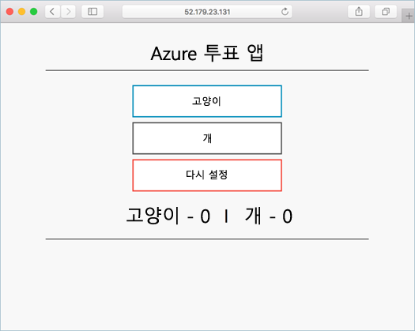

# <a name="tutorial-run-applications-in-azure-kubernetes-service-aks"></a>자습서: AKS(Azure Kubernetes Service)에서 애플리케이션 실행

Kubernetes는 컨테이너화된 애플리케이션용 분산 플랫폼을 제공합니다. 고유의 응용 프로그램 및 서비스를 빌드하여 Kubernetes 클러스터에 배포하고, 클러스터가 가용성 및 연결을 관리하게 합니다. 7개 중 4단계인 이 자습서에서는 애플리케이션 예제를 Kubernetes 클러스터에 배포합니다. 다음 방법에 대해 알아봅니다.

> [!div class="checklist"]
> * Kubernetes 매니페스트 파일 업데이트
> * Kubernetes에서 응용 프로그램 실행
> * 애플리케이션 테스트

추가 자습서에서 이 애플리케이션은 확장되고 업데이트됩니다.

이 빠른 시작에서는 Kubernetes 기본 개념을 이해하고 있다고 가정합니다. 자세한 내용은 [AKS(Azure Kubernetes Service)의 Kubernetes 핵심 개념][kubernetes-concepts]을 참조하세요.

## <a name="before-you-begin"></a>시작하기 전에

이전 자습서에서는 애플리케이션을 컨테이너 이미지에 패키지하고, Azure Container Registry에 이러한 이미지를 업로드하고, Kubernetes 클러스터를 만들었습니다.

이 자습서를 완료하려면 미리 작성된 `azure-vote-all-in-one-redis.yaml` Kubernetes 매니페스트 파일이 필요합니다. 이전 자습서에서 애플리케이션 소스 코드와 함께 이 파일을 다운로드했습니다. 리포지토리를 복제했으며 디렉터리를 복제된 리포지토리로 변경했는지 확인하세요. 이러한 단계를 아직 수행하지 않았으나 수행하려는 경우 [자습서 1 - 컨테이너 이미지 만들기][aks-tutorial-prepare-app]로 시작합니다.

이 자습서의 작업을 수행하려면 Azure CLI 버전 2.0.53 이상을 실행해야 합니다. `az --version`을 실행하여 버전을 찾습니다. 설치 또는 업그레이드해야 하는 경우 [Azure CLI 설치][azure-cli-install]를 참조하세요.

## <a name="update-the-manifest-file"></a>매니페스트 파일 업데이트

이 자습서에서는 ACR(Azure Container Registry) 인스턴스가 애플리케이션 예제용 컨테이너 이미지를 저장합니다. 애플리케이션을 배포하려면 ACR 로그인 서버 이름을 포함하도록 Kubernetes 매니페스트 파일에서 이미지 이름을 업데이트해야 합니다.

다음과 같이 [az acr list][az-acr-list] 명령을 사용하여 ACR 로그인 서버 이름을 가져옵니다.

```azurecli
az acr list --resource-group myResourceGroup --query "[].{acrLoginServer:loginServer}" --output table
```

첫 번째 자습서에서 복제된 git 리포지토리의 샘플 매니페스트 파일은 로그인 서버 이름으로 *microsoft*를 사용합니다. 복제된 *azure-voting-app-redis* 디렉터리에 있는지 확인한 다음, `vi`와 같은 텍스트 편집기를 사용하여 매니페스트 파일을 엽니다.

```console
vi azure-vote-all-in-one-redis.yaml
```

*microsoft*를 해당 ACR 로그인 서버 이름으로 바꿉니다. 이미지 이름은 매니페스트 파일의 51번 줄에 있습니다. 다음 예제는 기본 이미지 이름을 보여줍니다.

```yaml
containers:
- name: azure-vote-front
  image: microsoft/azure-vote-front:v1
```

매니페스트 파일이 다음 예제처럼 보이도록 해당 ACR 로그인 서버 이름을 입력합니다.

```yaml
containers:
- name: azure-vote-front
  image: <acrName>.azurecr.io/azure-vote-front:v1
```

파일을 저장하고 닫습니다. `vi`에서 `:wq`를 사용합니다.

## <a name="deploy-the-application"></a>애플리케이션 배포

응용 프로그램을 배포하려면 [kubectl apply][kubectl-apply] 명령을 사용합니다. 이 명령은 매니페스트 파일을 구문 분석하고 정의된 Kubernetes 개체를 만듭니다. 다음 예제처럼 샘플 매니페스트 파일을 지정합니다.

```console
kubectl apply -f azure-vote-all-in-one-redis.yaml
```

다음 예제 출력에서는 AKS 클러스터에서 성공적으로 만들어진 리소스를 보여줍니다.

```
$ kubectl apply -f azure-vote-all-in-one-redis.yaml

deployment "azure-vote-back" created
service "azure-vote-back" created
deployment "azure-vote-front" created
service "azure-vote-front" created
```

## <a name="test-the-application"></a>애플리케이션 테스트

애플리케이션이 실행되면 애플리케이션 프런트 엔드를 인터넷에 공개하는 Kubernetes 서비스가 만들어집니다. 이 프로세스를 완료하는 데 몇 분이 걸릴 수 있습니다.

진행 상황을 모니터링하려면 `--watch` 인수와 함께 [kubectl get service][kubectl-get] 명령을 사용합니다.

```console
kubectl get service azure-vote-front --watch
```

처음에는 *azure-vote-front* 서비스에 대한 *EXTERNAL-IP*가 *보류 중*으로 표시됩니다.

```
azure-vote-front   10.0.34.242   <pending>     80:30676/TCP   7s
```

*EXTERNAL-IP* 주소가 *보류 중*에서 실제 공용 IP 주소로 변경되면 `CTRL-C`를 사용하여 `kubectl` 조사식 프로세스를 중지합니다. 다음 예제 출력은 서비스에 할당된 유효한 공용 IP 주소를 보여줍니다.

```
azure-vote-front   10.0.34.242   52.179.23.131   80:30676/TCP   2m
```

애플리케이션이 실제로 작동하는 모습을 보려면 웹 브라우저를 서비스의 외부 IP 주소로 엽니다.



애플리케이션이 로드되지 않는 경우 이미지 레지스트의 권한 부여 문제가 원인일 수 있습니다. 컨테이너 상태를 보려면 `kubectl get pods` 명령을 사용합니다. 컨테이너 이미지를 풀할 수 없는 경우 [Kubernetes 비밀을 사용하여 Container Registry에 대한 액세스 허용](https://docs.microsoft.com/azure/container-registry/container-registry-auth-aks#access-with-kubernetes-secret)을 참조하세요.

## <a name="next-steps"></a>다음 단계

이 자습서에서는 샘플 Azure Vote 애플리케이션이 AKS의 Kubernetes 클러스터에 배포되었습니다. 다음 방법에 대해 알아보았습니다.

> [!div class="checklist"]
> * Kubernetes 매니페스트 파일 업데이트
> * Kubernetes에서 응용 프로그램 실행
> * 애플리케이션 테스트

그 다음 자습서로 이동하여 Kubernetes 응용 프로그램 및 기본 Kubernetes 인프라 규모를 조정하는 방법을 알아보세요.

> [!div class="nextstepaction"]
> [Kubernetes 애플리케이션 및 인프라 크기 조정][aks-tutorial-scale]

<!-- LINKS - external -->
[kubectl-apply]: https://kubernetes.io/docs/reference/generated/kubectl/kubectl-commands#apply
[kubectl-create]: https://kubernetes.io/docs/reference/generated/kubectl/kubectl-commands#create
[kubectl-get]: https://kubernetes.io/docs/reference/generated/kubectl/kubectl-commands#get

<!-- LINKS - internal -->
[aks-tutorial-prepare-app]: ./tutorial-kubernetes-prepare-app.md
[aks-tutorial-scale]: ./tutorial-kubernetes-scale.md
[az-acr-list]: /cli/azure/acr
[azure-cli-install]: /cli/azure/install-azure-cli
[kubernetes-concepts]: concepts-clusters-workloads.md
[kubernetes-service]: concepts-network.md#services
