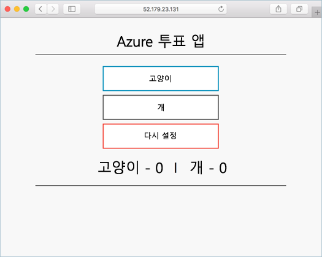

# <a name="tutorial-prepare-an-application-for-azure-kubernetes-service-aks"></a>자습서: AKS(Azure Kubernetes Service)에 대한 애플리케이션 준비

7개 중 1단계인 이 자습서에서는 Kubernetes에서 사용할 수 있도록 다중 컨테이너 애플리케이션을 준비하는 과정입니다. Docker Compose 같은 기존 개발 도구는 로컬로 애플리케이션을 빌드하고 테스트하는 데 사용됩니다. 다음 방법에 대해 알아봅니다.

> [!div class="checklist"]
> * GitHub에서 애플리케이션 예제 소스 복제
> * 애플리케이션 예제 소스로 컨테이너 이미지 만들기
> * 로컬 Docker 환경에서 다중 컨테이너 애플리케이션 테스트

완료되면 다음 애플리케이션이 로컬 개발 환경에서 실행됩니다.



추가 자습서에서는 컨테이너 이미지를 Azure Container Registry에 업로드한 다음, AKS 클러스터에 배포합니다.

## <a name="before-you-begin"></a>시작하기 전에

이 자습서에서는 컨테이너, 컨테이너 이미지 및 `docker` 명령과 같은 핵심 Docker 개념에 대한 기본적인 지식이 있다고 가정합니다. 컨테이너 기본 사항에 대한 입문서는 [Docker 시작][docker-get-started]을 참조하세요.

이 자습서를 완료하려면 Linux 컨테이너를 실행하는 로컬 Docker 개발 환경이 필요합니다. Docker는 모든 [Mac][docker-for-mac], [Windows][docker-for-windows] 또는 [Linux][docker-for-linux] 시스템에서 Docker를 구성하는 패키지를 제공합니다.

Azure Cloud Shell에는 이 자습서의 모든 단계를 완료하는 데 필요한 Docker 구성 요소가 포함되어 있지 않습니다. 따라서 전체 Docker 개발 환경을 사용하는 것이 좋습니다.

## <a name="get-application-code"></a>애플리케이션 코드 가져오기

이 자습서에서 사용되는 애플리케이션 예제는 기본 투표 앱입니다. 애플리케이션은 프런트 엔드 웹 구성 요소 및 백 엔드 Redis 인스턴스로 구성됩니다. 웹 구성 요소는 사용자 지정 컨테이너 이미지에 패키지됩니다. Redis 인스턴스는 Docker 허브에서 수정되지 않은 이미지를 사용합니다.

[git][]을 사용하여 애플리케이션 예제를 개발 환경에 복제합니다.

```console
git clone https://github.com/Azure-Samples/azure-voting-app-redis.git
```

복제된 디렉터리로 변경합니다.

```console
cd azure-voting-app-redis
```

해당 디렉터리에는 애플리케이션 소스 코드, 미리 만든 Docker Compose 파일 및 Kubernetes 매니페스트 파일이 있습니다. 이러한 파일은 자습서 집합 전체에서 사용됩니다.

## <a name="create-container-images"></a>컨테이너 이미지 만들기

[Docker Compose][docker-compose]는 컨테이너 이미지 빌드 및 다중 컨테이너 애플리케이션 배포를 자동화하는 데 사용할 수 있습니다.

샘플 `docker-compose.yaml` 파일을 사용하여 컨테이너 이미지를 만들고, Redis 이미지를 다운로드하고, 애플리케이션을 시작합니다.

```console
docker-compose up -d
```

완료되면 [docker images][docker-images] 명령을 사용하여 만든 이미지를 확인합니다. 3개 이미지가 다운로드되거나 생성되었는지 확인합니다. *azure-vote-front* 이미지는 애플리케이션을 포함하며 `nginx-flask` 이미지를 기준으로 사용합니다. `redis` 이미지는 Redis 인스턴스를 시작하는 데 사용됩니다.

```
$ docker images

REPOSITORY                   TAG        IMAGE ID            CREATED             SIZE
azure-vote-front             latest     9cc914e25834        40 seconds ago      694MB
redis                        latest     a1b99da73d05        7 days ago          106MB
tiangolo/uwsgi-nginx-flask   flask      788ca94b2313        9 months ago        694MB
```

[docker ps][docker-ps] 명령을 실행하여 실행 중인 컨테이너를 확인합니다.

```
$ docker ps

CONTAINER ID        IMAGE             COMMAND                  CREATED             STATUS              PORTS                           NAMES
82411933e8f9        azure-vote-front  "/usr/bin/supervisord"   57 seconds ago      Up 30 seconds       443/tcp, 0.0.0.0:8080->80/tcp   azure-vote-front
b68fed4b66b6        redis             "docker-entrypoint..."   57 seconds ago      Up 30 seconds       0.0.0.0:6379->6379/tcp          azure-vote-back
```

## <a name="test-application-locally"></a>로컬에서 애플리케이션 테스트

실행 중인 애플리케이션을 보려면 로컬 웹 브라우저에 `http://localhost:8080`을 입력합니다. 다음 예제처럼 샘플 애플리케이션이 로드됩니다.


## <a name="clean-up-resources"></a>리소스 정리

애플리케이션 기능의 유효성을 검사했으므로 실행 중인 컨테이너를 중지하고 제거할 수 있습니다. 컨테이너 이미지는 삭제하지 마세요. 다음 자습서에서 *azure-vote-front* 이미지가 Azure Container Registry 인스턴스에 업로드됩니다.

[docker-compose down][docker-compose-down] 명령을 사용하여 컨테이너 인스턴스 및 리소스를 중지하고 제거합니다.

```console
docker-compose down
```

로컬 애플리케이션이 제거되면 그 다음 자습서에서 사용할 Azure Vote 애플리케이션 *azure-front-front*가 포함된 Docker 이미지가 생깁니다.

## <a name="next-steps"></a>다음 단계

이 자습서에서는 애플리케이션을 테스트하고 애플리케이션에 대한 컨테이너 이미지를 만들었습니다. 다음 방법에 대해 알아보았습니다.

> [!div class="checklist"]
> * GitHub에서 애플리케이션 예제 소스 복제
> * 애플리케이션 예제 소스로 컨테이너 이미지 만들기
> * 로컬 Docker 환경에서 다중 컨테이너 애플리케이션 테스트

그 다음 자습서로 이동하여 Azure Container Registry에 컨테이너 이미지를 저장하는 방법을 알아봅니다.

> [!div class="nextstepaction"]
> [Azure Container Registry에 이미지 푸시][aks-tutorial-prepare-acr]

<!-- LINKS - external -->
[docker-compose]: https://docs.docker.com/compose/
[docker-for-linux]: https://docs.docker.com/engine/installation/#supported-platforms
[docker-for-mac]: https://docs.docker.com/docker-for-mac/
[docker-for-windows]: https://docs.docker.com/docker-for-windows/
[docker-get-started]: https://docs.docker.com/get-started/
[docker-images]: https://docs.docker.com/engine/reference/commandline/images/
[docker-ps]: https://docs.docker.com/engine/reference/commandline/ps/
[docker-compose-down]: https://docs.docker.com/compose/reference/down
[git]: https://git-scm.com/downloads

<!-- LINKS - internal -->
[aks-tutorial-prepare-acr]: ./tutorial-kubernetes-prepare-acr.md
