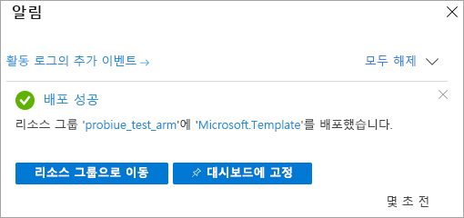

# <a name="quickstart-create-a-server---arm-template"></a>빠른 시작: 서버 만들기 - ARM 템플릿

이 빠른 시작에서는 ARM 템플릿(Azure Resource Manager 템플릿)을 사용하여 Azure 구독에 Analysis Services 서버 리소스를 만드는 방법을 설명합니다.

[!INCLUDE [About Azure Resource Manager](../../includes/resource-manager-quickstart-introduction.md)]

환경이 필수 구성 요소를 충족하고 ARM 템플릿 사용에 익숙한 경우 **Azure에 배포** 단추를 선택합니다. 그러면 Azure Portal에서 템플릿이 열립니다.

[](https://portal.azure.com/#create/Microsoft.Template/uri/https%3A%2F%2Fraw.githubusercontent.com%2FAzure%2Fazure-quickstart-templates%2Fmaster%2F101-analysis-services-create%2Fazuredeploy.json)

## <a name="prerequisites"></a>필수 구성 요소

* **Azure 구독**: [Azure 평가판](https://azure.microsoft.com/offers/ms-azr-0044p/)으로 이동하여 계정을 만들 수 있습니다.
* **Azure Active Directory**: 구독이 Azure Active Directory 테넌트와 연결되어야 합니다. 또한 해당 Azure Active Directory의 계정으로 Azure에 로그인해야 합니다. 자세한 내용은 [인증 및 사용자 권한](analysis-services-manage-users.md)을 참조하세요.

## <a name="review-the-template"></a>템플릿 검토

이 빠른 시작에서 사용되는 템플릿은 [Azure 빠른 시작 템플릿](https://azure.microsoft.com/resources/templates/101-analysis-services-create/)에서 나온 것입니다.

:::code language="json" source="~/quickstart-templates/101-analysis-services-create/azuredeploy.json":::

방화벽 규칙을 사용하는 단일 [Microsoft.AnalysisServices/servers](/azure/templates/microsoft.analysisservices/servers) 리소스가 템플릿에 정의되어 있습니다.

## <a name="deploy-the-template"></a>템플릿 배포

1. 다음 [Azure에 배포] 링크를 선택하여 Azure에 로그인하고 템플릿을 엽니다. 이 템플릿은 Analysis Services 서버 리소스를 만들고 필수 속성 및 선택적 속성을 지정하는 데 사용됩니다.

   [](https://portal.azure.com/#create/Microsoft.Template/uri/https%3A%2F%2Fraw.githubusercontent.com%2FAzure%2Fazure-quickstart-templates%2Fmaster%2F101-analysis-services-create%2Fazuredeploy.json)

2. 다음 값을 선택하거나 입력합니다.

    지정하지 않으면 기본값이 사용됩니다.

    * **구독**: Azure 구독을 선택합니다.
    * **리소스 그룹**: **새로 만들기**를 클릭한 다음, 새 리소스 그룹의 고유한 이름을 입력합니다.
    * **위치**: 리소스 그룹에 만든 리소스의 기본 위치를 선택합니다.
    * **서버 이름**: 서버 리소스의 이름을 입력합니다. 
    * **위치**: Analysis Services의 경우 위치를 무시합니다. 위치는 [서버 위치]에서 지정합니다.
    * **서버 위치**: Analysis Services 서버의 위치를 입력합니다. 리소스 그룹에 대해 지정한 기본 위치와 동일한 지역인 경우가 많지만, 필수는 아닙니다. 예를 들어 **미국 중북부**를 지정합니다. 지원되는 지역은 [지역별 Analysis Services 가용성](analysis-services-overview.md#availability-by-region)을 참조하세요.
    * **Sku 이름**: 만들려는 Analysis Services 서버의 sku 이름을 입력합니다. 이름을 B1, B2, D1, S0, S1, S2, S3, S4, S8v2, S9v2 중에 선택합니다. Sku 가용성은 지역에 따라 다릅니다. S0 또는 D1은 평가 및 테스트용으로 권장됩니다.
    * **Capacity**: 총 쿼리 복제본 스케일 아웃 인스턴스 수를 입력합니다. 두 개 이상의 인스턴스를 스케일 아웃하는 기능은 일부 지역에서만 지원됩니다.
    * **방화벽 설정**: 서버에 대해 정의할 인바운드 방화벽 규칙을 입력합니다. 지정하지 않으면 방화벽이 사용되지 않습니다.
    * **백업 Blob 컨테이너 Uri**: 읽기, 쓰기 및 나열 권한이 있는 프라이빗 Azure Blob Storage 컨테이너의 SAS URI를 입력합니다. [백업/복원](analysis-services-backup.md)을 사용하려는 경우에만 필요합니다.
    * **위에 명시된 사용 약관에 동의함**: 선택합니다.

3. **구매**를 선택합니다. 서버가 성공적으로 배포되면 다음과 같이 알림을 받게 됩니다.

   

## <a name="validate-the-deployment"></a>배포 유효성 검사

Azure Portal 또는 Azure PowerShell을 사용하여 리소스 그룹 및 서버 리소스가 생성되었는지 확인합니다.

### <a name="powershell"></a>PowerShell

```azurepowershell-interactive
$resourceGroupName = Read-Host -Prompt "Enter the Resource Group name"
(Get-AzResource -ResourceType "Microsoft.AnalysisServices/servers" -ResourceGroupName $resourceGroupName).Name
 Write-Host "Press [ENTER] to continue..."
```

---

## <a name="clean-up-resources"></a>리소스 정리

더 이상 필요 없으면 Azure Portal, Azure CLI 또는 Azure PowerShell을 사용하여 리소스 그룹 및 서버 리소스를 삭제합니다.

# <a name="cli"></a>[CLI](#tab/CLI)

```azurecli-interactive
echo "Enter the Resource Group name:" &&
read resourceGroupName &&
az group delete --name $resourceGroupName &&
echo "Press [ENTER] to continue ..."
```

# <a name="powershell"></a>[PowerShell](#tab/PowerShell)

```azurepowershell-interactive
$resourceGroupName = Read-Host -Prompt "Enter the Resource Group name"
Remove-AzResourceGroup -Name $resourceGroupName
Write-Host "Press [ENTER] to continue..."
```

---

## <a name="next-steps"></a>다음 단계

이 빠른 시작에서는 ARM 템플릿을 사용하여 새 리소스 그룹 및 Azure Analysis Services 서버 리소스를 만들었습니다. 템플릿을 사용하여 서버 리소스를 만든 후 다음 항목을 진행해 보세요.

> [!div class="nextstepaction"]
> [빠른 시작: 서버 방화벽 구성 - Portal](analysis-services-qs-firewall.md)   
