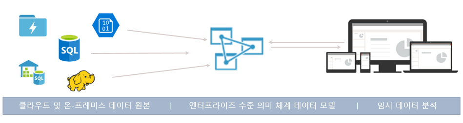
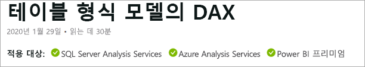
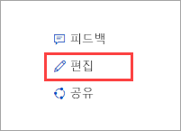

# Azure Analysis Services란?

Azure Analysis Services는 클라우드에서 엔터프라이즈급 데이터 모델을 제공하는 완전히 관리되는 PaaS(platform as a service)입니다. 고급 매시업 및 모델링 기능을 사용하여 여러 데이터 원본의 데이터를 결합하고, 메트릭을 정의하고, 신뢰할 수 있는 유의적 단일 데이터 모델에서 데이터를 보호합니다. 데이터 모델은 사용자가 임시 데이터 분석을 위해 대량의 데이터를 쉽고 빠르게 찾을 수 있는 방법을 제공합니다.

**비디오:** Azure Analysis Services가 Microsoft의 전반적인 BI 기능과 연동하는 방법을 알아보려면 [Azure Analysis Services 개요](https://sec.ch9.ms/ch9/d6dd/a1cda46b-ef03-4cea-8f11-68da23c5d6dd/AzureASoverview_high.mp4)를 확인합니다.

## 빠른 준비 및 실행

Azure Portal에서는 수분 내에 [서버를 만들 수 있습니다](analysis-services-create-server.md). 그리고 Azure Resource Manager [템플릿](../azure-resource-manager/resource-manager-create-first-template.md) 및 PowerShell을 사용하면 선언적 템플릿을 통해 서버를 만들 수 있습니다. 단일 템플릿을 사용하면 저장소 계정 및 Azure Functions와 같은 다른 Azure 구성 요소와 함께 서버 리소스를 배포할 수 있습니다. 

**비디오:** Azure Automation을 사용하여 서버 생성을 신속하게 하는 방법에 대한 자세한 내용을 알아보려면 [배포 자동화](https://channel9.msdn.com/series/Azure-Analysis-Services/AzureAnalysisServicesAutomation)를 확인합니다.

Azure Analysis Services는 다양한 Azure Services와 통합되어 정교한 분석 솔루션을 빌드할 수 있습니다. [Azure Active Directory](../active-directory/fundamentals/active-directory-whatis.md)와 통합되어 중요한 데이터에 안전한 역할 기반 액세스를 제공합니다. 모델에 데이터를 로드하는 활동을 포함하여 [Azure Data Factory](../data-factory/introduction.md) 파이프라인에 통합합니다. [Azure Automation](../automation/automation-intro.md) 및 [Azure Functions](../azure-functions/functions-overview.md)는 사용자 지정 코드를 사용하여 모델의 간단한 오케스트레이션을 수행하는 데 사용할 수 있습니다. 

## 필요할 때 올바른 계층

Azure Analysis Services는 **개발자**, **기본** 및 **표준** 계층에서 사용할 수 있습니다. 각 계층 내에서 계획 비용은 처리 능력, CPU 및 메모리 크기에 따라 달라집니다. 서버를 만들 때 계층 내에서 계획을 선택합니다. 동일한 계층 내에서 계획을 위 또는 아래로 변경하거나 상위 계층으로 업그레이드할 수 있지만, 상위 계층에서 하위 계층으로 다운그레이드할 수는 없습니다.

### 개발자 계층

이 계층은 평가, 개발 및 테스트 시나리오에 권장됩니다. 단일 계획에는 표준 계층과 동일한 기능이 포함되지만, 처리 능력, QPU 및 메모리 크기가 제한됩니다. 쿼리 복제본 스케일 아웃은 이 계층에 *사용할 수 없습니다*. 이 계층에는 SLA를 제공하지 않습니다.

|계획  |QPU  |메모리(GB)  |
|---------|---------|---------|
|D1    |    20     |    3     |

### 기본 계층

해당 계층은 소규모 테이블 형식 모델, 제한된 사용자 동시성 및 단순한 데이터 새로 고침 요구 사항이 있는 프로덕션 솔루션에 권장됩니다. 쿼리 복제본 스케일 아웃은 이 계층에 *사용할 수 없습니다*. 큐브 뷰, 여러 파티션 및 DirectQuery 테이블 형식 모델 기능은 이 계층에서 *지원되지 않습니다*.  

|계획  |QPU  |메모리(GB)  |
|---------|---------|---------|
|B1    |    40     |    10     |
|B2    |    80     |    20     |

### 표준 계층

이 계층은 탄력적 사용자 동시성이 필요하고 빠르게 성장하는 데이터 모델이 있는 중요 업무용 프로덕션 애플리케이션에 적합합니다. 근실시간 데이터 모델 업데이트에 고급 데이터 새로 고침을 지원하고, 모든 테이블 형식 모델링 기능을 지원합니다.

|계획  |QPU  |메모리(GB)  |
|---------|---------|---------|
|S0    |    40     |    10     |
|S1    |    100     |    25     |
|S2    |    200     |    50     |
|S4    |    400     |    100     |
|S8*    |    320     |    200     |
|S9*    |    640    |    400     |

\* 일부 지역에서 지원되지 않습니다.  

## 지역별 가용성

Azure Analysis Services는 전 세계 지역에서 지원됩니다. 지원되는 계획 및 쿼리 복제본 가용성은 선택한 지역에 따라 다릅니다. 계획 및 쿼리 복제본 가용성은 각 지역에 대해 사용 가능한 리소스 및 필요에 따라 변경될 수 있습니다. 

### 아메리카

|지역  | 지원되는 계획 | 쿼리 복제본(표준 계획만) |
|---------|---------|:---------:|
|브라질 남부     |    B1, B2, S0, S1, S2, S4, D1     |     1    |
|캐나다 중부    |     B1, B2, S0, S1, S2, S4, D1    |     1    |
|미국 동부     |     B1, B2, S0, S1, S2, S4, D1    |    1     |
|미국 동부 2     |     B1, B2, S0, S1, S2, S4, D1   |    7    |
|미국 동부 2     |     S8, S9   |    1    |
|미국 중북부     |     B1, B2, S0, S1, S2, S4, D1     |    1     |
|미국 중부     |    B1, B2, S0, S1, S2, S4, D1     |    1     |
|미국 중남부     |    B1, B2, S0, S1, S2, S4, D1     |    1     |
|미국 중서부   |     B1, B2, S0, S1, S2, S4, D1    |    3     |
|미국 서부     |    B1, B2, S0, S1, S2, S4, D1    |    7   |
|미국 서부     |    S8, S9   |    2  |
|미국 서부2    |    B1, B2, S0, S1, S2, S4, D1    |    3   |
|미국 서부2    |    S8, S9  |    1     |

### 유럽

|지역  | 지원되는 계획 | 쿼리 복제본(표준 계획만) |
|---------|---------|:---------:|
|북유럽     |    B1, B2, S0, S1, S2, S4, D1      |    7     |
|영국 남부     |    B1, B2, S0, S1, S2, S4, D1      |     1    |
|서유럽     |    B1, B2, S0, S1, S2, S4, D1   |    7    |
|서유럽    |   S8, S9  |  1  |

### 아시아 태평양 

|지역  | 지원되는 계획 | 쿼리 복제본(표준 계획만) |
|---------|---------|:---------:|
|오스트레일리아 동부     |    B1, B2, S0, S1, S2, S4     |    3     |
|오스트레일리아 동부     |    S8, S9    |    1     |
|오스트레일리아 남동부     | B1, B2, S0, S1, S2, S4, D1       |    1     |
|일본 동부     |   B1, B2, S0, S1, S2, S4, D1       |    1     |
|동남아시아     |     B1, B2, S0, S1, S2, S4, S8, S9, D1     |   1      |
|인도 서부     |    B1, B2, S0, S1, S2, S4, D1     |    1     |

## 사용자의 요구 사항에 맞게 규모 조정

### 강화\축소, 일시 중지 및 다시 시작

서버를 위쪽, 아래쪽으로 이동하거나 일시 중지합니다. Azure Portal을 사용하거나 즉시로 완전히 제어하려면 PowerShell을 사용합니다. 사용한 양만큼만 요금을 지급합니다.  

### 빠른 쿼리 응답에 대한 리소스 스케일 아웃

스케일 아웃하면 클라이언트 쿼리가 쿼리 풀의 여러 *쿼리 복제본*에 배포됩니다. 쿼리 복제본은 테이블 형식 모델의 복사본을 동기화했습니다. 쿼리 작업을 확산하여 높은 쿼리 작업 동안 응답 시간을 줄일 수 있습니다. 모델 처리 작업은 클라이언트 쿼리가 작업 처리에 의해 부정적인 영향을 받지 않도록 쿼리 풀에서 구분될 수 있습니다. 

최대 7개의 추가 쿼리 복제본으로 쿼리 풀을 만들 수 있습니다(총 8개, 서버 포함). 풀에 있을 수 있는 쿼리 복제본의 수는 선택한 계획 및 지역에 따라 다릅니다. 쿼리 복제본은 서버의 지역 밖에 분배될 수 없습니다. 쿼리 복제본은 서버와 동일한 요금으로 청구됩니다.

계층 변경과 마찬가지로 필요에 따라 쿼리 복제본을 스케일 아웃할 수 있습니다. 포털에서 또는 REST API를 사용하여 스케일 아웃을 구성합니다. 자세한 내용은 [Azure Analysis Services 스케일 아웃](analysis-services-scale-out.md)을 참조하세요.

## 가격

총 비용은 요인 수에 따라 다릅니다(예: 선택한 지역, 계층, 쿼리 복제본 및 일시 중지/다시 시작). [Azure Analysis Services 가격 책정](https://azure.microsoft.com/pricing/details/analysis-services/) 계산기를 사용하여 해당 지역에 대한 일반적인 가격 책정을 결정합니다. 이 도구는 단일 지역의 단일 서버 인스턴스에 대한 가격 책정을 계산합니다. 쿼리 복제본은 서버와 동일한 요금이 청구됩니다. 

## SQL Server Analysis Services에 구축

Azure Analysis Services는 이미 SQL Server Analysis Services Enterprise Edition에 있은 훌륭한 기능과 호환 가능하며, 1200 이상 [호환성 수준](analysis-services-compat-level.md)의 테이블 형식 모델을 지원합니다. 테이블 형식 모델은 관계형 모델링 구문(모델, 테이블, 열)이며 TMSL(Tabular Model Scripting Language) 및 TOM(Tabular Object Model) 코드로 테이블 형식 메타데이터 개체 정의에 명시됩니다. 파티션, 큐브 뷰, 행 수준 보안, 양방향 관계 및 변환을 모두 지원합니다\*. 다차원 모델 및 PowerPivot for SharePoint는 Azure Analysis Services에서 지원되지 *않습니다*.

메모리 내 및 DirectQuery 모드 모두에서 테이블 형식 모델이 지원됩니다. 메모리 내 모드(기본값) 테이블 형식 모델은 여러 데이터 원본을 지원합니다. 모델 데이터가 고도로 압축되고 메모리 내에 캐시되었기 때문에서 이 모드는 대량의 데이터에 가장 빠른 쿼리 응답을 제공합니다. 또한 복잡한 데이터 세트 및 쿼리에 가장 훌륭한 유연성을 제공합니다. 분할하면 증분 로드를 활성화하고, 평행을 증가하고, 메모리 소비를 줄입니다. 계산된 테이블 및 모든 DAX 함수와 같은 기타 고급 데이터 모델링 기능이 지원됩니다. 데이터 원본에서 캐시된 데이터를 업데이트하기 위해 메모리 내 모델을 새로 고칠(처리할) 수 있어야 합니다. Azure 서비스 주체가 지원되므로 PowerShell, TOM, TMSL 및 REST를 사용하는 무인 새로 고침 작업은 모델 데이터를 항상 최신 상태로 유지하는 유연성을 제공합니다. 

DirectQuery 모드*는 저장소 및 쿼리 실행에 백 엔드 관계형 데이터베이스를 활용합니다. 단일 SQL Server, SQL Server 데이터 웨어하우스, Azure SQL Database, Azure SQL Data Warehouse, Oracle 및 Teradata 데이터 원본에서 초대량의 데이터 세트가 지원됩니다. 백 엔드 데이터 집합은 사용 가능한 서버 리소스 메모리를 초과할 수 있습니다. 복잡한 데이터 모델 새로 고침 시나리오가 필요하지 않습니다. 또한 제한된 데이터 원본 형식, DAX 수식 제한 사항과 같은 몇 가지 제한 사항이 있으며 일부 고급 데이터 모델링 기능이 지원되지 않습니다. 사용자에게 적절한 모드를 결정하기 전에 [직접 쿼리 모드](https://docs.microsoft.com/sql/analysis-services/tabular-models/directquery-mode-ssas-tabular)를 참조하세요.

\* 기능 가용성은 계층에 따라 다릅니다.

## 지원되는 데이터 원본

Azure Analysis Services에서 테이블 형식 모델은 간단한 텍스트 파일부터 Azure Data Lake Store의 빅 데이터까지 다양한 데이터 원본을 지원합니다. 자세한 내용은 [Azure Analysis Services에서 지원되는 데이터 원본](analysis-services-datasource.md)을 참조하세요.

## 호환성 수준

호환성 수준은 Analysis Services 엔진의 릴리스 관련 동작을 가리킵니다. 1200 이상 호환성 수준의 테이블 형식 모델을 지원합니다. 자세히 알아보려면 [Analysis Services 테이블 형식 모델의 호환성 수준](analysis-services-compat-level.md)을 참조하세요.

## 데이터가 안전함

Azure Analysis Services는 여러 수준에서 중요한 데이터에 대한 보안을 제공합니다. Azure 서비스인 Analysis Services는 Azure 플랫폼의 일부로 자동으로 사용하도록 설정된 **기본** 수준의 DDoS(배포된 서비스 거부) 공격을 제공합니다. 자세한 내용은 [Azure DDoS Protection 표준 개요](../virtual-network/ddos-protection-overview.md)를 참조하세요. 

서버 수준에서 Analysis Services는 방화벽, Azure 인증, 서버 관리자 역할 및 서버 쪽 암호화를 제공합니다. 데이터 모델 수준에서 사용자 역할, 행 수준 및 개체 수준 보안은 데이터가 안전하고 데이터를 볼 수 있는 사용자에게만 표시되도록 합니다.

### 방화벽

Azure Analysis Services 방화벽은 규칙에 지정된 해다 IP 주소 이외의 모든 클라이언트 연결을 차단합니다. 기본적으로 방화벽 보호는 새 서버에 사용할 수 없습니다. 방화벽 보호를 사용하도록 설정하고 규칙이 서버 프로비전 스크립트의 일부로 구성되거나 서버를 만드는 즉시 포털에 구성되는 것이 좋습니다. 개별 클라이언트 IP 또는 범위로 허용된 IP 주소를 지정하는 규칙을 구성합니다. Power BI(서비스) 연결은 허용되거나 차단될 수 있습니다. 포털에서 또는 PowerShell을 사용하여 방화벽 및 규칙을 구성합니다. 자세한 내용은 [서버 방화벅 구성](analysis-services-qs-firewall.md)을 참조하세요.

### Authentication

사용자 인증은 [AAD(Azure Active Directory)](../active-directory/fundamentals/active-directory-whatis.md)에 의해 처리됩니다. 로그인하면 사용자는 데이터베이스에 대한 역할 기반 액세스에서 조직 계정 ID를 사용합니다. 사용자 ID는 서버가 위치한 구독에 대한 기본 Azure Active Directory의 멤버여야 합니다. 자세한 내용은 [인증 및 사용자 권한](analysis-services-manage-users.md)을 참조하세요.

### 데이터 보안

Azure Analysis Services에서는 Azure Blob Storage를 사용하여 Analysis Services 데이터베이스의 스토리지와 메타데이터를 유지합니다. Blob에 있는 데이터 파일은 [Azure Blob SSE(Server Side Encryption)](../storage/common/storage-service-encryption.md)를 사용하여 암호화됩니다. 직접 쿼리 모드를 사용하는 경우 메타데이터만 저장됩니다. 실제 데이터는 쿼리 시 데이터 원본에서 암호화된 프로토콜을 통해 액세스됩니다.

[온-프레미스 데이터 게이트웨이](analysis-services-gateway.md)를 설치하고 구성하여 조직의 온-프레미스 데이터 원본에 대한 액세스를 보호합니다. 게이트웨이는 DirectQuery와 메모리 내 모드 모두의 데이터에 대한 액세스 권한을 제공합니다.

### 역할

Analysis Services에서는 서버 및 데이터베이스 작업 모델, 개체 및 데이터에 대한 액세스를 부여하는 [역할 기반 권한 부여](https://docs.microsoft.com/sql/analysis-services/tabular-models/roles-ssas-tabular)를 사용합니다. 서버 또는 데이터베이스에 액세스하는 모든 사용자는 할당된 역할 내에서 Azure AD 사용자 계정을 사용하여 작업을 수행합니다. 서버 관리자 역할은 서버 리소스 수준입니다. 기본적으로 서버를 만들 때 사용되는 계정은 서버 관리자 역할에 자동으로 포함됩니다. 추가 사용자 및 그룹 계정은 포털, SSMS 또는 PowerShell을 사용하여 추가됩니다.
  
데이터를 쿼리하는 관리자가 아닌 최종 사용자에게는 데이터베이스 역할을 통해 액세스 권한이 부여됩니다. 데이터베이스 역할은 별도의 개체로 데이터베이스에 생성되며, 해당 역할이 생성된 데이터베이스에만 적용됩니다. 데이터베이스 역할은 (데이터베이스) 관리자, 읽기 및 읽기와 처리 권한에 의해 정의됩니다. 사용자 및 그룹 계정은 SSMS 또는 PowerShell을 사용하여 추가됩니다.

### 행 수준 보안

모든 호환성 수준의 테이블 형식 모델은 행 수준 보안을 지원합니다. 테이블의 행 및 사용자가 쿼리할 수 있는 관련 테이블의 여러 방향에서 테이블의 행을 정의하는 DAX 식을 사용하여 모델에서 행 수준 보안을 구성합니다. DAX 식을 사용하는 행 필터는 읽기 및 읽기와 처리 권한에 대해 정의됩니다. 

### 개체 수준 보안 

1400 호환성 수준에서 테이블 형식 모델은 개체 수준 보안을 지원합니다. 여기에는 테이블 수준 보안 및 열 수준 보안이 포함됩니다. 개체 수준 보안은 TOM 또는 TMSL을 사용하여 Model.bim 파일의 JSON 기반 메타데이터에서 설정됩니다. 자세한 내용은 [개체 수준 보안](https://docs.microsoft.com/sql/analysis-services/tabular-models/object-level-security)을 참조하세요.

### 서비스 주체를 통한 자동화

서비스 사용자는 무인 리소스 및 서비스 수준 작업을 수행하도록 테넌트 내에서 만드는 Azure Active Directory 애플리케이션 리소스입니다. 서비스 사용자는 새로 고침, 확장/축소 및 일시 정지/다시 시작과 같은 일반적인 작업을 자동화하는 Azure Automation, PowerShell 무인 모드, 사용자 지정 클라이언트 애플리케이션 및 웹앱에 사용됩니다. 사용 권한은 역할 멤버 자격을 통해 서비스 사용자에게 할당됩니다. 자세한 내용은 [서비스 사용자를 사용한 자동화](analysis-services-service-principal.md)를 참조하세요.

### Azure 거버넌스

Azure Analysis Services는 [Microsoft Online Services 약관](https://www.microsoftvolumelicensing.com/DocumentSearch.aspx?Mode=3&DocumentTypeId=31) 및 [Microsoft 개인정보처리방침](https://privacy.microsoft.com/privacystatement)에 따라 사용할 수 있습니다.
Azure 보안에 대한 자세한 내용은 [Microsoft 보안 센터](https://www.microsoft.com/trustcenter)를 참조하세요.

## 이미 알고 있는 도구 사용

### Visual Studio

[Visual Studio용 SSDT(SQL Server Data Tools)](/sql/ssdt/download-sql-server-data-tools-ssdt) 평가판을 사용하여 모델을 개발하고 배포합니다. SSDT에는 빠르게 준비하고 실행할 수 있는 Analysis Services 프로젝트 템플릿이 포함되어 있습니다. 이제는 SSDT에 1400 테이블 형식 모델에 대한 최신 데이터 가져오기 데이터 원본 쿼리 및 매시업 기능도 포함되어 있습니다. Power BI Desktop 및 Excel 2016에서 데이터 가져오기에 익숙한 경우 고도로 사용자 지정된 데이터 원본 쿼리를 만드는 것이 얼마나 쉬운지 이미 알고 있습니다. 

Visual Studio 2017을 사용하는 경우 Microsoft Analysis Services Projects는 무료 설치 가능한 VSIX 패키지로 제공됩니다. [Marketplace에서 다운로드](https://marketplace.visualstudio.com/items?itemName=ProBITools.MicrosoftAnalysisServicesModelingProjects).

### SQL Server Management Studio

[SSMS(SQL Server Management Studio)](https://docs.microsoft.com/sql/ssms/download-sql-server-management-studio-ssms)를 사용하여 서버 및 모델 데이터베이스를 관리합니다. 클라우드에서 서버에 연결합니다. XMLA 쿼리 창에서 TMSL 스크립트를 직접 실행하고 TMSL 스크립트 및 PowerShell을 사용하여 작업을 자동화합니다. SSMS가 매월 업데이트되므로 새 특징과 기능이 빠르게 출시됩니다.

### PowerShell

서버 리소스 만들기, 서버 작업 일시 중단/다시 시작 또는 서비스 수준(계층) 변경과 같은 서버 관리 작업에서는 Azure PowerShell cmdlet을 사용합니다. 역할 멤버 추가/제거, 처리 또는 TMSL 스크립트 실행과 같은 기타 데이터베이스 관리 작업에서는 SqlServer 모듈에 포함된 cmdlet을 사용합니다. 자세한 내용은 [PowerShell을 사용하여 Azure Analysis Services 관리](analysis-services-powershell.md)를 참조하세요.

### 개체 모델 및 스크립팅

테이블 형식 모델은 신속한 개발을 제공하며 손쉽게 사용자 지정할 수 있습니다. 테이블 형식 모델에는 모델 개체를 설명하는 TOM([테이블 형식 개체 모델](https://docs.microsoft.com/sql/analysis-services/tabular-model-programming-compatibility-level-1200/introduction-to-the-tabular-object-model-tom-in-analysis-services-amo))이 포함됩니다. TOM은 JSON에서 [Microsoft.AnalysisServices.Tabular](/dotnet/api/microsoft.analysisservices.tabular) 네임스페이스를 통해 [TMSL(테이블 형식 모델 스크립팅 언어)](https://docs.microsoft.com/sql/analysis-services/tabular-model-scripting-language-tmsl-reference) 및 AMO 데이터 정의 언어로 공개되어 있습니다. 

## 최신 클라이언트 도구 지원

Power BI, Excel, Reporting Services 및 타사 도구와 같은 최신 데이터 탐색 및 시각화 도구가 지원되며, 모델 데이터에 대해 시각적으로 풍부한 대화형 정보를 사용자에게 제공합니다. 

## 모니터링 및 진단

Azure Analysis Services는 Azure 메트릭과 통합되어 서버의 성능 및 상태를 모니터링할 수 있도록 리소스 특정 메트릭의 확장된 수를 제공합니다. 자세한 내용은 [서버 메트릭 모니터링](analysis-services-monitor.md)을 참조하세요. [Azure 리소스 진단 로그란?](../azure-monitor/platform/diagnostic-logs-overview.md)에서 메트릭을 기록합니다. 로그를 모니터링하여 [Azure Storage](https://azure.microsoft.com/services/storage/)로 보내고, [Azure Event Hubs](https://azure.microsoft.com/services/event-hubs/)로 스트림하고, [Azure](https://www.microsoft.com/cloud-platform/operations-management-suite)의 서비스인 [Azure Monitor 로그](https://azure.microsoft.com/services/log-analytics/)로 내보낼 수 있습니다. 자세한 내용은 [진단 로깅 설정](analysis-services-logging.md)을 참조하세요.

Azure Analysis Services는 [DMV(동적 관리 뷰)](https://docs.microsoft.com/sql/analysis-services/instances/use-dynamic-management-views-dmvs-to-monitor-analysis-services)도 사용하도록 지원합니다. SQL 구문에 따라 서버 인스턴스에 대한 메타데이터 및 모니터링 정보를 반환하는 DMV 인터페이스 스키마 행 집합입니다.

## 문서화

Azure Analysis Services에 관련된 설명서는 여기에 포함됩니다. 브라우저 화면 왼쪽에 있는 목차를 사용하여 아티클을 찾습니다. 

Azure Analysis Services 테이블 형식 모델이 SQL Server Analysis Services의 테이블 형식 모델과 거의 동일하기 때문에 [SQL Server Analysis Services 설명서](https://docs.microsoft.com/sql/analysis-services/analysis-services)에 광범위한 라이브러리 공유 개념, 절차, 개발자 및 참조 문서가 있습니다. SQL Server Analysis Services 설명서의 아티클은 제목 아래에서 적용 대상 배너에 의해 Azure Analysis Services에 적용되는지를 보여줍니다.

### 참가

이 아티클과 같은 Analysis Services 설명서는 오픈 소스입니다. GitHub 계정이 있는 경우 브라우저 화면 오른쪽 위 모퉁이에 편집(연필)을 클릭하여 아티클을 편집할 수 있습니다. 브라우저 편집기에서 사용한 다음, 파일 변경 제안을 클릭합니다. 

참가는 설명서 팀에서 검토되고 승인되면 GitHub 계정 이름이 참가자로 표시됩니다. 자세한 내용은 [Docs 참가자 가이드](https://docs.microsoft.com/contribute/)를 참조하세요.

Azure Analysis Services 설명서는 [GitHub 문제](https://docs.microsoft.com/teamblog/a-new-feedback-system-is-coming-to-docs)도 사용합니다. 제품 또는 설명서에 대한 피드백을 제공할 수 있습니다. 아티클 맨 아래에서 **피드백**을 사용합니다. GitHub 문제는 아직 SQL Server Analysis Services 설명서에 사용하도록 설정되지 않았습니다. 

## 블로그

상황이 빠르게 변화하고 있습니다. 최신 정보는 [Analysis Services 팀 블로그](https://blogs.msdn.microsoft.com/analysisservices/) 및 [Azure 블로그](https://azure.microsoft.com/blog/)에서 얻을 수 있습니다.

## 커뮤니티

Analysis Services에는 활발한 사용자 커뮤니티가 있습니다. [Azure Analysis Services 포럼](https://aka.ms/azureanalysisservicesforum)에서 주최하는 대화에 참여해 보세요.

## 다음 단계

> [!div class="nextstepaction"]
> [Azure 평가판 등록](https://azure.microsoft.com/offers/ms-azr-0044p/)   

> [!div class="nextstepaction"]
> [빠른 시작: 서버 만들기 - 포털](analysis-services-create-server.md)   

> [!div class="nextstepaction"]
> [빠른 시작: 서버 만들기 - PowerShell](analysis-services-create-powershell.md)  
