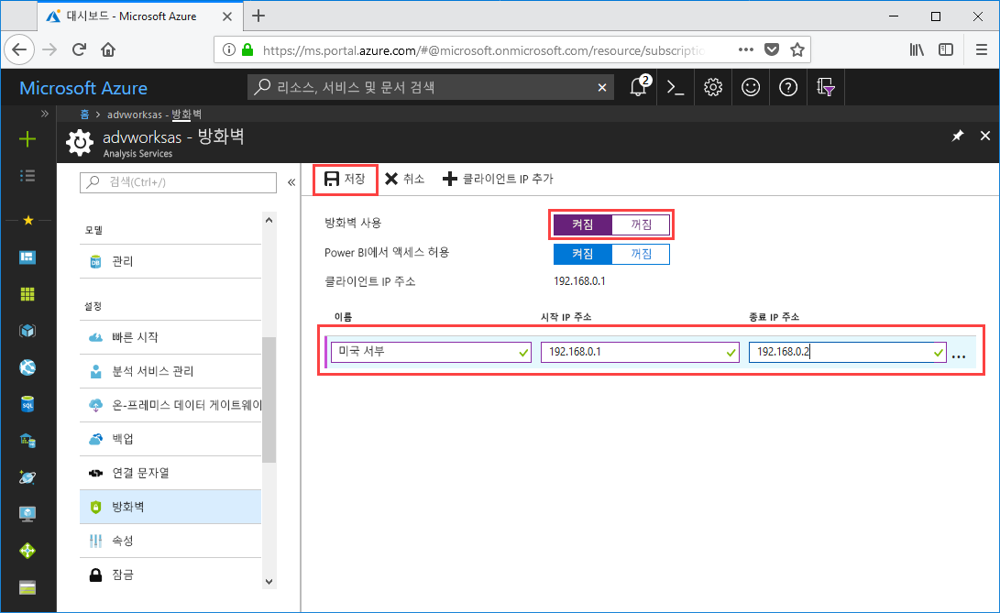

# 빠른 시작: 서버 방화벽 구성 - 포털

이 빠른 시작은 Azure Analysis Services 서버에 대한 방화벽을 구성하도록 도와줍니다. 서버에 액세스하는 해당 컴퓨터만을 위한 방화벽 활성화 및 IP 주소 범위 구성은 서버 및 데이터 보안의 중요한 부분입니다.

## 필수 조건

- 구독의 Azure Analysis Services 서버 자세히 알아보려면 [빠른 시작: 서버 만들기 - 포털](analysis-services-create-server.md) 또는 [빠른 시작: 서버 만들기 - PowerShell](analysis-services-create-powershell.md)을 참조하세요.
- 클라이언트 컴퓨터에 대한 하나 이상의 IP 주소 범위(필요한 경우)

## Azure Portal에 로그인 

[포털에 로그인](https://portal.azure.com)

## 방화벽 구성

1. 서버를 클릭하여 개요 페이지를 엽니다. 
2. **설정** > **방화벽** > **방화벽 설정**에서 **켜기**를 클릭합니다.
3. Power BI 서비스에서 DirectQuery 액세스를 허용하려면 **Power BI에서 액세스 허용**에서 **켜기**를 클릭합니다.  
4. (선택 사항) 하나 이상의 IP 주소 범위를 지정합니다. 각 범위에 대한 이름, 시작 및 끝 IP 주소를 입력합니다. 
5. **저장**을 클릭합니다.

     

## 리소스 정리

더 이상 필요하지 않은 경우 IP 주소 범위를 삭제하거나 방화벽을 비활성화합니다.

## 다음 단계
이 빠른 시작에서는 서버에 대한 방화벽을 구성하는 방법을 알아보았습니다. 이제 서버가 있고 방화벽으로 보호했으므로 포털에서 기본 샘플 데이터 모델을 추가할 수 있습니다. 모델 데이터베이스 역할 구성 및 클라이언트 연결 테스트에 대해 알아보는 데 샘플 모델이 있으면 유용합니다. 자세히 알아보려면 샘플 모델 추가를 위한 자습서를 계속합니다.

> [!div class="nextstepaction"]
> [자습서: 서버에 샘플 모델 추가](analysis-services-create-sample-model.md)
