# Logic Apps를 사용 하 여 새로 고침

Logic Apps 및 REST 호출을 사용 하 여 쿼리 스케일 아웃에 대 한 읽기 전용 복제본의 동기화를 포함 하 여 Azure Analysis 테이블 형식 모델에서 자동된 데이터 새로 고침 작업을 수행할 수 있습니다.

Azure Analysis Services를 사용 하 여 REST Api를 사용 하는 방법에 대 한 자세한 내용은 참조 하세요 [REST API를 사용 하 여 비동기 새로 고침](analysis-services-async-refresh.md)합니다.

## Authentication

유효한 Azure Active Directory (OAuth 2) 토큰을 사용 하 여 모든 호출을 인증 되어야 합니다.  이 문서의 예제는 SPN (서비스 사용자)를 사용 하 여 Azure Analysis Services에 인증할 수 됩니다. 자세한 내용은 참조 하세요 [Azure portal을 사용 하 여 서비스 주체를 만들려면](../active-directory/develop/howto-create-service-principal-portal.md)합니다.

## 논리 앱 디자인

> [!IMPORTANT]
> 다음 예제에서는 Azure Analysis Services 방화벽을 비활성화 하는 것을 가정 합니다.  방화벽을 사용 하는 경우 요청 초기자의 공용 IP 주소는 Azure Analysis Services 방화벽에서 허용 목록에 있어야 합니다. 지역당 논리 앱 IP 범위에 대 한 자세한 내용은 참조 하세요 [제한 및 Azure Logic Apps에 대 한 구성 정보](../logic-apps/logic-apps-limits-and-config.md#firewall-configuration-ip-addresses)합니다.

### 필수 조건

#### 서비스 주체 (SPN) 만들기

서비스 주체 만들기에 대 한 자세한 참조 [Azure portal을 사용 하 여 서비스 주체를 만들려면](../active-directory/develop/howto-create-service-principal-portal.md)합니다.

#### Azure Analysis Services에서 사용 권한 구성
 
만든 서비스 주체는 서버의 서버 관리자 권한이 있어야 합니다. 자세히 알아보려면 [서버 관리자 역할에 서비스 사용자 추가](analysis-services-addservprinc-admins.md)를 참조하세요.

### 논리 앱 구성

이 예제에서는 논리 앱 트리거는 HTTP 요청을 받으면 하도록 설계 되었습니다. 이렇게 하면 Azure Data Factory는 Azure Analysis Services 모델 새로 고침을 트리거할 수 등의 오케스트레이션 도구를 사용 합니다.

논리 앱을 만든 경우:

1. 논리 앱 디자이너에서 첫 번째 작업을 선택 **경우는 HTTP 요청을 받은**합니다.

   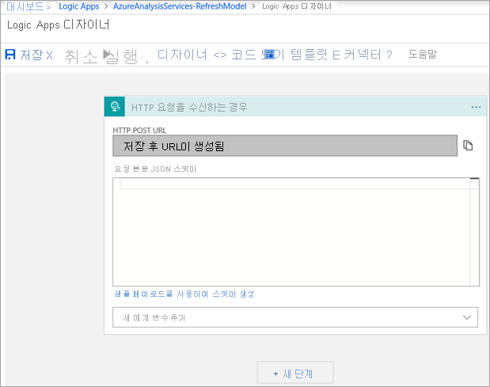

이 단계는 논리 앱을 저장 한 후 HTTP POST URL로 채웁니다.

2. 새 단계를 추가 하 고 검색할 **HTTP**합니다.  

   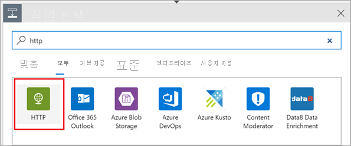

   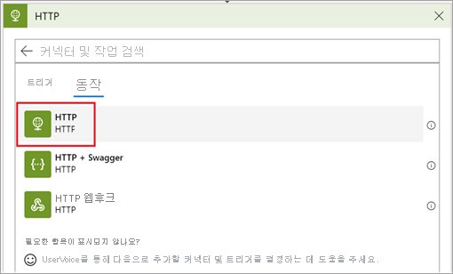

3. 선택 **HTTP** 이 동작을 추가 합니다.

   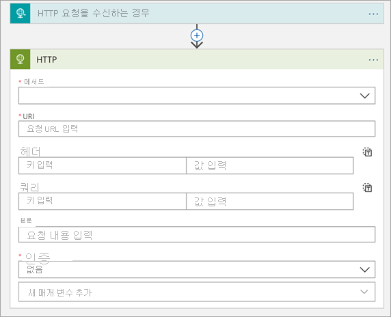

HTTP 작업을 다음과 같이 구성 합니다.

|자산  |값  |
|---------|---------|
|**메서드**     |POST         |
|**URI**     | https://*서버 지역을*/서버*aas 서버 이름*/models/*데이터베이스 이름*/     예: https://westus.asazure.windows.net/servers/myserver/models/AdventureWorks/|
|**헤더**     |   콘텐츠 형식이 application/json      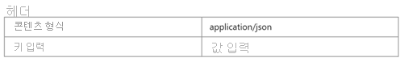    |
|**본문**     |   요청 본문을 형성 하는 방법에 대 한 자세한 내용은 참조 하세요 [POST /refreshes-REST API를 사용 하 여 비동기 새로 고침](analysis-services-async-refresh.md#post-refreshes)합니다. |
|**인증**     |Active Directory OAuth         |
|**Tenant**     |Azure Active Directory TenantId를 입력         |
|**대상**     |https://*.asazure.windows.net         |
|**클라이언트 ID**     |에 서비스 주체 이름 ClientID를 입력 합니다.         |
|**자격 증명 유형**     |Secret         |
|**비밀**     |에 서비스 사용자 이름 암호를 입력 합니다.         |

예제:

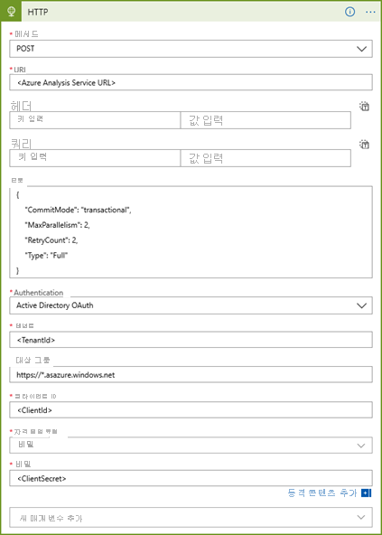

이제 논리 앱을 테스트 합니다.  논리 앱 디자이너에서 클릭 **실행**합니다.

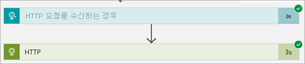

## Azure Data Factory 사용 하 여 논리 앱 사용

논리 앱 저장 되 면 검토는 **때 HTTP 요청을 받을** 활동 및 복사를 **HTTP POST URL** 이제 생성 됩니다.  논리 앱 트리거를 비동기 호출할 수 있도록 Azure Data Factory에서 사용할 수 있는 URL입니다.

이 작업을 수행 하는 Azure Data Factory 웹 작업 예제는 다음과 같습니다.

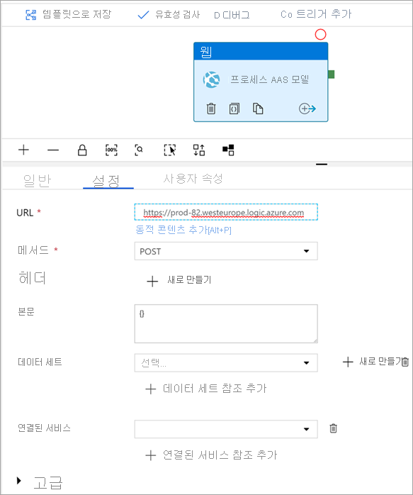

## 자체 포함 된 논리 앱을 사용 하 여

Data Factory와 같은 오케스트레이션 하는 도구를 사용 하 여 모델 새로 고침을 않으려는 경우 일정에 따라 새로 고침 하도록 논리 앱을 설정할 수 있습니다.

첫 번째 작업을 삭제 하 고 사용 하 여 교체 위의 예제를 사용 하는 **일정** 활동입니다.

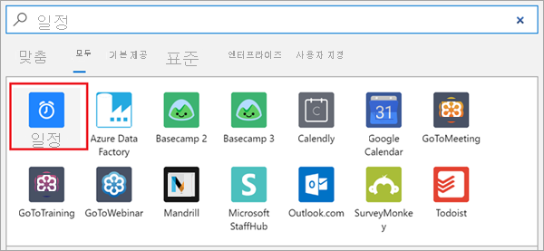

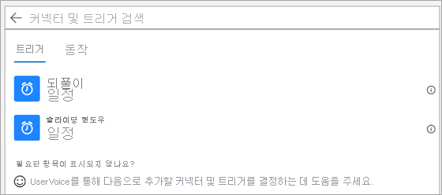

이 예제에서는 사용할지 **되풀이**합니다.

활동에 추가 되 면 간격 및 빈도 구성 합니다. 그런 다음 새 매개 변수를 추가 하 고 선택 **이러한 시간**합니다.

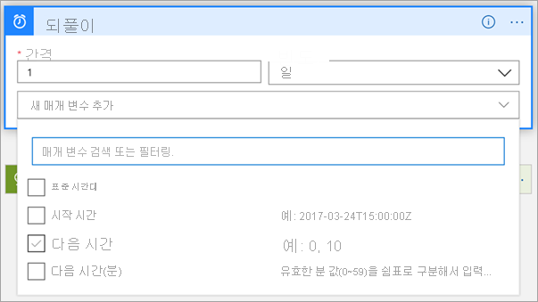

원하는 시간을 선택 합니다.

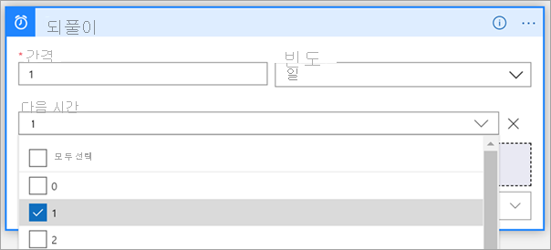

논리 앱을 저장 합니다.

## 다음 단계

[샘플](analysis-services-samples.md)  
[REST API](https://docs.microsoft.com/rest/api/analysisservices/servers)
