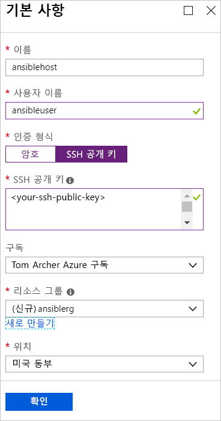
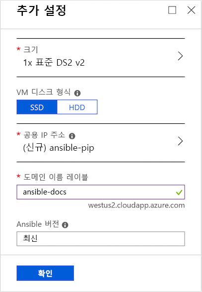
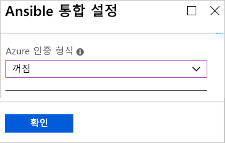
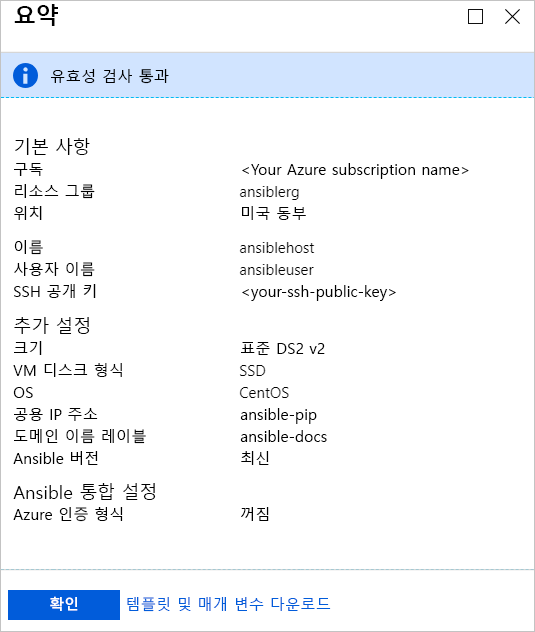
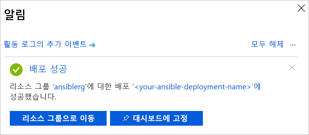

# 빠른 시작: CentOS에 Azure용 Ansible 솔루션 템플릿 배포

Azure용 Ansible 솔루션 템플릿은 Azure와 함께 작동하도록 구성된 Ansible 및 도구 모음과 함께 CentOS 가상 머신에 Ansible 인스턴스를 구성하도록 설계되었습니다. 도구로는 다음이 있습니다.

- **Azure용 Ansible 모듈** - [Azure용 Ansible 모듈](./ansible-matrix.md)은 Azure에서 인프라를 만들고 관리할 수 있는 모듈입니다. 이러한 모듈의 최신 버전이 기본적으로 배포됩니다. 그러나 솔루션 템플릿 배포 프로세스가 진행되는 동안 환경에 적합한 버전 번호를 지정할 수 있습니다.
- **Azure CLI(명령줄 인터페이스) 2.0** - [Azure CLI 2.0](/cli/azure/?view=azure-cli-latest)은 Azure 리소스를 관리하기 위한 플랫폼 간 명령줄 환경입니다. 
- **Azure 리소스에 대한 관리 ID** - [Azure 리소스에 대한 관리 ID](/azure/active-directory/managed-identities-azure-resources/overview) 기능은 클라우드 애플리케이션 자격 증명을 안전하게 보호하는 과제를 해결합니다.

## 필수 조건

[!INCLUDE [open-source-devops-prereqs-azure-subscription.md](../../includes/open-source-devops-prereqs-azure-subscription.md)]

## Ansible 솔루션 템플릿 배포

1. [Azure Marketplace에서 Ansible 솔루션 템플릿 배포](https://azuremarketplace.microsoft.com/en-%20%20us/marketplace/apps/azure-oss.ansible?tab=Overview)로 이동합니다.

1. **지금 가져오기**를 선택합니다.

1. 사용 약관, 개인정보처리방침 및 Azure Marketplace 사용 약관을 자세히 설명하는 창이 나타납니다. **계속**을 선택합니다.

1. Azure Portal이 나타나고 솔루션 템플릿을 설명하는 Ansible 페이지가 표시됩니다. **만들기**를 선택합니다.

1. **Ansible 만들기** 페이지에는 여러 탭이 있습니다. **기본** 탭에서 필수 정보를 입력합니다.

   - **이름** - Ansible 인스턴스 이름을 지정합니다. 이 데모에 사용되는 이름은 `ansiblehost`입니다.
   - **사용자 이름:** - Ansible 인스턴스에 액세스할 수 있는 사용자 이름을 지정합니다. 이 데모에 사용되는 이름은 `ansibleuser`입니다.
   - **인증 유형:** - **암호** 또는 **SSH 공용 키**를 선택합니다. 이 데모에서는 **SSH 공용 키**를 선택합니다.
   - **암호** 및 **암호 확인** - **인증 유형**으로 **암호**를 선택하는 경우 이러한 값의 암호를 입력합니다.
   - **SSH 공개 키** - **인증 유형**으로 **SSH 공개 키**를 선택하는 경우 한 줄 형식의 RSA 공개 키를 `ssh-rsa`부터 입력합니다.
   - **구독** - 드롭다운 목록에서 Azure 구독을 선택합니다.
   - **리소스 그룹** - 드롭다운 목록에서 기존 리소스 그룹을 선택하거나, **새로 만들기**를 선택하고 새 리소스 그룹의 이름을 지정합니다. 이 데모에서는 `ansiblerg`라는 새 리소스 그룹을 사용합니다.
   - **위치** - 드롭다운 목록에서 시나리오에 적합한 위치를 선택합니다.

     

1. **확인**을 선택합니다.

1. **추가 설정** 탭에서 필요한 정보를 입력합니다.

   - **크기** - Azure Portal은 기본적으로 표준 크기로 설정됩니다. 특정 시나리오에 적합한 크기를 지정하려면 화살표를 선택하여 다양한 크기 목록을 표시합니다.
   - **VM 디스크 유형** - **SSD**(프리미엄 반도체 드라이브) 또는 **HDD**(하드 디스크 드라이브)를 선택합니다. 이 데모에서는 고성능 **SSD**를 선택합니다. 각 디스크 스토리지 유형에 대한 자세한 내용은 다음 문서를 참조하세요.
       - [VM용 고성능 Premium Storage 및 관리 디스크](/azure/virtual-machines/windows/premium-storage)
       - [Azure 가상 머신 워크로드용 표준 SSD Managed Disks](/azure/virtual-machines/windows/disks-standard-ssd)
   - **공용 IP 주소** - 가상 머신 외부에서 가상 머신과 통신하려면 이 설정을 지정합니다. 기본값은 이름이 `ansible-pip`인 새 공용 IP 주소입니다. 다른 IP 주소를 지정하려면 화살표를 선택하여 이름, SKU, 할당 등 해당 IP 주소의 특성을 지정합니다. 
   - **도메인 이름 레이블** - 가상 머신의 공용 도메인 이름을 입력합니다. 이름은 고유해야 하고 명명 요구 사항을 충족해야 합니다. 가상 머신 이름 지정에 대한 자세한 내용은 [Azure 리소스의 명명 규칙](/azure/architecture/best-practices/naming-conventions)을 참조하세요.
   - **Ansible 버전** - 버전 번호 또는 `latest` 값을 지정하여 최신 버전을 배포합니다. **Ansible 버전** 옆에 있는 정보 아이콘을 선택하면 사용 가능한 버전에 대한 자세한 내용을 볼 수 있습니다.

     

1. **확인**을 선택합니다.

1. **Ansible 통합 설정** 탭에서 인증 유형을 지정합니다. Azure 리소스 보안에 대한 자세한 내용은 [Azure 리소스용 관리 ID란?](/azure/active-directory/managed-identities-azure-resources/overview)을 참조하세요.

    

1. **확인**을 선택합니다.

1. 유효성 검사 프로세스를 보여주고 Ansible 배포에 대해 지정된 조건을 나열하는 **요약** 페이지가 표시됩니다. 탭 맨 아래에 있는 링크를 통해 지원되는 Azure 언어 및 플랫폼에 사용할 **템플릿 및 매개 변수를 다운로드**할 수 있습니다. 

     

1. **확인**을 선택합니다.

1. **만들기** 탭이 나타나면 **확인**을 선택하여 Ansible을 배포합니다.

1. 포털 페이지 맨 위에서 **알림** 아이콘을 선택하여 Ansible 배포를 추적합니다. 배포가 완료되면 **리소스 그룹으로 이동**을 선택합니다. 

     

1. 리소스 그룹 페이지에서 Ansible 호스트의 IP 주소를 가져오고 로그인하여 Ansible을 통해 Azure 리소스를 관리합니다.

## 다음 단계

> [!div class="nextstepaction"] 
> [빠른 시작: Azure에서 Ansible을 사용하여 Linux 가상 머신 구성](/azure/virtual-machines/linux/ansible-create-vm)