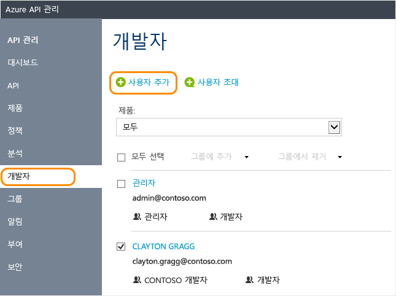

# Azure API Management에서 사용자 계정을 관리하는 방법

API Management에서 개발자는 API Management 사용을 공개하는 API의 사용자입니다. 이 가이드에서는 개발자를 만들고, 개발자가 API Management 인스턴스로 사용 가능하도록 설정된 API 및 제품을 사용할 수 있도록 초대하는 방법을 보여 줍니다. 프로그래밍 방식으로 사용자 계정 관리에 대한 내용은 [API Management REST](/rest/api/apimanagement/) 참조에서 [사용자 엔터티](https://docs.microsoft.com/en-us/rest/api/apimanagement/user) 설명서를 참조하세요.

[!INCLUDE [premium-dev-standard-basic.md](../../includes/api-management-availability-premium-dev-standard-basic.md)]

## 필수 조건

이 문서의 작업을 완료 합니다. [Azure API Management 인스턴스 만들기](get-started-create-service-instance.md)

[!INCLUDE [api-management-navigate-to-instance.md](../../includes/api-management-navigate-to-instance.md)]

## 새 개발자 만들기

새 사용자를 추가하려면 이 섹션의 단계를 수행합니다.

1. 화면 왼쪽의 **사용자** 탭을 선택합니다.
2. **+추가**를 누릅니다.
3. 사용자에 대한 적절한 정보를 입력합니다.
4. **추가**를 누릅니다.

    

기본적으로 새로 만든 개발자 계정은 **활성**이며, **개발자** 그룹과 연결됩니다. **활성** 상태의 개발자 계정은 구독하는 모든 API에 액세스하는 데 사용할 수 있습니다. 새로 만든 개발자와 추가 그룹을 연결하려면 [그룹과 개발자를 연결하는 방법][How to associate groups with developers]을 참조하세요.

## 개발자 초대
개발자를 초대하려면 이 섹션의 단계를 수행합니다.

1. 화면 왼쪽의 **사용자** 탭을 선택합니다.
2. **+초대**를 누릅니다.

확인 메시지가 표시되지만 새로 초대한 개발자는 해당 개발자가 초대를 허용할 때까지 목록에 나타나지 않습니다. 

개발자를 초대하면 메일이 개발자에게 전송됩니다. 이 메일은 템플릿을 사용하여 생성되며 사용자 지정 가능합니다. 자세한 내용은 [메일 템플릿 구성][Configure email templates]을 참조하세요.

초대가 허용되면 계정이 활성 상태가 됩니다.

##  개발자 계정 비활성화 또는 다시 활성화

기본적으로, 새로 만들거나 초대한 개발자 계정은 **활성**상태가 됩니다. 개발자 계정을 비활성화하려면 **차단**을 클릭합니다. 차단된 개발자 계정을 다시 활성화하려면 **활성화**를 클릭합니다. 차단된 개발자 계정에서는 개발자 포털에 액세스하거나 어떤 API도 호출할 수 없습니다. 사용자 계정을 삭제하려면 **삭제**를 클릭합니다.

사용자를 차단하려면 다음 단계를 수행합니다.

1. 화면 왼쪽의 **사용자** 탭을 선택합니다.
2. 차단하려는 사용자를 클릭합니다.
3. **차단**을 누릅니다.

## 사용자 암호 다시 설정

프로그래밍 방식으로 사용자 계정에 대해 작업하려면 [API Management REST](/rest/api/apimanagement/) 참조에서 [사용자 엔터티](https://docs.microsoft.com/en-us/rest/api/apimanagement/user) 설명서를 참조하세요. 사용자 계정 암호를 특정 값으로 다시 설정하려면 [사용자 업데이트](https://docs.microsoft.com/rest/api/apimanagement/apimanagementrest/azure-api-management-rest-api-user-entity#UpdateUser) 작업을 사용하여 원하는 암호를 지정할 수 있습니다.

## 다음 단계
개발자 계정이 생성된 후에는 계정과 역할을 연결하고 해당 계정으로 제품 및 API를 구독할 수 있습니다. 자세한 내용은 [그룹을 만들고 사용하는 방법][How to create and use groups]을 참조하세요.

[api-management-management-console]: ./media/api-management-howto-create-or-invite-developers/api-management-management-console.png
[api-management-add-new-user]: ./media/api-management-howto-create-or-invite-developers/api-management-add-new-user.png
[api-management-create-developer]: ./media/api-management-howto-create-or-invite-developers/api-management-create-developer.png
[api-management-invite-developer]: ./media/api-management-howto-create-or-invite-developers/api-management-invite-developer.png
[api-management-new-developer]: ./media/api-management-howto-create-or-invite-developers/api-management-new-developer.png
[api-management-invite-developer-window]: ./media/api-management-howto-create-or-invite-developers/api-management-invite-developer-window.png
[api-management-invite-developer-confirmation]: ./media/api-management-howto-create-or-invite-developers/api-management-invite-developer-confirmation.png
[api-management-pending-verification]: ./media/api-management-howto-create-or-invite-developers/api-management-pending-verification.png
[api-management-view-developer]: ./media/api-management-howto-create-or-invite-developers/api-management-view-developer.png
[api-management-reset-password]: ./media/api-management-howto-create-or-invite-developers/api-management-reset-password.png

[Create a new developer]: #create-developer
[Invite a developer]: #invite-developer
[Deactivate or reactivate a developer account]: #block-developer
[Next steps]: #next-steps
[How to create and use groups]: api-management-howto-create-groups.md
[How to associate groups with developers]: api-management-howto-create-groups.md#associate-group-developer

[Get started with Azure API Management]: get-started-create-service-instance.md
[Create an API Management service instance]: get-started-create-service-instance.md
[Configure email templates]: api-management-howto-configure-notifications.md#email-templates
