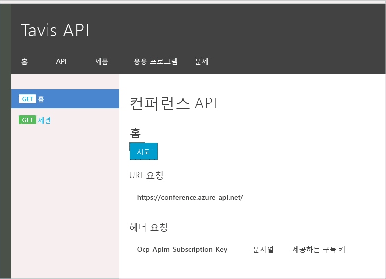

# <a name="monitor-your-apis-with-azure-api-management-event-hubs-and-moesif"></a>Azure API Management, Event Hubs 및 Moesif를 사용하여 API 모니터링
[API Management 서비스](api-management-key-concepts.md)는 HTTP API로 전송 된 HTTP 요청의 처리를 향상시키기 위해 다양한 기능을 제공합니다. 그러나 요청 및 응답의 존재는 일시적입니다. 요청이 생성되면 API Management 서비스를 통해 백 엔드 API로 전달됩니다. API는 요청을 처리하고 응답은 API 소비자를 통해 다시 전달합니다. API Management 서비스는 Azure Portal 대시보드에 표시하기 위해 API에 대한 중요한 통계를 일부 유지하지만 세부 정보는 사라집니다.

API Management 서비스에서 log-to-eventhub 정책을 사용하여 요청 및 응답에서 [Azure Event Hub](../event-hubs/event-hubs-what-is-event-hubs.md)에 세부 정보를 보낼 수 있습니다. API로 전송되는 HTTP 메시지에서 이벤트를 생성하려는 다양한 이유가 있습니다. 예에는 업데이트의 감사 내역, 사용 분석, 예외 경고 및 타사 통합이 포함됩니다.

이 문서는 전체 HTTP 요청 및 응답 메시지를 캡처하고 이를 Event Hub에 보낸 다음 HTTP 로깅 및 모니터링 서비스를 제공하는 타사 서비스에 해당 메시지를 릴레이하는 방법을 보여줍니다.

## <a name="why-send-from-api-management-service"></a>API Management 서비스에서 전송되는 이유는 무엇입니까?
HTTP API 프레임워크에 연결할 수 있는 HTTP 미들웨어를 작성하여 HTTP 요청 및 응답을 캡처하고 로깅 및 모니터링 시스템에 공급할 수 있습니다. 이 방법의 단점은 HTTP 미들웨어가 백 엔드 API에 통합되어야 하고 API의 플랫폼과 일치해야 한다는 점입니다. 여러 API가 있는 경우 각 API는 미들웨어를 배포해야 합니다. 백 엔드 API를 업데이트할 수 없는 이유가 있습니다.

Azure API Management 서비스를 사용하여 로깅 인프라와 통합하는 작업은 중앙 집중화되고 플랫폼 독립적인 솔루션을 제공합니다. 또한 부분적으로 Azure API Management의 [지역에서 복제](api-management-howto-deploy-multi-region.md) 기능으로 인해 확장성이 있습니다.

## <a name="why-send-to-an-azure-event-hub"></a>Azure 이벤트 허브에 전송되는 이유는 무엇입니까?
Azure Event Hubs에 지정된 정책을 만드는 이유를 묻는 것이 합리적입니다. 내 요청을 로그할 수 있는 여러 위치가 있습니다. 최종 대상에 직접 요청을 전송하는 이유는 무엇입니까?  이것은 옵션입니다. 그러나 API Management 서비스에서 로깅 요청을 생성할 때 로깅 메시지가 API의 성능에 미치는 영향을 고려해야 합니다. 로드의 점진적인 증가는 시스템 구성 요소에서 사용할 수 있는 인스턴스를 늘리거나 지역에서 복제를 활용하여 처리될 수 있습니다. 그러나 로깅 인프라에 대한 요청이 부하로 늦기 시작하는 경우 트래픽의 순간적인 급증은 요청을 지연시킬 수 있습니다.

Azure Event Hubs는 대부분 API 프로세스를 요청하는 HTTP 수 보다 훨씬 많은 이벤트를 처리하는 용량을 보유하여 엄청난 양의 데이터를 수신하도록 설계됩니다. Event Hub는 메시지를 저장하고 처리하는 API Management 서비스와 인프라 간에 한 종류의 복잡한 버퍼 역할을 합니다. 이렇게 하면 API는 로깅 인프라로 인해 성능이 저하되지 않습니다.

데이터가 Event Hub에 전달되면 유지되고 Event Hub 소비자가 처리하기를 기다립니다. Event Hub는 처리 방법이 중요하지 않고 메시지가 성공적으로 전달될 수 있는 것이 중요합니다.

Event Hubs에는 여러 소비자 그룹에 이벤트를 스트림하는 기능이 있습니다. 이렇게 하면 이벤트를 다른 시스템에서 처리할 수 있습니다. 이렇게 하면 하나의 이벤트를 생성해야 하기 때문에 API Management 서비스 내에서 API 요청의 처리가 추가적으로 지연되지 않고 다양한 통합 시나리오를 지원합니다.

## <a name="a-policy-to-send-applicationhttp-messages"></a>애플리케이션/http 메시지를 보내는 정책
이벤트 허브는 이벤트 데이터를 간단한 문자열로 수락합니다. 이 문자열의 내용은 사용자의 몫입니다. HTTP 요청을 패키지하고 Event Hubs에 보낼 수 있으려면 요청 또는 응답 정보를 사용하여 문자열 형식을 지정해야 합니다. 이런 경우에 다시 사용할 수 있는 기존 형식이 있는 경우 고유한 구문 분석 코드를 작성할 필요가 없을 수 있습니다. 처음 필자는 HTTP 요청 및 응답을 보내는 데 [HAR](http://www.softwareishard.com/blog/har-12-spec/) 를 사용할 생각이었습니다. 그러나 이 형식은 JSON 기반 형식에 일련의 HTTP 요청을 저장하도록 최적화됩니다. 연결을 통해 HTTP 메시지를 전달하는 시나리오에 불필요 한 복잡성을 추가하는 여러 가지 필수 요소를 포함합니다.

대체 옵션은 HTTP 사양 [RFC 7230](https://tools.ietf.org/html/rfc7230)에 설명된 대로 `application/http` 미디어 형식을 사용하는 것입니다. 이 미디어 형식은 연결을 통해 실제로 HTTP 메시지를 보내는 데 사용되는 것과 동일한 형식을 사용하지만 전체 메시지는 다른 HTTP 요청의 본문에 삽입될 수 있습니다. 지금과 같은 경우에 본문을 메시지로 사용하여 Event Hubs에 보내려고 합니다. 이 형식을 구문 분석하고 네이티브 `HttpRequestMessage` 및 `HttpResponseMessage` 개체로 변환할 수 있는 [Microsoft ASP.NET Web API 2.2 클라이언트](https://www.nuget.org/packages/Microsoft.AspNet.WebApi.Client/) 라이브러리에 존재하는 파서입니다.

이 메시지를 만들 수 있게 되려면 Azure API Management에서 C# 기반 [정책 식](/azure/api-management/api-management-policy-expressions)을 활용해야 합니다. 다음은 Azure Event Hubs에 HTTP 요청 메시지를 전송하는 정책입니다.

```xml
<log-to-eventhub logger-id="conferencelogger" partition-id="0">
@{
   var requestLine = string.Format("{0} {1} HTTP/1.1\r\n",
                                               context.Request.Method,
                                               context.Request.Url.Path + context.Request.Url.QueryString);

   var body = context.Request.Body?.As<string>(true);
   if (body != null && body.Length > 1024)
   {
       body = body.Substring(0, 1024);
   }

   var headers = context.Request.Headers
                          .Where(h => h.Key != "Authorization" && h.Key != "Ocp-Apim-Subscription-Key")
                          .Select(h => string.Format("{0}: {1}", h.Key, String.Join(", ", h.Value)))
                          .ToArray<string>();

   var headerString = (headers.Any()) ? string.Join("\r\n", headers) + "\r\n" : string.Empty;

   return "request:"   + context.Variables["message-id"] + "\n"
                       + requestLine + headerString + "\r\n" + body;
}
</log-to-eventhub>
```

### <a name="policy-declaration"></a>정책 선언
이 정책 식에 대한 몇 가지 특정 사항을 설명합니다. log-to-eventhub 정책에는 API Management 서비스 내에서 생성된 로거의 이름을 의미하는 logger-id라는 특성이 있습니다. API Management 서비스에서 이벤트 허브 로거를 설정하는 방법에 대한 세부 정보는 [Azure API Management에서 Azure Event Hubs에 이벤트를 기록하는 방법](api-management-howto-log-event-hubs.md)에서 찾을 수 있습니다. 두 번째 특성은 메시지를 저장하도록 분할하는 Event Hubs에 지시하는 선택적 매개 변수입니다. Event Hubs는 파티션을 사용하여 확장성을 사용하고 최소한 두 개가 필요합니다. 파티션 내에서 메시지의 순차적인 전달이 보장됩니다. Event Hub에 메시지를 저장할 파티션을 지정하지 않는 경우 라운드 로빈 알고리즘을 사용하여 로드를 분산합니다. 그러나 일부 메시지가 순서대로 처리되지 않는 경우가 발생할 수 있습니다.

### <a name="partitions"></a>파티션
메시지가 순서대로 소비자에게 전달되고 파티션의 부하 배포 기능을 활용하려면 하나의 파티션에 HTTP 요청 메시지를 보내고 다른 파티션에 HTTP 응답 메시지를 보내도록 선택합니다. 이렇게 하면 부하가 고르게 분산되고 모든 요청이 순서대로 사용되고 모든 응답도 순서대로 사용되도록 보장됩니다. 해당 요청 전에 응답이 사용될 수 있지만 응답에 대한 해당 요청이 다른 매커니즘을 가지고 해당 요청이 항상 응답 전에 온다면 문제가 발생합니다.

### <a name="http-payloads"></a>HTTP 페이로드
`requestLine`을 빌드한 후에 요청 본문을 잘라냈는지 확인합니다. 요청 본문은 1024에만 잘립니다. 이는 증가할 수 있지만 개별 이벤트 허브 메시지는 256KB로 제한되므로 일부 HTTP 메시지 본문은 단일 메시지에 적합하지 않을 수 있습니다. 로깅 및 분석을 수행할 때 상당한 양의 정보는 HTTP 요청 라인 및 헤더에서 파생될 수 있습니다. 또한 많은 API 요청이 적은 본문을 반환하므로 큰 본문을 자르는 것으로 인한 정보 값의 손실은 모든 본문 내용을 유지하기 위해 전송, 처리 및 저장에 드는 비용 감소에 비교하여 상당히 미미합니다. 본문을 처리하는 방법에서 한 가지 유의할 점은 본문 내용을 읽지만 백 엔드 API가 본문을 읽을 수 있기를 바라기 때문에 `true`를 `As<string>()` 메서드에 전달해야 한다는 것입니다. 이 메서드에 true를 전달하여 본문을 버퍼링하게 되므로 두 번 읽을 수 있습니다. 큰 파일을 업로드하거나 긴 폴링을 사용하는 API가 있는 경우 주의해야 합니다. 이러한 경우에 본문을 읽는 작업을 피하는 것이 좋습니다.

### <a name="http-headers"></a>HTTP 헤더
HTTP 헤더는 간단한 키/값 쌍 형식인 메시지 형식을 통해 전송할 수 있습니다. 중요한 특정 보안 필드를 제거하여 불필요하게 자격 증명 정보가 누수되는 것을 방지하려고 합니다. 분석을 위해 API 키 및 기타 자격 증명은 사용될 가능성이 적습니다. 사용자 및 사용자가 사용하는 특정 제품에 대한 분석을 수행하려면 `context` 개체에서 얻고 해당 사항을 메시지에 추가할 수 있습니다.

### <a name="message-metadata"></a>메시지 메타데이터
이벤트 허브로 보낼 전체 메시지를 작성할 때 첫 번째 줄은 실제 `application/http` 메시지의 일부가 아닙니다. 첫 번째 줄은 메시지가 응답에 대한 요청을 상호 연결하는 데 사용된 요청 또는 응답 메시지 및 메시지 ID로 구성된 추가 메타데이터입니다. 메시지 ID는 다음과 같이 다른 정책을 사용하여 만들어집니다.

```xml
<set-variable name="message-id" value="@(Guid.NewGuid())" />
```

요청 메시지를 만들고 응답이 반환될 때까지 변수에 저장한 다음 요청 및 응답을 단일 메시지로 전송했을 수 있습니다. 그러나 요청 및 응답을 독립적으로 전송하고 둘을 상호 연결하는 메시지 ID를 사용하여 메시지 순서를 유지 관리하는 동안 여러 파티션을 활용하는 기능과 같이 메시지 크기 면에서 유연성을 얻고 요청이 곧 로깅 대시보드에 표시됩니다. 또한 유효한 응답이 API Management 서비스에서 발생한 심각한 요청 오류 때문에 이벤트 허브에 전송되지 않은 일부 시나리오가 있을 수 있지만 아직 요청한 레코드는 남아 있습니다.

HTTP 응답 메시지를 보내는 정책은 요청과 유사하므로 완성된 정책 구성은 다음과 같습니다.

```xml
<policies>
  <inbound>
      <set-variable name="message-id" value="@(Guid.NewGuid())" />
      <log-to-eventhub logger-id="conferencelogger" partition-id="0">
      @{
          var requestLine = string.Format("{0} {1} HTTP/1.1\r\n",
                                                      context.Request.Method,
                                                      context.Request.Url.Path + context.Request.Url.QueryString);

          var body = context.Request.Body?.As<string>(true);
          if (body != null && body.Length > 1024)
          {
              body = body.Substring(0, 1024);
          }

          var headers = context.Request.Headers
                               .Where(h => h.Key != "Authorization" && h.Key != "Ocp-Apim-Subscription-Key")
                               .Select(h => string.Format("{0}: {1}", h.Key, String.Join(", ", h.Value)))
                               .ToArray<string>();

          var headerString = (headers.Any()) ? string.Join("\r\n", headers) + "\r\n" : string.Empty;

          return "request:"   + context.Variables["message-id"] + "\n"
                              + requestLine + headerString + "\r\n" + body;
      }
  </log-to-eventhub>
  </inbound>
  <backend>
      <forward-request follow-redirects="true" />
  </backend>
  <outbound>
      <log-to-eventhub logger-id="conferencelogger" partition-id="1">
      @{
          var statusLine = string.Format("HTTP/1.1 {0} {1}\r\n",
                                              context.Response.StatusCode,
                                              context.Response.StatusReason);

          var body = context.Response.Body?.As<string>(true);
          if (body != null && body.Length > 1024)
          {
              body = body.Substring(0, 1024);
          }

          var headers = context.Response.Headers
                                          .Select(h => string.Format("{0}: {1}", h.Key, String.Join(", ", h.Value)))
                                          .ToArray<string>();

          var headerString = (headers.Any()) ? string.Join("\r\n", headers) + "\r\n" : string.Empty;

          return "response:"  + context.Variables["message-id"] + "\n"
                              + statusLine + headerString + "\r\n" + body;
     }
  </log-to-eventhub>
  </outbound>
</policies>
```

`set-variable` 정책은 `<inbound>` 섹션 및 `<outbound>` 섹션의 모든 `log-to-eventhub` 정책에서 액세스할 수 있는 값을 만듭니다.

## <a name="receiving-events-from-event-hubs"></a>Event Hubs에서 이벤트 수신
Azure 이벤트 허브의 이벤트는 [AMQP 프로토콜](https://www.amqp.org/)를 사용하여 수신됩니다. Microsoft Service Bus 팀 소비 이벤트를 쉽게 만드는 데 사용할 수 있는 클라이언트 라이브러리를 만들었습니다. 지원되는 두 가지 방법 중에 하나는 *직접 소비자*가 되는 것이고 다른 하나는 `EventProcessorHost` 클래스를 사용하는 것입니다. 이러한 두 방법의 예는 [Event Hubs 프로그래밍 가이드](../event-hubs/event-hubs-programming-guide.md)에서 찾을 수 있습니다. 차이점은 간략하게 `Direct Consumer`가 완벽한 제어를 제공하고 `EventProcessorHost`가 일부 배관 작업을 수행하지만 이러한 이벤트를 처리하는 방법에 대 해 특정한 가정을 한다는 점입니다.

### <a name="eventprocessorhost"></a>EventProcessorHost
이 샘플에서는 간략한 설명을 위해 `EventProcessorHost`를 사용하지만 이는 이 특정 시나리오에 가장 적합한 선택 사항이 아닐 수 있습니다. `EventProcessorHost`는 특정 이벤트 프로세서 클래스 내에서 스레딩 문제를 걱정하지 않도록 하는 어려운 작업을 수행합니다. 그러나 시나리오에서는 단순히 메시지를 다른 형식으로 변환하며 비동기 메서드를 사용하여 다른 서비스에 전달합니다. 공유 상태를 업데이트할 필요가 없기 때문에 따라서 스레딩 문제의 위험도 없습니다  시나리오 중 대부분의 경우 `EventProcessorHost`은 아마도 최고의 선택이며 쉬운 옵션일 것입니다.

### <a name="ieventprocessor"></a>IEventProcessor
`EventProcessorHost`를 사용할 때 중앙 개념은 `ProcessEventAsync` 메서드를 포함하는 `IEventProcessor` 인터페이스를 구현하도록 만드는 것입니다. 해당 메서드의 핵심은 다음과 같습니다.

```csharp
async Task IEventProcessor.ProcessEventsAsync(PartitionContext context, IEnumerable<EventData> messages)
{

    foreach (EventData eventData in messages)
    {
        _Logger.LogInfo(string.Format("Event received from partition: {0} - {1}", context.Lease.PartitionId,eventData.PartitionKey));

        try
        {
            var httpMessage = HttpMessage.Parse(eventData.GetBodyStream());
            await _MessageContentProcessor.ProcessHttpMessage(httpMessage);
        }
        catch (Exception ex)
        {
            _Logger.LogError(ex.Message);
        }
    }
    ... checkpointing code snipped ...
}
```

EventData 개체의 목록이 메서드로 전달되고 해당 목록을 반복합니다. 각 메서드의 바이트는 HttpMessage 개체로 구문 분석되고 해당 개체는 IHttpMessageProcessor의 인스턴스에 전달됩니다.

### <a name="httpmessage"></a>HttpMessage
`HttpMessage` 인스턴스는 세 가지 데이터를 포함합니다.

```csharp
public class HttpMessage
{
    public Guid MessageId { get; set; }
    public bool IsRequest { get; set; }
    public HttpRequestMessage HttpRequestMessage { get; set; }
    public HttpResponseMessage HttpResponseMessage { get; set; }

... parsing code snipped ...

}
```

`HttpMessage` 인스턴스는 개체가 HttpRequestMessage 및 HttpResponseMessage의 인스턴스를 포함하는지를 식별하는 해당 HTTP 응답 및 부울 값에 HTTP 요청을 연결하도록 하는  `MessageId` GUID를 포함합니다.  `System.Net.Http`에서 기본 제공 HTTP 클래스를 사용하여 `System.Net.Http.Formatting`에 포함된 코드의 `application/http` 구문을 분석하도록 활용할 수 있습니다.  

### <a name="ihttpmessageprocessor"></a>IHttpMessageProcessor
`HttpMessage` 인스턴스는 Azure Event Hub에서 이벤트의 수신 및 해석을 분리하고 실제 처리를 위해 만든 인터페이스인 `IHttpMessageProcessor`를 구현하는 데 전달됩니다.

## <a name="forwarding-the-http-message"></a>HTTP 메시지 전달
이 샘플의 경우 [Moesif API Analytics](https://www.moesif.com)에 HTTP 요청을 푸시해보면 흥미로울 것입니다. Moesif는 HTTP 분석 및 디버깅을 전문으로 하는 클라우드 기반 서비스입니다. 무료 계층이 있으므로 시도하기 쉽고 API Management 서비스를 통해 실시간 흐름에서 HTTP 요청을 볼 수 있게 합니다.

`IHttpMessageProcessor` 구현은 다음과 같습니다

```csharp
public class MoesifHttpMessageProcessor : IHttpMessageProcessor
{
    private readonly string RequestTimeName = "MoRequestTime";
    private MoesifApiClient _MoesifClient;
    private ILogger _Logger;
    private string _SessionTokenKey;
    private string _ApiVersion;
    public MoesifHttpMessageProcessor(ILogger logger)
    {
        var appId = Environment.GetEnvironmentVariable("APIMEVENTS-MOESIF-APP-ID", EnvironmentVariableTarget.Process);
        _MoesifClient = new MoesifApiClient(appId);
        _SessionTokenKey = Environment.GetEnvironmentVariable("APIMEVENTS-MOESIF-SESSION-TOKEN", EnvironmentVariableTarget.Process);
        _ApiVersion = Environment.GetEnvironmentVariable("APIMEVENTS-MOESIF-API-VERSION", EnvironmentVariableTarget.Process);
        _Logger = logger;
    }

    public async Task ProcessHttpMessage(HttpMessage message)
    {
        if (message.IsRequest)
        {
            message.HttpRequestMessage.Properties.Add(RequestTimeName, DateTime.UtcNow);
            return;
        }

        EventRequestModel moesifRequest = new EventRequestModel()
        {
            Time = (DateTime) message.HttpRequestMessage.Properties[RequestTimeName],
            Uri = message.HttpRequestMessage.RequestUri.OriginalString,
            Verb = message.HttpRequestMessage.Method.ToString(),
            Headers = ToHeaders(message.HttpRequestMessage.Headers),
            ApiVersion = _ApiVersion,
            IpAddress = null,
            Body = message.HttpRequestMessage.Content != null ? System.Convert.ToBase64String(await message.HttpRequestMessage.Content.ReadAsByteArrayAsync()) : null,
            TransferEncoding = "base64"
        };

        EventResponseModel moesifResponse = new EventResponseModel()
        {
            Time = DateTime.UtcNow,
            Status = (int) message.HttpResponseMessage.StatusCode,
            IpAddress = Environment.MachineName,
            Headers = ToHeaders(message.HttpResponseMessage.Headers),
            Body = message.HttpResponseMessage.Content != null ? System.Convert.ToBase64String(await message.HttpResponseMessage.Content.ReadAsByteArrayAsync()) : null,
            TransferEncoding = "base64"
        };

        Dictionary<string, string> metadata = new Dictionary<string, string>();
        metadata.Add("ApimMessageId", message.MessageId.ToString());

        EventModel moesifEvent = new EventModel()
        {
            Request = moesifRequest,
            Response = moesifResponse,
            SessionToken = _SessionTokenKey != null ? message.HttpRequestMessage.Headers.GetValues(_SessionTokenKey).FirstOrDefault() : null,
            Tags = null,
            UserId = null,
            Metadata = metadata
        };

        Dictionary<string, string> response = await _MoesifClient.Api.CreateEventAsync(moesifEvent);

        _Logger.LogDebug("Message forwarded to Moesif");
    }

    private static Dictionary<string, string> ToHeaders(HttpHeaders headers)
    {
        IEnumerable<KeyValuePair<string, IEnumerable<string>>> enumerable = headers.GetEnumerator().ToEnumerable();
        return enumerable.ToDictionary(p => p.Key, p => p.Value.GetEnumerator()
                                                         .ToEnumerable()
                                                         .ToList()
                                                         .Aggregate((i, j) => i + ", " + j));
    }
}
```

`MoesifHttpMessageProcessor`는 HTTP 이벤트 데이터를 해당 서비스로 쉽게 푸시할 수 있게 해주는 [Moesif용 C# API 라이브러리](https://www.moesif.com/docs/api?csharp#events)를 활용합니다. HTTP 데이터를 Moesif Collector API로 보내려면 계정 및 애플리케이션 ID가 필요합니다. [Moesif 웹 사이트](https://www.moesif.com)에서 계정을 만들어 Moesif 애플리케이션 ID를 얻은 다음, ‘오른쪽 위 메뉴’ -> ‘앱 설정’으로 이동합니다.

## <a name="complete-sample"></a>전체 샘플
샘플의 [원본 코드](https://github.com/dgilling/ApimEventProcessor) 및 테스트는 GitHub에 있습니다. 샘플을 직접 실행하려면 [API Management 서비스](get-started-create-service-instance.md), [연결된 Event Hub](api-management-howto-log-event-hubs.md) 및 [Storage 계정](../storage/common/storage-create-storage-account.md)이 있어야 합니다.   

샘플은 이벤트 허브에서 들어오는 이벤트를 수신 대기하고 Moesif `EventRequestModel` 및 `EventResponseModel` 개체로 변환한 다음, Moesif Collector API에 전달하는 간단한 콘솔 애플리케이션입니다.

다음 애니메이션 이미지에서는 개발자 포털의 API에 대한 요청, 수신, 처리 및 전달되는 메시지를 보여 주는 콘솔 애플리케이션, 이벤트 스트림에 표시되는 요청 및 응답을 확인할 수 있습니다.



## <a name="summary"></a>요약
Azure API Management 서비스는 API간을 이동하는 HTTP 트래픽을 캡처하기 위한 최적의 장소를 제공합니다. Azure Event Hubs는 해당 트래픽을 캡처하고 로깅, 모니터링 및 기타 복잡한 분석을 하는 보조 처리 시스템에 전달하기 위한 뛰어난 확장성을 가진 저렴한 비용의 솔루션입니다. Moesif와 같은 타사 트래픽 모니터링 시스템에 연결하는 작업은 수십 줄의 코드만으로 간단하게 수행할 수 있습니다.

## <a name="next-steps"></a>다음 단계
* Azure Event Hubs에 대해 자세히 알아보기
  * [Azure Event Hubs 시작](../event-hubs/event-hubs-c-getstarted-send.md)
  * [EventProcessorHost를 사용하여 메시지 수신](../event-hubs/event-hubs-dotnet-standard-getstarted-receive-eph.md)
  * [Event Hubs 프로그래밍 가이드](../event-hubs/event-hubs-programming-guide.md)
* API Management 및 Event Hubs 통합에 대해 자세히 알아보기
  * [Azure API Management에서 Azure Event Hubs에 이벤트를 기록하는 방법](api-management-howto-log-event-hubs.md)
  * [로거 엔터티 참조](https://docs.microsoft.com/rest/api/apimanagement/apimanagementrest/azure-api-management-rest-api-logger-entity)
  * [log-to-eventhub 정책 참조](/azure/api-management/api-management-advanced-policies#log-to-eventhub)
