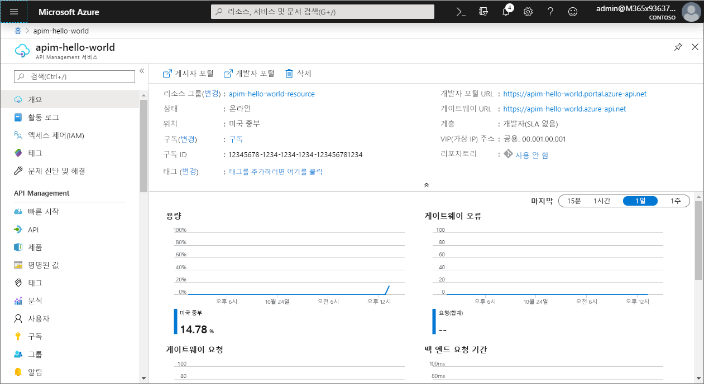
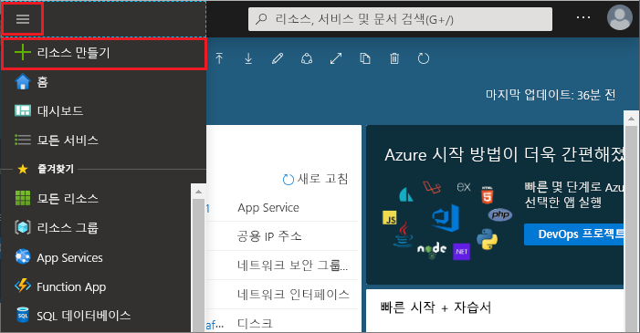
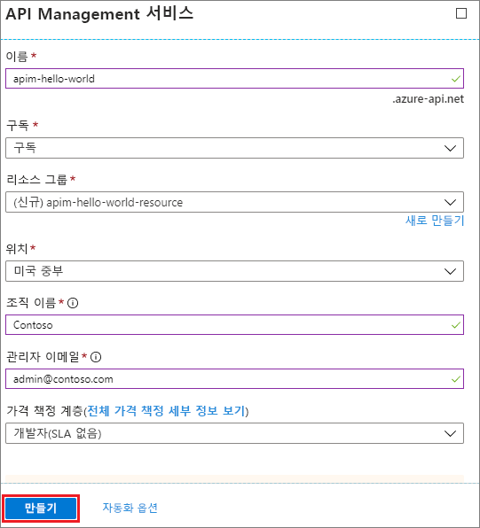
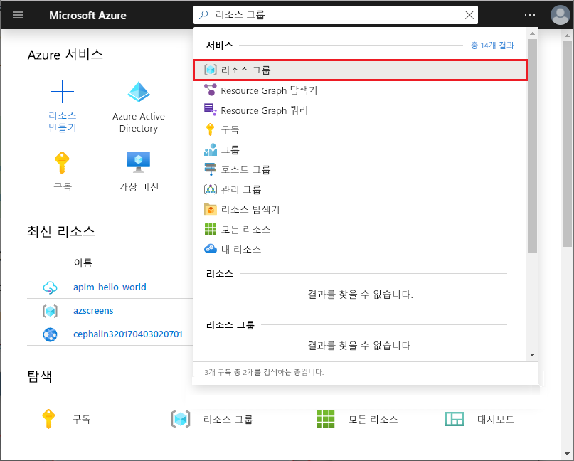
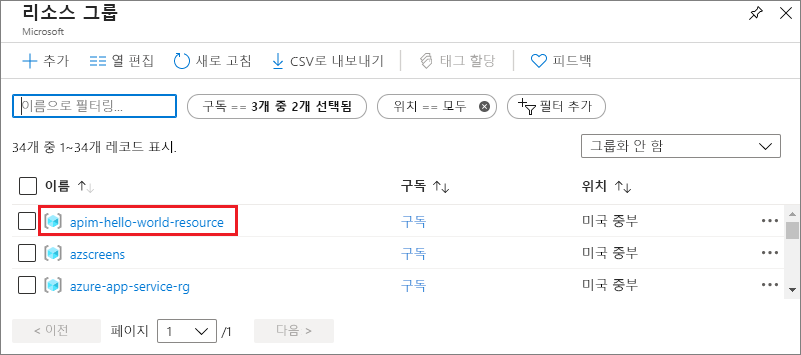

# 새 Azure API Management 서비스 인스턴스 만들기

Azure APIM(API Management)을 사용하여 조직은 외부, 파트너 및 내부의 개발자에게 API를 게시하여 데이터 및 서비스의 잠재성을 활용할 수 있습니다. API Management는 개발자 참여, 비즈니스 통찰력, 분석, 보안과 보호 등을 통해 성공적인 API 프로그램을 보장하는 핵심적인 역량을 제공합니다. APIM을 사용하면 어디서든 호스팅되는 기존 백 엔드 서비스를 위한 최신 API 게이트웨이를 만들고 관리할 수 있습니다. 자세한 내용은 [개요](api-management-key-concepts.md) 항목을 참조하세요.

이 빠른 시작에서는 Azure Portal을 사용하여 새 API Management 인스턴스를 만드는 단계를 설명합니다.

[!INCLUDE [quickstarts-free-trial-note](../../includes/quickstarts-free-trial-note.md)]

## Azure에 로그인

Azure Portal ( https://portal.azure.com ) 에 로그인합니다.

## 새 서비스 만들기

1. [Azure Portal](https://portal.azure.com/)에서 **리소스 만들기** > **엔터프라이즈 통합** > **API 관리**를 선택합니다.

    또는 **새로 만들기**를 선택하고 검색 상자에 `API management`를 입력하고 Enter 키를 누릅니다. **만들기**를 클릭합니다.

2. **API Management 서비스** 창에서 설정을 입력합니다.

    

    | 설정                 | 제안 값                               | 설명                                                                                                                                                                                                                                                                                                                         |
|-------------------------|-----------------------------------------------|-------------------------------------------------------------------------------------------------------------------------------------------------------------------------------------------------------------------------------------------------------------------------------------------------------------------------------------|
| **Name**                | API Management 서비스에 대한 고유한 이름 | 이 이름은 나중에 변경할 수 없습니다. 서비스 이름은 *{name}.azure-api.net* 형식의 기본 도메인 이름을 생성하는 데 사용됩니다. 사용자 지정 도메인 이름을 사용하려는 경우 [사용자 지정 도메인 구성](configure-custom-domain.md)을 참조하세요.   서비스 이름은 서비스 및 해당하는 Azure 리소스를 참조하는 데 사용됩니다. |
| **구독**        | 사용자의 구독                             | 이 새 서비스 인스턴스가 만들어질 구독입니다. 사용자가 액세스할 수 있는 다양한 Azure 구독 중에서 구독을 선택할 수 있습니다.                                                                                                                                                            |
| **리소스 그룹**      | *apimResourceGroup*                           | 새 또는 기존 리소스를 선택할 수 있습니다. 리소스 그룹은 수명 주기, 권한 및 정책을 공유하는 리소스의 컬렉션입니다. [여기](../azure-resource-manager/resource-group-overview.md#resource-groups)를 참조하세요.                                                                                                  |
| **위치**:            | *미국 서부*                                    | 가까운 지리적 지역을 선택합니다. 사용 가능한 API Management 서비스 지역만 드롭다운 목록 상자에 표시됩니다.                                                                                                                                                                                                          |
| **조직 이름**   | 사용자 조직의 이름                 | 이 이름은 여러 개발자 포털 제목 및 알림 전자 메일의 보낸 사람을 비롯하여 여러 위치에 사용됩니다.                                                                                                                                                                                                             |
| **관리자 전자 메일** | *admin@org.com*                               | **API Management**에서 모든 알림이 전송될 이메일 주소를 설정합니다.                                                                                                                                                                                                                                              |
| **가격 책정 계층**        | *Developer*                                   | 서비스를 평가할 **개발자** 계층을 설정합니다. 이 계층은 프로덕션 환경에서 사용할 수 없습니다. API Management 계층 크기 조정에 대한 자세한 내용은 [업그레이드 및 크기 조정](upgrade-and-scale.md)을 참조하세요.                                                                                                                                    |

3. **만들기**를 선택합니다.

    > [!TIP]
    > 일반적으로 API Management 서비스를 만드는 20~30분이 소요됩니다. **대시보드에 고정**을 선택하면 새로 생성된 서비스를 보다 쉽게 찾을 수 있습니다.

[!INCLUDE [api-management-navigate-to-instance.md](../../includes/api-management-navigate-to-instance.md)]

## 리소스 정리

더 이상 필요하지 않은 경우 다음 단계에 따라 리소스 그룹 및 모든 관련된 리소스를 제거할 수 있습니다.

1. Azure Portal에서 **모든 서비스**를 선택합니다.
2. 검색 상자에 `resource groups`를 입력하고 결과를 클릭합니다.

    

3. 리소스 그룹을 찾아서 클릭합니다.
4. **리소스 그룹 삭제**를 클릭합니다.

    

5. 리소스 그룹의 이름을 입력하여 삭제를 확인합니다.
6. **삭제**를 클릭합니다.

## 다음 단계

> [!div class="nextstepaction"]
> [첫 번째 API 가져오기 및 게시](import-and-publish.md)
