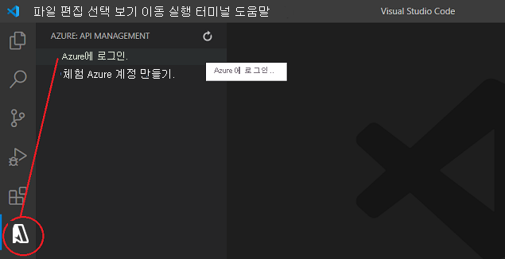
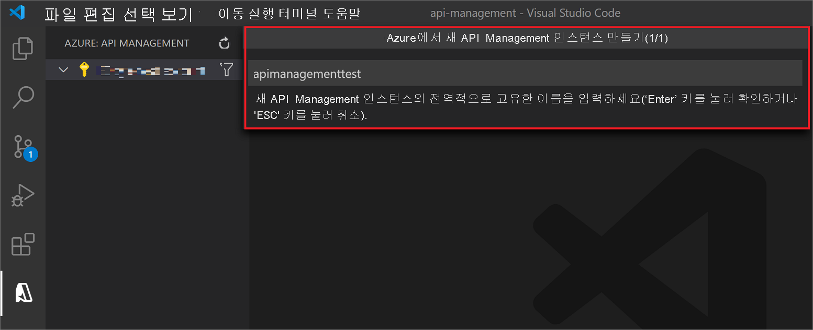
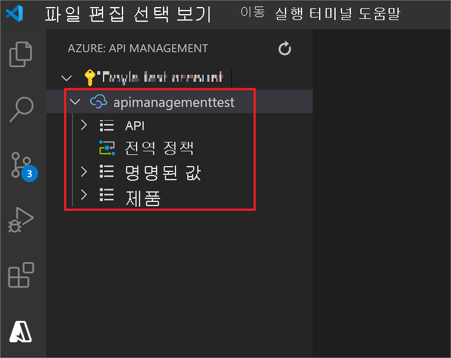
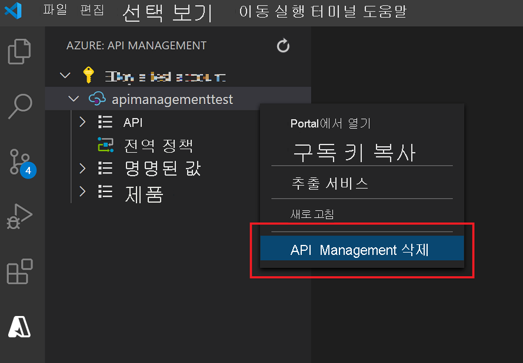

# 빠른 시작: Visual Studio Code를 사용하여 새 Azure API Management 서비스 인스턴스 만들기

Azure APIM(API Management)을 사용하여 조직은 외부, 파트너 및 내부의 개발자에게 API를 게시하여 데이터 및 서비스의 잠재성을 활용할 수 있습니다. API Management는 개발자 참여, 비즈니스 통찰력, 분석, 보안과 보호 등을 통해 성공적인 API 프로그램을 보장하는 핵심적인 역량을 제공합니다. APIM을 사용하면 어디서든 호스팅되는 기존 백 엔드 서비스를 위한 최신 API 게이트웨이를 만들고 관리할 수 있습니다. 자세한 내용은 [개요](api-management-key-concepts.md) 항목을 참조하세요.

이 빠른 시작에서는 Visual Studio Code용 *Azure API Management* 확장 미리 보기를 사용하여 새 API Management 인스턴스를 만드는 단계를 설명합니다. 확장을 사용하여 API Management 인스턴스에 대한 일반적인 관리 작업을 수행할 수도 있습니다.

## 필수 구성 요소

[!INCLUDE [quickstarts-free-trial-note](../../includes/quickstarts-free-trial-note.md)]

또한 다음을 설치했는지 확인합니다.

- [Visual Studio Code](https://code.visualstudio.com/)

- [Visual Studio Code용 Azure API Management 확장(미리 보기)](https://marketplace.visualstudio.com/items?itemName=ms-azuretools.vscode-apimanagement&ssr=false#overview)

## Azure에 로그인

Visual Studio Code를 시작하고 Azure 확장을 엽니다. (활동 표시줄에 Azure 아이콘이 표시되지 않는 경우 *Azure API Management* 확장이 활성화되어 있는지 확인합니다.)

**Azure에 로그인...** 을 선택하여 브라우저 창을 시작하고 Microsoft 계정에 로그인합니다.

## API Management 서비스 만들기

Microsoft 계정에 로그인하면 *Azure: API Management* 탐색기 창에 Azure 구독이 나열됩니다.

사용하려는 구독을 마우스 오른쪽 단추로 클릭하고 **Azure에서 API Management 만들기**를 선택합니다.

창이 열리면 새 API Management 인스턴스의 이름을 제공합니다. Azure 내에서 전역적으로 고유해야 하며 1~50개의 영숫자 및/또는 하이픈으로 구성되어야 하며 문자로 시작하고 영숫자로 끝나야 합니다.

새 API Management 인스턴스(및 상위 리소스 그룹)가 지정된 이름으로 생성됩니다. 기본적으로 인스턴스는 *Consumption* SKU를 사용하여 *미국 서부* 지역에 만들어집니다.

> [!TIP]
> *Azure API Management* 확장 설정에서 **고급 만들기**를 사용하도록 설정하면 [API Management SKU](https://azure.microsoft.com/pricing/details/api-management/), [Azure 지역](https://status.azure.com/en-us/status), [리소스 그룹](../azure-resource-manager/management/overview.md)을 지정하여 API Management 인스턴스를 배포할 수도 있습니다.
>
> *Consumption* SKU는 프로비저닝하는 데 1분 미만이 걸리지만 다른 SKU는 만드는 데 일반적으로 30~40분이 걸립니다.

이제 첫 번째 API를 가져오고 게시할 준비가 되었습니다. 이 작업을 수행하고 Visual Studio Code용 확장 내에서 일반적인 API Management 작업을 수행할 수도 있습니다. 자세한 내용은 [Visual Studio Code용 API Management 확장](https://marketplace.visualstudio.com/items?itemName=ms-azuretools.vscode-apimanagement&ssr=false#overview) 설명서를 참조하세요.

## 리소스 정리

더 이상 필요하지 않은 경우 마우스 오른쪽 단추를 클릭하고 **Portal에서 열기**를 선택하고 [API Management 서비스 및 리소스 그룹을 삭제](get-started-create-service-instance.md#clean-up-resources)하여 API Management 인스턴스를 제거합니다.

또는 **API Management 삭제**를 선택하여 API Management 인스턴스만 삭제할 수 있습니다(이 작업은 해당 리소스 그룹이 삭제되지 않음).

## 다음 단계

> [!div class="nextstepaction"]
> [첫 번째 API 가져오기 및 게시](import-and-publish.md)
