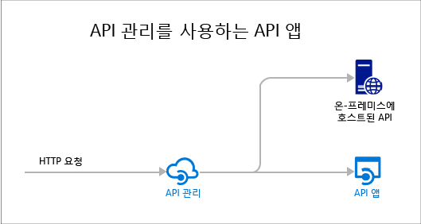

<properties 
	pageTitle="API 앱 소개 | Microsoft Azure" 
	description="Azure 앱 서비스로 RESTful API를 개발, 호스팅, 소비하는 방법에 대해 알아보세요." 
	services="app-service\api" 
	documentationCenter=".net" 
	authors="tdykstra" 
	manager="wpickett" 
	editor=""/>

<tags 
	ms.service="app-service-api" 
	ms.workload="web" 
	ms.tgt_pltfrm="na" 
	ms.devlang="na" 
	ms.topic="get-started-article" 
	ms.date="05/03/2016" 
	ms.author="tdykstra"/>

# API 앱 개요

Azure 앱 서비스의 API 앱은 클라우드 및 온-프레미스에서 API를 더욱 쉽게 개발, 호스팅 및 사용하는 기능을 제공합니다. API 앱을 사용하면 엔터프라이즈급 보안, 단순 액세스 제어, 하이브리드 연결, 자동 SDK 생성, 그리고 [Logic Apps](../app-service-logic/app-service-logic-what-are-logic-apps.md)와의 원활한 통합이 가능합니다.

[Azure 앱 서비스](../app-service/app-service-value-prop-what-is.md)는 웹, 모바일 및 통합 시나리오에 대해 완전히 관리되는 플랫폼입니다. API 앱은 [Azure 앱 서비스](../app-service/app-service-value-prop-what-is.md)에서 제공하는 4개의 앱 형식 중 하나입니다.

## API 앱을 사용하는 이유

API 앱의 몇 가지 주요 기능은 다음과 같습니다.

- **기존 API를 그대로 가져오기** - API 앱 기능을 활용하기 위해 기존 API의 코드를 변경할 필요가 없습니다. API 앱에 사용자 코드를 배포하기만 하면 됩니다. API는 ASP.NET 및 C#, Java, PHP, Node.js, Python을 비롯하여 앱 서비스에서 지원하는 모든 언어 또는 프레임워크를 사용할 수 있습니다.

- **쉽게 사용** - 통합된 [Swagger API 메타데이터](http://swagger.io/) 지원을 통해 다양한 클라이언트가 쉽게 API를 사용할 수 있도록 합니다. C#, Java 및 Javascript를 비롯한 다양한 언어로 API용 클라이언트 코드를 자동으로 생성할 수 있습니다. 코드 변경 없이 [CORS](app-service-api-cors-consume-javascript.md)를 쉽게 구성합니다. 자세한 내용은 [API 검색 및 코드 생성에 대한 앱 서비스 API 앱 메타데이터](app-service-api-metadata.md) 및 [CORS를 사용하여 JavaScript에서 API 앱 사용](app-service-api-cors-consume-javascript.md)을 참조하세요.

- **간단한 액세스 제어** - 코드를 변경하지 않고 API 앱을 인증되지 않은 액세스로부터 보호합니다. 기본 제공 인증 서비스는 다른 서비스 또는 사용자를 나타내는 클라이언트에서 액세스에 대해 API를 보호합니다. 지원되는 ID 공급자에는 Azure Active Directory, Facebook, Twitter, Google, Microsoft 계정 등이 있습니다. 클라이언트는 ADAL(Active Directory 인증 라이브러리) 또는 모바일 앱 SDK를 사용할 수 있습니다. 자세한 내용은 [Azure 앱 서비스의 API 앱에 대한 인증 및 권한 부여](app-service-api-authentication.md)를 참조하세요.

- **Visual Studio 통합** - Visual Studio의 전용 도구는 API 앱을 생성, 배포, 사용, 디버그 및 관리하는 작업을 간소화합니다. 자세한 내용은 [.NET용 Azure SDK 2.8.1 발표](/blog/announcing-azure-sdk-2-8-1-for-net/)를 참조하세요.

- **논리 앱과 통합** - 사용자가 만드는 API 앱은 [앱 서비스 논리 앱](../app-service-logic/app-service-logic-what-are-logic-apps.md)을 통해 사용할 수 있습니다. 자세한 내용은 [Logic Apps로 앱 서비스에서 호스팅되는 사용자 지정 API 사용](../app-service-logic/app-service-logic-custom-hosted-api.md) 및 [새 스키마 버전 2015-08-01-preview](../app-service-logic/app-service-logic-schema-2015-08-01.md)를 참조하세요.

또한 API 앱에서는 [웹앱](../app-service-web/app-service-web-overview.md) 및 [모바일 앱](../app-service-mobile/app-service-mobile-value-prop.md)에서 제공하는 기능을 활용할 수 있습니다. 반대의 경우도 마찬가지입니다. 웹앱 또는 모바일 앱을 사용하여 API를 호스트할 수 있는 경우 클라이언트 코드 생성을 위해 Swagger 메타데이터와 같은 API 앱 기능을, 도메인 간 브라우저 액세스를 위해 CORS를 활용할 수 있습니다. 세 가지 앱 유형(API, 웹, 모바일) 간의 유일한 차이는 해당 이름과 Azure 포털에서 사용되는 아이콘뿐입니다.

## API 앱과 Azure API 관리의 차이

API 앱 및 [Azure API 관리](../api-management/api-management-key-concepts.md)는 다음과 같이 보완적인 서비스입니다.

* API 관리는 API를 관리하는 것입니다. API에 API 관리 프런트 엔드를 배치하여 사용량을 모니터링 및 제한하고, 입력과 출력을 조작하며, 여러 API를 하나의 끝점으로 통합하는 등의 작업을 합니다. 관리되는 API는 어디서나 호스팅할 수 있습니다.
* API 앱은 API를 호스팅하는 것입니다. 이 서비스에는 API 개발 및 사용 방법을 용이하게 하는 기능이 포함되어 있지만 API 관리가 수행하는 것을 모니터링, 제한, 조작하거나 통합하는 유형의 작업은 수행하지 않습니다. API 관리 기능이 필요하지 않은 경우 API 관리를 사용하지 않고 Api 앱에 API를 호스팅할 수 있습니다.

다음은 API 앱 및 기타 위치에 호스팅되는 API에 사용하는 API 관리를 보여주는 다이어그램입니다.

API 관리 및 API 앱의 일부 기능에는 유사한 함수가 있습니다. 예를 들어, 두 가지 모두 CORS 지원을 자동화할 수 있습니다. 두 서비스를 함께 사용하면 API 앱에 대한 프런트 엔드로 작동하므로 CORS에 대한 API 관리를 사용합니다.

## 시작

샘플 코드를 배포하여 API 앱을 시작하려면 선호하는 프레임워크에 대한 자습서를 참조하세요.

* [ASP.NET](app-service-api-dotnet-get-started.md) 
* [Node.JS](app-service-api-nodejs-api-app.md) 
* [Java](app-service-api-java-api-app.md) 

API 앱에 대해 질문하려면 [API 앱 포럼](https://social.msdn.microsoft.com/Forums/ko-KR/home?forum=AzureAPIApps)에서 스레드를 시작하세요.

<!---HONumber=AcomDC_0511_2016-->