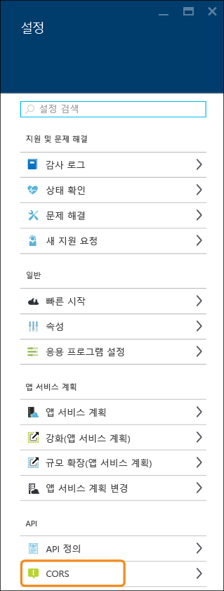
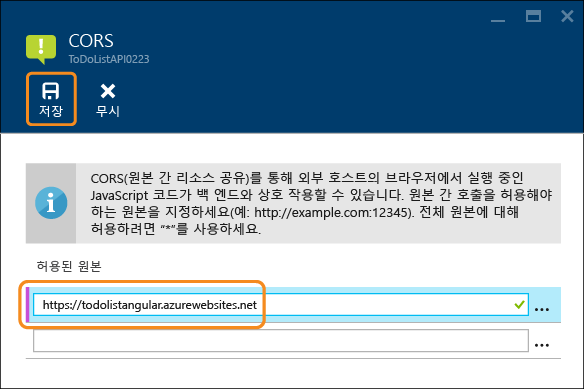
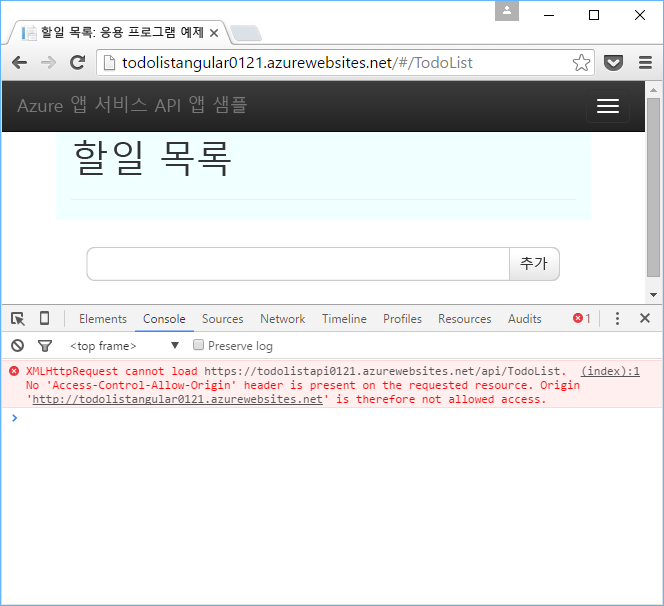
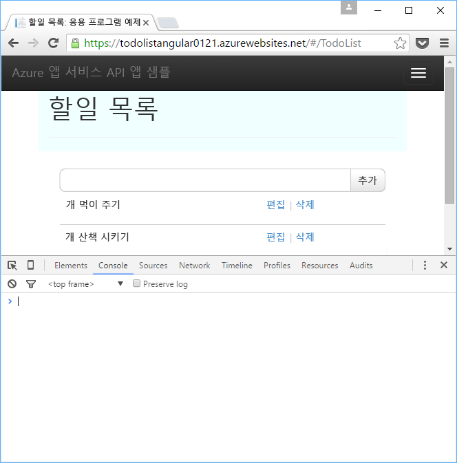

<properties
	pageTitle="CORS를 사용하여 JavaScript에서 API 앱 사용 | Microsoft Azure"
	description="CORS를 사용하여 JavaScript 클라이언트에서 Azure 앱 서비스의 API 앱을 사용하는 방법을 알아봅니다."
	services="app-service\api"
	documentationCenter=".net"
	authors="tdykstra"
	manager="wpickett"
	editor=""/>

<tags
	ms.service="app-service-api"
	ms.workload="na"
	ms.tgt_pltfrm="dotnet"
	ms.devlang="na"
	ms.topic="get-started-article"
	ms.date="01/26/2016"
	ms.author="tdykstra"/>

# CORS를 사용하여 JavaScript에서 API 앱 사용

[AZURE.INCLUDE [app-service-api-get-started-selector](../../includes/app-service-api-get-started-selector.md)]

## 개요

이 문서에는 다음과 같은 두 섹션이 포함되어 있습니다.

* [CORS을 구성하는 방법](#corsconfig) 섹션은 모든 API 앱에 CORS을 구성하는 방법을 일반적으로 설명하며 .NET, Node.js 및 Java 등 앱 서비스에서 지원하는 모든 프레임워크에 동일하게 적용됩니다. 

* [문서의 나머지 부분](#tutorialstart)은 .NET 샘플 응용 프로그램을 배포하고 CORS를 구성하는 과정을 안내하므로 JavaScript 프런트 엔드는 Web API 백 엔드를 호출할 수 있습니다.

##  Azure 앱 서비스에서 CORS을 구성하는 방법

### CORS 정의

보안상의 이유로 브라우저에서는 JavaScript가 해당 JavaScript 코드와 함께 제공되는 도메인 이외의 다른 도메인에 대한 API 호출을 방지합니다. 예를 들어 contoso.com 웹 페이지에서는 contoso.com API 끝점을 호출할 수 있지만 fabrikam.com 끝점을 호출할 수는 없습니다. CORS(원본 간 리소스 공유)는 이러한 도메인 간 API 호출이 필요한 시나리오를 지원하도록 설계된 인터넷 프로토콜입니다. Azure 앱 서비스에서 이러한 시나리오의 예를 들면 API가 API 앱에서 실행되는 동안 JavaScript 클라이언트가 웹앱에서 실행되는 경우입니다.

### 앱 서비스에서 CORS 지원

앱 서비스는 API 앱을 호출할 수 있는 도메인을 구성하는 간편한 방법을 제공하고 CORS 기능은 API 앱 서비스가 지원하는 모든 언어에 대해 동일하게 작동합니다.

### Azure 포털에서 CORS 구성

8. 브라우저에서 [Azure 포털](https://portal.azure.com/)로 이동합니다.

9. **찾아보기 > API 앱**을 클릭합니다.

	

11. 대상 API 앱을 선택합니다.

	

10. **API 앱** 블레이드에서 **설정**을 클릭합니다.

	

11. **API** 섹션을 찾은 다음 **CORS**를 클릭합니다.

12. 텍스트 상자에서 가져올 JavaScript 호출을 허용하려는 URL을 입력합니다.

	예를 들어 todolistangular라는 웹앱에 JavaScript 응용 프로그램을 배포한 경우 "https://todolistangular.azurewebsites.net"을 입력합니다. 대신 별표(*)를 입력하여 모든 원본 도메인이 허용되도록 지정할 수 있습니다.

13. **Save**를 클릭합니다.

	

	**저장**을 클릭한 후에 API 앱은 지정된 URL에서 JavaScript 호출을 수락합니다.

### Azure 리소스 관리자 도구를 사용하여 CORS 구성

또한 Azure PowerShell 또는 Azure 플랫폼 간 명령줄 인터페이스와 같은 명령줄 도구를 사용하거나 [리소스 탐색기](https://resources.azure.com/)를 사용하여 API 앱에 CORS를 구성할 수 있습니다.

이러한 도구에서 <site name>/web 리소스에 대한 Microsoft.Web/sites/config 리소스 유형에서 `cors` 속성을 설정합니다. 예를 들어, **리소스 탐색기**에서 **구독 > {구독} > resourceGroups > {리소스 그룹} > 공급자 > Microsoft.Web > 사이트 > {사이트} > 구성 > 웹**으로 이동하면 cors 속성이 표시됩니다.

		"cors": {
		    "allowedOrigins": [
		        "todolistangular.azurewebsites.net"
		    ]
		}

##  .NET 시작 자습서 계속

API 앱에 Node.js 또는 Java 시작 시리즈를 수행 중인 경우 다음 글인 [앱 서비스 API 앱에 대한 인증](app-service-api-authentication.md)으로 건너뜁니다.

이 문서의 나머지 부분은 .NET 시작 시리즈의 계속이며 성공적으로 [첫 번째 자습서](app-service-api-dotnet-get-started.md)를 완료했다고 가정합니다.

## 새 웹앱에 ToDoListAngular 프로젝트 배포

[첫 번째 자습서](app-service-api-dotnet-get-started.md)에서 중간 계층 API 앱 및 데이터 계층 API 앱을 만들었습니다. 이 자습서에서는 중간 계층 API 앱을 호출하는 SPA(단일 페이지 응용 프로그램) 웹앱을 만듭니다. SPA를 작동하려면 중간 계층 API 앱에서 CORS를 사용하도록 설정해야 합니다.

[ToDoList 샘플 응용 프로그램](https://github.com/Azure-Samples/app-service-api-dotnet-todo-list)에서 ToDoListAngular 프로젝트는 중간 계층 ToDoListAPI Web API 프로젝트를 호출하는 간단한 AngularJS 클라이언트입니다. *app/scripts/todoListSvc.js* 파일에서 JavaScript 코드는 AngularJS HTTP 공급자를 사용하여 API를 호출합니다.

		angular.module('todoApp')
		.factory('todoListSvc', ['$http', function ($http) {
		    var apiEndpoint = "http://localhost:46439";
		
		    $http.defaults.useXDomain = true;
		    delete $http.defaults.headers.common['X-Requested-With']; 
		
		    return {
		        getItems : function(){
		            return $http.get(apiEndpoint + '/api/TodoList');
		        },

		        /* Get by ID, Put, and Delete methods not shown */

		        postItem : function(item){
		            return $http.post(apiEndpoint + '/api/TodoList', item);
		        }
		    };
		}]);

### ToDoListAngular 프로젝트를 구성하여 ToDoListAPI API 앱 호출 

이때 코드가 이전 자습서에 만든 ToDoListAPI Azure API 앱을 호출하도록 프런트 엔드를 Azure에 배포하기 전에 AngularJS 프로젝트에서 API 끝점을 변경해야 합니다.

1. ToDoListAngular 프로젝트에서 *app/scripts/todoListSvc.js* 파일을 엽니다.

2. `apiEndpoint`을 localhost URL로 설정하는 줄을 주석 처리하고 `apiEndPoint`을 azurewebsites.net URL로 설정하는 줄의 주석을 제거한 후 자리 표시자를 이전에 만든 API 앱의 실제 이름으로 바꿉니다. API 앱 이름을 ToDoListAPI0125로 지정하면 코드가 다음 예제와 같이 표시됩니다.

		var apiEndPoint = 'https://todolistapi0125.azurewebsites.net';
		//var apiEndPoint = 'http://localhost:45914';

3. 변경 내용을 저장합니다.

### ToDoListAngular 프로젝트에 새 웹앱 만들기

새 웹앱을 만들고 프로젝트를 배포하는 절차는 **웹앱**에서 **API 앱**으로 형식을 변경하지 않는 점을 제외하고 이 시리즈의 첫 번째 자습서와 동일합니다.

1. **솔루션 탐색기**에서 ToDoListAngular 프로젝트를 마우스 오른쪽 단추로 클릭하고 **게시**를 클릭합니다.

3.  **웹 게시** 마법사의 **프로필** 탭에서 **Microsoft Azure 앱 서비스**를 클릭합니다.

5. **앱 서비스** 대화 상자에서 **새로 만들기**를 클릭합니다.

3. **앱 서비스 만들기** 대화 상자의 **호스팅** 탭에서 형식이 **웹앱**인지 확인합니다.

4. *azurewebsites.net* 도메인에서 고유한 **웹앱 이름**을 입력합니다.

5. 사용할 Azure **구독**을 선택합니다.

6. **리소스 그룹** 드롭다운에서 이전에 만든 리소스 그룹을 선택합니다.

4. **앱 서비스 계획** 드롭다운에서 이전에 만든 계획을 선택합니다.

7. **만들기**를 클릭합니다.

	Visual Studio에서 웹앱을 만들고, 해당 게시 프로필을 만든 다음, **웹 게시** 마법사의 **연결** 단계를 표시합니다.

### 새 웹앱에 ToDoListAngular 웹 프로젝트 배포

*  **웹 게시** 마법사의 **연결** 단계에서 **게시**를 클릭합니다.

	Visual Studio에서 ToDoListAngular 프로젝트를 웹앱에 배포하고 해당 웹앱의 URL로 브라우저를 엽니다.

### CORS를 사용하지 않고 응용 프로그램 테스트 

2. 브라우저 개발자 도구에서에서 콘솔 창을 엽니다.

3. AngularJS UI를 표시하는 브라우저 창에서 **할 일 목록** 링크를 클릭합니다.

	JavaScript 코드는 중간 계층 API 앱을 호출하려 하지만 해당 호출은 프런트 엔드가 백 엔드(API 앱 URL)와 다른 도메인(웹앱 URL)에서 실행되므로 실패합니다. 브라우저의 개발자 도구 콘솔 창은 교차 원본 오류 메시지를 표시합니다.

	

## Azure 앱 서비스에서 CORS 구성

이 섹션에서는 ToDoListAngular 프로젝트에 대해 만든 웹앱에서 JavaScript 호출을 허용하도록 중간 계층 API 앱을 구성합니다.
 
8. 브라우저에서 [Azure 포털](https://portal.azure.com/)로 이동합니다.

9. ToDoListAPI(중간 계층) API 앱으로 이동합니다.

10. **API 앱** 블레이드에서 **설정**을 클릭합니다.

11. **API** 섹션을 찾은 다음 **CORS**를 클릭합니다.

12. 텍스트 상자에 ToDoListAngular(프런트 엔드) 웹앱에 대한 URL을 입력합니다. 예를 들어 ToDoListAngular 프로젝트를 todolistangular0121이라는 웹앱에 배포한 경우 URL `https://todolistangular0121.azurewebsites.net`에서 호출을 허용합니다.

	대신 별표(*)를 입력하여 모든 원본 도메인이 허용되도록 지정할 수 있습니다.

13. **Save**를 클릭합니다.

	

### CORS를 사용하여 응용 프로그램 테스트

* 웹앱의 HTTPS URL로 브라우저를 엽니다. 

	이번에는 응용 프로그램이 할 일 목록을 보기, 추가, 편집 및 삭제합니다.

	

## 앱 서비스 CORS와 Web API CORS

Web API 프로젝트에서는 [Microsoft.AspNet.WebApi.Cors](https://www.nuget.org/packages/Microsoft.AspNet.WebApi.Cors/) NuGet 패키지를 설치하여 API가 JavaScript 호출을 허용할 도메인을 코드에서 지정할 수 있습니다.
 
하나의 API 앱에서 Web API CORS와 앱 서비스 CORS를 함께 사용하지 마십시오. 앱 서비스 CORS가 우선적으로 적용되며 Web API CORS는 아무 효과가 없습니다. 예를 들어 앱 서비스에서 하나의 원본 도메인을 사용하도록 설정하고 Web API 코드에서 모든 원본 도메인을 사용하도록 설정한 경우 Azure API 앱은 Azure에서 지정한 도메인의 호출만 허용합니다.

Web API CORS 지원은 앱 서비스 CORS 지원보다 유연성이 뛰어납니다. 예를 들어 코드에서 다른 작업 메서드에 대해 다른 허용된 원본을 지정할 수 있는 반면 앱 서비스 CORS의 경우 모든 API 앱의 메서드에 대해 허용된 원본 집합을 지정합니다.

### Web API 코드에서 CORS를 설정하는 방법

다음 단계는 Web API CORS 지원 설정에 대한 프로세스를 간략하게 설명합니다. 자세한 내용은 [ASP.NET Web API 2에서 교차 원본 요청 사용](http://www.asp.net/web-api/overview/security/enabling-cross-origin-requests-in-web-api)을 참조하세요.

1. Web API 프로젝트에서 다음 예제와 같이 **WebApiConfig** 클래스의 **등록** 메서드에 `config.EnableCors()` 코드 줄을 포함합니다. 

		public static class WebApiConfig
	    {
	        public static void Register(HttpConfiguration config)
	        {
	            // Web API configuration and services
	            
		        // The following line enables you to control CORS by using Web API code
				config.EnableCors();
	
	            // Web API routes
	            config.MapHttpAttributeRoutes();
	
	            config.Routes.MapHttpRoute(
	                name: "DefaultApi",
	                routeTemplate: "api/{controller}/{id}",
	                defaults: new { id = RouteParameter.Optional }
	            );
	        }
	    }

1. Web API 컨트롤러에서 `EnableCors` 특성을 컨트롤러 클래스 또는 개별 작업 메서드에 추가합니다. 다음 예제에서 CORS 지원은 전체 컨트롤러에 적용됩니다.

		namespace ToDoListAPI.Controllers
		{
		    [HttpOperationExceptionFilterAttribute]
		    [EnableCors(origins:"*", headers:"*", methods: "*")]
		    public class ToDoListController : ApiController
 
	> **참고**: `EnableCors` 특성에서 모든 매개 변수에 와일드카드를 사용한 것은 데모만을 위한 것이며, 모든 원본 및 모든 HTTP 요청까지 API를 개방합니다. 이 특성을 사용할 때 주의하세요.

## 다음 단계 

이 자습서에서는 앱 서비스 CORS 지원을 사용하여 클라이언트 JavaScript 코드가 다른 도메인에서 API를 호출할 수 있는 방법을 살펴보았습니다. API 앱 시작 시리즈의 다음 문서에서는 [앱 서비스 API 앱에 대한 인증](app-service-api-authentication.md)에 대해 알아봅니다.

<!---HONumber=AcomDC_0128_2016-->