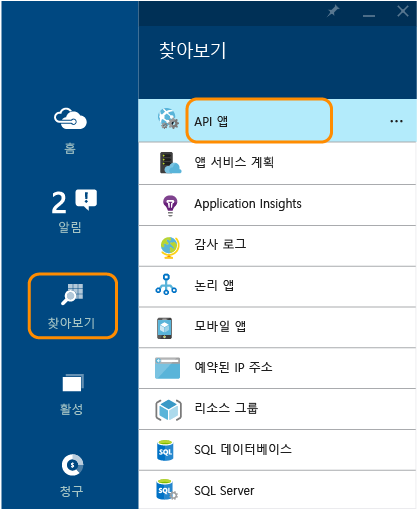
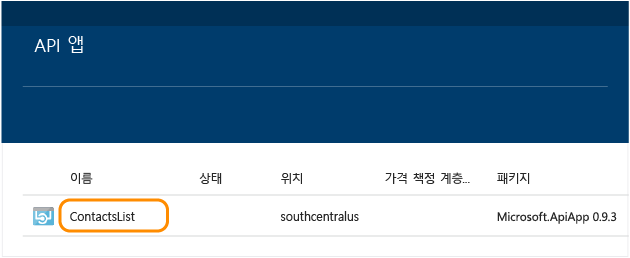
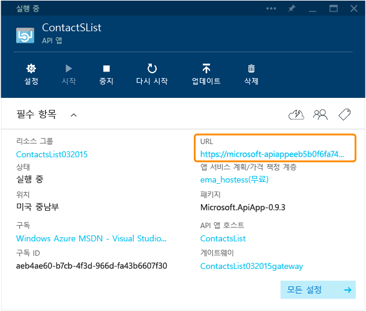
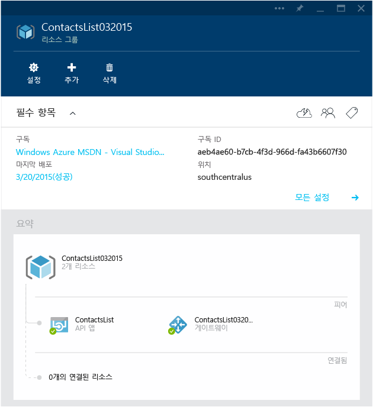
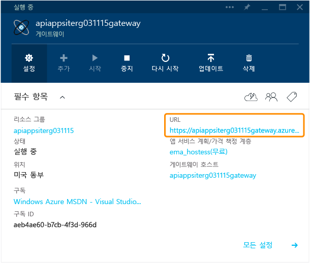
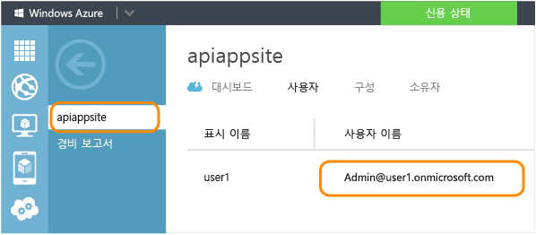
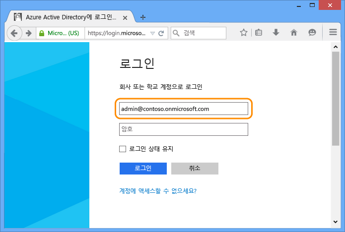
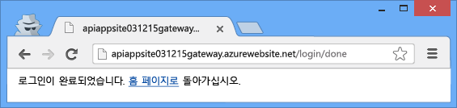
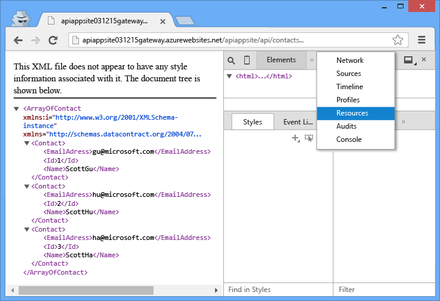

<properties 
	pageTitle="Azure API 앱 보호" 
	description="Visual Studio를 사용하여 Azure API 앱을 보호하는 방법에 대해 알아봅니다." 
	services="app-service\api" 
	documentationCenter=".net" 
	authors="tdykstra" 
	manager="wpickett" 
	editor="jimbe"/>

<tags 
	ms.service="app-service-api" 
	ms.workload="web" 
	ms.tgt_pltfrm="dotnet" 
	ms.devlang="na" 
	ms.topic="article" 
	ms.date="03/24/2015" 
	ms.author="tdykstra"/>

# API 앱 보호: Azure Active Directory 또는 소셜 공급자 인증 추가

## 개요

[API 앱 배포](app-service-dotnet-deploy-api-app.md) 자습서에서는 **Available to anyone(누구나 사용 가능)** 액세스 수준으로 API 앱을 배포했습니다. 이 자습서에서는 인증된 사용자만 API 앱에 액세스할 수 있도록 API 앱을 보호하는 방법을 보여 줍니다.

다음 단계를 수행합니다.

- API 앱을 호출하여 작동하는지 확인
- API 앱에 인증 규칙 적용
- API 앱을 다시 호출하여 인증되지 않은 요청을 거부하는지 확인
- 구성된 공급자에 로그인
- API 앱을 다시 호출하여 인증된 액세스가 작동하는지 확인

## 필수 조건

이 자습서에서는 [API 앱 만들기](app-service-dotnet-create-api-app.md)에서 만들고 [API 앱 배포](app-service-dotnet-deploy-api-app.md)에서 배포한 API 앱을 사용합니다.

## 브라우저를 사용하여 API 앱 호출 

API 앱에 공개적으로 액세스할 수 있는지를 확인하는 가장 간단한 방법은 브라우저에서 API 앱을 호출하는 것입니다.

1. 브라우저에서 [Azure Preview 포털]로 이동합니다.

3. 홈페이지에서 **찾아보기 > API 앱**을 클릭한 후 보호하려는 API 앱의 이름을 클릭합니다.

	

	

3. **API 앱** 블레이드에서 **URL**을 클릭하여 API 앱을 호출하는 브라우저 창을 엽니다.

	

2. 브라우저 주소 표시줄의 URL에 `/api/contacts/get/`를 추가합니다.

	예를 들어 API 앱의 URL이 다음과 같은 경우

    	https://microsoft-apiappeeb5bdsasd744e188be7fa26f239bd4b.azurewebsites.net/

	전체 URL은 다음과 같습니다.

    	https://microsoft-apiappeeb5bdsasd744e188be7fa26f239bd4b.azurewebsites.net/api/contacts/get/

	다양한 브라우저가 API 호출을 처리하는 방식은 각기 다릅니다. 이미지는 Chrome 브라우저에서의 성공적인 호출을 보여 줍니다.

	

2. 사용한 URL을 저장합니다. 자습서의 뒷부분에서 이 URL을 다시 사용합니다.

## API 앱 보호

API 앱을 배포할 때 리소스 그룹에 배포했습니다. 동일한 리소스 그룹에 웹앱과 다른 API 앱을 추가할 수 있으며 리소스 그룹 내의 각 API 앱의 접근성 설정은 다음의 세 가지 중 하나일 수 있습니다. <!--todo: diagram showing different accessibility settings-->

- **공용(익명)** - 모든 사용자가 로그인하지 않고 리소스 그룹 외부에서 API 앱을 호출할 수 있습니다.
- **공용(인증됨)** - 인증된 사용자만 리소스 그룹 외부에서 API 앱을 호출할 수 있습니다.
- **내부** - 동일한 리소스 그룹의 다른 API 앱만 API 앱을 호출할 수 있습니다. 웹앱에서의 호출은 웹앱이 동일한 리소스 그룹에 있는 경우에도 외부로 간주됩니다.

Visual Studio에서 리소스 그룹을 만들 때 *게이트웨이*도 만들어집니다. 게이트웨이는 대상이 리소스 그룹의 API 앱인 모든 요청을 처리하는 특수 웹앱입니다.

[Azure Preview 포털]에서 리소스 그룹의 블레이드로 이동하면 API 앱 및 다이어그램의 게이트웨이를 볼 수 있습니다.

### 인증을 요구하도록 API 앱 구성

API 앱이 인증된 요청만 수락하도록 구성하기 위해 해당 접근성을 **공용(인증됨)**으로 설정하고 Azure Active Directory, Google 또는 Facebook과 같은 공급자의 인증을 요구하도록 게이트웨이를 구성합니다.

1. 보호하려는 API 앱의 **API 앱** 블레이드로 돌아갑니다.

2. **API 앱** 블레이드에서 **설정**을 클릭한 후 **응용 프로그램 설정**을 클릭합니다.

	

	

3. **응용 프로그램 설정** 블레이드에서 **액세스 수준**을 **공용(인증됨)**으로 변경하고 **저장**을 클릭합니다.

	

	이제 API 앱이 인증되지 않은 액세스로부터 보호됩니다. 그런 다음, 게이트웨이를 구성하여 사용할 인증 공급자를 지정해야 합니다.

### 인증 공급자를 사용하도록 게이트웨이 구성

4. 다시 **API 앱** 블레이드가 표시될 때까지 왼쪽으로 스크롤한 후 게이트웨이 링크를 클릭합니다.

	

7. **게이트웨이** 블레이드에서 **설정**을 클릭한 후 **ID**를 클릭합니다.

	

	

	**ID** 블레이드에서 Azure Active Directory 및 기타 여러 공급자를 사용하여 인증을 구성하기 위한 다른 블레이드로 이동할 수 있습니다.

	
  
3. 사용할 ID 공급자를 선택하고 해당 문서의 단계에 따라 해당 공급자를 사용하여 API 앱을 구성합니다. 이러한 문서는 모바일 앱용으로 작성되었지만 절차는 API 앱에 대해서도 동일합니다. 일부 절차를 수행하려면 [Azure 포털]을 사용해야 합니다.

 - [Microsoft 계정](../app-service-mobile/app-service-mobile-how-to-configure-microsoft-authentication-preview.md)
 - [Facebook 로그인](../app-service-mobile/app-service-mobile-how-to-configure-facebook-authentication-preview.md)
 - [Twitter 로그인](../app-service-mobile/app-service-mobile-how-to-configure-twitter-authentication-preview.md)
 - [Google 로그인](../app-service-mobile/app-service-mobile-how-to-configure-google-authentication-preview.md)
 - [Azure Active Directory](../app-service-mobile/app-service-mobile-how-to-configure-active-directory-authentication-preview.md)

예를 들어 다음 스크린샷은 Azure Active Directory 인증을 설정한 후 [Azure 포털] 페이지 및 [Azure Preview 포털] 블레이드에 표시되어야 하는 내용을 보여 줍니다.

Azure Preview 포털에서 **Azure Active Directory** 블레이드에는 Azure 포털의 Azure Active Directory 탭에서 만든 응용 프로그램의 **클라이언트 ID**가 있고, **허용된 테넌트**에는 Azure Active Directory 테넌트(예: "contoso.onmicrosoft.com")가 있습니다.

Azure 포털에서 **Azure Active Directory** 탭에서 만든 응용 프로그램의 **구성** 탭에는 Azure Preview 포털의 **Azure Active Directory** 블레이드에서 가져온 **로그온 URL**, **앱 ID URI** 및 **회신 URL**이 있습니다.

이미지의 회신 URL은 동일한 URL을 두 번 보여 주는데 하나는 `http:`를 사용한 것이고 다른 하나는 `https:`를 사용한 것입니다.

## 인증이 작동하는지 확인

**참고:** 다음 단계를 수행할 때 로그인하는 데 문제가 있는 경우 비공개 또는 시크릿 창으로 여세요.
 
1. 브라우저 창을 열고 앞에서 한 것처럼 API 앱의 `Get` 메서드를 호출하는 URL을 주소 표시줄에 입력합니다.

	이번에는 API 앱에 액세스하려는 시도로 인해 오류 메시지가 표시됩니다.

	

2. 브라우저에서 다음과 같이 로그인 URL로 이동합니다. URL은 다음 패턴을 따릅니다.

    	http://[gatewayurl]/login/[providername]

	[Azure Preview 포털]의 **게이트웨이** 블레이드에서 게이트웨이 URL을 얻을 수 있습니다. **게이트웨이** 블레이드에 액세스하려면 **리소스 그룹** 블레이드에 표시된 다이어그램에서 게이트웨이를 클릭합니다.

	

	[providername] 값은 "microsoftaccount", "facebook", "twitter", "google" 또는 "aad"입니다.

	다음은 Azure Active Directory에 대한 샘플 로그인 URL입니다.

		https://dropboxrgaeb4ae60b7cb4f3d966dfa43.azurewebsites.net/login/aad/

	이전 URL과 달리 이 URL에는 API 앱 이름이 포함되지 않습니다. 게이트웨이는 사용자를 인증하는 것이지 API 앱을 인증하는 것이 아닙니다. 게이트웨이는 리소스 그룹의 모든 API 앱에 대한 인증을 처리합니다.

3. 브라우저에 로그인 페이지가 표시되면 자격 증명을 입력합니다.
 
	Azure Active Directory 로그인을 구성한 경우 [Azure 포털]의 Azure Active Directory 탭에서 만든 응용 프로그램의 **사용자** 탭에 나열된 사용자 중 하나를 사용합니다(예: admin@contoso.onmicrosoft.com).

	

	

4. "로그인 완료" 메시지가 표시되면 API 앱의 Get 메서드 URL을 다시 입력합니다.

	이번에는 사용자가 인증되었으므로 호출에 성공합니다. 게이트웨이가 사용자를 인증된 사용자로 인식하고 요청을 API 앱에 전달합니다.

	

	

## Postman을 사용하여 Post 요청 보내기

게이트웨이에 로그인하면 게이트웨이가 인증 토큰을 다시 보냅니다. 이 토큰은 게이트웨이를 통과하는 외부 원본의 모든 요청에 포함되어야 합니다. 브라우저로 API에 액세스하는 경우 브라우저는 일반적으로 토큰을 쿠키에 저장하고 API에 대한 모든 후속 호출과 함께 토큰을 보냅니다.

따라서 백그라운드에서 수행되고 있는 작업을 볼 수 있으며, 자습서의 이 섹션에서는 브라우저 도구를 사용하여 Post 요청을 만들어 제출하고 쿠키에서 인증 토큰을 가져와 HTTP 헤더에 포함합니다. 이 섹션은 선택 사항입니다. 이전 섹션에서 API 앱이 인증된 액세스만 수락하는 것을 이미 확인했습니다.

이러한 지침에서는 Chrome 브라우저에서 Postman 도구를 사용하는 방법을 보여 주지만 모든 REST 클라이언트 도구 및 브라우저 개발자 도구를 사용해서도 동일한 작업을 수행할 수 있습니다.

1. Chrome 브라우저 창에서 이전 섹션에 표시된 단계를 거쳐 인증한 후 개발자 도구(F12 키)를 엽니다.

	

3. Chrome 개발자 도구의 **Resources** 탭에서 게이트웨이에 대한 쿠키를 찾아 **x-zumo-auth** 쿠키 값을 세 번 클릭하여 모두 선택합니다.

	**참고:** 쿠키의 값을 모두 가져와야 합니다. 두 번 클릭하면 첫 번째 부분만 가져올 수 있습니다.

5. **x-zumo-auth** 쿠키의 **Value**를 마우스 오른쪽 단추로 클릭한 후 **Copy**를 클릭합니다.

	

4. 아직 Chrome 브라우저에 Postman 확장을 설치하지 않은 경우 설치합니다.

6. Postman 확장을 엽니다.

7. Request URL 필드에 이전에 사용한 API 앱의 Get 메서드 URL을 입력하되 끝에서 `get/`를 생략합니다.
 
		http://[apiappurl]/api/contacts
    
8. **Headers**를 클릭하고 *x-zumo-auth* 헤더를 추가합니다. 클립보드의 토큰 값을 **Value** 필드에 붙여넣습니다.

9. 값을 *application/json*으로 하여 *Content-Type* 헤더를 추가합니다.

10. **form-data**를 클릭하고 다음 값으로 *contact* 키를 추가합니다.

		{   "Id": 0,   "Name": "Li Yan",   "EmailAddress": "yan@contoso.com" }

11. Send를 클릭합니다.

	API 앱에서 *201 Created* 응답을 반환합니다.

	

12. 이 요청이 인증 토큰 없이는 작동하지 않는지 확인하려면 인증 헤더를 삭제하고 Send를 다시 클릭합니다.

	*403 Forbidden* 응답이 표시됩니다.

	

## 다음 단계

Azure Active Directory 또는 소셜 공급자 인증을 요구하여 Azure API 앱을 보호하는 방법을 살펴봤습니다. 자세한 내용은 [API 앱 정의](app-service-api-apps-why-best-platform.md)를 참조하세요.

[Azure 포털]: https://manage.windowsazure.com/
[Azure Preview 포털]: https://portal.azure.com/

<!--HONumber=54--> 