<properties
	pageTitle="앱 서비스에서 API 앱 및 ASP.NET 시작 | Microsoft Azure"
	description="Visual Studio 2015를 사용하여 Azure 앱 서비스에서 ASP.NET API 앱을 만들고, 배포하고, 사용하는 방법을 알아봅니다."
	services="app-service\api"
	documentationCenter=".net"
	authors="tdykstra"
	manager="wpickett"
	editor=""/>

<tags
	ms.service="app-service-api"
	ms.workload="na"
	ms.tgt_pltfrm="dotnet"
	ms.devlang="na"
	ms.topic="hero-article"
	ms.date="09/20/2016"
	ms.author="rachelap"/>

# Azure 앱 서비스에서 API 앱, ASP.NET 및 Swagger 시작

[AZURE.INCLUDE [선택기](../../includes/app-service-api-get-started-selector.md)]

다음은 RESTful API를 개발 및 호스팅하기 위해 Azure 앱 서비스의 기능을 사용하는 방법을 보여주는 자습서 시리즈의 첫 번째 항목입니다. 이 자습서에는 Swagger 형식인 API 메타데이터에 대한 지원을 다룹니다.

다음 내용을 배웁니다.

* Visual Studio 2015의 기본 제공 도구를 사용하여 Azure 앱 서비스에서 [API 앱](app-service-api-apps-why-best-platform.md)을 만들고 배포하는 방법
* Swashbuckle NuGet 패키지를 사용하여 Swagger API 메타데이터를 동적으로 생성하는 방식으로 API 검색을 자동화하는 방법
* Swagger API 메타데이터를 사용하여 API 앱에 클라이언트 코드를 자동으로 생성하는 방법

## 샘플 응용 프로그램 개요

이 자습서에서는 간단한 할 일 모음 샘플 응용 프로그램으로 작업합니다. 응용 프로그램에는 SPA(단일 페이지 응용 프로그램) 프런트 엔드, ASP.NET Web API 중간 계층 및 ASP.NET Web API 데이터 계층이 있습니다.

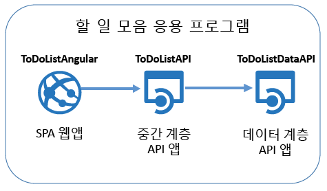

[AngularJS](https://angularjs.org/) 프런트 엔드의 스크린샷은 다음과 같습니다.

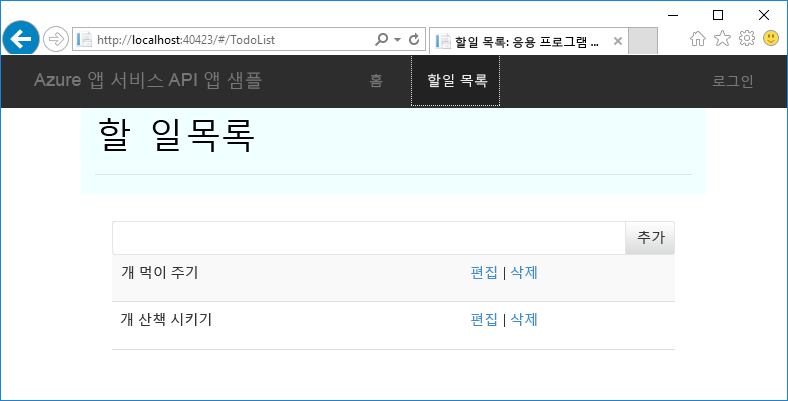

Visual Studio 솔루션에는 다음과 같은 세 가지 프로젝트가 포함되어 있습니다.

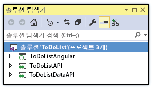

* **ToDoListAngular** - 프런트 엔드: 중간 계층을 호출하는 AngularJS SPA입니다.

* **ToDoListAPI** - 중간 계층: 할 일 항목에서 CRUD 작업을 수행하는 데이터 계층을 호출하는 ASP.NET Web API 프로젝트입니다.

* **ToDoListDataAPI** - 데이터 계층: 할 일 항목에서 CRUD 작업을 수행하는 ASP.NET Web API 프로젝트입니다.

3계층 아키텍처는 API 앱을 사용하여 구현할 수 있는 많은 아키텍처 중 하나이며 여기서는 설명을 위해서만 사용됩니다. 각 계층의 코드는 API 앱 기능을 보여 주기 위해 가능한 한 단순하게 만들었습니다. 예를 들어 데이터 계층에서는 지속성 메커니즘인 데이터베이스가 아닌 서버 메모리를 사용합니다.

이 자습서를 완료하려면 두 개의 Web API 프로젝트를 사용하고 앱 서비스 API 앱의 클라우드에서 실행합니다.

시리즈의 다음 자습서는 클라우드에 SPA 프런트 엔드를 배포합니다.

## 필수 조건

* ASP.NET Web API - 이 자습서 지침에서는 Visual Studio에서 ASP.NET [Web API 2](http://www.asp.net/web-api/overview/getting-started-with-aspnet-web-api/tutorial-your-first-web-api)와 함께 작업하는 방법에 대한 기본적인 지식이 있다고 가정합니다.

* Azure 계정 - [무료로 Azure 계정을 열거나](/pricing/free-trial/?WT.mc_id=A261C142F) [Visual Studio 구독자 혜택을 활성화](/pricing/member-offers/msdn-benefits-details/?WT.mc_id=A261C142F)할 수 있습니다.

	Azure 계정을 등록하기 전에 Azure 앱 서비스를 시작하려는 경우 [앱 서비스 체험](http://go.microsoft.com/fwlink/?LinkId=523751)으로 이동하세요. 여기서 **신용 카드와 약정 없이** App Service에서 수명이 짧은 스타터 앱을 즉시 만들 수 있습니다.

* [Azure SDK for.NET](https://azure.microsoft.com/downloads/archive-net-downloads/)를 포함한 Visual Studio 2015 - SDK는 Visual Studio 2015가 아직 없는 경우 자동으로 설치합니다.

    * Visual Studio에서 도움말 -> Microsoft Visual Studio를 클릭하고 "Azure App Service 도구 v2.9.1" 이상을 설치해야 합니다.

	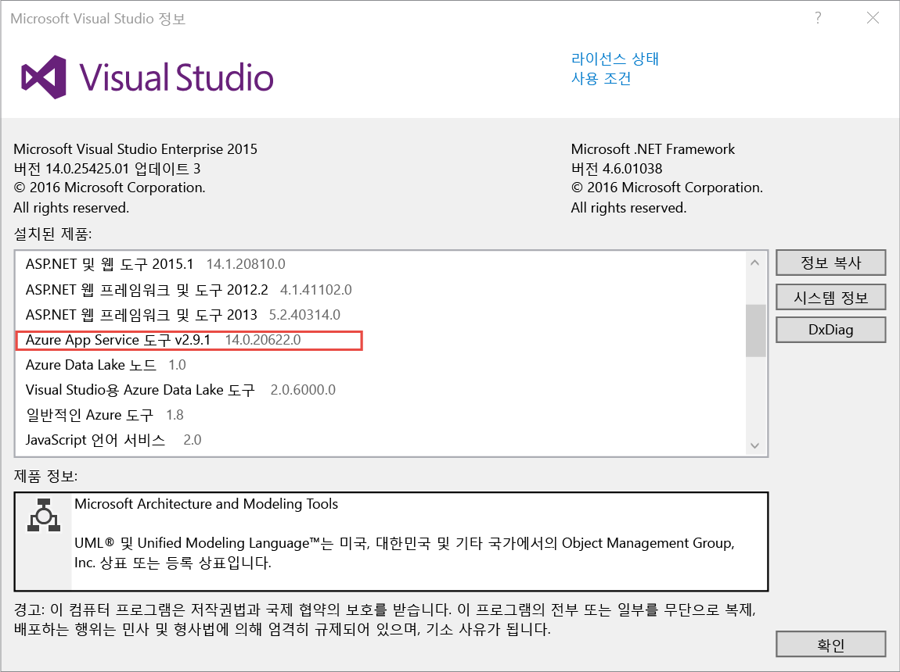

	>[AZURE.NOTE] 사용자 컴퓨터에 SDK 종속성이 얼마나 있었는지에 따라 SDK를 설치하는 시간이 몇 분에서 30분 또는 그 이상이 될 수 있습니다.

## 샘플 응용 프로그램 다운로드

1. [Azure-Samples/app-service-api-dotnet-to-do-list](https://github.com/Azure-Samples/app-service-api-dotnet-todo-list) 리포지토리를 다운로드합니다.

	**ZIP 다운로드** 단추를 클릭하거나 로컬 컴퓨터에서 리포지토리를 복제할 수 있습니다.

2. Visual Studio 2015 또는 2013에서 ToDoList 솔루션을 엽니다.
   1. 각 솔루션을 신뢰해야 합니다. 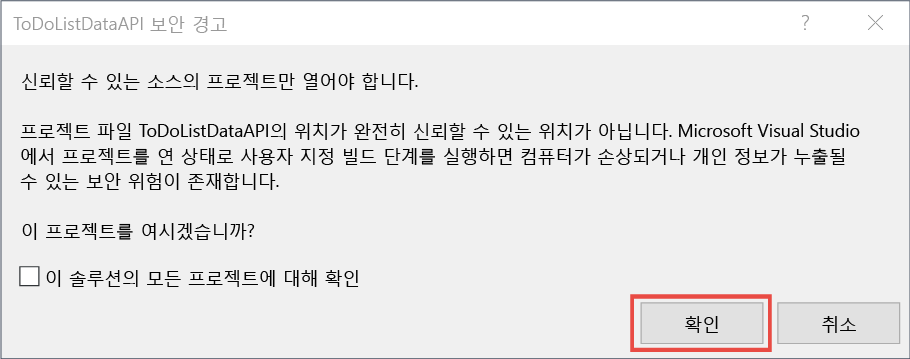

3. NuGet 패키지를 복원할 솔루션을 빌드(CTRL + SHIFT + B)합니다.

	응용 프로그램을 배포하기 전에 작업에서 확인하려는 경우 로컬에서 실행할 수 있습니다. ToDoListDataAPI가 시작 프로젝트인지 확인하고 솔루션을 실행합니다. 브라우저에서 HTTP 403 오류가 표시되어야 합니다.

## Swagger API 메타데이터 및 UI 사용

Azure 앱 서비스에서는 기본적으로 [Swagger](http://swagger.io/) 2.0 API 메타데이터를 지원합니다. 각 API 앱은 API에 대한 메타데이터를 Swagger JSON 형식으로 반환하는 URL 끝점을 지정할 수 있습니다. 해당 끝점에서 반환한 메타데이터는 클라이언트 코드를 생성하는 데 사용할 수 있습니다.

ASP.NET Web API 프로젝트는 [Swashbuckle](https://www.nuget.org/packages/Swashbuckle) NuGet 패키지를 사용하여 Swagger 메타데이터를 동적으로 생성할 수 있습니다. Swashbuckle NuGet 패키지는 다운로드한 ToDoListDataAPI 및 ToDoListAPI 프로젝트에 이미 설치되어 있습니다.

자습서의 이 섹션에서는 생성된 Swagger 2.0 메타데이터를 살펴본 다음 Swagger 메타데이터를 기반으로 하는 테스트 UI를 사용해봅니다.

1. ToDoListDataAPI 프로젝트(ToDoListAPI 프로젝트가 **아닌**)를 시작 프로젝트로 설정합니다.

	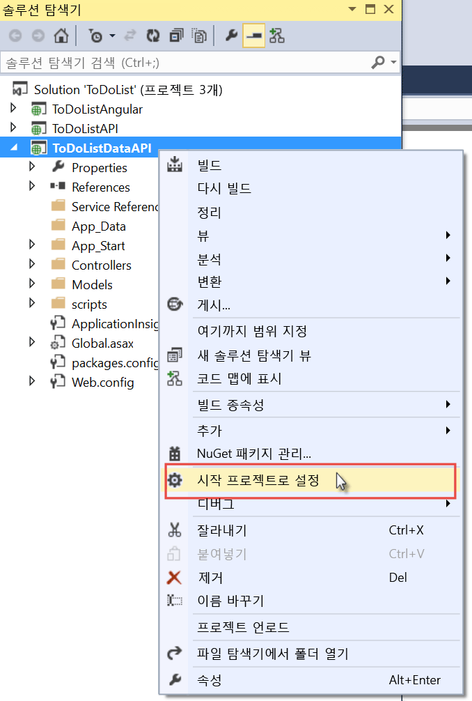

2. 디버그 모드에서 프로젝트를 실행하려면 F5 키를 누르거나 **디버그 > 디버깅 시작**을 클릭합니다.

	브라우저가 열리고 HTTP 403 오류 페이지가 표시됩니다.

3. 브라우저의 주소 표시줄에서 줄 끝에 `swagger/docs/v1`을 추가한 다음 Enter 키를 누릅니다. (URL은 `http://localhost:45914/swagger/docs/v1`입니다.)

	이는 Swashbuckle에서 API에 대한 Swagger 2.0 JSON 메타데이터를 반환하는 데 사용하는 기본 URL입니다.

	Internet Explorer를 사용하는 경우 브라우저에서 *v1.json* 파일을 다운로드하라는 메시지가 표시됩니다.

	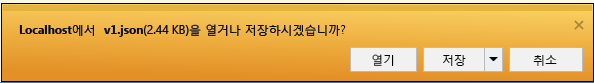

	Chrome, Firefox 또는 에지를 사용하는 경우 브라우저 창에 JSON이 표시됩니다. 다양한 브라우저가 JSON을 다르게 처리하고 브라우저 창이 정확히 예제와 같지 않을 수 있습니다.

	

	다음 샘플에서는 Get 메서드에 대한 정의와 함께 API에 대한 Swagger 메타데이터의 첫 번째 섹션을 보여 줍니다. 이 메타데이터는 다음 단계에서 사용할 Swagger UI를 구동하며, 자습서의 이후 섹션에서 클라이언트 코드를 자동으로 생성하는 데 사용됩니다.

		{
		  "swagger": "2.0",
		  "info": {
		    "version": "v1",
		    "title": "ToDoListDataAPI"
		  },
		  "host": "localhost:45914",
		  "schemes": [ "http" ],
		  "paths": {
		    "/api/ToDoList": {
		      "get": {
		        "tags": [ "ToDoList" ],
		        "operationId": "ToDoList_GetByOwner",
		        "consumes": [ ],
		        "produces": [ "application/json", "text/json", "application/xml", "text/xml" ],
		        "parameters": [
		          {
		            "name": "owner",
		            "in": "query",
		            "required": true,
		            "type": "string"
		          }
		        ],
		        "responses": {
		          "200": {
		            "description": "OK",
		            "schema": {
		              "type": "array",
		              "items": { "$ref": "#/definitions/ToDoItem" }
		            }
		          }
		        },
		        "deprecated": false
		      },

4. 브라우저를 닫고 Visual Studio 디버깅을 중지합니다.

5. **솔루션 탐색기**의 ToDoListDataAPI 프로젝트에서 *App\_Start\\SwaggerConfig.cs* 파일을 연 후에 174 줄로 스크롤을 내리고 다음 코드의 주석 처리를 제거합니다.

		/*
		    })
		.EnableSwaggerUi(c =>
		    {
		*/

	*SwaggerConfig.cs* 파일은 프로젝트에서 Swashbuckle 패키지를 설치할 때 생성됩니다. 이 파일은 Swashbuckle을 구성하는 다양한 방법을 제공합니다.

	주석을 제거한 코드는 다음 단계에서 사용할 Swagger UI를 사용하도록 설정합니다. API 앱 프로젝트 템플릿을 사용하여 Web API 프로젝트를 만들 때는 하나의 보안 조치로 이 코드가 기본적으로 주석 처리됩니다.

6. 프로젝트를 다시 실행합니다.

7. 브라우저의 주소 표시줄에서 줄 끝에 `swagger`을 추가한 다음 Enter 키를 누릅니다. (URL은 `http://localhost:45914/swagger`입니다.)

8. Swagger UI 페이지가 나타나면 **ToDoList**를 클릭하여 사용 가능한 메서드를 확인합니다.

	

9. 목록에서 첫 번째 **Get** 단추를 클릭합니다.

10. **매개 변수** 섹션에서 `owner` 매개 변수의 값에 별표를 입력하고 **사용해 보기**를 클릭합니다.

	이후의 자습서에서 인증을 추가하면 중간 계층은 데이터 계층에 실제 사용자 ID를 제공합니다. 이제 모든 작업이 소유자 ID로 별표를 갖게 되고 응용 프로그램이 인증 없이 실행됩니다.

	

	Swagger UI에서 ToDoList Get 메서드를 호출하고 응답 코드와 JSON 결과를 표시합니다.

	

11. **Post**를 클릭한 다음 **Model Schema** 아래의 상자를 클릭합니다.

	모델 스키마를 클릭하면 입력 상자가 미리 채워집니다. 여기서 Post 메서드의 매개 변수 값을 지정할 수 있습니다. (Internet Explorer에서 작동하지 않으면 다른 브라우저를 사용하거나 다음 단계에서 매개 변수 값을 수동으로 입력합니다.)

	

12. `todo` 매개 변수 입력 상자에서 다음 예제와 같이 표시되도록 JSON을 변경하거나, 사용자 고유의 설명 텍스트로 대체합니다.

		{
		  "ID": 2,
		  "Description": "buy the dog a toy",
		  "Owner": "*"
		}

13. **Try it out**을 클릭합니다.

	ToDoList API는 성공 여부를 나타내는 HTTP 204 응답 코드를 반환합니다.

14. 첫 번째 **Get** 단추를 클릭한 다음 페이지의 해당 섹션에서 **사용해 보기** 단추를 클릭합니다.

	가져오기 메서드 응답은 이제 새 할 일 항목을 포함합니다.

15. 선택 사항: Put, Delete 및 Get by ID 메서드도 사용해봅니다.

16. 브라우저를 닫고 Visual Studio 디버깅을 중지합니다.

Swashbuckle은 모든 ASP.NET Web API 프로젝트에서 작동합니다. Swagger 메타데이터 생성을 기존 프로젝트에 추가하려면 Swashbuckle 패키지를 설치하기만 하면 됩니다.

>[AZURE.NOTE] Swagger 메타데이터에는 각 API 작업에 대한 고유 ID가 있습니다. 기본적으로 Swashbuckle은 Web API 컨트롤러 메서드에 대한 중복 Swagger 작업 ID를 생성할 수 있습니다. 컨트롤러에 오버로드된 HTTP 메서드가 있는 경우 이러한 동작이 발생합니다(예: `Get()` 및 `Get(id)`). 오버로드를 처리하는 방법에 대한 자세한 내용은 [Swashbuckle 생성 API 정의 사용자 지정](app-service-api-dotnet-swashbuckle-customize.md)을 참조하세요. Azure API 앱 템플릿을 사용하여 Visual Studio에서 Web API 프로젝트를 만들면 고유한 작업 ID를 생성하는 코드가 *SwaggerConfig.cs* 파일에 자동으로 추가됩니다.

##  Azure에서 API 앱 만들기 및 코드 배포

이 섹션에서는 Visual Studio **웹 게시** 마법사에 통합된 Azure 도구를 사용하여 Azure에서 새 API 앱을 만듭니다. 그런 다음 새 API 앱에 ToDoListDataAPI 프로젝트를 배포하고 Swagger UI를 실행하여 API를 호출합니다.

1. **솔루션 탐색기**에서 ToDoListDataAPI 프로젝트를 마우스 오른쪽 단추로 클릭하고 **게시**를 클릭합니다.

	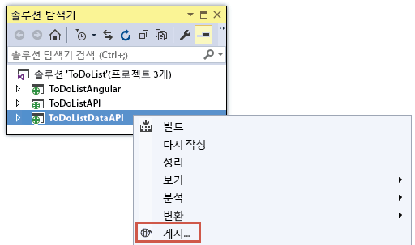

2.  **웹 게시** 마법사의 **프로필** 단계에서 **Microsoft Azure 앱 서비스**를 클릭합니다.

	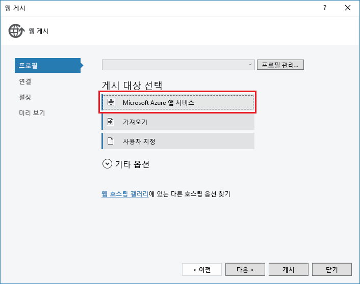

3. Azure 계정에 로그인(아직 로그인하지 않은 경우)하거나 자격 증명을 새로 고칩니다(만료된 경우).

4. 앱 서비스 대화 상자에서 사용할 Azure **구독**을 선택하고 **새로 만들기**를 클릭합니다.

	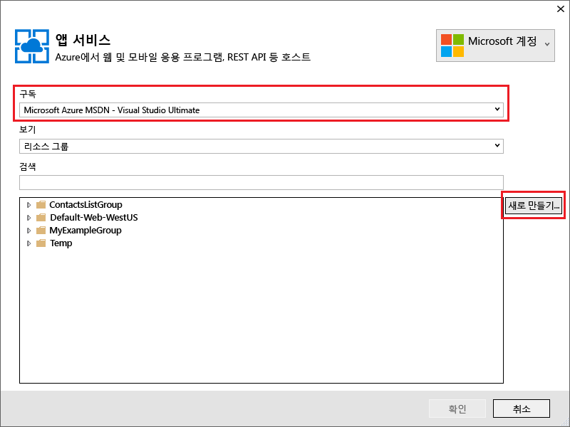

	**앱 서비스 만들기** 대화 상자의 **호스팅** 탭이 나타납니다.

	Swashbuckle이 설치된 Web API 프로젝트를 배포하기 때문에 Visual Studio는 API 앱을 만들려 한다고 가정합니다. 이는 **API 앱 이름** 제목과 **변경 형식** 드롭다운 목록이 **API 앱**으로 설정되었음을 나타냅니다.

	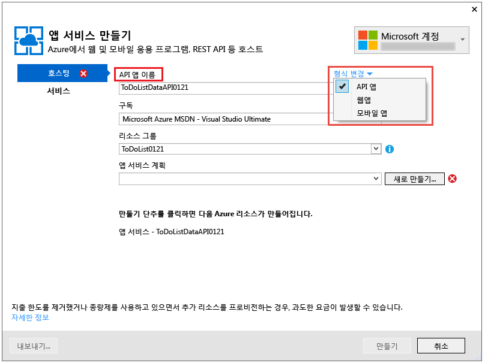

5. *azurewebsites.net* 도메인에서 고유한 **API 앱 이름**을 입력합니다. Visual Studio에서 제공하는 기본 이름을 허용할 수 있습니다.

	다른 사용자가 이미 사용하는 이름을 입력하면 오른쪽에 빨간색 느낌표가 표시됩니다.

	API 앱의 URL은 `{API app name}.azurewebsites.net`입니다.

6. **리소스 그룹** 드롭다운에서 **새로 만들기**를 클릭한 다음, "ToDoListGroup" 또는 원하는 이름을 입력합니다.

	리소스 그룹은 API 앱, 데이터베이스, VM 등 Azure 리소스의 컬렉션입니다. 이 자습서에서는 새 리소스 그룹을 만드는 것이 가장 좋습니다. 자습서에서 만든 모든 Azure 리소스를 한 번에 쉽게 삭제할 수 있기 때문입니다.

	이 상자에서 기존 [리소스 그룹](../resource-group-overview.md)을 선택하거나 구독의 기존 리소스 그룹과 다른 이름을 입력하여 새 리소스 그룹을 만들 수 있습니다.

7. **앱 서비스 계획** 드롭다운 옆의 **새로 만들기** 단추를 클릭합니다.

	스크린샷은 **API 앱 이름**, **구독** 및 **리소스 그룹**에 대한 샘플 값을 보여줍니다. 값은 달라질 수 있습니다.

	

	다음 단계에서는 새 리소스 그룹에 대한 앱 서비스 계획을 만듭니다. 앱 서비스 계획은 API 앱이 실행되는 계산 리소스를 지정합니다. 예를 들어, 무료 계층을 선택한 경우 API 앱은 공유 VM에서 실행되지만, 일부 유료 계층에의 경우 전용 VM에서 실행됩니다. 앱 서비스 계획에 대한 자세한 내용은 [앱 서비스 계획 개요](../app-service/azure-web-sites-web-hosting-plans-in-depth-overview.md)를 참조하세요.

8. **앱 서비스 계획 구성** 대화 상자에서 "ToDoListPlan" 또는 원하는 경우 다른 이름을 입력합니다.

9. **위치** 드롭다운 목록에서 가장 가까운 위치를 선택합니다.

	이 설정은 앱이 실행되는 Azure 데이터 센터를 지정합니다. 가까운 위치를 선택하여 [대기 시간](http://www.bing.com/search?q=web%20latency%20introduction&qs=n&form=QBRE&pq=web%20latency%20introduction&sc=1-24&sp=-1&sk=&cvid=eefff99dfc864d25a75a83740f1e0090)을 최소화합니다.

10. **크기** 드롭다운에서 **무료**를 클릭합니다.

	이 자습서의 경우 무료 가격 책정 계층으로도 충분한 성능이 제공됩니다.

11. **앱 서비스 계획 구성** 대화 상자에서 **확인**을 클릭합니다.

	

12. **앱 서비스 만들기** 대화 상자에서 **만들기**를 클릭합니다.

	

	Visual Studio에서 API 앱을 만들고 해당 API 앱에 필요한 모든 설정이 있는 프로필을 게시합니다. 그런 다음 **웹 게시** 마법사가 열리면 이 마법사를 사용하여 프로젝트를 배포할 수 있습니다.

	아래와 같이 **연결** 탭에 **웹 게시** 마법사가 열립니다.

	**연결** 탭의 **서버** 및 **사이트 이름** 설정은 API 앱을 가리킵니다. **사용자 이름** 및 **암호**는 Azure가 사용자를 위해 만드는 배포 자격 증명입니다. 배포가 끝나면 Visual Studio가 **대상 URL**로 브라우저를 엽니다(**대상 URL**의 유일한 목적).

13. **다음**을 클릭합니다.

	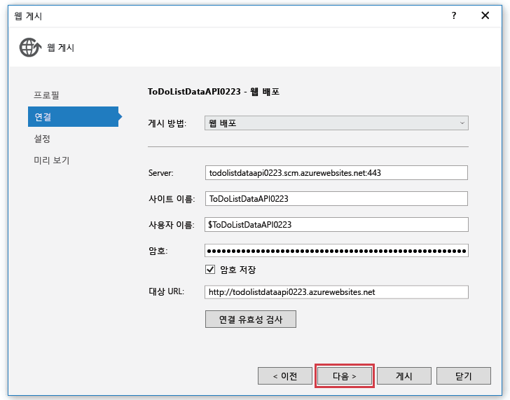

	다음 탭은 아래와 같은 **설정** 탭입니다. 여기에서 빌드 구성 탭을 변경하여 [원격 디버깅](../app-service-web/web-sites-dotnet-troubleshoot-visual-studio.md#remotedebug)을 위한 디버그 빌드를 배포할 수 있습니다. 이 탭은 몇 가지 **파일 게시 옵션**도 제공합니다.

	* 대상에 있는 추가적인 파일을 제거합니다.
	* 게시 중 미리 컴파일합니다.
	* App\_Data 폴더에서 파일을 실행합니다.

	이 자습서의 경우 이런 것들이 필요하지 않습니다. 옵션을 통해 수행하는 작업에 대한 자세한 설명은 [Visual Studio의 One-Click 게시를 사용하여 웹 프로젝트 배포 방법](https://msdn.microsoft.com/library/dd465337.aspx)을 참조하세요.

14. **다음**을 클릭합니다.

	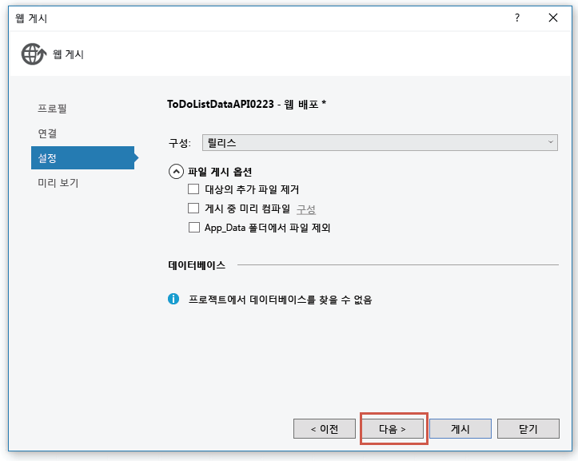

	다음은 아래와 같은 **미리 보기** 탭으로, 어떤 파일이 프로젝트에서 API 앱으로 복사되는지 볼 수 있습니다. 이전에 배포한 API 앱에 프로젝트를 배포하는 경우, 변경된 파일만 복사됩니다. 복사될 파일 목록을 표시하려면 **미리 보기 시작** 단추를 클릭할 수 있습니다.

15. **게시**를 클릭합니다.

	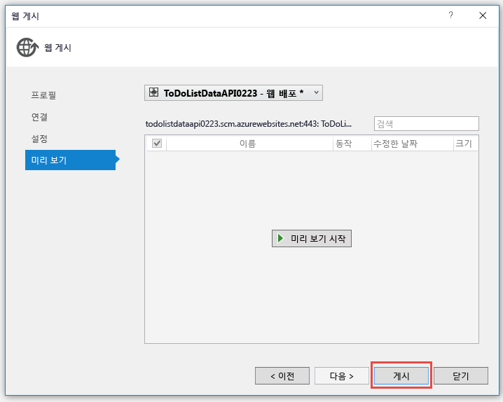

	Visual Studio는 새 API 앱에 ToDoListDataAPI 프로젝트를 배포합니다. **출력** 창은 성공한 배포를 기록하고 API 앱의 URL에 열린 브라우저 창에 "성공적으로 만들어진" 페이지가 나타납니다.

	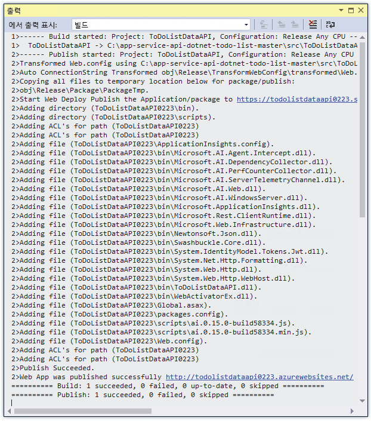

	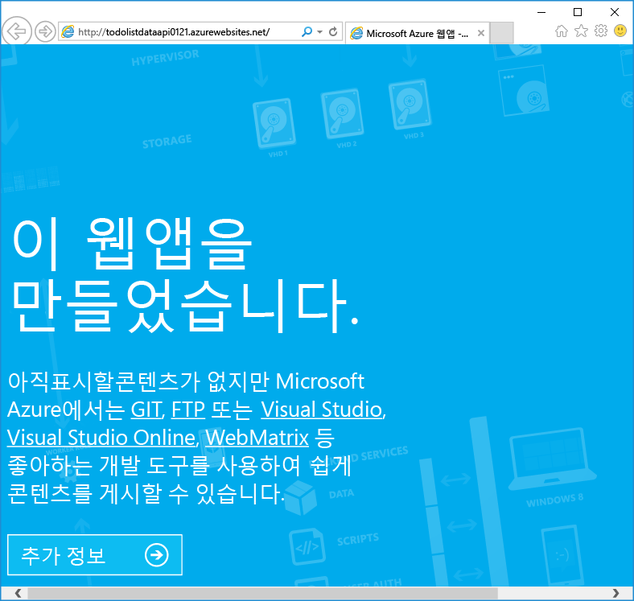

16. 브라우저 주소 표시줄에서 URL에 "swagger"를 추가한 다음 Enter 키를 누릅니다. (URL은 `http://{apiappname}.azurewebsites.net/swagger`입니다.)

	이전에 본 것과 동일한 Swagger UI가 브라우저에 표시되지만 이번에는 클라우드에서 실행됩니다. 가져오기 메서드를 사용하면 기본 2가지 할 일 항목으로 다시 돌아옵니다. 이전에 만든 변경 내용이 로컬 컴퓨터의 메모리에 저장됩니다.

17. [Azure 포털](https://portal.azure.com/)을 엽니다.

	Azure 포털은 API 앱 같은 Azure 리소스 관리를 위한 웹 인터페이스입니다.

18. **더 많은 서비스 > App Services**를 클릭합니다.

	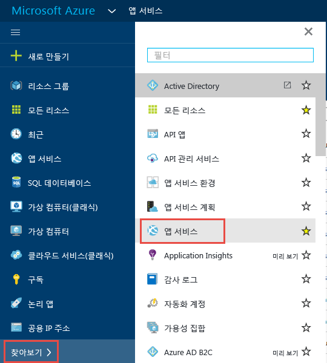

19. **앱 서비스** 블레이드에서 새 API 앱을 찾아 클릭합니다. (Azure 포털에서는 오른쪽으로 열리는 창을 *블레이드*라고 합니다.)

	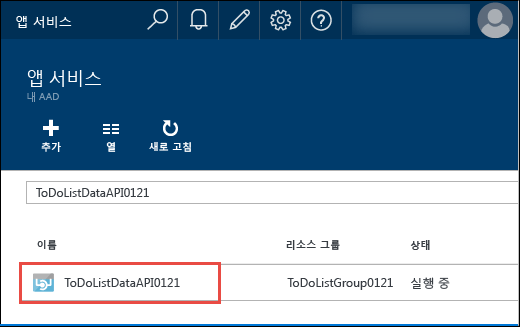

	두 블레이드가 열립니다. 하나에는 API 앱의 개요가 있고 다른 하나에는 보고 변경할 수 있는 긴 설정 목록이 있습니다.

20. **설정** 블레이드에서 **API** 섹션을 찾아 **API 정의**를 클릭합니다.

	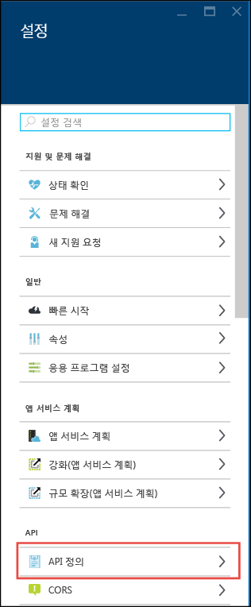

	**API 정의** 블레이드에서 JSON 형식으로 Swagger 2.0 메타데이터를 반환하는 URL을 지정할 수 있습니다. Visual Studio에서 API 앱을 만든 경우, API 정의 URL이 이전에 본 Swashbuckle 생성 메타데이터의 기본값으로 설정됩니다. 즉, API 앱의 기준 URL에 `/swagger/docs/v1`이(가) 추가됩니다.

	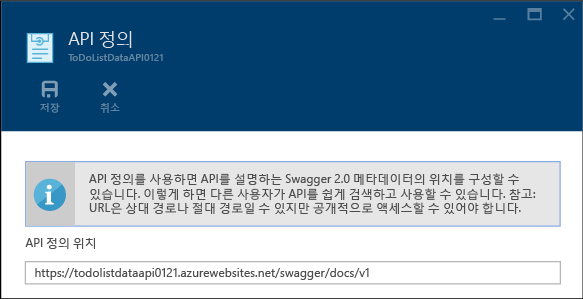

	클라이언트 코드를 생성할 API 앱을 선택한 경우 Visual Studio는 이 URL에서 메타데이터를 검색합니다.

##  데이터 계층에 클라이언트 코드 생성

Azure API 앱에 Swagger를 통합할 경우의 장점 중 하나는 자동 코드 생성입니다. 생성된 클라이언트 클래스는 API 앱을 호출하는 코드를 더욱 쉽게 작성하도록 합니다.

ToDoListAPI 프로젝트에는 생성된 클라이언트 코드가 이미 있지만 다음 단계에서는 이를 삭제하고 다시 생성하여 코드 생성을 수행하는 방법을 확인합니다.

1. Visual Studio **솔루션 탐색기**의 ToDoListAPI 프로젝트에서 *ToDoListDataAPI* 폴더를 삭제합니다. **주의: ToDoListDataAPI 프로젝트가 아닌 폴더만을 삭제합니다.**

	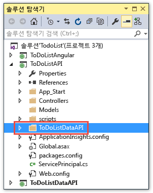

	이 폴더는 진행하려는 코드 생성 프로세스를 사용하여 만들어집니다.

2. ToDoListAPI 프로젝트를 마우스 오른쪽 단추로 클릭하고 **추가 > REST API 클라이언트**를 클릭합니다.

	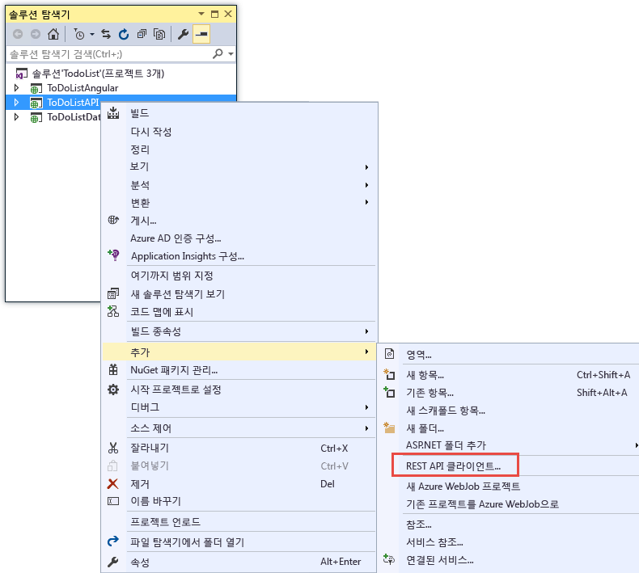

3. **REST API 클라이언트 추가** 대화 상자에서 **Swagger URL**을 클릭한 다음 **Azure 자산 선택**을 클릭합니다.

	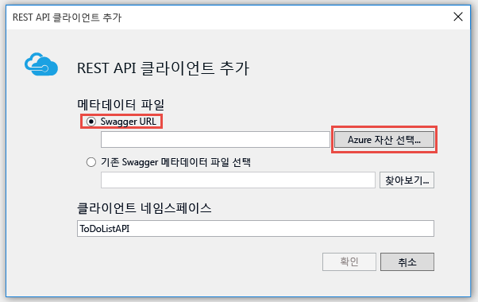

4. **앱 서비스** 대화 상자에서 이 자습서에 사용하는 리소스 그룹을 확장하고 API 앱을 선택한 다음 **확인**을 클릭합니다.

	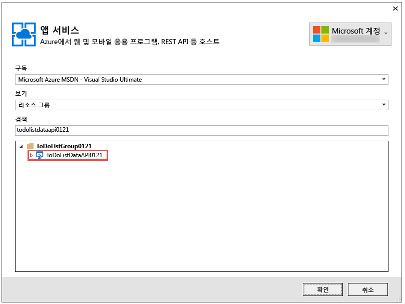

	**REST API 클라이언트 추가** 대화 상자로 돌아가면 이전에 포털에서 본 API 정의 URL 값으로 텍스트 상자가 채워져 있는 것을 볼 수 있습니다.

	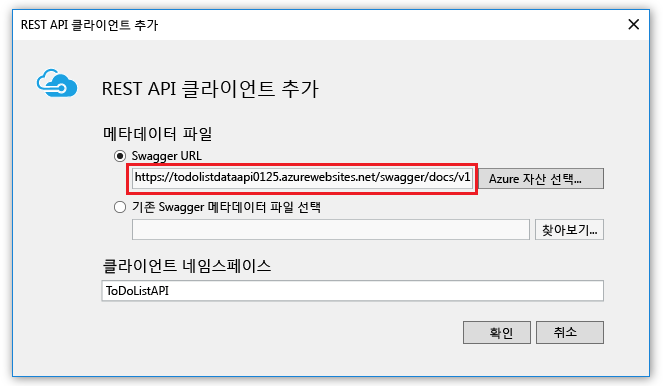

	>[AZURE.TIP] 코드 생성에 대한 메타데이터를 가져오는 다른 방법은 찾아보기 대화 상자를 사용하는 대신 URL을 직접 입력하는 것입니다. 또는 Azure에 배포하기 전에 클라이언트 코드를 생성하려는 경우 로컬로 Web API 프로젝트를 실행하고, Swagger JSON 파일을 제공하는 URL로 이동한 다음, 파일을 저장하여 **기존 Swagger 메타데이터 파일 선택**을 사용합니다.

5. **REST API 클라이언트 추가** 대화 상자에서 **확인**을 클릭합니다.

	Visual Studio에서 API 앱의 이름을 딴 폴더를 만들고 클라이언트 클래스를 생성합니다.

	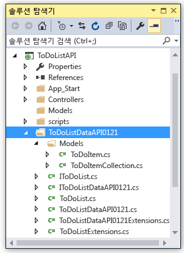

6. ToDoListAPI 프로젝트에서 *Controllers\\ToDoListController.cs*를 열어 생성된 클라이언트를 사용하여 API를 호출하는 40 줄의 코드를 표시합니다.

	다음 코드 조각은 코드가 클라이언트 개체를 인스턴스화하고 가져오기 메서드를 호출하는 방법을 보여줍니다.

		private static ToDoListDataAPI NewDataAPIClient()
		{
		    var client = new ToDoListDataAPI(new Uri(ConfigurationManager.AppSettings["toDoListDataAPIURL"]));
		    return client;
		}

		public async Task<IEnumerable<ToDoItem>> Get()
		{
		    using (var client = NewDataAPIClient())
		    {
		        var results = await client.ToDoList.GetByOwnerAsync(owner);
		        return results.Select(m => new ToDoItem
		        {
		            Description = m.Description,
		            ID = (int)m.ID,
		            Owner = m.Owner
		        });
		    }
		}

	생성자 매개 변수는 `toDoListDataAPIURL` 앱 설정에서 끝점 URL을 가져옵니다. Web.config 파일에서 해당 값은 응용 프로그램을 로컬로 실행할 수 있도록 API 프로젝트의 로컬 IIS Express URL에 설정됩니다. 생성자 매개 변수를 생략한 경우 코드를 생성한 URL이 기본 끝점이 됩니다.

7. 클라이언트 클래스는 API 앱 이름을 기반으로 다른 이름으로 생성됩니다. 형식 이름이 프로젝트에서 생성된 이름과 일치하도록 *Controllers\\ToDoListController.cs*에서 코드를 변경합니다. 예를 들어 API 앱을 ToDoListDataAPI071316이라고 명명한 경우 이 코드를

		private static ToDoListDataAPI NewDataAPIClient()
		{
		    var client = new ToDoListDataAPI(new Uri(ConfigurationManager.AppSettings["toDoListDataAPIURL"]));

다음과 같이 변경합니다.

		private static ToDoListDataAPI071316 NewDataAPIClient()
		{
		    var client = new ToDoListDataAPI071316(new Uri(ConfigurationManager.AppSettings["toDoListDataAPIURL"]));

## 중간 계층을 호스트하는 API 앱 만들기

앞서 [데이터 계층 API 앱을 만들고 코드를 배포했습니다](#createapiapp). 이제 중간 계층 API 앱에 동일한 절차를 수행합니다.

1. **솔루션 탐색기**에서 중간 계층 ToDoListAPI 프로젝트(데이터 계층 ToDoListDataAPI 아님)를 마우스 오른쪽 단추로 클릭하고 **게시**를 클릭합니다.

	

2.  **웹 게시** 마법사의 **프로필** 탭에서 **Microsoft Azure 앱 서비스**를 클릭합니다.

3. **앱 서비스** 대화 상자에서 **새로 만들기**를 클릭합니다.

4. **앱 서비스 만들기** 대화 상자의 **호스팅** 탭에서 기본 **API 앱 이름**을 허용하거나 *azurewebsites.net* 도메인에 고유한 이름을 입력합니다.

5. 사용해 온 Azure **구독**을 선택합니다.

6. **리소스 그룹** 드롭다운에서 이전에 만든 리소스 그룹을 선택합니다.

7. **앱 서비스 계획** 드롭다운에서 이전에 만든 계획을 선택합니다. 해당 값으로 초기화됩니다.

8. **만들기**를 클릭합니다.

	Visual Studio에서 API 앱을 만들고 해당 게시 프로필을 만든 다음, **웹 게시** 마법사의 **연결** 단계를 표시합니다.

9.  **웹 게시** 마법사의 **연결** 단계에서 **게시**를 클릭합니다.

	Visual Studio에서 ToDoListAPI 프로젝트를 새 API 앱에 배포하고 해당 API 앱의 URL로 브라우저를 엽니다. "성공적으로 만들었습니다." 페이지가 나타납니다.

## 중간 계층을 구성하여 데이터 계층 호출

지금 중간 계층 API 앱을 호출한 경우 Web.config 파일에 있는 localhost URL을 사용하여 데이터 계층을 호출하려고 합니다. 이 섹션에서 데이터 계층 API 앱 URL을 중간 계층 API 앱의 환경 설정에 입력합니다. 중간 계층 API 앱의 코드가 데이터 계층 URL 설정을 검색하는 경우 환경 설정은 Web.config 파일의 내용을 재정의합니다.

1. [Azure 포털](https://portal.azure.com/)로 이동한 다음, TodoListAPI(중간 계층) 프로젝트를 호스트하기 위해 만든 API 앱용 **API 앱** 블레이드로 이동합니다.

2. API 앱의 **설정** 블레이드에서 **응용 프로그램 설정**을 클릭합니다.

3. API 앱의 **응용 프로그램 설정** 블레이드에서 **앱 설정** 섹션까지 아래로 스크롤하고 다음 키와 값을 추가합니다. 값은 이 자습서에서 게시된 첫 번째 API 앱의 URL입니다.

	| **키** | toDoListDataAPIURL |
	|---|---|
	| **값** | https://{your 데이터 계층 API 앱 이름}.azurewebsites.net |
	| **예제** | https://todolistdataapi.azurewebsites.net |

4. **Save**를 클릭합니다.

	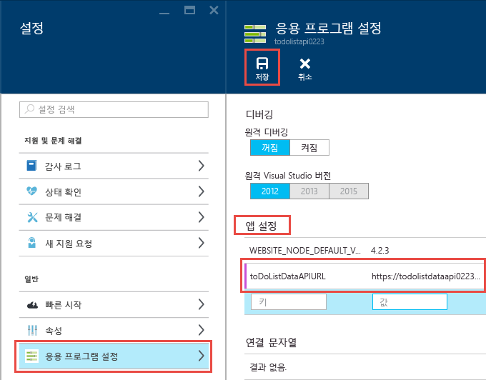

	코드가 Azure에서 실행되면 이 값은 이제 Web.config 파일에 있는 localhost URL을 재정의합니다.

## 테스트

1. 브라우저 창에서 ToDoListAPI에 방금 만든 새 중간 계층 API 앱의 URL로 이동합니다. 포털의 API 앱의 주 블레이드에서 URL을 클릭하여 이동할 수 있습니다.

2. 브라우저 주소 표시줄에서 URL에 "swagger"를 추가한 다음 Enter 키를 누릅니다. (URL은 `http://{apiappname}.azurewebsites.net/swagger`입니다.)

	브라우저가 ToDoListDataAPI에 대해 앞서 살펴본 동일한 Swagger UI를 표시하지만 중간 계층 API 앱이 해당 값을 데이터 계층 API 앱에 보내고 있기 때문에 이제 `owner`은 가져오기 작업에서 필수 필드가 아닙니다. (인증 자습서를 수행하는 경우 중간 계층은 `owner` 매개 변수에 대한 실제 사용자 ID를 보냅니다. 지금은 별표를 하드 코딩합니다.)

3. 가져오기 메서드 및 다른 메서드를 사용하여 중간 계층 API 앱이 데이터 계층 API 앱을 성공적으로 호출하는지 유효성을 검사합니다.

	

## 문제 해결

다음은 이 자습서를 수행하는 동안 문제가 발생하는 경우에 사용할 몇 가지 문제 해결 방법입니다.

* [.NET용 Azure SDK](http://go.microsoft.com/fwlink/?linkid=518003)의 최신 버전을 사용하도록 합니다.

* 프로젝트 이름 두 개가 비슷합니다(ToDoListAPI, ToDoListDataAPI). 프로젝트 작업 시 지침의 설명과 다르게 보이는 경우에는, 올바른 프로젝트를 열었는지 확인합니다.

* 회사 네트워크에서 방화벽을 통해 Azure 앱 서비스에 배포하려고 하는 경우 포트 443 및 8172가 웹 배포에 열려 있는지 확인합니다. 이러한 포트를 열 수 없으면 다른 배포 방법을 사용할 수 있습니다. [Azure 앱 서비스에 앱 배포](../app-service-web/web-sites-deploy.md)을 참조하세요.

* "경로 이름은 고유해야 합니다" 오류 -- 실수로 API 앱에 잘못된 프로젝트를 배포하고 나중에 올바른 프로젝트를 그 위치에 다시 배포할 경우 이 오류가 표시될 수 있습니다. 이 오류를 해결하려면 올바른 프로젝트를 API 앱에 다시 배포하고, **웹 게시** 마법사의 **설정** 탭에서 **대상에서 추가 파일 제거**를 선택합니다.

Azure 앱 서비스에서 ASP.NET API 앱이 실행 중인 경우 문제 해결을 단순화하는 Visual Studio 기능에 대한 자세한 내용을 확인할 수 있습니다. 로깅, 원격 디버깅 등에 대한 정보는 [Visual Studio에서 Azure 앱 서비스 앱 문제 해결](../app-service-web/web-sites-dotnet-troubleshoot-visual-studio.md)을 참조하세요.

## 다음 단계

API 앱에 기존 웹 API 프로젝트를 배포하고 API 앱에 클라이언트 코드를 생성하며 .NET 클라이언트에서 API 앱을 사용하는 방법을 살펴보았습니다. 이 시리즈의 다음 자습서에서는 [CORS를 사용하여 JavaScript 클라이언트에서 API 앱을 사용](app-service-api-cors-consume-javascript.md)하는 방법을 보여 줍니다.

클라이언트 코드 생성에 대한 자세한 내용은 GitHub.com에서 [Azure/AutoRest](https://github.com/azure/autorest) 리포지토리를 참조하세요. 생성된 클라이언트 사용과 관련하여 도움이 필요하면 [AutoRest 리포지토리의 문제](https://github.com/azure/autorest/issues)를 참조하세요.

새 API 앱 프로젝트를 처음부터 만들려는 경우 **Azure API 앱** 템플릿을 사용합니다.

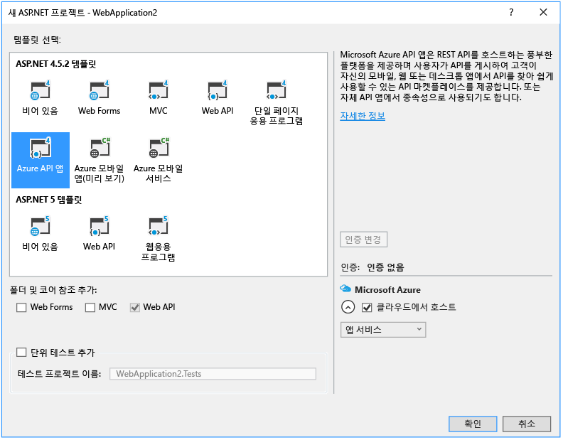

**Azure API 앱** 프로젝트 템플릿은 **빈** ASP.NET 4.5.2 템플릿을 선택하고, 확인란을 클릭하여 Web API 지원을 추가하고, Swashbuckle NuGet 패키지를 설치하는 것과 동일합니다. 또한 탬플릿은 중복 Swagger 작업 ID가 만들어지지 않도록 하기 위해 설계된 일부 Swashbuckle 구성 코드를 추가합니다. API 앱 프로젝트를 만들면 이 자습서와 동일한 방식으로 API 앱에 배포할 수 있습니다.

<!---HONumber=AcomDC_0921_2016-->