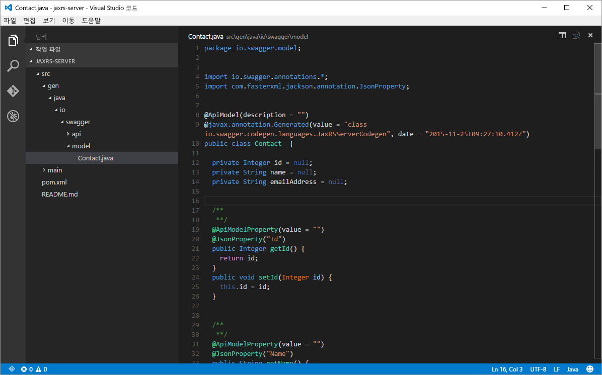
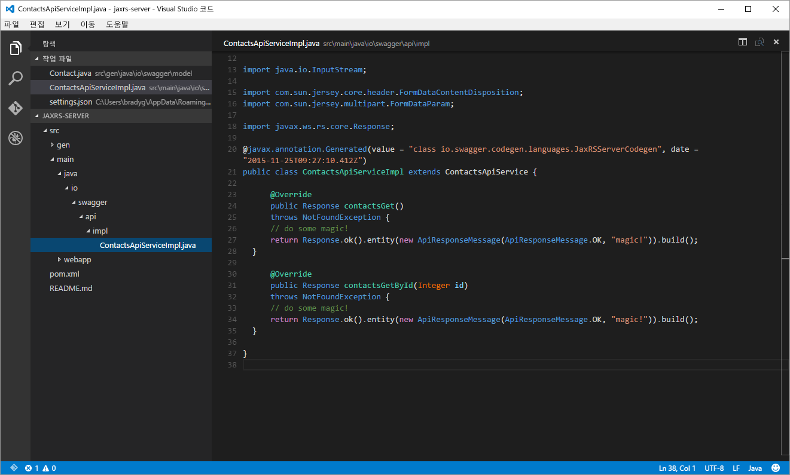
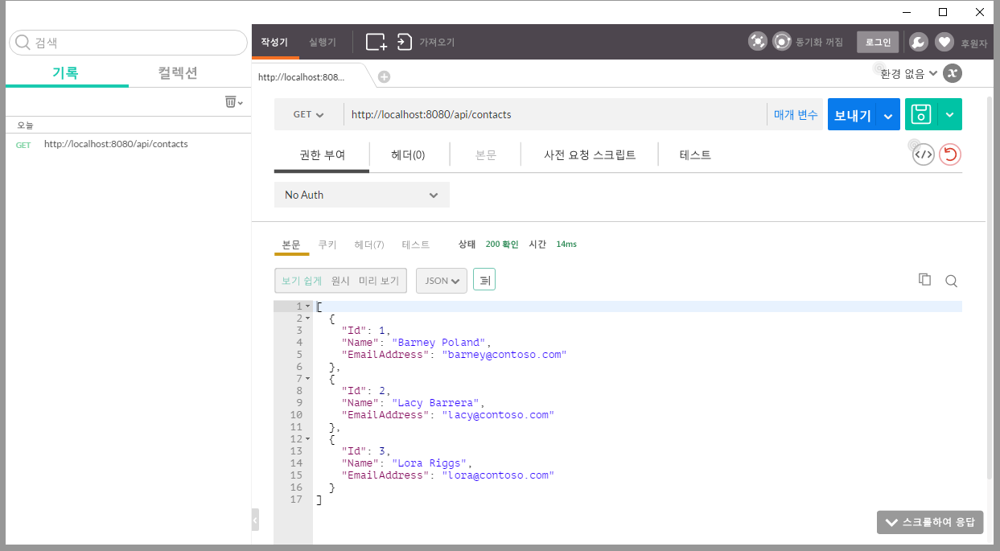
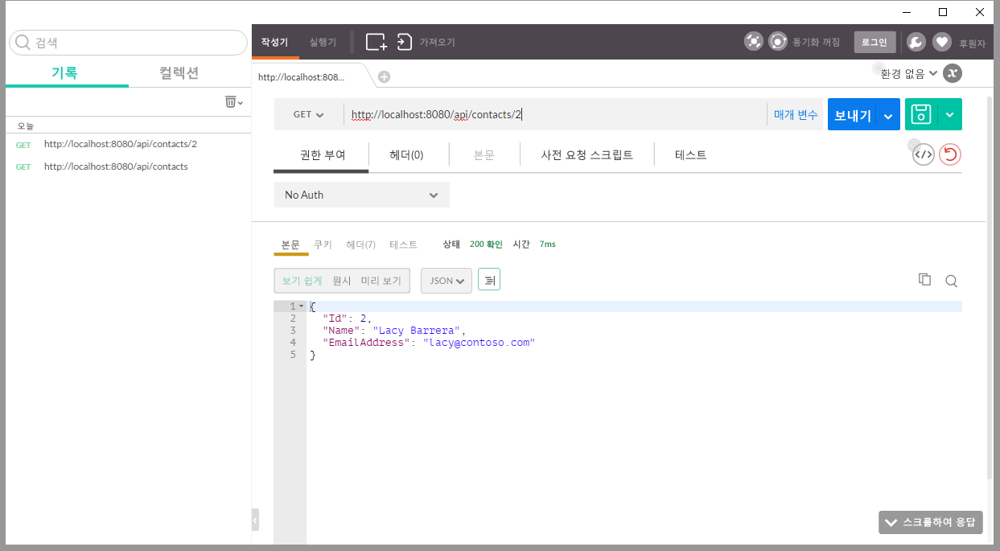
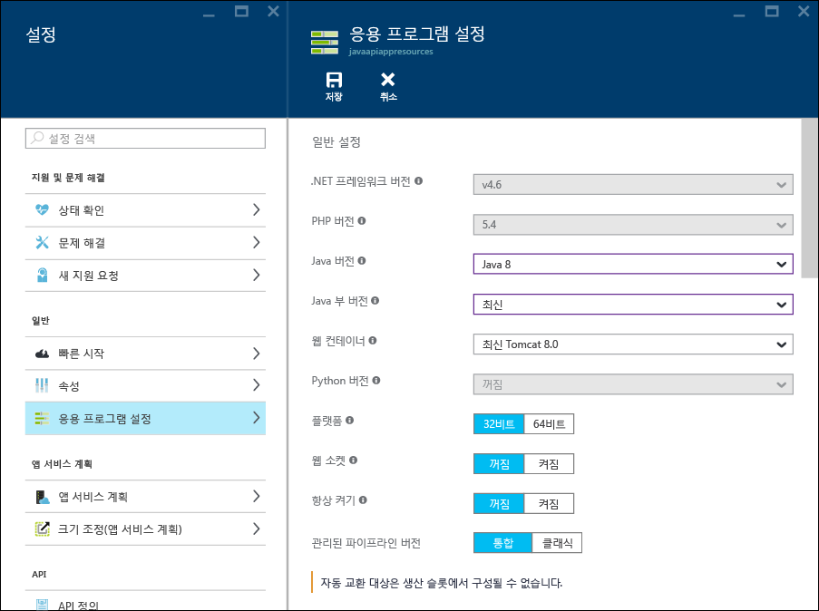
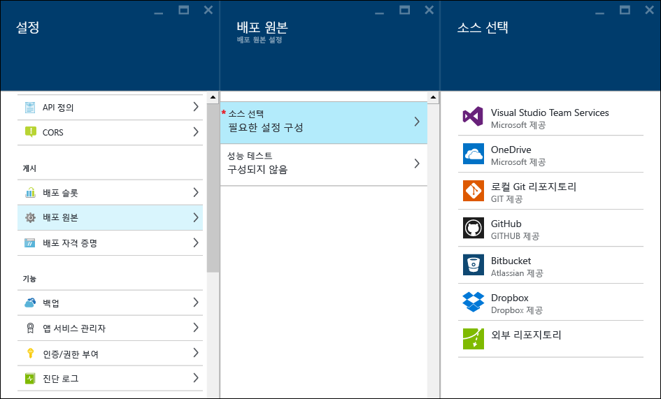
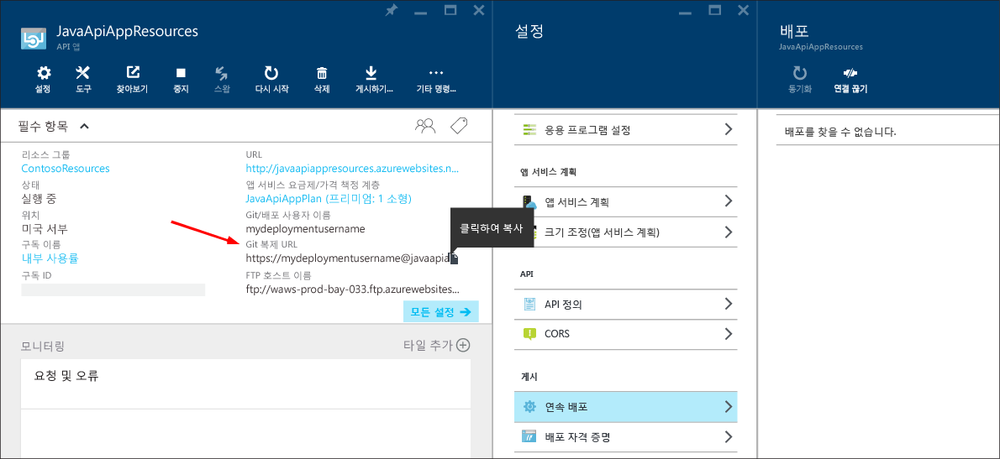
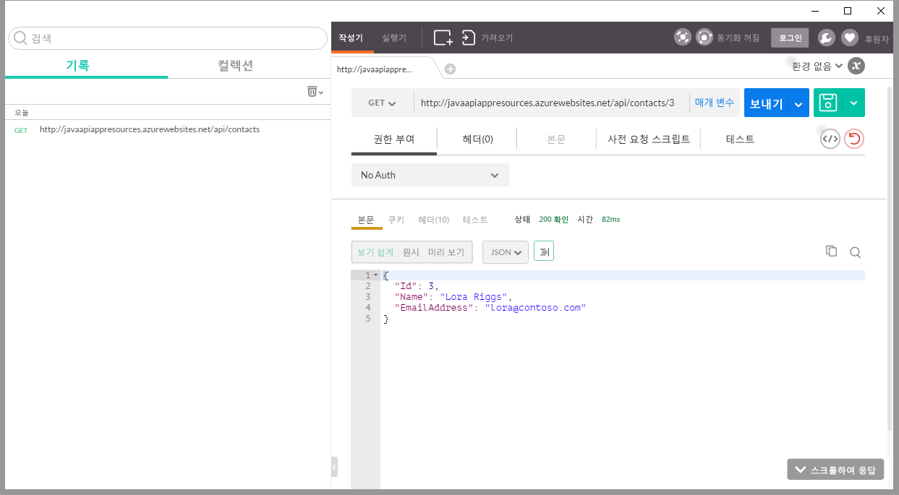

<properties
	pageTitle="Azure 앱 서비스에서 Java API 앱 빌드 및 배포"
	description="Java API 앱 패키지를 만들고 Azure 엡 서비스에 배포하는 방법을 알아봅니다."
	services="app-service\api"
	documentationCenter="java"
	authors="bradygaster"
	manager="mohisri" 
	editor="tdykstra"/>

<tags
	ms.service="app-service-api"
	ms.workload="web"
	ms.tgt_pltfrm="na"
	ms.devlang="java"
	ms.topic="get-started-article"
	ms.date="11/27/2015"
	ms.author="bradygaster"/>

# Azure 앱 서비스에서 Java API 앱 빌드 및 배포

[AZURE.INCLUDE [app-service-api-get-started-selector](../../includes/app-service-api-get-started-selector.md)]

이 자습서에서는 Java 응용 프로그램을 만들고 [Git](http://git-scm.com)를 사용하여 Azure 앱 서비스 API 앱에 배포하는 방법을 보여 줍니다. 이 자습서의 지침은 Java를 실행할 수 있는 모든 운영 체제에 적용될 수 있습니다. 이 자습서의 코드는 [Maven](https://maven.apache.org/)을 사용하여 만들어집니다. [Jax-RS](https://jax-rs-spec.java.net/)는 RESTful 서비스를 만드는 데 사용되고 [Swagger 편집기](http://editor.swagger.io/)를 사용하여 [Swagger](http://swagger.io) 메타데이터 사양을 기반으로 생성됩니다.

## 필수 조건

1. [Java 개발자 키트 8](http://www.oracle.com/technetwork/java/javase/downloads/jdk8-downloads-2133151.html)(또는 이상)
1. [Microsoft Azure](https://azure.microsoft.com)에 대한 유료 또는 [무료 평가판](https://azure.microsoft.com/pricing/free-trial/) 구독
1. 개발 컴퓨터에 [Maven](https://maven.apache.org/) 설치됨
1. 개발 컴퓨터에 Git 설치됨 

## Swagger.IO를 사용하여 API 스캐폴드
swagger.io 온라인 편집기를 사용하여 API의 구조를 나타내는 Swagger JSON 또는 YAML 코드에서 입력할 수 있습니다. API 노출 영역이 설계되면 다양한 플랫폼 및 프레임 워크로 코드를 내보낼 수 있습니다. 다음 섹션에서 스캐폴드된 코드는 모의 기능을 포함하도록 수정됩니다.

이 데모는 swagger.io 편집기에 붙여 넣는 Swagger JSON 본문으로 시작되며 그런 다음 JAX-RS가 REST API 끝점에 액세스하기 위해 사용한 코드를 생성하는 데 사용됩니다. 그러면 스캐폴드된 코드를 편집하여 모의 데이터를 반환하며 이는 데이터 지속성 메커니즘을 기반으로 한 REST API를 시뮬레이션합니다.

1. Swagger JSON 코드를 아래 클립보드에 복사합니다.

		{
			"swagger": "2.0",
			"info": {
				"version": "v1",
				"title": "Contact List",
				"description": "A Contact list API based on Swagger and built using Java"
			},
			"host": "localhost",
			"schemes": [
				"http",
				"https"
			],
			"basePath": "/api",
			"paths": {
				"/contacts": {
					"get": {
						"tags": [
							"Contact"
						],
						"operationId": "contacts_get",
						"consumes": [],
						"produces": [
							"application/json",
							"text/json"
						],
						"responses": {
							"200": {
								"description": "OK",
								"schema": {
									"type": "array",
									"items": {
										"$ref": "#/definitions/Contact"
									}
								}
							}
						},
						"deprecated": false
					}
				},
				"/contacts/{id}": {
					"get": {
						"tags": [
							"Contact"
						],
						"operationId": "contacts_getById",
						"consumes": [],
						"produces": [
							"application/json",
							"text/json"
						],
						"parameters": [
							{
								"name": "id",
								"in": "path",
								"required": true,
								"type": "integer",
								"format": "int32"
							}
						],
						"responses": {
							"200": {
								"description": "OK",
								"schema": {
									"type": "array",
									"items": {
										"$ref": "#/definitions/Contact"
									}
								}
							}
						},
						"deprecated": false
					}
				}
			},
			"definitions": {
				"Contact": {
					"type": "object",
					"properties": {
						"Id": {
							"format": "int32",
							"type": "integer"
						},
						"Name": {
							"type": "string"
						},
						"EmailAddress": {
							"type": "string"
						}
					}
				}
			}
		}
		
1. [온라인 Swagger 편집기](http://editor.swagger.io/)로 이동합니다. 이동하면 **파일-> JSON 붙여넣기** 메뉴 항목을 클릭합니다.

    

1. 연락처 목록에 앞에서 복사한 API Swagger JSON를 붙여 넣습니다.

    

1. 설명서 페이지 및 편집기에서 렌더링된 API 요약을 봅니다.

    

1. **서버 생성 -> JAX-RS** 메뉴 옵션을 선택하여 모의 구현을 추가하기 위해 나중에 편집할 서버 쪽 코드를 스캐폴드합니다.

    
	
	코드가 생성되면 다운로드할 ZIP 파일을 제공합니다. 이 파일은 Swagger 코드 생성기 및 모든 관련된 작성 스크립트로 인해 스캐폴드된 코드를 포함합니다. 개발 워크스테이션의 디렉터리에 전체 라이브러리의 압축을 풉니다.

## 코드를 편집하여 API 구현 추가
이 섹션에서는 사용자 지정 코드로 생성된 코드의 서버 측 구현을 바꿉니다. 새 코드는 클라이언트를 호출하는 데 연락처의 ArrayList 엔터티를 반환합니다.

1. [Visual Studio Code](https://code.visualstudio.com)를 사용하거나 원하는 텍스트 편집기에서 *src/gen/java/swagger/model* 폴더에 위치한 *Contact.java* 모델 파일을 엽니다. 

    

1. **연락처** 클래스에 다음 생성자를 추가합니다.

        public Contact(Integer id, String name, String email) 
		{
			this.id = id;
			this.name = name;
			this.emailAddress = email;
		}

1. [Visual Studio Code](https://code.visualstudio.com)를 사용하거나 원하는 텍스트 편집기에서 *src/main/java/swagger/api/impl* 폴더에 위치한 *ContactsApiServiceImpl.java* 서비스 구현 파일을 엽니다.

    

1. 이 새 코드를 사용하여 파일의 코드를 덮어써서 모의 구현을 서비스 코드에 추가합니다.

        package io.swagger.api.impl;

        import io.swagger.api.*;
        import io.swagger.model.*;
        import com.sun.jersey.multipart.FormDataParam;
        import io.swagger.model.Contact;
        import java.util.*;
        import io.swagger.api.NotFoundException;
        import java.io.InputStream;
        import com.sun.jersey.core.header.FormDataContentDisposition;
        import com.sun.jersey.multipart.FormDataParam;
        import javax.ws.rs.core.Response;

        @javax.annotation.Generated(value = "class io.swagger.codegen.languages.JaxRSServerCodegen", date = "2015-11-24T21:54:11.648Z")
        public class ContactsApiServiceImpl extends ContactsApiService {
  
            private ArrayList<Contact> loadContacts()
            {
                ArrayList<Contact> list = new ArrayList<Contact>();
                list.add(new Contact(1, "Barney Poland", "barney@contoso.com"));
                list.add(new Contact(2, "Lacy Barrera", "lacy@contoso.com"));
                list.add(new Contact(3, "Lora Riggs", "lora@contoso.com"));
                return list;
            }
  
            @Override
            public Response contactsGet()
            throws NotFoundException {
                ArrayList<Contact> list = loadContacts();
                return Response.ok().entity(list).build();
                }
  
            @Override
            public Response contactsGetById(Integer id)
            throws NotFoundException {
                ArrayList<Contact> list = loadContacts();
                Contact ret = null;
            
                for(int i=0; i<list.size(); i++)
                {
                    if(list.get(i).getId() == id)
                    {
                        ret = list.get(i);
                    }
                }
                return Response.ok().entity(ret).build();
            }
        }

1. 명령 프롬프트를 엽니다.

1. 로컬로 Jetty 앱 서버를 사용하여 코드를 작성하고 실행하려면 다음 Maven 명령을 실행합니다.

		mvn package jetty:run
		
1. Jetty가 포트 8080에서 코드를 시작했음을 반영하는 명령 창이 표시되어야 합니다.

	
	
1. [Postman](https://www.getpostman.com/)을 사용하여 http://localhost:8080/api/contacts에 있는 "모든 연락처 가져오기" API 메서드에 요청합니다.

	
	
1. [Postman](https://www.getpostman.com/)을 사용하여 http://localhost:8080/api/contacts/2에 있는 "특정 연락처 가져오기" API 메서드에 요청합니다.

	
	
1. 마지막으로 콘솔에서 다음 Maven 명령을 실행하여 Java WAR(웹 보관) 파일을 작성합니다.

		mvn package war:war
		
	WAR 파일을 작성하면 **대상** 폴더에 둘 수 있습니다. **대상** 폴더로 이동하고 **ROOT.war** WAR 파일 이름을 바꿉니다.(대/소문자가 이 형식과 일치하도록 합니다)
	
		rename swagger-jaxrs-server-1.0.0.war ROOT.war
		
	마지막으로 다음 명령을 실행하여 WAR 파일을 Azure에 배포하는 데 사용할 **배포** 폴더를 만듭니다.
	
		mkdir deploy
		mkdir deploy\webapps
		copy target\ROOT.war deploy\webapps
		cd deploy
	
## Azure 앱 서비스에 출력 게시
이 섹션에서는 Azure 포털을 사용 하여 새 API 앱을 만들고 Java 응용 프로그램을 호스팅하기 위해 해당 API 앱을 준비하며 새 API 앱을 실행하기 위해 Azure 앱 서비스에 새로 만든 WAR 파일을 배포하는 방법을 알아봅니다.

1. **새로 만들기 -> 웹 + 모바일 -> API 앱** 메뉴 항목을 클릭하여 [Azure 포털](http://portal.azure.com)에서 새 API 앱을 만듭니다.
	
	

1. API 앱의 설정 블레이드에서 **응용 프로그램 설정** 옵션을 클릭합니다. 그런 다음 Java 버전 메뉴에서 최신 Java 버전을 선택하고 웹 컨테이너 메뉴에서 최신 Tomcat을 선택합니다.

	

1. **배포 자격 증명** 설정 메뉴 항목을 클릭하고 API 앱에 파일을 게시하는 데 사용하려는 사용자 이름 및 암호를 제공합니다.

	

1. **연속 배포** 설정 메뉴 항목을 클릭합니다. 일단 이동하면 **원본 선택** 단추를 클릭하고 **로컬 Git 리포지토리** 옵션을 선택합니다. API 앱을 사용하는 연결이 있는 Azure에서 실행되는 Git 리포지토리가 만들어집니다. Git 리포지토리의 *마스터* 분기로 코드를 커밋할 때마다 코드는 라이브 실행 중인 API 앱 인스턴스에 게시됩니다.

	

1. 새 Git 리포지토리의 URL을 클립보드에 복사합니다. 잠시 후에 중요하다고 생각되면 저장합니다.

	

1. Git는 온라인 리포지토리에 WAR 파일을 푸시합니다. 이 작업을 수행하려면 앞에서 만든 **배포** 폴더로 이동하므로 코드를 앱 서비스에서 실행하는 리포지토리까지 쉽게 커밋할 수 있습니다. 콘솔 창에 위치하고 webapps 폴더가 있는 폴더로 이동하면 다음 Git 명령을 발급하여 프로세스를 시작하고 배포를 시작합니다.

		git init
		git add .
		git commit -m "initial commit"
		git remote add azure [YOUR GIT URL]		
		git push azure master
		
	**푸시** 요청을 발급하면 이전에 배포 자격 증명에 대해 만든 암호를 요청하는 메시지가 표시됩니다. 입력하면 업데이트가 도착하고 배포되었다는 메시지가 포털에 표시되어야 합니다.
		
1. 다시 한 번 Postman을 사용하여 Azure 앱 서비스에서 실행되는 새로 배포된 API 앱을 누르면 동작이 일관되고 예상 대로 연락처 데이터를 반환하며 Swagger.io로 스캐폴드된 Java 코드에 간단한 코드 변경 내용을 사용하는 것을 확인할 수 있습니다.

	
	
## 다음 단계
이 문서에서는 Swagger.io 편집기에서 가져온 Swagger JSON 파일 및 스캐폴드된 Java 코드를 시작할 수 있었습니다. 여기서부터 간단한 변경 내용 및 Git 배포 프로세스가 Java로 작성된 기능 API 앱을 갖게 됩니다. API 앱 시작 시리즈의 다음 자습서에서는 [CORS를 사용하여 JavaScript 클라이언트에서 API 앱을 사용](app-service-api-cors-consume-javascript.md)하는 방법을 보여 줍니다.

이 샘플을 작성하려면 JSON blob를 유지하기 위해 [Java용 저장소 SDK](../storage/storage-java-how-to-use-blob-storage.md)에 대한 자세한 정보를 알아볼 수 있습니다. 또는 [Document DB Java SDK](../documentdb/documentdb-java-application.md)를 사용하여 Azure Document DB에 연락처 데이터를 저장할 수 있습니다.

Azure에서 Java를 사용하는 방법에 대한 자세한 내용은 [Java 개발자 센터](/develop/java/)를 참조하세요.

<!---HONumber=AcomDC_1210_2015-->