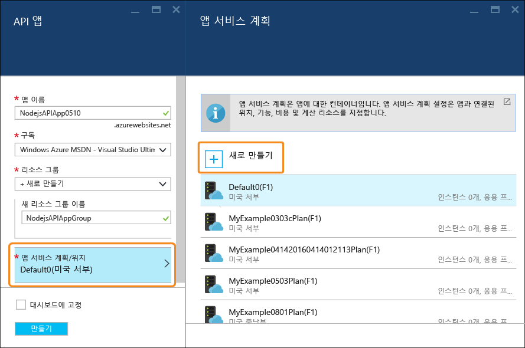
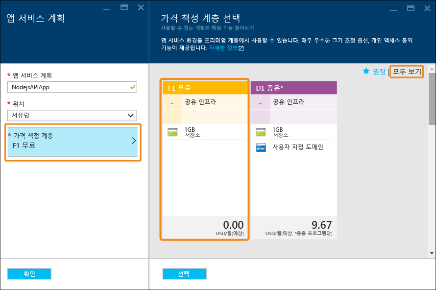
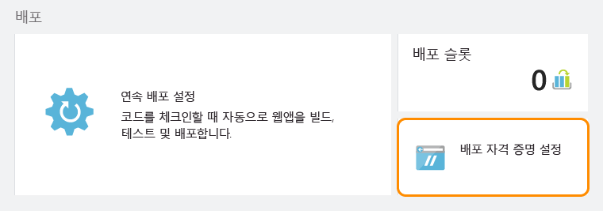

# Node.js RESTful API를 빌드하여 Azure의 API 앱에 배포
[!INCLUDE [app-service-api-get-started-selector](../../includes/app-service-api-get-started-selector.md)]

이 자습서에서는 [Git](http://git-scm.com)를 사용하여 간단한 [Node.js](http://nodejs.org) API를 만들고 [Azure App Service](../app-service/app-service-value-prop-what-is.md)의 [API 앱](app-service-api-apps-why-best-platform.md)에 배포하는 방법을 보여 줍니다. Node.js를 실행할 수 있는 운영 체제를 사용할 수 있으며 comd.exe 또는 bash 등의 명령줄 도구를 사용하여 모든 작업을 수행합니다.

## 필수 조건
1. Microsoft Azure 계정([여기서 무료 계정 열기](https://azure.microsoft.com/pricing/free-trial/))
2. [Node.js](http://nodejs.org) 설치(이 샘플에서는 Node.js 버전 4.2.2가 설치된 경우를 가정)
3. [Git](https://git-scm.com/) 설치
4. [GitHub](https://github.com/) 계정

앱 서비스에서 다양한 방법으로 API 앱에 코드를 배포하도록 지원하지만 이 자습서는 Git 메서드를 보여 주고 Git로 작업하는 방법에 대한 기본 지식이 있다고 가정합니다. 다른 배포 방법에 대한 정보는 [Azure 앱 서비스에 앱 배포](../app-service-web/web-sites-deploy.md)를 참조하세요.

## 샘플 코드 가져오기
1. Node.js 및 Git 명령을 실행할 수 있는 명령줄 인터페이스를 엽니다.
2. 로컬 Git 리포지토리에 사용할 수 있는 폴더로 이동하여 [샘플 코드가 포함된 GitHub 리포지토리](https://github.com/Azure-Samples/app-service-api-node-contact-list)를 복제합니다.
   
        git clone https://github.com/Azure-Samples/app-service-api-node-contact-list.git
   
    샘플 API는 두 개의 끝점을 제공합니다. `/contacts`에 대한 Get 요청은 이름 및 전자 메일 주소의 목록을 JSON 형식으로 반환하며 `/contacts/{id}`는 선택된 연락처만 반환합니다.

## Swagger 메타데이터 기반 Node.js 코드 스캐폴드(자동 생성)
[Swagger](http://swagger.io/) 는 RESTful API에 대해 설명하는 메타데이터의 파일 형식입니다. Azure 앱 서비스는 [기본적으로 Swagger 메타데이터를 지원](app-service-api-metadata.md)합니다. 자습서의 이 섹션에서는 Swagger 메타데이터를 먼저 만들고 API에 대한 서버 코드에 스캐폴딩(자동 생성)하는 데 사용할 API 개발 워크플로를 모델링합니다. 

> [!NOTE]
> Swagger 메타데이터 파일에서 Node.js 코드를 스캐폴딩하는 방법을 알아보지 않으려면 이 섹션을 건너뛸 수 있습니다. 샘플 코드를 새 API 앱에 배포하려는 경우 [Azure에서 API 앱 만들기](#createapiapp) 섹션으로 직접 이동합니다.
> 
> 

### Swaggerize 설치 및 실행
1. 다음 명령을 실행하여 **yo** 및 **generator-swaggerize** NPM 모듈을 전역적으로 설치합니다.
   
        npm install -g yo
        npm install -g generator-swaggerize
   
    Swaggerize는 Swagger 메타데이터 파일에서 설명하는 API의 서버 코드를 생성하는 도구입니다. 사용할 Swagger 파일의 이름은 *api.json*으로 지정되며 복제한 리포지토리의 *시작* 폴더에 있습니다.
2. *시작* 폴더로 이동한 다음 `yo swaggerize` 명령을 실행합니다. Swaggerize가 일련의 질문을 합니다.  **이 프로젝트의 이름**에 "contactlist"를 입력하고 **swagger 문서 경로**에는 "api.json", **Express, Hapi 또는 Restify**에는 "express"를 입력합니다.
   
        yo swaggerize
   
    
   
    **참고**: 이 단계에서 오류가 발생할 경우 다음 단계에서 해결 방법에 대한 설명이 표시됩니다.
   
    Swaggerize에서 응용 프로그램 폴더를 만들고 처리기와 구성 파일을 스캐폴드한 다음 **package.json** 파일을 생성합니다. Swagger 도움말 페이지를 생성하는 데 Express 보기 엔진이 사용됩니다.  
3. "알 수 없는 토큰" 또는 "잘못된 escape 시퀀스" 오류가 발생하고 `swaggerize` 명령이 실패하면 생성된 *package.json* 파일을 편집하여 오류의 원인을 수정합니다. `scripts` 아래 `regenerate` 줄에서 *api.json* 앞의 백슬래시를 슬래시로 변경하여 다음 예제와 같이 표시되도록 합니다.
   
         "regenerate": "yo swaggerize --only=handlers,models,tests --framework express --apiPath config/api.json"
4. 스캐폴드된 코드가 들어 있는 폴더(이 경우는 */start/ContactList* 하위 폴더)로 이동합니다.
5. `npm install`을 실행합니다.
   
        npm install
6. 그런 다음 **jsonpath** NPM 모듈을 설치합니다. 
   
        npm install --save jsonpath
   
    
7. **swaggerize ui** NPM 모듈을 설치합니다. 
   
        npm install --save swaggerize-ui
   
    

### 스캐폴드된 코드 사용자 지정
1. **start** 폴더의 **lib** 폴더를 scaffolder에서 만든 **ContactList** 폴더에 복사합니다. 
2. **handlers/contacts.js** 파일의 코드를 다음 코드로 바꿉니다. 
   
    이 코드는 **lib/contactRepository.js**에서 제공하는 **lib/contacts.json** 파일에 저장된 JSON 데이터를 사용합니다. 새 contacts.js 코드는 HTTP 요청에 응답하여 모든 연락처를 가져와 JSON 페이로드로 반환합니다. 
   
        'use strict';
   
        var repository = require('../lib/contactRepository');
   
        module.exports = {
            get: function contacts_get(req, res) {
                res.json(repository.all())
            }
        };
3. **handlers/contacts/{id}.js** 파일의 코드를 다음 코드로 바꿉니다. 
   
        'use strict';
   
        var repository = require('../../lib/contactRepository');
   
        module.exports = {
            get: function contacts_get(req, res) {
                res.json(repository.get(req.params['id']));
            }    
        };
4. **server.js** 의 코드를 다음 코드로 바꿉니다. 
   
    변경되는 내용을 볼 수 있도록 server.js 파일의 변경 사항이 주석으로 명시됩니다. 
   
        'use strict';
   
        var port = process.env.PORT || 8000; // first change
   
        var http = require('http');
        var express = require('express');
        var bodyParser = require('body-parser');
        var swaggerize = require('swaggerize-express');
        var swaggerUi = require('swaggerize-ui'); // second change
        var path = require('path');
   
        var app = express();
   
        var server = http.createServer(app);
   
        app.use(bodyParser.json());
   
        app.use(swaggerize({
            api: path.resolve('./config/swagger.json'), // third change
            handlers: path.resolve('./handlers'),
            docspath: '/swagger' // fourth change
        }));
   
        // change four
        app.use('/docs', swaggerUi({
          docs: '/swagger'  
        }));
   
        server.listen(port, function () { // fifth and final change
        });

### 로컬로 실행되는 API로 테스트
1. Node.js 명령줄 실행 파일을 사용하여 서버를 활성화합니다. 
   
        node server.js
2. **http://localhost:8000/contacts**로 이동하면 연락처 목록의 JSON 출력이 표시됩니다(또는 사용 중인 브라우저에 따라 다운로드할지 묻는 메시지가 표시됨). 
   
    
3. **http://localhost:8000/contacts/2**로 이동하면 해당 ID 값이 나타내는 연락처가 표시됩니다.
   
    
4. Swagger JSON 데이터는 **/swagger** 끝점을 통해 제공됩니다.
   
    
5. Swagger UI는 **/docs** 끝점을 통해 제공됩니다. Swagger UI에서 리치 HTML 클라이언트 기능을 사용하여 API를 테스트할 수 있습니다.
   
    

##  새 API 앱 만들기
이 섹션에서는 Azure 포털을 사용하여 Azure에서 새로운 API 앱을 만듭니다. 이 API 앱은 Azure에서 코드를 실행하기 위해 제공하는 계산 리소스를 나타냅니다. 이후 섹션에서 새 API 앱에 코드를 배포합니다.

1. [Azure 포털](https://portal.azure.com/)로 이동합니다. 
2. **새로 만들기 > 웹 + 모바일 > API 앱**을 클릭합니다. 
   
    
3. **azurewebsites.net** 도메인에 NodejsAPIApp에 고유 번호를 결합한 이름과 같은 고유한 *앱 이름* 을 입력합니다. 
   
    예를 들어 이름이 `NodejsAPIApp`이면 URL은 `nodejsapiapp.azurewebsites.net`이 됩니다.
   
    다른 사용자가 이미 사용하는 이름을 입력하면 오른쪽에 빨간색 느낌표가 표시됩니다.
4. **리소스 그룹** 드롭다운에서 **새로 만들기**를 클릭한 다음 **새 리소스 그룹 이름**에 "NodejsAPIAppGroup" 또는 선호하는 다른 이름을 입력합니다. 
   
    [리소스 그룹](../azure-resource-manager/resource-group-overview.md)은 API 앱, 데이터베이스, VM과 같은 Azure 리소스의 컬렉션입니다. 이 자습서에서는 새 리소스 그룹을 만드는 것이 가장 좋습니다. 자습서에서 만든 모든 Azure 리소스를 한 번에 쉽게 삭제할 수 있기 때문입니다.
5. **App Service 계획/위치**를 클릭한 다음 **새로 만들기**를 클릭합니다.
   
    
   
    다음 단계에서는 새 리소스 그룹에 대한 앱 서비스 계획을 만듭니다. 앱 서비스 계획은 API 앱이 실행되는 계산 리소스를 지정합니다. 예를 들어, 무료 계층을 선택한 경우 API 앱은 공유 VM에서 실행되지만, 일부 유료 계층에의 경우 전용 VM에서 실행됩니다. 앱 서비스 계획에 대한 자세한 내용은 [앱 서비스 계획 개요](../app-service/azure-web-sites-web-hosting-plans-in-depth-overview.md)를 참조하세요.
6. **앱 서비스 계획** 블레이드에서 "NodejsAPIAppPlan" 또는 선호하는 다른 이름을 입력합니다.
7. **위치** 드롭다운 목록에서 가장 가까운 위치를 선택합니다.
   
    이 설정은 앱이 실행되는 Azure 데이터 센터를 지정합니다. 이 자습서에서는 어떤 지역이든 선택할 수 있으며 지역에 따른 뚜렷한 차이는 없습니다. 그러나 프로덕션 앱의 경우 [대기 시간](http://www.bing.com/search?q=web%20latency%20introduction&qs=n&form=QBRE&pq=web%20latency%20introduction&sc=1-24&sp=-1&sk=&cvid=eefff99dfc864d25a75a83740f1e0090)을 최소화하기 위해 액세스하는 클라이언트와 최대한 가깝게 서버를 배치할 수 있습니다.
8. **가격 책정 계층 > 모두 보기 > F1 무료**를 클릭합니다.
   
    이 자습서의 경우 무료 가격 책정 계층으로도 충분한 성능이 제공됩니다.
   
    
9. **App Service 계획** 블레이드에서 **확인**을 클릭합니다.
10. **API 앱** 블레이드에서 **만들기**를 클릭합니다.

## Git 배포에 대한 새 API 앱 설정
Azure 앱 서비스에서 Git 리포지토리에 커밋을 푸시하여 API 앱에 코드를 배포합니다. 여기에서는 배포에 사용할 Azure의 자격 증명과 Git 리포지토리를 만듭니다.  

1. API 앱을 만든 다음 포털 홈 페이지에서 **App Services > {API 앱}**을 클릭합니다. 
   
    포털에 **API 앱** 및 **설정** 블레이드가 표시됩니다.
   
    
2. **설정** 블레이드에서 아래로 스크롤하여 **게시** 섹션을 표시한 다음 **배포 자격 증명**을 클릭합니다.
3. **배포 자격 증명 설정** 블레이드에서 사용자 이름과 암호를 입력한 다음 **저장**을 클릭합니다.
   
    API 앱에 Node.js 코드를 게시하기 위해 이러한 자격 증명을 사용합니다. 
   
    
4. **설정** 블레이드에서 **배포 원본 > 원본 선택 > 로컬 Git 리포지토리**를 클릭한 다음 **확인**을 클릭합니다.
   
    
5. Git 리포지토리를 만들어지면 블레이드가 변경되고 활성 배포가 표시됩니다. 새 리포지토리이므로 목록에 활성 배포가 없습니다. 
   
    
6. Git 리포지토리 URL을 복사합니다. 이렇게 하려면 새 API 앱의 블레이드로 이동하여 **필수 패키지** 섹션을 확인합니다. **필수 패키지** 섹션에 **Git 복제 URL**이 표시됩니다. 이 URL을 마우스로 가리키면 오른쪽에 URL을 클립보드로 복사하는 아이콘이 표시됩니다. 이 아이콘을 클릭하여 URL을 복사합니다.
   
    
   
    **참고**: Git 복제 URL은 다음 섹션에서 임의 위치에 임시로 저장하는 데 필요합니다.

백업하는 Git 리포지토리가 포함된 API 앱이 있으므로 코드를 리포지토리에 푸시하여 API 앱에 배포할 수 있습니다. 

## Azure에 API 코드 배포
이 섹션에서는 API에 대한 서버 코드를 포함하는 로컬 Git 리포지토리를 만들고 해당 리포지토리에서 이전에 Azure에 만든 리포지토리로 코드를 푸시합니다.

1. 새 로컬 Git 리포지토리에 사용할 수 있는 위치로 `ContactList` 폴더를 복사합니다. 이 자습서의 첫 번째 부분을 수행한 경우 `start` 폴더에서 `ContactList`를 복사합니다. 그렇지 않으면 `end` 폴더에서 `ContactList`를 복사합니다.
2. 명령줄 도구에서 새 폴더로 이동한 다음 아래 명령을 실행하여 새 로컬 Git 리포지토리를 만듭니다. 
   
        git init
   
     
3. 이 자습서의 첫 번째 부분을 수행하고 `ContactList` 폴더를 복사하면 복사본에는 `node_modules` 폴더가 포함될 수 있습니다. `package.json` 파일 및 `npm install`을 통한 배포 프로세스 중 만들어진 대로 원본 제어에서 `node_modules` 폴더를 포함하지 않으려고 합니다. 그러면 프로젝트 디렉터리의 루트에서 다음 명령을 실행하여 `.gitignore` 파일을 추가합니다.

         touch .gitignore
      
   .gitignore 파일을 열고 파일의 첫 줄에 `node_modules`을(를) 추가합니다. `git status`을(를) 실행하는 경우 원본 제어에서 `node_modules` 폴더를 무시하는지 확인할 수 있고 디렉터리가 목록에 표시되지 않습니다. 규칙을 추가하려는 경우 NodeJS 프로젝트에서 무시해야 할 권장 파일은 (GitHub 프로젝트)[https://github.com/github/gitignore/blob/master/Node.gitignore]이 있습니다.
 
4. 아래 명령을 실행하여 API 앱의 리포지토리에 대한 Git 원격을 추가합니다. 
   
        git remote add azure YOUR_GIT_CLONE_URL_HERE
   
    **참고**: "YOUR_GIT_CLONE_URL_HERE" 문자열을 앞에서 복사한 자신의 Git 복제 URL로 바꿉니다. 
5. 다음 명령을 실행하여 모든 코드가 포함된 커밋을 만듭니다. 
   
        git add .
        git commit -m "initial revision"
   
    
6. 명령을 실행하여 코드를 Azure로 푸시합니다. 암호를 입력하라는 메시지가 표시되면 앞에서 Azure 포털에서 만든 암호를 입력합니다.
   
        git push azure master
   
    그러면 API 앱에 대한 배포가 트리거됩니다.  
7. 브라우저에서 다시 API 앱의 **배포** 블레이드로 이동하면 배포가 실행 중인 것으로 표시됩니다. 
   
    
   
    이와 동시에 명령줄 인터페이스에 진행 중인 배포의 상태가 반영됩니다. 
   
    
   
    배포가 완료되면 **배포** 블레이드에 코드 변경 내용이 API 앱에 성공적으로 배포되었음이 반영됩니다. 

## Azure에서 실행되는 API로 테스트
1. API 앱 블레이드의 **필수 패키지** 섹션에서 **URL**을 복사합니다. 
   
    
2. Postman 또는 Fiddler(또는 사용 중인 웹 브라우저)와 같은 REST API 클라이언트를 사용하여 연락처 API 호출 URL(API 앱의 `/contacts` 끝점)을 입력합니다. URL은 `https://{your API app name}.azurewebsites.net/contacts`
   
    이 끝점에 GET 요청을 실행하면 API 앱의 JSON 출력이 표시됩니다.
   
    
3. 브라우저에서 `/docs` 끝점으로 이동하여 Azure에서 실행되는 Swagger UI를 사용해 봅니다.

지속적 업데이트가 연결되었으므로 코드를 변경하고 Azure Git 리포지토리에 커밋을 푸시하여 Azure에 배포할 수 있습니다.

## 다음 단계
이제 API 앱을 만들고 거기에 Node.js API 코드를 배포했습니다. 다음 자습서에서는 [CORS를 사용하여 JavaScript 클라이언트에서 API 앱을 사용](app-service-api-cors-consume-javascript.md)하는 방법을 보여 줍니다.

<!--HONumber=Jan17_HO3-->

