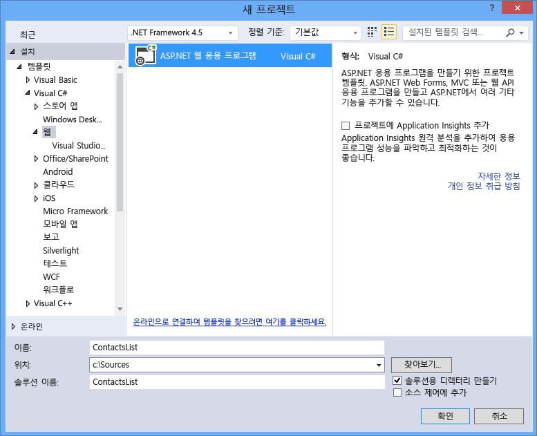
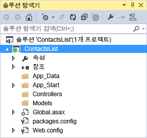
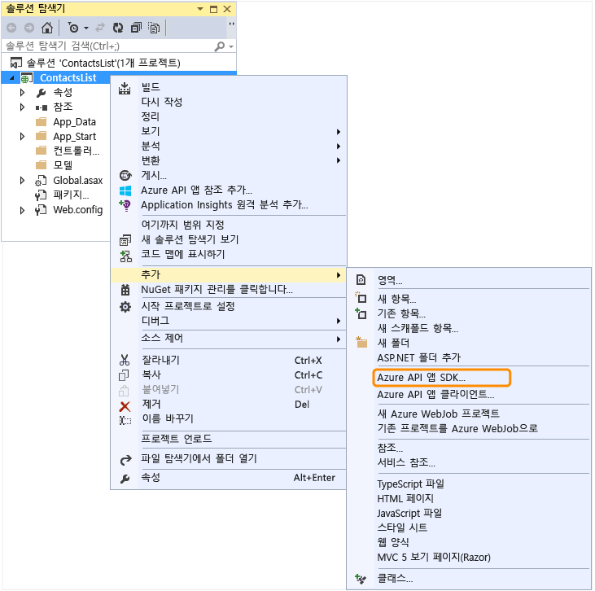
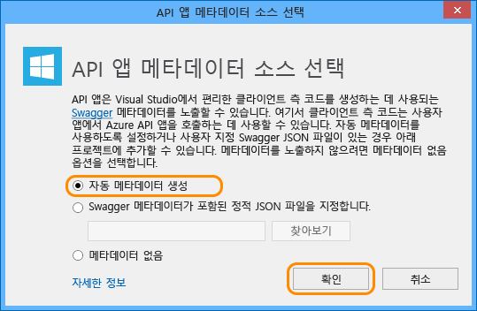

<properties 
	pageTitle="Web API 프로젝트를 API 앱으로 구성" 
	description="Visual Studio 2013을 사용하여 Web API 프로젝트를 API 앱으로 구성하는 방법을 알아봅니다." 
	services="app-service\api" 
	documentationCenter=".net" 
	authors="bradygaster" 
	manager="wpickett" 
	editor="jimbe"/>

<tags 
	ms.service="app-service-api" 
	ms.workload="web" 
	ms.tgt_pltfrm="dotnet" 
	ms.devlang="na" 
	ms.topic="article" 
	ms.date="08/14/2015" 
	ms.author="tdykstra"/>

# Web API 프로젝트를 API 앱으로 구성

## 개요

이 자습서에서는 기존 Web API 프로젝트를 가져와 [Azure 앱 서비스](../app-service/app-service-value-prop-what-is.md)에서 [API 앱](app-service-api-apps-why-best-platform.md)으로 배포하기 위해 구성하는 방법을 보여 줍니다. 시리즈의 이후 자습서에서는 이 자습서에서 만든 API 앱 프로젝트를 [배포](app-service-dotnet-deploy-api-app.md) 및 [디버그](../app-service-dotnet-remotely-debug-api-app.md)하는 방법을 보여 줍니다.

API 앱에 대한 자세한 내용은 [API 앱 정의](app-service-api-apps-why-best-platform.md)를 참조하세요.

[AZURE.INCLUDE [install-sdk-2015-2013](../../includes/install-sdk-2015-2013.md)]

이 자습서에는 Azure SDK for .NET 버전 2.6 이상이 필요합니다.

## Web API 프로젝트 구성 

이 섹션에서는 기존 Web API 프로젝트를 API 앱으로 구성하는 방법을 보여 줍니다. 먼저 Web API 프로젝트 템플릿을 사용하여 Web API 프로젝트를 만든 후 API 앱으로 구성합니다.

1. Visual Studio 2015 또는 Visual Studio 2013을 엽니다.

2. **파일 > 새 프로젝트**를 클릭합니다.

3. **ASP.NET 웹 응용 프로그램** 템플릿을 선택합니다.

4. **프로젝트에 Application Insights 추가** 확인란의 선택이 취소되었는지 확인하십시오.

4. 프로젝트의 이름을 *ContactsList*로 지정합니다.

	

5. **확인**을 클릭합니다.

6. **새 ASP.NET 프로젝트** 대화 상자에서 **빈** 프로젝트 템플릿을 선택합니다.

7. **Web API** 확인란을 클릭합니다.

8. **클라우드에서 호스트** 옵션을 선택 취소합니다.

	

9. **확인**을 클릭하여 프로젝트를 생성합니다.

	

10. **솔루션 탐색기**에서 솔루션이 아니라 프로젝트를 마우스 오른쪽 단추로 클릭하고 **추가 > Azure API 앱 SDK**를 선택합니다.

	

11. **Choose API App Metadata source(API 앱 메타데이터 소스 선택)** 대화 상자에서 **Automatic Metadata Generation(자동 메타데이터 생성)**을 클릭합니다.

	

	이 선택은 자습서 뒷부분에서 보게 될 동적 Swagger UI를 사용할 수 있게 해줍니다. Swagger 메타데이터 파일을 업로드하도록 선택하는 경우 다음 섹션에 설명된 대로 파일 이름이 *apiDefinition.swagger.json*으로 저장됩니다.

12. **확인**을 클릭합니다.
 
	이때 Visual Studio에서 API 앱 NuGet 패키지를 설치하고 Web API 프로젝트에 API 앱 메타데이터를 추가합니다.

[AZURE.INCLUDE [app-service-api-review-metadata](../../includes/app-service-api-review-metadata.md)]

[AZURE.INCLUDE [app-service-api-define-api-app](../../includes/app-service-api-define-api-app.md)]

[AZURE.INCLUDE [app-service-api-direct-deploy-metadata](../../includes/app-service-api-direct-deploy-metadata.md)]

## 다음 단계

이제 API 앱을 배포할 준비가 되었으며 [API 앱 배포](app-service-dotnet-deploy-api-app.md) 자습서에 따라 API 앱을 배포할 수 있습니다.
 

<!---HONumber=Oct15_HO3-->