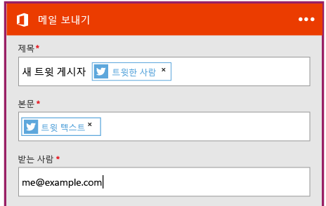

<properties
	pageTitle="논리 앱 만들기 | Microsoft Azure"
	description="SaaS 서비스에 연결하는 논리 앱을 만드는 방법에 대해 알아보세요."
	authors="stepsic-microsoft-com"
	manager="dwrede"
	editor=""
	services="app-service\logic"
	documentationCenter=""/>

<tags
	ms.service="app-service-logic"
	ms.workload="na"
	ms.tgt_pltfrm="na"
	ms.devlang="na"
	ms.topic="get-started-article"
	ms.date="02/17/2016"
	ms.author="stepsic"/>

# SaaS 서비스에 연결하는 새 논리 앱 만들기

| 빠른 참조 |
| --------------- |
| [논리 앱 정의 언어](https://msdn.microsoft.com/library/azure/dn948512.aspx?f=255&MSPPError=-2147217396) |
| [논리 앱 커넥터 문서](https://azure.microsoft.com/documentation/articles/app-service-logic-connectors-list/) |
| [논리 앱 포럼](https://social.msdn.microsoft.com/Forums/ko-KR/home?forum=azurelogicapps) |

이 항목에서는 단 몇 분 안에 [앱 서비스 논리 앱](app-service-logic-what-are-logic-apps.md)을 시작할 수 있는 방법을 보여줍니다. 관심이 있는 일련의 트윗을 Dropbox 폴더로 전달할 수 있는 워크플로 단계별로 안내합니다.

이 시나리오를 사용하려면 다음이 필요합니다.

- Azure 구독
- Twitter 계정
- Office 365 계정

## 트윗으로 전자 메일을 보낼 새 논리 앱 만들기

1. Azure 포털 대시보드에서 **마켓플레이스**를 선택합니다. 
2. 모든 경우에서 '논리 앱'을 검색한 다음 **논리 앱(미리 보기)**를 선택합니다. 또한 **새로 만들기**, **웹 + 모바일**을 선택하고 **논리 앱(미리 보기)**를 선택할 수도 있습니다 
3. 논리 앱의 이름을 입력하고 앱 서비스 계획을 선택한 다음 **만들기**를 선택합니다. 이 단계에서는 앱 서비스 계획이 있고 필요한 속성에 익숙하다는 것으로 가정하겠습니다. 그렇지 않은 경우에도 [Azure 앱 서비스 계획의 포괄 개요](azure-web-sites-web-hosting-plans-in-depth-overview.md)를 시작할 수 있습니다. 

4. 논리 앱을 처음 열 때 트리거가 필요합니다. 예를 들어 **되풀이**를 사용할 수 있습니다.

	되풀이를 사용하면 논리 앱이 선택한 시간을 사용하여 지속적으로 실행됩니다. 예를 들어, 30초마다, 5시간마다, 매일 오전 8시(PST), 매일 오전 2시(EST) 등에 논리 앱을 실행할 수 있습니다. 또한 논리 앱에서 되풀이를 삭제할 수도 있습니다. 되풀이를 삭제하는 경우 논리 앱을 수동으로 시작할 수 있습니다.

5. 그러나 이 자습서에서는 조건과 일치하는 트 윗될 때마다 트리거가 실행되도록 합니다. `...` 메뉴를 클릭하여 되풀이 트리거를 삭제합니다.

6. 트리거 검색 상자에서 **twitter**를 검색하고 선택합니다.

7. 이제 에 대한 twitter를 검색하려는 키워드를 입력합니다.

5. 더하기 기호를 선택한 다음 **동작 추가** 또는 **조건 추가**를 선택합니다. 
6. **동작 추가**를 선택하면, 사용 가능한 작업과 모든 커넥터가 나열됩니다. 그런 다음 논리 앱에 추가할 커넥터 및 작업을 선택할 수 있습니다. 예를 들어, **Office 365 - 전자 메일 보내기**와 기타 Office 365 작업을 선택할 수 있습니다.

7. 이제 원하는 전자 메일에 대 한 매개 변수를 입력해야 합니다. 

8. 마지막으로 **저장**을 선택하여 논리 앱을 라이브 상태로 만듭니다.

## 논리 앱 생성 후 관리

이제 논리 앱이 실행됩니다. 예약된 워크플로가 실행될 때마다 특정 해시태그가 있는 트윗을 확인합니다. 일치하는 트윗을 찾으면 Dropbox에 넣습니다. 마지막으로, 앱을 비활성화하는 방법 또는 그 작동 방법을 살펴보겠습니다.

1. 화면의 왼쪽에서 **찾아보기**를 클릭하고 **논리 앱**을 선택합니다.

2. 방금 만든 새 논리 앱을 클릭하여 현재 상태 및 일반 정보를 표시합니다.

3. 새 논리 앱을 편집하려면 **트리거 및 동작**을 클릭합니다.

5. 앱을 끄려면 명령 모음에서 **사용 안 함**을 클릭합니다.

5분 이내에 클라우드에서 간단한 논리 앱이 실행되도록 설정할 수 있습니다. 논리 앱 기능을 사용하는 방법에 대한 자세한 내용은 [논리 앱 기능 사용]을 참조하세요. 논리 앱 정의 자체에 대해 알아보려면 [논리 응용 프로그램 정의 작성](app-service-logic-author-definitions.md)을 참조하세요.

<!-- Shared links -->
[Azure portal]: https://portal.azure.com
[논리 앱 기능 사용]: app-service-logic-create-a-logic-app.md

<!---HONumber=AcomDC_0224_2016-->