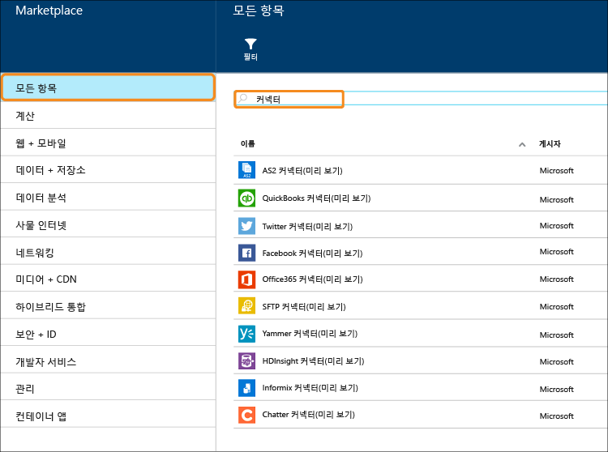

<properties 
	pageTitle="커넥터 및 BizTalk API 앱 정의" 
	description="API 앱, 커넥터 및 BizTalk API 앱에 대해 알아봅니다." 
	services="app-service\logic" 
	documentationCenter="" 
	authors="MandiOhlinger" 
	manager="dwrede" 
	editor=""/>

<tags 
	ms.service="app-service-logic" 
	ms.workload="integration" 
	ms.tgt_pltfrm="na" 
	ms.devlang="na" 
	ms.topic="article" 
	ms.date="12/01/2015" 
	ms.author="mandia"/>

# 커넥터 및 BizTalk API 앱 정의

Azure 앱 서비스는 API 앱을 통한 일반적인 연결 및 확장성의 원칙을 기반으로 하여 빌드되었습니다. *커넥터*는 연결에 중점을 두는 API 앱 유형입니다. 다른 API 앱과 마찬가지로 커넥터는 웹앱, 모바일 앱 및 논리 앱에서 사용됩니다. 커넥터는 기존 서비스에 쉽게 연결할 수 있게 해주며 인증 관리에 도움이 되고 모니터링, 분석 등을 제공합니다.

모든 개발자가 고유한 API 앱을 만들고 비공개로 배포할 수 있습니다. 나중에 개발자는 사용자 지정해서 만든 API 앱을 마켓플레이스를 통해 공유하고 수익화할 수 있습니다.

개발자가 Azure 앱 서비스로 솔루션을 신속하게 빌드할 수 있도록 Azure 팀은 여러 일반적인 시나리오를 충족하는 많은 커넥터를 마켓플레이스에 추가했습니다. 뿐만 아니라 앱 서비스의 도달 범위를 복잡한 고급 통합 시나리오까지 확장하기 위해 많은 프리미엄 및 BizTalk 기능도 제공됩니다.

Azure 앱 서비스에서 다양한 서비스 "계층"을 사용할 수 있습니다. 모든 계층에는 전체 기능을 포함하여 모든 커넥터 및 API 앱이 포함되어 있습니다.

[앱 서비스 가격](http://azure.microsoft.com/pricing/details/app-service/)에서는 서비스 계층을 설명하고 이러한 계층에 포함된 항목도 나열합니다. 다음 섹션에서는 BizTalk API 앱 및 커넥터의 다양한 범주를 설명합니다.

## 표준 커넥터
앱 서비스에는 Office 365, SalesForce, Sugar CRM, OneDrive, DropBox, Marketo, Facebook 등을 비롯한 오늘날 SaaS의 가장 유명한 이름들에 웹앱, 모바일 앱 및 논리 앱을 연결하기 위한 완성 인도 방식을 제공하는 풍부한 커넥터 집합이 포함되어 있습니다. 또한 HTTP 호출만큼 쉽게 FTP, SFTP, POP3/IMAP, SMTP 및 SOAP를 사용하여 외부 서비스와 통신하는 커넥터 집합도 포함되어 있습니다.

## 프리미엄 커넥터 
프리미엄 커넥터는 앱 서비스의 도달 범위를 SAP, Oracle, DB2, Informix 및 WebSphere MQ에 대한 연결이 있는 엔터프라이즈까지 확장합니다.

## EAI 및 EDI 서비스
중요 업무용 앱을 빌드하려면 연결 이상의 것이 필요합니다. Microsoft의 업계 선도적인 통합 플랫폼인 BizTalk Server를 기반으로 하는 BizTalk API 앱은 웹앱, 모바일 앱 및 논리 앱에 쉽게 맞출 수 있는 고급 통합 기능을 제공합니다. 이러한 통합 기능에는 유효성 검사, 추출, 변환, 인코더, 거래 업체 관리 및 X12, EDIFACT, AS2와 같은 EDI 형식에 대한 지원이 포함됩니다.

## 규칙
비즈니스 규칙은 비즈니스 프로세스를 제어하는 정책 및 의사 결정을 캡슐화합니다. 일반적으로 규칙은 동적이며 비즈니스 계획, 규정 및 기타 여러 이유를 비롯한 다양한 이유로 시간이 지남에 따라 변경됩니다. 앱 서비스의 BizTalk 규칙을 사용하면 응용 프로그램 코드에서 이러한 정책을 분리하여 변경 프로세스를 더 간단하고 빠르게 만들 수 있습니다.

## 커넥터 및 API 앱 목록
표준 커넥터, BizTalk EAI, 프리미엄 커넥터 등을 포함하여 각 범주에 포함된 커넥터 및 API 앱의 전체 목록은 [커넥터 및 API 앱 목록](app-service-logic-connectors-list.md)을 참조하세요.
 

<!---HONumber=AcomDC_1203_2015-->