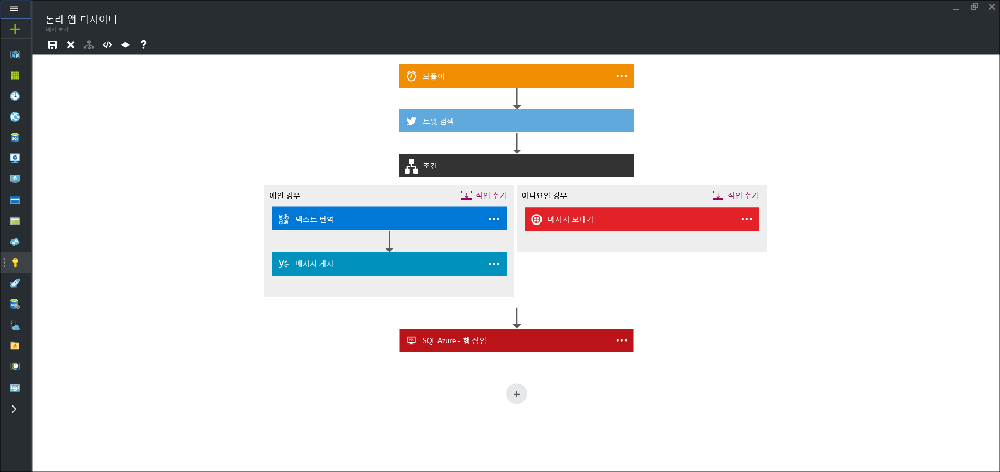

<properties 
	pageTitle="논리 앱이란 무엇인가요?" 
	description="앱 서비스 논리 앱에 대해 자세히 알아봅니다." 
	authors="kevinlam1" 
	manager="dwrede" 
	editor="" 
	services="logic-apps" 
	documentationCenter=""/>

<tags
	ms.service="logic-apps"
	ms.workload="na"
	ms.tgt_pltfrm="na"
	ms.devlang="na"
	ms.topic="hero-article" 
	ms.date="07/12/2016"
	ms.author="klam"/>

#논리 앱이란 무엇인가요?

논리 앱은 클라우드에서 확장 가능한 통합 및 워크플로를 단순화하고 구현하는 방법을 제공합니다. 모델에 비주얼 디자이너를 제공하고 프로세스를 워크플로로 알려진 일련의 단계로 자동화합니다. 서비스 및 프로토콜에 걸쳐 신속하게 통합하기 위해 클라우드 및 온-프레미스에 [많은 커넥터](../connectors/apis-list.md)가 있습니다. 논리 앱은 \('Dynamics CRM에 계정을 추가하는 경우'와 같이\) 트리거로 시작하고 실행 후에 여러 조합 작업, 변환 및 조건 논리 실행을 시작할 수 있습니다.

논리 앱을 사용하는 이점은 다음과 같습니다.

- 설계 도구를 쉽게 이해하기 위해 사용하는 복잡한 프로세스를 설계하여 시간 절약
- 코드에서 구현하기 어려운 패턴 및 워크플로를 원활하게 구현
- 템플릿에서 신속하게 시작
- 고유의 사용자 지정 API, 코드 및 작업을 사용하여 논리 앱 사용자 지정
- 온-프레미스 및 클라우드에 서로 다른 시스템 연결 및 동기화
- 강력한 통합 지원을 통해 BizTalk Server, API 관리, Azure Functions 및 Azure 서비스 버스 구축

논리 앱은 완전히 관리되는 iPaaS\(integration Platform as a Service\)로서 개발자가 호스팅, 확장성, 가용성 및 관리를 구축하는 방법에 대해 걱정하지 않도록 합니다. 논리 앱은 수요에 맞게 자동으로 강화됩니다.

언급했듯이 논리 앱과 함께 비즈니스 프로세스를 자동화할 수 있습니다. 다음은 몇 가지 예입니다.
 
* FTP 서버에 업로드된 파일 Azure 저장소로 이동
* 온-프레미스 및 클라우드에 걸친 프로세스 및 경로 순서
* 특정 주제에 대한 모든 트윗 모니터링, 데이터 분석 및 추가 작업을 필요로 하는 항목에 대한 경고 및 작업 만들기

이와 같은 시나리오는 비주얼 디자이너에서 코드를 전혀 작성하지 않고도 구성될 수 있습니다. [이제 논리 앱을 구축][create]을 시작합니다. 작성되면 논리 앱은 여러 환경 및 지역에 걸쳐 [신속하게 배포되고 다시 구성될](app-service-logic-create-deploy-template.md) 수 있습니다.

## 논리 앱 사용 이유

논리 앱은 엔터프라이즈 통합 공간에 속도 및 확장성을 제공합니다. 디자이너의 사용 편의성, 사용 가능한 다양한 트리거 및 작업 및 가장 단순하게 API를 중앙 집중화시키는 강력한 관리 도구를 제공합니다. 기업이 디지털화되면서 논리 앱을 사용하면 레거시 및 첨단 시스템을 함께 연결할 수 있습니다.

또한 [엔터프라이즈 통합 계정][biztalk]을 사용하여 [XML 메시징][xml], [거래 파트너 관리][tpm] 등의 권한으로 통합 시나리오를 확장할 수 있습니다.

- **사용하기 쉬운 디자인 도구** - 브라우저에서 또는 Visual Studio 도구를 사용하여 종단간 논리 앱을 디자인할 수 있습니다. 트리거 시작 - 단순한 일정부터 GitHub 문제가 발생하는 경우까지 적용됩니다. 그런 다음 풍부한 커넥터 갤러리를 사용하여 작업을 개수 제한 없이 오케스트레이션합니다.

- **쉽게 API 연결** - 설명하기 쉬운 컴퍼지션 작업도 코드에서 구현하기는 어렵습니다. 논리 앱을 통해 개별 시스템을 쉽게 연결할 수 있습니다. 클라우드 마케팅 솔루션을 온-프레미스 청구 시스템에 연결하고 싶으세요? 엔터프라이즈 서비스 버스를 사용하여 API 및 시스템에 걸쳐 메시징을 중앙 집중화하시겠습니까? 논리 앱은 이러한 문제에 대한 솔루션을 제공하는 가장 빠르고 신뢰할 수 있는 방법입니다.

- **템플릿으로 빠르게 시작** - 빠르게 시작할 수 있도록 일부 일반적인 솔루션을 신속하게 만들 수 있는 [템플릿의 갤러리][templates]를 제공합니다. 고급 B2B 솔루션부터 간단한 SaaS 연결 및 일부 '오락용' 솔루션에 이르기까지 갤러리는 논리 앱의 기능을 시작하는 가장 빠른 방법입니다.

- **내재된 확장성** - 필요한 커넥터가 보이지 않나요? 논리 앱은 사용자 고유의 API 및 코드로 작업하도록 설계되었습니다. 고유한 API 앱을 만들어서 사용자 지정 커넥터로 사용하거나 [Azure Function](https://functions.azure.com)에 호출하여 주문형 코드 조각을 실행할 수 있습니다.

- **진정한 통합 능력** - 쉽게 시작되고 필요에 따라 확장됩니다. 논리 앱은 통합 전문가가 필요한 솔루션을 빌드할 수 있도록 하기 위해 Microsoft의 업계 선도적인 통합 솔루션인 BizTalk 기능을 쉽게 활용할 수 있습니다. [엔터프라이즈 통합 팩](./app-service-logic-enterprise-integration-overview.md)에 대해 자세히 알아봅니다.

## 논리 앱 개념

논리 앱 환경을 구성하는 몇 가지 주요 부분은 다음과 같습니다.

- **워크플로** - 논리 앱은 비즈니스 프로세스를 일련의 단계나 워크플로로 모델링하는 그래픽 방법을 제공합니다.
- **관리 커넥터** - 논리 앱은 데이터 및 서비스에 액세스해야 합니다. 관리 커넥터는 데이터에 연결하고 작업할 때 도움이 되도록 특별히 생성됩니다. [관리 커넥터][managedapis]에서 현재 사용 가능한 커넥터 목록을 확인하세요.
- **트리거** - 일부 관리 커넥터는 트리거로도 작동할 수 있습니다. 트리거는 메일 도착이나 Azure 저장소 계정 변경과 같은 특정 이벤트에 따라 워크플로의 새 인스턴스를 시작합니다.
-  **동작** - 워크플로에서 트리거 후의 각 단계를 동작이라고 합니다. 각 동작은 일반적으로 관리 커넥터 또는 사용자 지정 API 앱의 작업에 매핑됩니다.
- **엔터프라이즈 통합 팩** - 고급 통합 시나리오를 위해 논리 앱에는 BizTalk의 기능이 포함됩니다. BizTalk는 Microsoft의 업계 선도적인 통합 플랫폼입니다. 엔터프라이즈 통합 팩 커넥터를 사용하면 유효성 검사, 변환 등을 논리 앱 워크플로에 쉽게 포함할 수 있습니다.

## 시작하기  

- 논리 앱을 시작하려면 [논리 앱 만들기][create] 자습서를 따르세요.
- [일반적인 예제 및 시나리오 보기](app-service-logic-examples-and-scenarios.md)
- [논리 앱으로 비즈니스 프로세스를 자동화할 수 있습니다](http://channel9.msdn.com/Events/Build/2016/T694)
- [논리 앱과 시스템을 통합하는 방법을 알아봅니다](http://channel9.msdn.com/Events/Build/2016/P462)

[biztalk]: app-service-logic-enterprise-integration-accounts.md
[appservice]: ../app-service/app-service-value-prop-what-is.md
[create]: app-service-logic-create-a-logic-app.md
[managedapis]: ../connectors/apis-list.md
[tpm]: app-service-logic-enterprise-integration-accounts.md
[xml]: app-service-logic-enterprise-integration-b2b.md
[templates]: app-service-logic-use-logic-app-templates.md

<!---HONumber=AcomDC_0803_2016-->