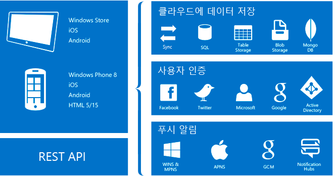

<properties
	pageTitle="모바일 앱 정의"
	description="앱 서비스가 엔터프라이즈 모바일 앱에 제공하는 이점을 알아봅니다."
	services="app-service\mobile"
	documentationCenter=""
	authors="adrianhall"
	manager="dwrede"
	editor=""/>

<tags
	ms.service="app-service-mobile"
	ms.workload="na"
	ms.tgt_pltfrm="mobile-multiple"
	ms.devlang="na"
	ms.topic="hero-article"
	ms.date="05/03/2016"
	ms.author="glennga"/>

# 모바일 앱 정의

Azure 앱 서비스는 전문적 개발자를 위한 완전히 관리되는 PaaS([Platform as a Service](https://azure.microsoft.com/overview/what-is-paas/)) 제품으로, 웹, 모바일 및 통합 시나리오에 풍부한 기능 집합을 제공합니다. *Azure 앱 서비스*의 *모바일 앱*은 엔터프라이즈 개발자 및 시스템 통합자를 위해 확장성이 크고 전 세계에서 사용 가능한 모바일 응용 프로그램 개발 플랫폼을 제공합니다. 이 플랫폼은 모바일 개발자에게 풍부한 기능 집합을 제공합니다.

##모바일 앱 사용 이유
*Azure 앱 서비스*의 *모바일 앱*은 엔터프라이즈 개발자 및 시스템 통합자를 위해 확장성이 크고 전 세계에서 사용 가능한 모바일 응용 프로그램 개발 플랫폼을 제공합니다. 이 플랫폼은 모바일 개발자에게 풍부한 기능 집합을 제공합니다. 모바일 앱을 통해 다음을 수행할 수 있습니다.

- **네이티브 앱 및 크로스 플랫폼 앱 빌드** - 빌드하는 앱이 네이티브 iOS, Android 및 Windows 앱인지 또는 크로스 플랫폼 Xamarin 앱이나 Cordova(Phonegap) 앱인지에 관계없이 네이티브 SDK를 통해 앱 서비스를 이용할 수 있습니다.
- **엔터프라이즈 시스템에 연결** - 모바일 앱을 사용하면 몇 분 내에 회사 로그온을 추가하고 엔터프라이즈 온-프레미스 또는 클라우드 리소스에 연결할 수 있습니다.
- **데이터 동기화를 사용하여 오프라인 지원 앱 빌드** - 오프라인에서 작동하는 앱을 빌드하여 모바일 작업자의 생산성을 높이고 엔터프라이즈 데이터 원본이나 SaaS API와 연결된 경우 모바일 앱을 사용하여 백그라운드에서 데이터를 동기화합니다.
- **몇 초 내에 수백만 명에게 푸시 알림 전송** - 요구에 맞게 개인 설정되고 적절한 시간에 전송되는 인스턴트 푸시 알림을 모든 장치에서 지원하여 고객을 관리합니다.

## 모바일 앱 기능
다음 기능은 클라우드 사용 모바일 개발에 중요합니다.

- **인증 및 권한 부여** - 엔터프라이즈 인증을 위한 Azure Active Directory와 Facebook, Google, Twitter 및 Microsoft 계정과 같은 소셜 공급자를 포함하여 점점 증가하는 ID 공급자 목록에서 선택합니다. Azure 모바일 앱은 각 공급자에 대한 OAuth 2.0 서비스를 제공합니다. 또한 공급자 특정 기능에 대한 ID 공급자의 SDK도 통합할 수 있습니다.

  [인증 기능]에 대해 자세히 알아보세요.

- **데이터 액세스** - Azure Mobile Apps은 SQL Azure 또는 온-프레미스 SQL Server에 연결된 모바일 친화적인 OData v3 데이터 원본을 제공합니다. 이 서비스는 Entity Framework를 기반으로 할 수 있으며 이를 통해 [Azure 테이블 저장소], MongoDB, [DocumentDB] 및 SaaS API 공급자(예: Office 365 및 Salesforce.com)를 비롯한 다른 NoSQL 및 SQL 데이터 공급자와 쉽게 통합할 수 있습니다.
- **오프라인 동기화** - 클라이언트 SDK를 통해 충돌 해결 지원을 비롯하여 백 엔드 데이터와 자동으로 동기화될 수 있는 오프라인 데이터 집합에서 작동하는 강력하고 응답성이 우수한 모바일 응용 프로그램을 쉽게 빌드할 수 있습니다.

  [데이터 기능]에 대해 자세히 알아보세요.

- **푸시 알림** - 클라이언트 SDK는 Azure 알림 허브의 등록 기능과 원활하게 통합되어 수백만 명의 사용자에게 동시에 푸시 알림을 보낼 수 있습니다.

  [푸시 알림 기능]에 대해 자세히 알아보세요.

- **클라이언트 SDK** - 네이티브 개발([iOS], [Android] 및 [Windows]), 크로스 플랫폼 개발([iOS 및 Android용 Xamarin], [Xamarin Forms]) 및 하이브리드 응용 프로그램 개발([Apache Cordova])을 포함하는 전체 집합의 클라이언트 SDK를 제공합니다. 각 클라이언트 SDK는 MIT 라이선스로 사용할 수 있으며 오픈 소스입니다.

## Azure 앱 서비스 기능.
다음 플랫폼 기능은 일반적으로 모바일 프로덕션 사이트에 유용합니다.

- **자동 크기 조정** - 앱 서비스를 사용하면 들어오는 고객 부하를 처리하기 위해 신속하게 확장하거나 축소할 수 있습니다. VM 수와 크기를 수동으로 선택하거나 부하 또는 일정에 따라 모바일 앱 백 엔드의 크기를 조정하도록 자동 크기 조정을 설정합니다.

  [자동 크기 조정]에 대해 자세히 알아보세요.

- **스테이징 환경** - 앱 서비스는 여러 버전의 사이트를 실행할 수 있으므로 A/B 테스트, 대규모 DevOps 계획의 일부로 프로덕션에서 테스트 및 새로운 백 엔드의 현재 위치 스테이징을 수행할 수 있습니다.

  [스테이징 환경]에 대해 자세히 알아보세요.

- **연속 배포** - 앱 서비스는 일반 SCM 시스템과 통합할 수 있어 SCM 시스템의 분기에 푸시하여 새 버전의 백 엔드를 자동으로 배포할 수 있습니다.

  [배포 옵션]에 대해 자세히 알아보세요.

- **가상 네트워킹** - App Service는 가상 네트워크, Express 경로 또는 하이브리드 연결을 사용하여 온-프레미스 리소스에 연결할 수 있습니다.

  [하이브리드 연결], [가상 네트워크] 및 [Express 경로]에 대해 자세히 알아보세요.

- **격리/전용 환경** - 높은 확장성으로 Azure 앱 서비스를 안전하게 실행하기 위해 완전히 격리된 전용 환경에서 앱 서비스를 실행할 수 있습니다. 매우 높은 확장성, 격리 또는 보안 네트워크 액세스가 요구되는 응용 프로그램 워크로드에 이상적입니다.

  [앱 서비스 환경]에 대해 자세히 알아보세요.

## 시작하기 ##
모바일 앱을 시작하려면 [시작] 자습서를 따르세요. 여기서는 모바일 백 엔드 및 선택한 클라이언트 생성의 기본 사항에 대해 설명한 후 통합 인증, 오프라인 동기화 및 푸시 알림에 대해 설명합니다. 각 클라이언트 응용 프로그램마다 한 번씩 [시작] 자습서를 여러 번 진행할 수 있습니다.

Azure 모바일 앱에 대한 자세한 내용은 [학습 맵]을 검토하세요. Azure 앱 서비스 플랫폼에 대한 자세한 내용은 [Azure 앱 서비스]를 참조하세요.

>[AZURE.NOTE] Azure 계정을 등록하기 전에 Azure 앱 서비스를 시작하려면 [앱 서비스 평가](https://tryappservice.azure.com/?appServiceName=mobile)로 이동합니다. 앱 서비스에서 단기 스타터 웹 앱을 즉시 만들 수 있습니다. 신용 카드는 필요하지 않으며 약정도 필요하지 않습니다.

<!-- URLs. -->
[Migrate your Mobile Service to App Service]: app-service-mobile-migrating-from-mobile-services.md
[Azure 앱 서비스]: ../app-service/app-service-value-prop-what-is.md
[시작]: app-service-mobile-ios-get-started.md
[Azure 테이블 저장소]: ../storage/storage-getting-started-guide.md
[DocumentDB]: ../documentdb/documentdb-get-started.md
[인증 기능]: ./app-service-mobile-auth.md
[데이터 기능]: ./app-service-mobile-offline-data-sync.md
[푸시 알림 기능]: ../notification-hubs/notification-hubs-push-notification-overview.md
[iOS]: ./app-service-mobile-ios-how-to-use-client-library.md
[Android]: ./app-service-mobile-android-how-to-use-client-library.md
[Windows]: ./app-service-mobile-dotnet-how-to-use-client-library.md
[iOS 및 Android용 Xamarin]: ./app-service-mobile-dotnet-how-to-use-client-library.md
[Xamarin Forms]: ./app-service-mobile-xamarin-forms-get-started.md
[Apache Cordova]: ./app-service-mobile-cordova-how-to-use-client-library.md
[자동 크기 조정]: ../app-service-web/web-sites-scale.md
[스테이징 환경]: ../app-service-web/web-sites-staged-publishing.md
[배포 옵션]: ../app-service-web/web-sites-deploy.md
[하이브리드 연결]: ../app-service-web/web-sites-hybrid-connection-get-started.md
[가상 네트워크]: ../app-service-web/web-sites-integrate-with-vnet.md
[Express 경로]: ../app-service/app-service-app-service-environment-network-configuration-expressroute.md
[앱 서비스 환경]: ../app-service-web/app-service-app-service-environment-intro.md
[학습 맵]: https://azure.microsoft.com/documentation/learning-paths/appservice-mobileapps/

<!---HONumber=AcomDC_0921_2016-->