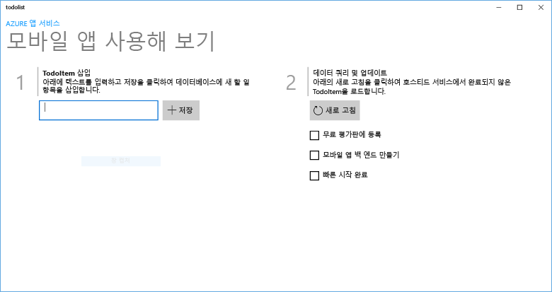
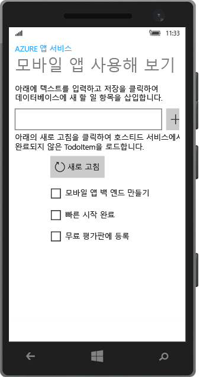
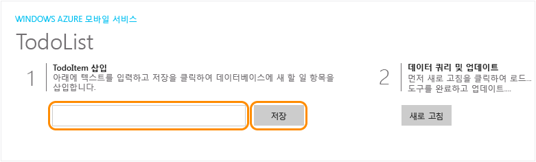

# Windows 앱 만들기
[!INCLUDE [app-service-mobile-selector-get-started](../../includes/app-service-mobile-selector-get-started.md)]

## 개요
이 자습서에서는 UWP(범용 Windows 플랫폼) 앱에 클라우드 기반 백 엔드 서비스를 추가하는 방법을 보여 줍니다. 자세한 내용은 [Mobile Apps 정의](app-service-mobile-value-prop.md)를 참조하세요. 다음은 완성된 앱의 화면 캡처입니다.

   
데스크톱에서 실행

  
휴대폰에서 실행

먼저 이 자습서를 완료해야만 UWP 앱용 다른 모든 모바일 앱 자습서를 학습할 수 있습니다.

## 필수 조건
이 자습서를 완료하려면 다음이 필요합니다.

* 활성 Azure 계정. 계정이 없는 경우 Azure 평가판을 등록하고 최대 10개의 무료 모바일 앱을 가져올 수 있습니다. 이러한 앱은 평가판 사용 기간이 끝난 후에도 계속 사용할 수 있습니다. 자세한 내용은 [Azure 무료 체험](https://azure.microsoft.com/pricing/free-trial/)을 참조하세요.
* [Visual Studio Community 2015] 이상 버전

## 새 Azure 모바일 앱 백 엔드 만들기
다음 단계에 따라 새 모바일 앱 백 엔드를 만드세요.

[!INCLUDE [app-service-mobile-dotnet-backend-create-new-service](../../includes/app-service-mobile-dotnet-backend-create-new-service.md)]

이제 모바일 클라이언트 응용 프로그램에서 사용할 수 있는 Azure 모바일 앱 백 엔드를 프로비저닝했습니다. 다음으로, 간단한 “할 일 목록” 백 엔드에 대한 서버 프로젝트를 다운로드하고 Azure에 게시합니다.

## 서버 프로젝트 구성
[!INCLUDE [app-service-mobile-configure-new-backend.md](../../includes/app-service-mobile-configure-new-backend.md)]

## 클라이언트 프로젝트 다운로드 및 실행
모바일 앱 백 엔드를 구성하면 새 클라이언트 앱을 만들거나 Azure에 연결할 기존 앱을 수정할 수 있습니다. 이 섹션에서 모바일 앱 백 엔드에 연결하도록 사용자 지정된 UWP 앱 템플릿 프로젝트를 다운로드합니다.

1. 모바일 앱 백 엔드에 대한 **빠른 시작** 블레이드로 돌아가서 **새 앱 만들기** > **다운로드**를 클릭한 다음 로컬 컴퓨터에 압축된 프로젝트 파일을 추출합니다.

    
2. (선택 사항) 동일한 솔루션에 UWP 앱 프로젝트를 서버 프로젝트로 추가합니다. 이렇게 하면 작업을 수행하려는 경우 동일한 Visual Studio 솔루션에서 앱 및 백 엔드 모두를 디버그하고 테스트할 수 있습니다. UWP 앱 프로젝트를 솔루션에 추가하려면 Visual Studio 2015 이상 버전을 사용해야 합니다.
3. UWP 앱을 시작 프로젝트로 사용하여 앱을 배포하고 실행하도록 F5 키를 누릅니다.
4. 앱에서 **할 일 항목 삽입** 텍스트 상자에 *자습서 완료*와 같은 의미 있는 텍스트를 입력하고 **저장**을 클릭합니다.

    

    Azure에 호스트된 새 모바일 앱 백 엔드에 POST 요청이 전송됩니다.
5. (선택 사항) 앱을 중지하고 다른 장치 또는 모바일 에뮬레이터에서 다시 시작합니다.

    

    UWP 앱이 시작된 후 이전 단계에서 저장한 데이터가 Azure에서 로드됩니다.

## 다음 단계
* [앱에 인증 추가](app-service-mobile-windows-store-dotnet-get-started-users.md)  
  ID 공급자를 사용하여 앱 사용자를 인증하는 방법을 알아봅니다.
* [앱에 푸시 알림 추가](app-service-mobile-windows-store-dotnet-get-started-push.md)  
  앱에 푸시 알림 지원을 추가하고 모바일 앱 백 엔드를 구성하여 푸시 알림을 보내는 Azure Notification Hubs를 사용하는 방법을 알아봅니다.
* [앱에 오프라인 동기화 사용](app-service-mobile-windows-store-dotnet-get-started-offline-data.md)  
  모바일 앱 백 엔드를 사용하여 앱에 오프라인 지원을 추가하는 방법을 알아봅니다. 오프라인 동기화를 사용하면 최종 사용자는 네트워크에 연결되어 있지 않을 때도 모바일 앱&mdash;데이터 보기, 추가 또는 수정&mdash;과 같은 상호 작용을 수행할 수 있습니다.

<!-- Anchors. -->
<!-- Images. -->
<!-- URLs. -->
[Mobile App SDK]: http://go.microsoft.com/fwlink/?LinkId=257545
[Azure portal]: https://portal.azure.com/
[Visual Studio Community 2015]: https://go.microsoft.com/fwLink/p/?LinkID=534203
