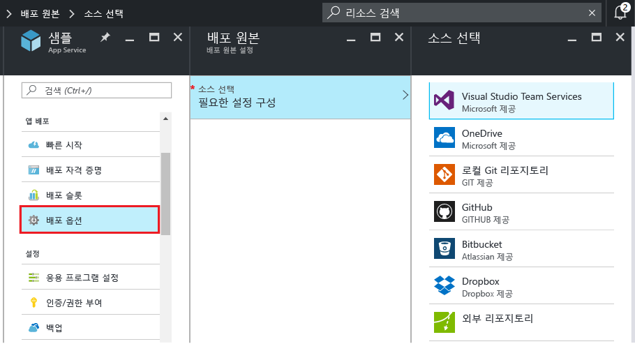

# Azure 앱 서비스에 연속 배포
이 자습서에서는 [Azure 앱 서비스] 앱에 대한 연속 배포 워크플로를 구성하는 방법을 보여 줍니다. BitBucket, GitHub 및 VSTS(Visual Studio 팀 서비스)와 앱 서비스 통합을 통해 Azure가 이러한 서비스 중 하나에 게시한 프로젝트에서 최신 업데이트를 가져오는 연속 배포 워크플로를 활성화합니다. 연속 배포는 여러 개의 빈번한 작성자가 통합되는 프로젝트에 적합한 옵션입니다.

## 연속 배포 활성화
연속 배포를 활성화하려면

1. 연속 배포에 사용될 리포지토리에 앱 콘텐츠를 게시합니다.  
    이러한 서비스에 프로젝트를 게시하는 것에 대한 자세한 내용은 [리포지토리 만들기(GitHub)], [리포지토리 만들기(BitBucket)] 및 [VSTS 시작]을 참조하세요.
2. 앱의 메뉴 블레이드에 있는 [Azure 포털]에서 **앱 배포 > 배포 옵션**을 클릭합니다. **원본 선택**을 클릭한 다음 배포 원본을 선택합니다.  
   
    
   
   > [!NOTE]
   > 앱 서비스 배포를 위한 VSTS 계정을 구성하려면 이 [자습서](https://github.com/projectkudu/kudu/wiki/Setting-up-a-VSTS-account-so-it-can-deploy-to-a-Web-App)를 참조하세요.
   > 
   > 
3. 권한 부여 워크플로를 완료합니다.
4. **배포 원본** 블레이드에서 배포할 프로젝트 및 분기를 선택합니다. 완료되면 **확인**을 클릭합니다.
   
    
   
   > [!NOTE]
   > GitHub 또는 BitBucket에서 지속적으로 배포할 수 있도록 하면 공용 및 개인 프로젝트가 둘 다 표시됩니다.
   > 
   > 
   
    앱 서비스는 선택한 저장소와의 연결을 만들고 지정한 분기에서 파일을 가져오고 앱 서비스 앱에 대한 리포지토리의 복제본을 유지합니다. Azure 포털에서 VSTS 연속 배포를 구성할 때 통합은 App Service [Kudu 배포 엔진](https://github.com/projectkudu/kudu/wiki)을 사용하며 여기서는 모든 `git push`를 통해 빌드 및 배포 작업을 자동화합니다. VSTS에서 연속 배포를 별도로 설정할 필요가 없습니다. 이 프로세스를 완료한 후에는 **배포 옵션** 앱 블레이드에서 배포가 성공했음을 나타내는 활성 배포를 표시합니다.
5. 앱이 성공적으로 배포되었는지 확인하려면 Azure 포털에서 앱의 블레이드 맨 위에 있는 **URL**을 클릭합니다.
6. 사용자가 선택한 리포지토리에서 지속적으로 배포되는지 확인하려면, 리포지토리에 대한 변경을 푸시합니다. 리포지토리에 푸시한 직후 변경 내용이 반영되도록 앱을 업데이트해야 합니다. 앱의 **배포 옵션** 블레이드에서 업데이트를 가져왔는지 확인할 수 있습니다.

## Visual Studio 솔루션의 연속 배포
Azure 앱 서비스에 Visual Studio 솔루션을 푸시하는 것은 간단한 index.html 파일을 푸시하는 것만큼 쉽습니다. 앱 서비스 배포 프로세스는 NuGet 종속성 복원 및 응용 프로그램 이진 파일 생성 등의 모든 세부 정보를 간소화합니다. Git 리포지토리에서 코드를 유지 관리하는 소스 제어 모범 사례만 따르면 나머지는 앱 서비스 배포에서 처리할 수 있습니다.

솔루션과 리포지토리를 다음과 같이 구성한 경우 Visual Studio 솔루션을 앱 서비스에 푸시하는 단계는 [이전 섹션](#overview)과 동일합니다.

* Visual Studio 원본 제어 옵션을 사용하여 아래 이미지와 같은 `.gitignore` 파일을 생성하거나 이 [.gitignore 샘플](https://github.com/github/gitignore/blob/master/VisualStudio.gitignore)과 유사한 콘텐츠로 리포지토리 루트에 `.gitignore` 파일을 수동으로 추가합니다.
  
  
* 전체 솔루션의 디렉터리 트리를 리포지토리에 추가하고 .sln 파일을 리포지토리 루트에 둡니다.

설명된 대로 리포지토리를 설정하고, 온라인 Git 리포지토리 중 하나에서 연속 게시에 대해 Azure에서 앱을 구성한 후에는 Visual Studio에서 ASP.NET 응용 프로그램을 로컬로 개발하고 온라인 Git 리포지토리에 변경 내용을 푸시하여 코드를 지속적으로 배포할 수 있습니다.

## 지속적 배포 사용 안 함
지속적 배포를 비활성화하려면

1. 앱의 메뉴 블레이드에 있는 [Azure 포털]에서 **앱 배포 > 배포 옵션**을 클릭합니다. 그런 다음 **배포 옵션** 블레이드에서 **연결 끊기**를 클릭합니다.
   
    
2. 확인 메시지에서 **예**를 클릭한 후 다른 원본의 게시를 설정하려면 앱의 블레이드로 돌아가서 **앱 배포 > 배포 원본**을 클릭합니다.

## 추가 리소스
* [연속 배포의 일반 문제를 조사하는 방법](https://github.com/projectkudu/kudu/wiki/Investigating-continuous-deployment)
* [Azure용 PowerShell 사용 방법]
* [Mac 및 Linux용 Azure 명령줄 도구를 사용하는 방법]
* [Git 설명서]
* [Project Kudu](https://github.com/projectkudu/kudu/wiki)

> [!NOTE]
> Azure 계정을 등록하기 전에 Azure App Service를 시작하려면 [App Service 체험](http://go.microsoft.com/fwlink/?LinkId=523751)으로 이동합니다. 여기서 App Service의 단기 시작 웹앱을 즉시 만들 수 있습니다. 신용 카드는 필요하지 않으며 약정도 필요하지 않습니다.
> 
> 

[Azure 앱 서비스]: https://azure.microsoft.com/en-us/documentation/articles/app-service-changes-existing-services/
[Azure 포털]: https://portal.azure.com
[VSTS Portal]: https://www.visualstudio.com/en-us/products/visual-studio-team-services-vs.aspx
[Installing Git]: http://git-scm.com/book/en/Getting-Started-Installing-Git
[Azure용 PowerShell 사용 방법]: /powershell/azureps-cmdlets-docs
[Mac 및 Linux용 Azure 명령줄 도구를 사용하는 방법]: ../xplat-cli-install.md
[Git 설명서]: http://git-scm.com/documentation

[리포지토리 만들기(GitHub)]: https://help.github.com/articles/create-a-repo
[리포지토리 만들기(BitBucket)]: https://confluence.atlassian.com/display/BITBUCKET/Create+an+Account+and+a+Git+Repo
[VSTS 시작]: https://www.visualstudio.com/get-started/overview-of-get-started-tasks-vs
[Continuous delivery to Azure using Visual Studio Team Services]: ../articles/cloud-services/cloud-services-continuous-delivery-use-vso.md

<!--HONumber=Dec16_HO1-->

