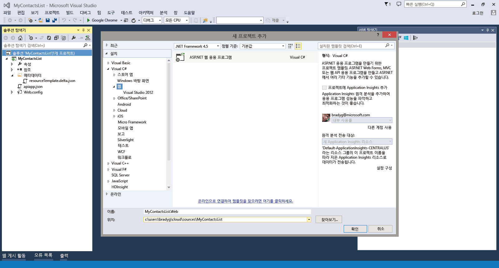
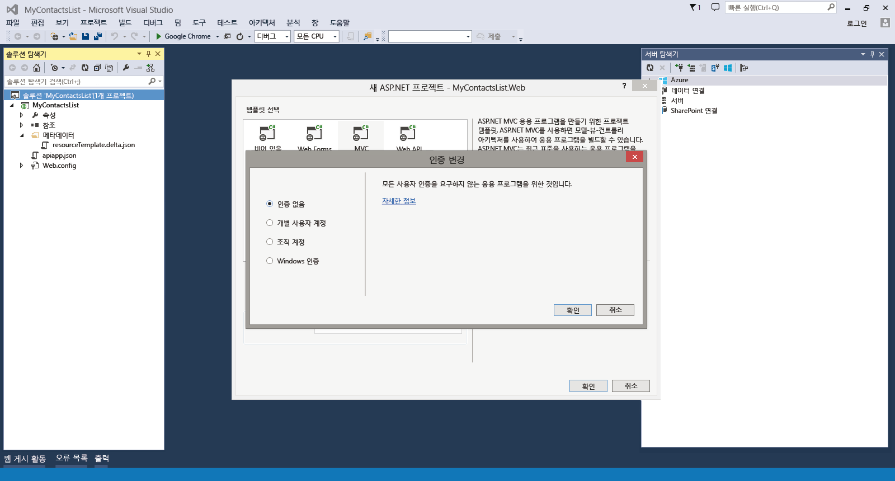
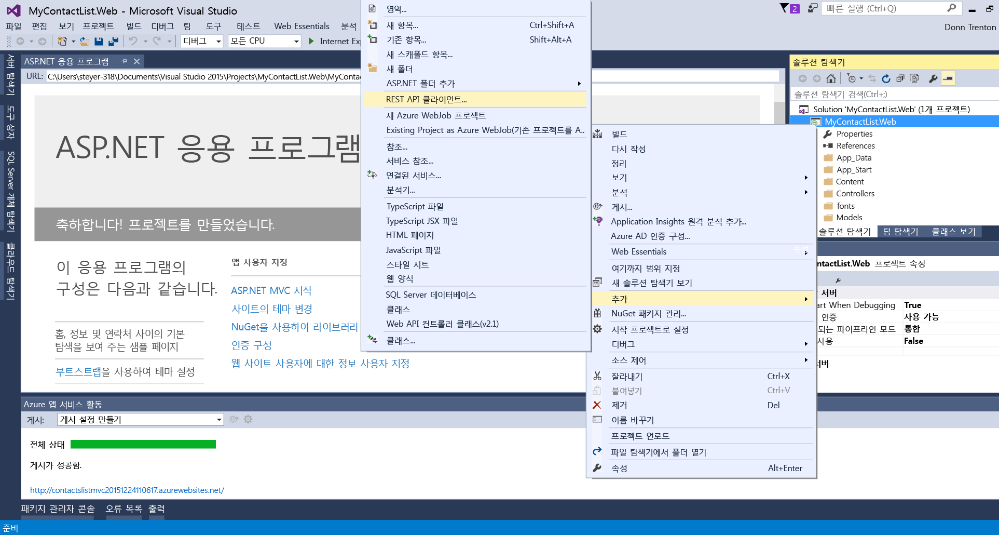
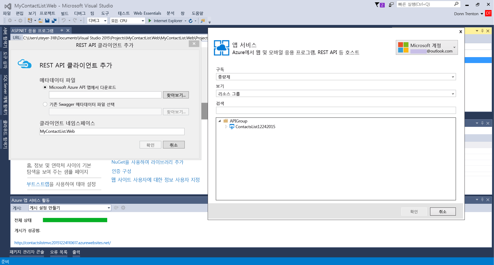
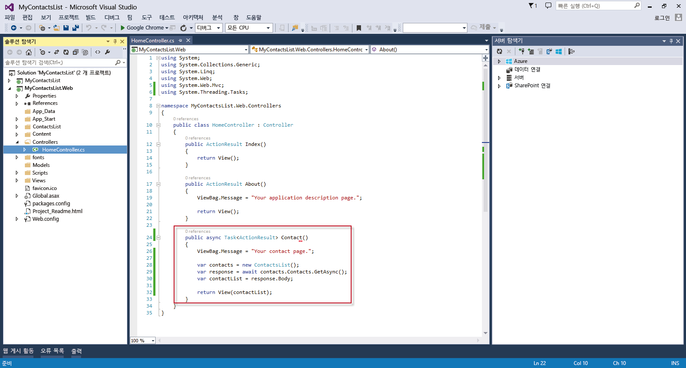
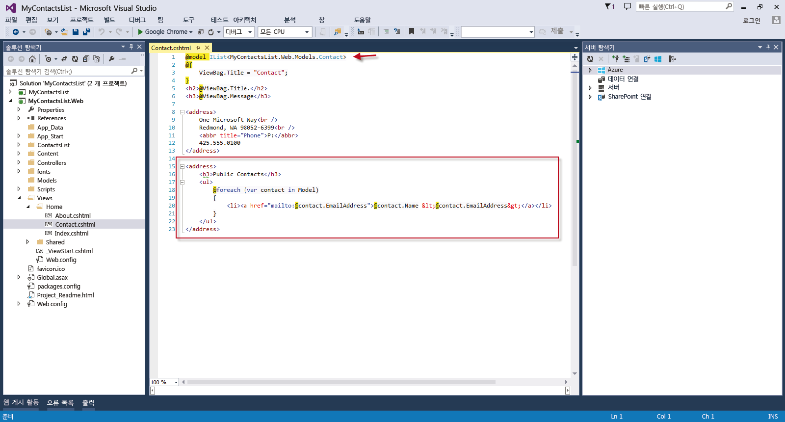

<properties 
	pageTitle="Azure 앱 서비스의 API 앱에 웹앱 연결" 
	description="이 자습서에서는 Azure 앱 서비스에 호스트된 ASP.NET 웹앱에서 API 앱을 사용하는 방법을 보여 줍니다." 
	services="app-service\web" 
	documentationCenter=".net" 
	authors="syntaxc4" 
	manager="yochayk" 
	editor="jimbe"/>

<tags
	ms.service="app-service"
	ms.devlang="dotnet"
	ms.topic="article"
	ms.tgt_pltfrm="na"
	ms.workload="web" 
	ms.date="09/15/2015"
	ms.author="cfowler"/>

# Azure 앱 서비스의 API 앱에 웹앱 연결

이 자습서에서는 [앱 서비스](../app-service.md)에 호스트된 ASP.NET 웹앱에서 API 앱을 사용하는 방법을 보여 줍니다.

## 필수 조건

이 자습서는 API 앱 자습서의 다음 시리즈를 기반으로 합니다.

1. [Azure API 앱 만들기](../app-service-dotnet-create-api-app)
3. [Azure API 앱 배포](../app-service-dotnet-deploy-api-app)
4. [Azure API 앱 디버그](../app-service-dotnet-remotely-debug-api-app)

## API 앱을 공개적으로 액세스할 수 있도록 설정

[Azure Preview 포털](http://go.microsoft.com/fwlink/?LinkId=529715)에서 API 앱을 선택합니다. 명령 모음에서 **설정** 단추를 클릭합니다. **응용 프로그램 설정** 블레이드에서 **액세스 수준**을 **공용(익명)**으로 변경합니다.

## Visual Studio에서 ASP.NET MVC 응용 프로그램 만들기

1. Visual Studio를 엽니다. **새 프로젝트** 대화 상자를 사용하여 새 **ASP.NET 웹 응용 프로그램**을 추가합니다. **확인**을 클릭합니다.

	

1. **MVC** 템플릿을 선택합니다. **인증 변경**을 클릭하고 **인증 없음**을 선택한 다음 **확인**을 두 번 클릭합니다.

	

1. 솔루션 탐색기에서 새로 만든 웹 응용 프로그램 프로젝트를 마우스 오른쪽 단추로 클릭하고** Azure 앱 참조 추가**를 선택합니다.

	

1. **기존 API 앱** 드롭다운 목록에서 연결할 API 앱을 선택합니다.

	

	>[AZURE.NOTE]API 앱에 연결하기 위한 클라이언트 코드가 Swagger API 끝점에서 자동으로 생성됩니다.

1. 생성된 API 코드를 활용하려면 HomeController.cs 파일을 열고 `Contact` 동작을 다음 코드로 바꿉니다.

	    public async Task<ActionResult> Contact()
	    {
	        ViewBag.Message = "Your contact page.";
	
	        var contacts = new ContactsList();
	        var response = await contacts.Contacts.GetAsync();
	        var contactList = response.Body;
	
	        return View(contactList);
	    }

	

1. 아래 코드를 사용하여 동적 연락처 목록을 반영하도록 `Contact` 보기를 업데이트합니다.
	<pre>// 뷰 파일의 최상위에 추가
@model IList&lt;MyContactsList.Web.Models.Contact>

// 기본 메일 주소를 다음 메일 주소로 바꿉니다.
&lt;h3>Public Contacts&lt;/h3>
&lt;ul>
    @foreach (var contact in Model)
    {
        &lt;li>&lt;a href="mailto:@contact.EmailAddress">@contact.Name &amp;lt;@contact.EmailAddress&amp;gt;&lt;/a>&lt;/li>
    }
&lt;/ul> 
	</pre>

	

## 앱 서비스에서 웹앱에 웹 응용 프로그램 배포

[Azure 웹앱을 배포하는 방법](web-sites-deploy.md)에 있는 지침을 따르세요.

>[AZURE.NOTE]Azure 계정을 등록하기 전에 Azure 앱 서비스를 시작하려면 [앱 서비스 평가](http://go.microsoft.com/fwlink/?LinkId=523751)로 이동합니다. 앱 서비스에서 단기 스타터 웹앱을 즉시 만들 수 있습니다. 신용 카드는 필요하지 않으며 약정도 필요하지 않습니다.

## 변경된 내용
* 웹 사이트에서 앱 서비스로의 변경에 대한 지침은 [Azure 앱 서비스와 이 서비스가 기존 Azure 서비스에 미치는 영향](http://go.microsoft.com/fwlink/?LinkId=529714)을 참조하세요.
* 이전 포털에서 새 포털로의 변경에 대한 지침은 [미리 보기 포털 탐색에 대한 참조](http://go.microsoft.com/fwlink/?LinkId=529715)를 참조하세요.
 

<!---HONumber=Sept15_HO3-->