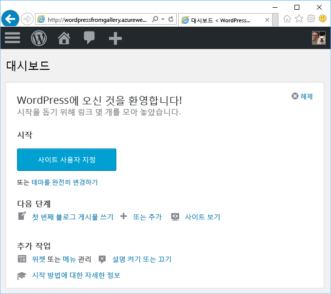

# Azure 마켓플레이스에서 웹앱 만들기
<!-- Note: This article replaces web-sites-php-web-site-gallery.md -->

[!INCLUDE [tabs](../../includes/app-service-web-get-started-nav-tabs.md)]

Azure Marketplace는 WordPress 및 Umbraco CMS와 같이 오픈 소스 소프트웨어 커뮤니티에서 개발한 인기 있는 다양한 웹앱을 제공합니다. 이 자습서에서는 Azure Marketplace에서 WordPress 앱을 만드는 방법을 알아봅니다.
Azure Web App 및 MySQL 데이터베이스를 만듭니다. 

## 시작하기 전에 

Azure 구독이 아직 없는 경우 시작하기 전에 [무료 계정](https://azure.microsoft.com/free/?WT.mc_id=A261C142F) 을 만듭니다.

## Azure Marketplace에서 배포
아래 단계에 따라 Azure Marketplace에서 WordPress를 배포합니다.

### Azure에 로그인
[Azure 포털](https://portal.azure.com)에 로그인합니다.

### WordPress 템플릿 배포
Azure Marketplace에서는 리소스를 설정하기 위한 템플릿을 제공합니다. 이러한 [WordPress](https://portal.azure.com/#create/WordPress.WordPress) 템플릿을 설정하여 시작하세요.
   
WordPress 앱 및 해당 리소스를 배포하려면 다음 정보를 입력합니다.

  

| 필드         | 제안 값           | 설명  |
| ------------- |-------------------------|-------------|
| 앱 이름      | mywordpressapp          | **웹앱 이름**으로 고유한 앱 이름을 입력합니다. 이 이름은 사용자의 앱에 대한 기본 DNS 이름의 일부로 사용되므로(`<app_name>.azurewebsites.net`) Azure의 모든 앱에서 고유해야 합니다. 나중에 사용자에게 노출하기 전에 앱에 사용자 지정 도메인 이름을 매핑할 수 있습니다. |
| 구독  | Pay-As-You-Go             | **구독**을 선택합니다. 구독이 여러 개인 경우 적절한 구독을 선택합니다. |
| 리소스 그룹| mywordpressappgroup                 |    **리소스 그룹**을 입력합니다. 리소스 그룹은 웹앱 및 데이터베이스 같은 Azure 리소스가 배포되고 관리되는 논리적 컨테이너입니다. 리소스 그룹을 만들거나 기존 리소스 그룹을 사용할 수 있습니다. |
| 앱 서비스 계획 | myappplan          | App Service 계획은 앱을 호스트하는 데 사용되는 실제 리소스의 컬렉션을 나타냅니다. **위치** 및 **가격 책정 계층**을 선택합니다. 가격 책정에 대한 자세한 내용은 [App Service 가격 책정 계층](https://azure.microsoft.com/pricing/details/app-service/)을 참조하세요. |
| 데이터베이스      | mywordpressapp          | MySQL에 대한 적절한 데이터베이스 공급자를 선택합니다. 웹앱은 **ClearDB**, **MySQL용 Azure 데이터베이스** 및 **MySQL 앱 내**를 지원합니다. 자세한 내용은 아래의 [데이터베이스 구성](#database-config) 섹션을 참조하세요. |
| Application Insights | 설정 또는 해제          | 선택 사항입니다. [Application Insights](https://azure.microsoft.com/en-us/services/application-insights/)는 **설정**을 클릭하면 웹앱에 대한 모니터링 서비스를 제공합니다.|

### 데이터베이스 구성
사용자가 선택한 MySQL 데이터베이스 공급자에 따라 다음 단계를 수행합니다.  웹앱 및 MySQL 데이터베이스를 같은 위치에 두는 것이 좋습니다.

#### ClearDB 
[ClearDB](https://azuremarketplace.microsoft.com/en-us/marketplace/apps/SuccessBricksInc.ClearDBMySQLDatabase?tab=Overview)는 Azure의 완전히 통합된 MySQL 서비스를 위한 타사 솔루션입니다. ClearDB 데이터베이스를 사용하려면 신용 카드를 [Azure 계정](http://account.windowsazure.com/subscriptions)에 연결해야 합니다. ClearDB 데이터베이스 공급자를 선택한 경우 기존 데이터베이스 목록에서 선택하거나 **새로 만들기** 단추를 클릭하여 데이터베이스를 만들 수 있습니다.

#### MySQL용 Azure 데이터베이스(미리 보기)
[MySQL용 Azure 데이터베이스](https://azure.microsoft.com/en-us/services/mysql)는 MySQL 데이터베이스를 몇 분 이내에 가장 신뢰할 수 있는 클라우드에서 설정하고 바로 확장할 수 있는 앱 개발 및 배포를 위한 관리 데이터베이스 서비스를 제공합니다. 포괄적인 가격 책정 모델을 통해 추가 비용 없이 기본 제공되는 가용성, 보안, 복구 등 원하는 기능을 모두 이용할 수 있습니다. **가격 책정 계층**을 클릭하여 다른 [가격 책정 계층](https://azure.microsoft.com/pricing/details/mysql)을 선택할 수 있습니다. 기존 데이터베이스 또는 기존 MySQL 서버를 사용하려면 서버가 있는 기존 리소스 그룹을 사용합니다. 

> [!NOTE]
>  MySQL용 Azure 데이터베이스(미리 보기) 및 Linux의 웹앱(미리 보기)을 모든 하위 지역에서 사용할 수 있는 것은 아닙니다. [MySQL용 Azure 데이터베이스(미리 보기)](https://docs.microsoft.com/en-us/azure/mysql) 및 [Linux의 웹앱](./app-service-linux-intro.md) 제한 사항에 대해 자세히 알아보세요. 

#### MySQL 인앱
[MySQL 인 앱](https://blogs.msdn.microsoft.com/appserviceteam/2017/03/06/announcing-general-availability-for-mysql-in-app)은 플랫폼에서 기본적으로 MySql을 실행할 수 있도록 하는 App Service의 기능입니다. 이 기능 릴리스 시 지원되는 핵심 기능:

- MySQL 서버를 사이트를 호스트하는 웹 서버와 동일한 인스턴스에서 함께 실행. 이렇게 하면 응용 프로그램 성능이 향상됩니다.
- 저장소가 MySQL 및 웹앱 파일 간에 공유됩니다. 무료 및 공유 계획을 사용하면 사이트를 사용할 때 수행한 작업을 기준으로 할당량 제한에 도달할 수 있습니다. 무료 및 공유 계획에 대한 [할당량 제한](https://azure.microsoft.com/en-us/pricing/details/app-service/plans/)을 확인하세요.
- MySQL에 대해 느린 쿼리 로깅 및 일반 로깅을 설정할 수 있습니다. 이러한 설정은 사이트 성능에 영향을 미칠 수 있으므로 항상 설정하지는 않도록 합니다. 로깅 기능을 사용하면 응용 프로그램 문제를 조사하는 데 도움이 됩니다. 

자세한 내용은 이 [문서](https://blogs.msdn.microsoft.com/appserviceteam/2016/08/18/announcing-mysql-in-app-preview-for-web-apps/ )를 확인하세요.

WordPress 앱을 배포하는 동안 포털 페이지의 위쪽에 종 아이콘을 클릭하여 진행률을 확인할 수 있습니다.    

## 새로운 Azure 웹앱 관리

Azure Portal로 이동하여 방금 만든 웹앱을 살펴봅니다.

이 작업을 수행하려면 [https://portal.azure.com](https://portal.azure.com)에 로그인합니다.

왼쪽 메뉴에서 **App Services**를 클릭한 다음 Azure 웹앱의 이름을 클릭합니다.

웹앱의 _블레이드_(가로로 열리는 포털 페이지)로 이동했습니다.

기본적으로 웹앱의 블레이드는 **개요** 페이지를 표시합니다. 이 페이지에서는 앱이 어떻게 작동하고 있는지를 보여 줍니다. 여기에서 찾아보기, 중지, 시작, 다시 시작, 삭제와 같은 기본 관리 작업을 수행할 수 있습니다. 블레이드의 왼쪽에 있는 탭에서는 열 수 있는 다른 구성 페이지를 보여 줍니다.

블레이드의 이러한 탭은 웹앱에 추가할 수 있는 유용한 많은 기능을 보여 줍니다. 다음은 몇 가지 가능성을 제공합니다.

* 사용자 지정 DNS 이름 매핑
* 사용자 지정 SSL 인증서 바인딩
* 지속적 배포 구성
* 수평 및 수직 확장
* 사용자 인증 추가

5분 정도 소요되는 WordPress 설치 마법사를 완료하여 WordPress 앱이 작동되 고 실행되도록 합니다. 웹앱을 개발하려면 [Wordpress 설명서](https://codex.WordPress.org/)를 확인하세요.

## 앱 구성 
WordPress 앱을 프로덕션에서 사용할 수 있도록 준비하기 위해 관리와 관련된 몇 가지 단계를 수행해야 합니다. 다음 단계에 따라 WordPress 앱을 구성하고 관리하세요.

| 원하는 작업. | 사용 기능... |
| --- | --- |
| **대규모 파일 업로드 또는 저장** |[Blob Storage 사용을 위한 WordPress 플러그 인](https://wordpress.org/plugins/windows-azure-storage/)|
| **메일 보내기** |[SendGrid](https://azuremarketplace.microsoft.com/en-us/marketplace/apps/SendGrid.SendGrid?tab=Overview) 전자 메일 서비스를 구매하고 [SendGrid 사용을 위한 WordPress 플러그 인](https://wordpress.org/plugins/sendgrid-email-delivery-simplified/)을 사용하여 구성|
| **사용자 지정 도메인 이름** |[Azure 앱 서비스에서 사용자 지정 도메인 이름 구성](app-service-web-tutorial-custom-domain.md) |
| **HTTPS** |[Azure App Service에서 웹앱에 대한 HTTPS를 사용하도록 설정](app-service-web-tutorial-custom-ssl.md) |
| **사전 프로덕션 유효성 검사** |[Azure App Service에서 웹앱에 대한 스테이징 및 개발 환경 설정](web-sites-staged-publishing.md)|
| **모니터링 및 문제 해결** |[Azure App Service에서 웹앱에 대한 진단 로깅 설정](web-sites-enable-diagnostic-log.md) 및 [Azure App Service에서 웹앱 모니터링](app-service-web-tutorial-monitoring.md) |
| **사이트 배포** |[Azure App Service에서 웹앱 배포](app-service-deploy-local-git.md) |

## 앱 보안 
WordPress 앱을 프로덕션에서 사용할 수 있도록 준비하기 위해 관리와 관련된 몇 가지 단계를 수행해야 합니다. 다음 단계에 따라 WordPress 앱을 구성하고 관리하세요.

| 원하는 작업. | 사용 기능... |
| --- | --- |
| **강력한 사용자 이름 및 암호**|  암호를 자주 변경합니다. *admin* 또는 *wordpress* 등과 같이 일반적으로 사용되는 사용자 이름은 사용하지 마세요. 강제로 모든 WordPress 사용자가 고유한 사용자 이름과 강력한 암호를 사용하도록 합니다. |
| **최신 상태로 유지** | WordPress 코어, 테마, 플러그 인을 최신 상태로 유지합니다. Azure App Service에서 사용할 수 있는 최신 PHP 런타임 사용 |
| **WordPress 보안 키 업데이트** | [WordPress 보안 키](https://codex.wordpress.org/Editing_wp-config.php#Security_Keys)를 업데이트하여 쿠키에 저장된 암호화를 향상시킵니다.|

## 성능 향상
클라우드의 성능은 주로 캐싱 및 확장을 통해 달성됩니다. 그러나 메모리, 대역폭 및 Web Apps 호스팅의 다른 특성을 고려해야 합니다.

| 원하는 작업. | 사용 기능... |
| --- | --- |
| **앱 서비스 인스턴스 기능 이해** |[App Service 계층의 기능을 비롯한 가격 책정 세부 정보](https://azure.microsoft.com/en-us/pricing/details/app-service/)|
| **리소스 캐시** |[Azure Redis cache](https://azure.microsoft.com/en-us/services/cache/) 또는 [Azure Store](https://azuremarketplace.microsoft.com)에 제공되는 기타 캐싱 제품 중 하나 사용 |
| **응용 프로그램 확장** |[Azure App Service의 웹앱](web-sites-scale.md) 및/또는 MySQL 데이터베이스의 규모를 조정해야 합니다. MySQL 인 앱은 확장을 지원하지 않으므로 ClearDB 또는 MySQL용 Azure 데이터베이스(미리 보기)를 선택합니다. [MySQL용 Azure 데이터베이스 크기 조정(미리 보기)](https://azure.microsoft.com/en-us/pricing/details/mysql/) 또는 [ClearDB 고가용성 라우팅](http://w2.cleardb.net/faqs/)을 사용하여 데이터베이스 확장 |

## 가용성 및 재해 복구
고가용성에는 비즈니스 연속성을 유지하기 위한 재해 복구 측면도 포함됩니다. 클라우드에서 오류 및 재해를 계획하려면 오류를 신속하게 인식해야 합니다. 이러한 솔루션은 고가용성을 위한 전략을 구현하는 데 도움이 됩니다.

| 원하는 작업. | 사용 기능... |
| --- | --- |
| **사이트 부하 분산** 또는 **사이트 지리적으로 분산** |[Azure Traffic Manager로 트래픽 라우팅](https://azure.microsoft.com/en-us/services/traffic-manager/) |
| **백업 및 복원** |[Azure App Service에서 웹앱 백업](web-sites-backup.md) 및 [Azure App Service에서 웹앱 복원](web-sites-restore.md) |

## 다음 단계
[개발 및 크기 조정을 위한 App Service](/app-service-web/)의 다양한 기능을 알아봅니다.
