# 첫 번째 웹앱에 기능 추가
[5분 안에 Azure에 웹앱 배포](app-service-web-get-started-cli-nodejs.md)에서 [Azure App Service](../app-service/app-service-value-prop-what-is.md)에 샘플 웹앱을 배포합니다. 이 문서에서는 개발한 웹앱에 몇 가지 중요한 기능을 신속하게 추가합니다. 잠시 후에 다음을 수행합니다.

* 사용자에게 인증 적용
* 자동으로 앱 크기 조정
* 앱의 성능에 대한 경고 받기

이전 문서에서 어떤 샘플 앱을 배포했든, 자습서를 따라 할 수 있습니다.

이 자습서의 세 가지 작업은 앱 서비스에 웹앱을 배치하는 경우 사용할 수 있는 많은 유용한 기능에 대한 예제입니다. 다양한 기능을 **무료** 계층(첫 번째 웹앱이 여기서 실행됨)에서 사용할 수 있으며 평가판 크레딧을 사용하여 높은 가격 책정 계층을 필요로 하는 기능을 시도해 볼 수 있습니다. 명시적으로 다른 가격 책정 계층을 변경하지 않는 한 웹앱이 **무료** 계층에 남아있게 됩니다.

> [!NOTE]
> Azure CLI를 사용하여 만든 웹앱은 **무료** 계층에서 실행되며 여기에서만 리소스 할당량이 있는 공유 VM 인스턴스를 허용합니다. **무료** 계층을 사용하여 이용할 수 있는 항목에 대한 자세한 내용은 [앱 서비스 제한](../azure-subscription-service-limits.md#app-service-limits)을 참조하세요.
> 
> 

## 사용자 인증
이제 앱에 인증을 추가하는 작업이 얼마나 쉬운지 알아보겠습니다( [앱 서비스 인증/권한 부여](https://azure.microsoft.com/blog/announcing-app-service-authentication-authorization/)에 추가 정보).

1. 방금 연 앱의 포털 블레이드에서 **설정** > **인증/권한 부여**를 클릭합니다.  
    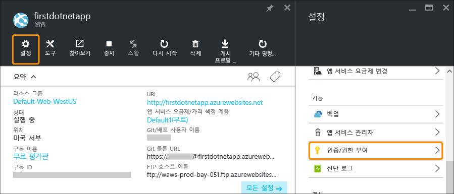
2. **켜기** 를 클릭하여 인증을 켭니다.  
3. **인증 공급자**에서** Azure Active Directory**를 클릭합니다.  
    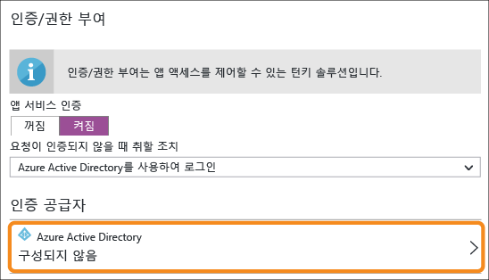
4. **Azure Active Directory 설정** 블레이드에서 **Express**를 클릭한 다음 **확인**을 클릭합니다. 기본 설정에 따라 기본 디렉터리에 새 Azure AD 응용 프로그램이 생성됩니다.  
    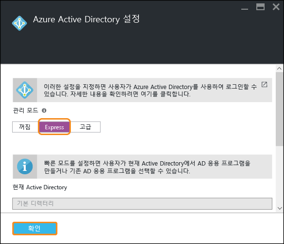
5. **저장**을 클릭합니다.  
    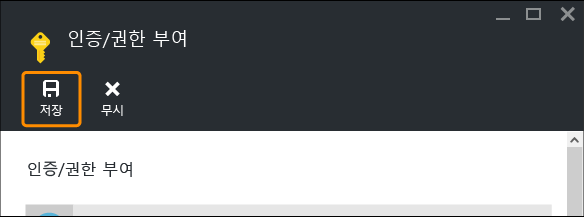
   
    성공적으로 변경되면 친숙한 메시지와 함께 알림 벨이 녹색으로 바뀝니다.
6. 앱의 포털 블레이드로 돌아가서 **URL** 링크(또는 메뉴 모음의 **찾아보기**)를 클릭합니다. 링크는 HTTP 주소입니다.  
      
    하지만 새 탭에서 앱을 열면 일단 URL 상자가 여러 차례 리디렉션되고 HTTPS 주소가 있는 앱에서 완료됩니다. Azure 구독에 이미 로그인되어 있고, 앱에 자동으로 인증되어 있는 것을 볼 수 있습니다.  
    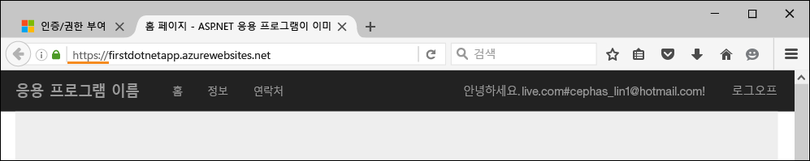  
    따라서 이제 다른 브라우저에서 인증되지 않은 세션을 열면 동일한 URL로 이동하는 경우 로그인 화면을 볼 수 있습니다.  
    <!-- 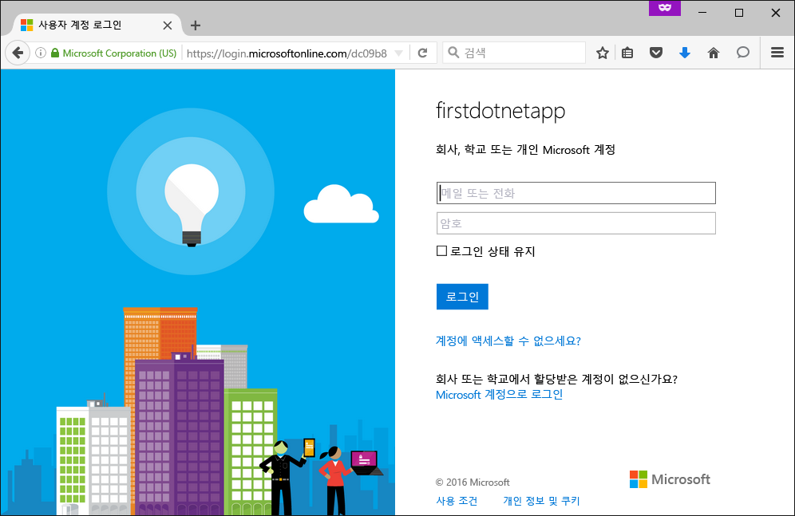  -->
    Azure Active Directory를 사용하여 작업을 완료하지 못한 경우 기본 디렉터리에는 Azure AD 사용자가 없을 수 있습니다. 이 경우 아마도 여기에 있는 유일한 계정은 Azure 구독의 Microsoft 계정입니다. 따라서 이전에 동일한 버전에서 앱에 자동으로 로그인된 것입니다.
   이 로그인 페이지에서도 해당 Microsoft 계정을 사용하여 로그인할 수 있습니다.

축하합니다. 웹앱으로 들어오는 모든 트래픽을 인증하도록 설정되었습니다.

**인증/권한 부여** 블레이드에서 보셨듯이, 다음을 포함하여 더 많은 일을 할 수 있습니다.

* 소셜 로그인 활성화
* 여러 로그인 옵션 활성화
* 사람들이 처음으로 앱을 탐색할 때 수행되는 기본 동작 변경

앱 서비스는 일부 일반적인 인증에 필요한 턴키 솔루션을 제공하므로 관리자가 인증 논리를 직접 제공할 필요가 없습니다.
자세한 내용은 참조 [앱 서비스 인증/권한 부여](https://azure.microsoft.com/blog/announcing-app-service-authentication-authorization/)를 참조하세요.

## 필요에 따라 자동으로 앱 크기 조정
다음으로 앱이 사용자 요청에 맞게 용량을 자동으로 조정하도록 앱 크기를 자동으로 조정합니다([Azure에서 앱 크기 확장](web-sites-scale.md) 및 [수동 또는 자동으로 인스턴스 개수 조정](../monitoring-and-diagnostics/insights-how-to-scale.md)에서 추가 정보 참조).

간단히 말하면 다음과 같은 두 가지 방법으로 웹앱의 크기를 조정할 수 있습니다.

* [강화](https://en.wikipedia.org/wiki/Scalability#Horizontal_and_vertical_scaling): 더 많은 CPU, 메모리, 디스크 공간 및 추가 기능(전용 VM, 사용자 지정 도메인 및 인증서, 스테이징 슬롯, 자동 크기 조정 등)을 사용할 수 있습니다. 앱이 속한 App Service 계획의 가격 책정 계층을 변경하여 확장합니다.
* [확장](https://en.wikipedia.org/wiki/Scalability#Horizontal_and_vertical_scaling): 앱을 실행하는 VM 인스턴스 번호가 증가합니다.
  가격 책정 계층에 따라 최대 50개의 인스턴스로 확장할 수 있습니다.

각설하고, 자동 크기 조정을 설정해 보겠습니다.

1. 먼저, 자동 크기 조정을 사용할 수 있도록 앱을 강화하겠습니다. 앱의 포털 블레이드에서 **설정** > **강화(App Service 계획)**을 클릭합니다.  
    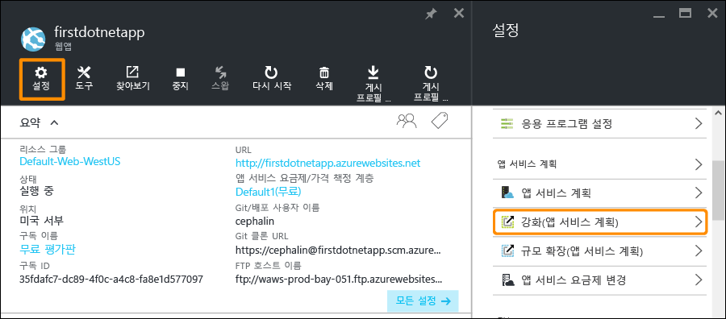
2. 스크롤하여 자동 크기 조정을 지원하는 가장 낮은 계층인 **S1 표준** 계층(스크린샷에 원으로 표시)을 선택한 다음 **선택**을 클릭합니다.  
    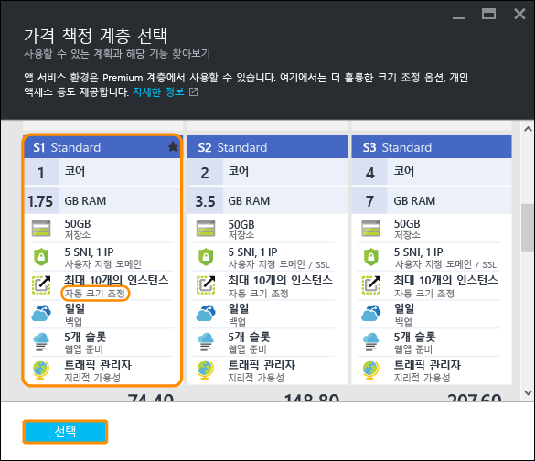
   
    강화가 완료되었습니다.
   
   > [!IMPORTANT]
   > 이 계층은 무료 평가판 크레딧을 소비합니다. 종량 요금제 계정이 있는 경우 계정에 요금이 부과됩니다.
   > 
   > 
3. 다음으로, 자동 크기 조정을 구성해 보겠습니다. 앱의 포털 블레이드에서 **설정** > **규모 확장(App Service 계획)**을 클릭합니다.  
    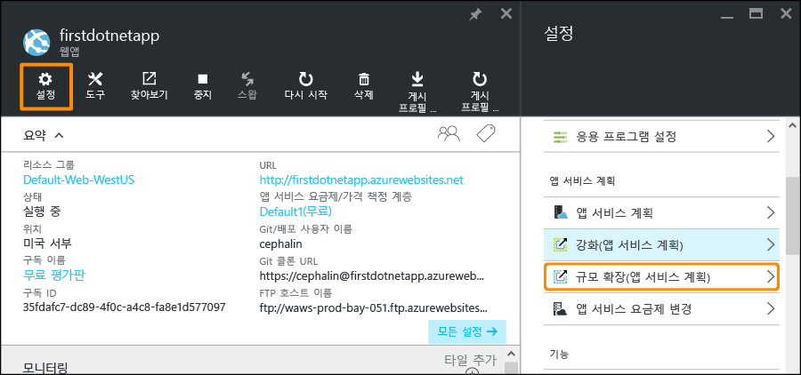
4. **크기 조정 기준**을 **CPU 비율**로 변경합니다. 드롭다운 아래의 슬라이더가 비율에 따라 업데이트됩니다. 그런 다음 **인스턴스** 범위를 **1** ~ **2**로, **대상 범위**를 **40** ~ **80**으로 정의합니다. 상자에 입력하거나 슬라이더를 이동하여 작업을 수행합니다.  
    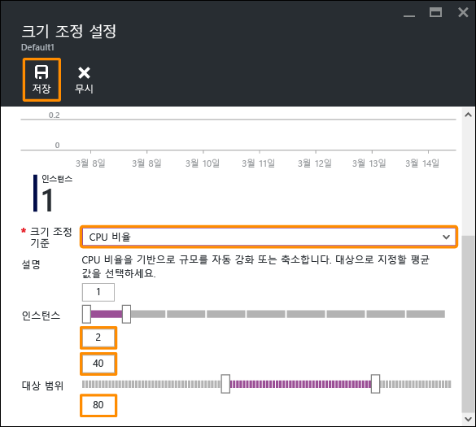
   
    이 구성에 따라 CPU 사용률이 80%를 초과하면 자동으로 규모 확장되고 CPU 사용률이 40% 미만으로 떨어지면 자동으로 규모 축소됩니다.
5. 메뉴 모음에서 **저장** 을 클릭합니다.

축하합니다. 앱 자동 크기 조정이 설정되었습니다.

**크기 조정 설정** 블레이드에서 보았듯이, 다음을 포함하여 더 많은 일을 할 수 있습니다.

* 인스턴스 수를 특정 개수로 수동 조정
* 메모리 비율 또는 디스크 큐와 같은 기타 성능 메트릭에 따라 크기 조정
* 성능 규칙이 트리거되면 크기 조정 동작을 사용자 지정
* 일정에 따라 자동 크기 조정
* 향후 이벤트에 대해 자동 크기 조정 동작 설정

앱 강화에 대한 자세한 내용은 [Azure에서 앱 크기 확장](web-sites-scale.md)을 참조하세요. 규모 확장에 대한 자세한 내용은 [수동 또는 자동으로 인스턴스 개수 조정](../monitoring-and-diagnostics/insights-how-to-scale.md)을 참조하세요.

## 앱에 대한 경고 받기
이제 앱이 자동 크기 조정되며 앱이 최대 인스턴스 수(2)에 도달하고 CPU가 원하는 사용률(80%)을 초과하면 어떻게 될까요?
예를 들어 이러한 상황이 발생하면 앱을 추가로 강화/확장하도록 이러한 상황을 알리는 경고( [경고 알림 받기](../monitoring-and-diagnostics/insights-receive-alert-notifications.md)에 추가 정보)를 설정할 수 있습니다. 이 시나리오에 대한 경고를 간단하게 설정해 보겠습니다.

1. 앱의 포털 블레이드에서 **도구** > **경고**에 샘플 웹앱을 배포합니다.  
    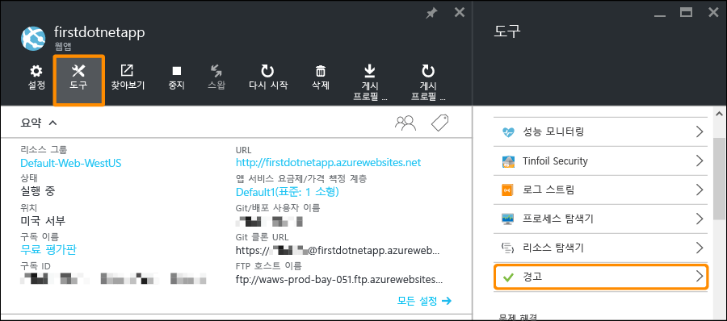
2. **경고 추가**를 클릭합니다. 그런 다음 **리소스** 상자에서 **(serverfarm)**으로 끝나는 리소스를 선택합니다. 그 리소스가 앱 서비스 계획입니다.  
    
3. **이름**을 `CPU Maxed`로, **메트릭**을 **CPU 비율**로, **임계값**을 `90`으로 지정한 다음 **전자 메일 소유자, 참여자 및 독자**를 선택하고 **확인**을 클릭합니다.   
    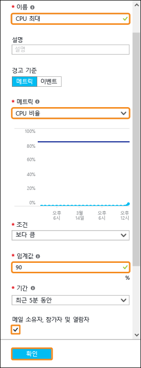
   
    Azure가 경고 만들기를 완료하면 **경고** 블레이드에 해당 경고가 보일 것입니다.  
    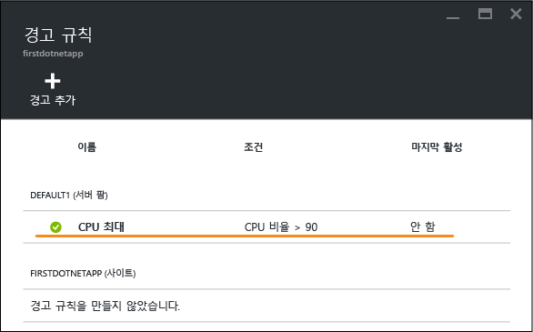

축하합니다. 이제 경고가 생겼습니다.

이 경고 설정은&5;분마다 CPU 사용률을 확인합니다. 사용률이 90%를 초과하면 권한이 있는 사용자와 함께 전자 메일 경고를 받게 됩니다. 경고를 받을 권한이 있는 모든 사용자를 보려면 앱의 포털 블레이드로 돌아가서 **액세스** 단추를 클릭합니다.  
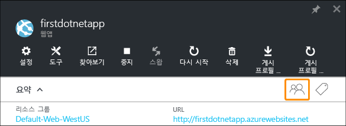

**구독 관리자**는 이미 앱의 **소유자**임을 확인할 수 있습니다. Azure 구독(예: 평가판 구독)의 계정 관리자인 경우도 이 그룹에 포함됩니다. Azure 역할 기반 액세스 제어에 대한 자세한 내용은 [Azure 역할 기반 액세스 제어](../active-directory/role-based-access-control-configure.md)를 참조하세요.

> [!NOTE]
> 경고 규칙은 Azure 기능입니다. 자세한 내용은 [경고 알림 받기](../monitoring-and-diagnostics/insights-receive-alert-notifications.md)를 참조하세요.
> 
> 

## 다음 단계
경고를 구성하는 과정에서 **도구** 블레이드에 다양한 도구 집합이 있는 것을 확인할 수 있습니다. 여기에서 문제를 해결하고 성능을 모니터링하며 취약점을 테스트하고 리소스를 관리하며 VM 콘솔과 상호 작용하고 유용한 확장을 추가할 수 있습니다. 이러한 도구를 클릭하여 간편하게 사용할 수 있는 간단하면서도 강력한 도구에 대해 알아보세요.

배포한 앱으로 더 많은 작업을 수행하는 방법에 대해 알아보세요. 다음은 일부 목록입니다.

* [사용자 지정 도메인 이름 구입 및 구성](custom-dns-web-site-buydomains-web-app.md) - *.azurewebsites.net 도메인 대신 웹앱에 대한 매력적인 도메인을 구입합니다. 또는 이미 있는 도메인을 사용합니다.
* [스테이징 환경 설정](web-sites-staged-publishing.md) - 앱을 프로덕션으로 전환하기 전에 스테이징 URL에 배포합니다. 안심하고 라이브 웹앱을 업데이트합니다. 다중 배포 슬롯으로 정교한 DevOps 솔루션을 설정합니다.
* [연속 배포 설정](app-service-continuous-deployment.md) - 원본 제어 시스템에 앱 배포를 통합합니다. 모든 커밋을 사용하여 Azure에 배포합니다.
* [온-프레미스 리소스에 액세스](web-sites-hybrid-connection-get-started.md) - 기존 온-프레미스 데이터베이스 또는 CRM 시스템에 액세스합니다.
* [앱 백업](web-sites-backup.md) - 백업을 설정하고 웹앱에 복원합니다. 예기치 않은 오류에 준비하고 해당 오류에서 복구합니다.
* [진단 로그 사용](web-sites-enable-diagnostic-log.md) - Azure 또는 응용 프로그램 추적에서 IIS 로그를 읽습니다. 스트림에서 읽고 다운로드하거나 턴키 분석을 위해 [Application Insights](../application-insights/app-insights-overview.md) 로 가져옵니다.
* [취약성에 대한 앱 스캔](https://azure.microsoft.com/blog/web-vulnerability-scanning-for-azure-app-service-powered-by-tinfoil-security/) -
  [Tinfoil Security](https://www.tinfoilsecurity.com/)에서 제공하는 서비스를 사용하여 최신 위협에 대해 웹앱을 스캔합니다.
* [백그라운드 작업 실행](../azure-functions/functions-overview.md) - 데이터 처리, 보고 등의 작업을 실행합니다.
* [앱 서비스 작동 방법 알아보기](../app-service/app-service-how-works-readme.md)

<!--HONumber=Feb17_HO3-->

