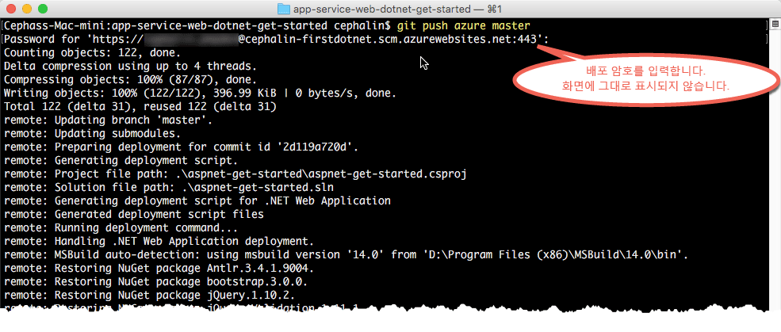

# 5분 내에 Azure에 첫 번째 .NET 웹앱 배포
이 자습서를 통해 [Azure App Service](../app-service/app-service-value-prop-what-is.md)에 간단한 .NET 웹앱을 배포합니다.
App Service를 사용하여 웹앱, [모바일 앱 백 엔드](/documentation/learning-paths/appservice-mobileapps/) 및 [API 앱](../app-service-api/app-service-api-apps-why-best-platform.md)을 만들 수 있습니다.

다음을 수행합니다. 

* Azure App Service에서 웹앱을 만듭니다.
* 샘플 ASP.NET 코드를 배포합니다.
* 프로덕션 환경에서 라이브로 코드 실행을 참조하세요.
* [Git 커밋을 푸시](https://git-scm.com/docs/git-push)하는 것과 똑같은 방식으로 웹앱을 업데이트합니다.

## 필수 조건
* [Git](http://www.git-scm.com/downloads)
* [Azure CLI](../xplat-cli-install.md).
* Microsoft Azure 계정. 계정이 없는 경우 [무료 평가판을 등록](https://azure.microsoft.com/pricing/free-trial/?WT.mc_id=A261C142F)하거나 [Visual Studio 구독자 혜택을 활성화](https://azure.microsoft.com/pricing/member-offers/msdn-benefits-details/?WT.mc_id=A261C142F)할 수 있습니다.

> [!NOTE]
> Azure 계정 없이 [App Service를 체험](http://go.microsoft.com/fwlink/?LinkId=523751)할 수 있습니다. 시작 앱을 만들고 최대 한 시간 동안 해당 앱을 사용하여 재생합니다. -- 신용 카드는 필요하지 않으며 약정도 필요하지 않습니다.
> 
> 

## .NET 웹앱 배포
1. 새 Windows 명령 프롬프트, PowerShell 창, Linux 셸 또는 OS X 터미널을 엽니다. `git --version` 및 `azure --version`를 실행하여 Git 및 Azure CLI가 컴퓨터에 설치되어 있는지 확인합니다.
   
    
   
    도구를 설치하지 않은 경우 다운로드 링크는 [필수 구성 요소](#Prerequisites) 를 참조하세요.
2. 다음과 같이 Azure에 로그인합니다.
   
        azure login
   
    로그인 프로세스를 계속하려면 도움말 메시지를 따릅니다.
   
    
3. Azure CLI를 ASM 모드로 변경한 다음 App Service에 대한 배포 사용자를 설정합니다. 나중에 자격 증명을 사용하여 코드를 배포합니다.
   
        azure config mode asm
        azure site deployment user set --username <username> --pass <password>
4. 작업 디렉터리(`CD`)를 변경하고 샘플 앱을 복제합니다.
   
        git clone https://github.com/Azure-Samples/app-service-web-dotnet-get-started.git
5. 샘플 앱의 리포지토리로 변경합니다. 
   
        cd app-service-web-dotnet-get-started
6. 고유한 앱 이름 및 이전에 구성한 배포 사용자를 가지고 Azure에 App Service 응용 프로그램 리소스를 만듭니다. 대화 상자가 나타나면 원하는 지역의 수를 지정합니다.
   
        azure site create <app_name> --git --gitusername <username>
   
    
   
    이제 Azure에서 앱이 생성되었습니다. 또한, 현재 디렉터리가 Git 초기화되어 새로운 앱 서비스 앱에 Git 원격으로 연결됩니다.
    앱 URL(http://&lt;app_name>.azurewebsites.net)을 검색하면 기본 HTML 페이지를 볼 수 있지만 지금은 이 URL에서 사용자 고유의 코드를 가져옵니다.
7. Git로 코드를 푸시하듯이 새 Azure 앱에 샘플 코드를 배포합니다. 메시지가 표시되면 이전에 구성한 암호를 사용합니다.
   
        git push azure master
   
    
   
    `git push` 은(는) Azure에 코드를 배치할 뿐만 아니라 필요한 패키지를 복원하며 ASP.NET 이진 파일을 작성합니다. 

축하합니다. Azure 앱 서비스에 앱을 배포하셨습니다.

## 실시간으로 실행 중인 앱 확인
Azure에서 라이브로 실행 중인 앱을 보려면 리포지토리의 디렉터리에서 이 명령을 실행합니다.

    azure site browse

## 앱 업데이트
이제 언제든지 Git를 사용하여 프로젝트(리포지토리) 루트에서 푸시하여 라이브 사이트를 업데이트할 수 있습니다. 사용자의 코드를 처음으로 배포했을 때와 같은 방식으로 수행합니다. 예를 들어 로컬에서 테스트한 새로운 변경 내용을 푸시하고 싶을 때마다 프로젝트(리포지토리) 루트에서 다음 명령을 실행하기만 하면 됩니다.

    git add .
    git commit -m "<your_message>"
    git push azure master

## 다음 단계
[Visual Studio를 사용하여 Azure App Service에 ASP.NET 웹앱 배포](web-sites-dotnet-get-started.md)에서, Visual Studio에서 .NET 웹앱을 만들고 개발하여 Azure에 직접 배포하는 방법에 대해 알아보세요.

또는 첫 번째 웹앱으로 더 많은 작업을 수행합니다. 예:

* [사용자의 코드를 Azure에 배포하는 다른 방법](web-sites-deploy.md)을 시도해 보세요. 예를 들어 GitHub 리포지토리 중 하나에서 배포하려면 **배포 옵션**에서 **로컬 Git 리포지토리** 대신에 **GitHub**를 선택합니다.
* 다음 수준으로 Azure 앱을 이동합니다. 사용자를 인증합니다. 요구에 따라 규모를 조정합니다. 몇 가지 성능 경고를 설정합니다. 이 모든 작업이 클릭 몇 번으로 가능합니다. [첫 번째 웹앱에 기능 추가](app-service-web-get-started-2.md)를 참조하세요.

<!--HONumber=Dec16_HO1-->

