# <a name="create-your-first-aspnet-web-app-in-azure-in-five-minutes"></a>5분 내에 Azure에서 첫 번째 ASP.NET 웹앱 만들기

[!INCLUDE [app-service-web-selector-get-started](../../includes/app-service-web-selector-get-started.md)] 

이 빠른 시작을 사용하면 몇 분 만에 [Azure App Service](../app-service/app-service-value-prop-what-is.md)에 첫 번째 ASP.NET 웹앱을 배포할 수 있습니다. 완료하면 클라우드에서 간단한 웹앱을 실행할 수 있습니다.

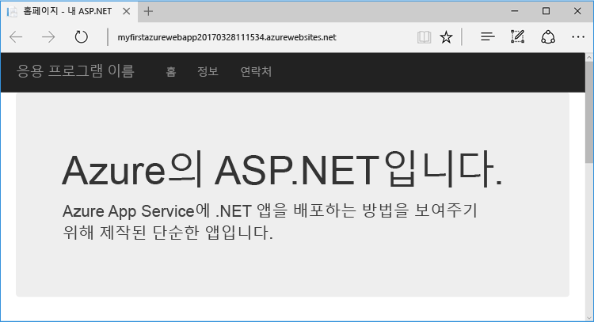

## <a name="prerequisites"></a>필수 조건

이 자습서에서는 Visual Studio 2017을 사용하여 ASP.NET 웹앱을 빌드하고 Azure에 배포하는 방법을 보여 줍니다. Visual Studio 2017이 아직 설치되지 않은 경우 **체험판** [Visual Studio 2017 Community Edition](https://www.visualstudio.com/downloads/)을 다운로드하고 사용할 수 있습니다. Visual Studio를 설정하는 동안 **Azure 개발**을 사용할 수 있는지 확인합니다.

[!INCLUDE [quickstarts-free-trial-note](../../includes/quickstarts-free-trial-note.md)]

## <a name="create-an-aspnet-web-app"></a>ASP.NET 웹앱 만들기

Visual Studio에서 `Ctrl`+`Shift`+`N`를 사용하여 프로젝트를 만듭니다.

**새 프로젝트** 대화 상자에서 **Visual C# > 웹 > ASP.NET 웹 응용 프로그램(.NET Framework)**을 클릭합니다.

응용 프로그램 이름을 **myFirstAzureWebApp**으로 지정한 다음 **확인**을 클릭합니다.
   
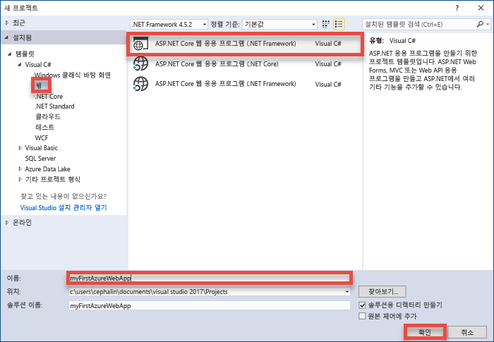

모든 종류의 ASP.NET 웹앱을 Azure에 배포할 수 있습니다. 이 자습서의 경우 **MVC** 템플릿을 선택하고 인증이 **인증 없음**으로 설정되어 있는지 확인합니다.
      
**확인**을 클릭합니다.

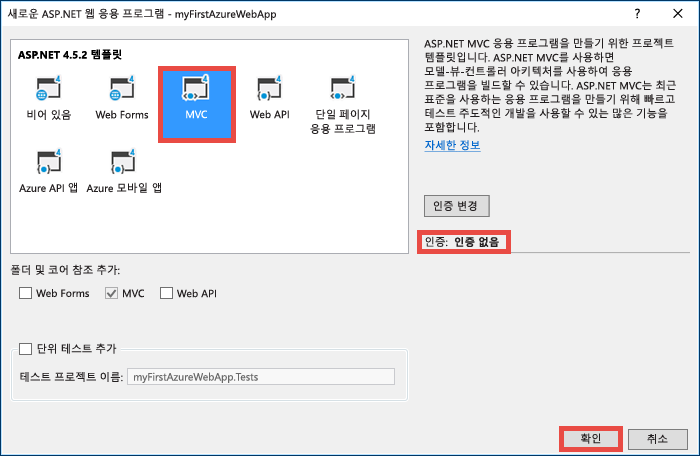

## <a name="publish-to-azure"></a>Azure에 게시

**솔루션 탐색기**에서 **myFirstAzureWebApp** 프로젝트를 마우스 오른쪽 단추로 클릭하고 **게시**를 선택합니다.

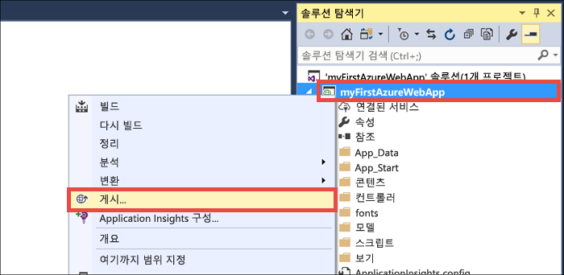

**Microsoft Azure App Service**를 선택했는지 확인하고 **게시**를 클릭합니다.

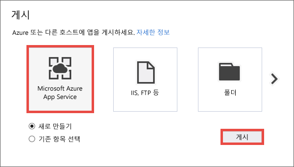

그러면 **App Service 만들기** 대화 상자가 열리고 Azure에서 ASP.NET 웹앱을 실행하는 데 필요한 모든 Azure 리소스를 만들 수 있습니다.

## <a name="sign-in-to-azure"></a>Azure에 로그인

**App Service 만들기** 대화 상자에서 **계정 추가**를 클릭한 다음 Azure 구독에 로그인합니다. 이미 Microsoft 계정에 로그인한 경우 계정에 Azure 구독이 있는지 확인합니다. 로그인된 Microsoft 계정에 Azure 구독이 없는 경우 클릭하여 올바른 계정을 추가합니다.
   
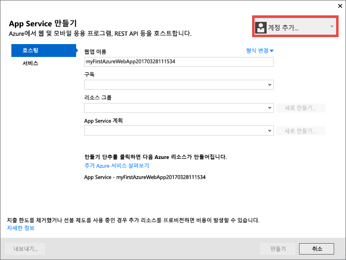

일단 로그인되면 이 대화 상자에서 Azure 웹앱에 필요한 모든 리소스를 만들 준비가 되었습니다.

## <a name="create-a-resource-group"></a>리소스 그룹 만들기

먼저, _리소스 그룹_이 필요합니다. 

> [!NOTE] 
> 리소스 그룹은 웹앱, 데이터베이스, 저장소 계정과 같은 Azure 리소스가 배포되고 관리되는 논리적 컨테이너입니다.
>
>

**리소스 그룹** 옆에 있는 **새로 만들기**를 클릭합니다.

리소스 그룹의 이름을 **myResourceGroup**으로 지정하고 **확인**을 클릭합니다.

## <a name="create-an-app-service-plan"></a>App Service 계획 만들기

Azure 웹앱에도 _App Service 계획_이 필요합니다. 

> [!NOTE]
> App Service 계획은 앱을 호스트하는 데 사용되는 실제 리소스의 컬렉션을 나타냅니다. App Service 계획에 할당된 모든 앱은 정의된 리소스를 공유하므로 여러 앱을 호스팅할 때 비용을 절감할 수 있습니다. 
>
> App Service 계획은 다음을 정의합니다.
>
> - 지역(북유럽, 미국 동부, 동남 아시아)
> - 인스턴스 크기(소, 중, 대)
> - 확장 개수(1, 2, 3개 인스턴스 등) 
> - SKU(무료, 공유, 기본, 표준, 프리미엄)
>
>

**App Service 계획** 옆에 있는 **새로 만들기**를 클릭합니다. 

**App Service 계획 구성** 대화 상자에서 다음 설정을 사용하여 새 App Service 계획을 구성합니다.

- **App Service 계획**: **myAppServicePlan**을 입력합니다. 
- **위치**: **유럽 서부** 또는 원하는 다른 지역을 선택합니다.
- **크기**: **체험판** 또는 원하는 기타 [가격 책정 계층](https://azure.microsoft.com/pricing/details/app-service/)을 선택합니다.

**확인**을 클릭합니다.

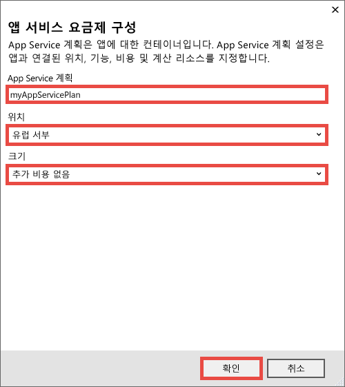

## <a name="create-and-publish-the-web-app"></a>웹앱 만들기 및 게시

이제 수행할 남은 작업은 웹앱 이름을 지정하는 것입니다. **웹앱 이름**에서 고유한 앱 이름을 입력합니다. 이 이름은 사용자의 앱(`<app_name>.azurewebsites.net`)에 대한 기본 DNS 이름의 일부로 사용됩니다. Azure에서 모든 응용 프로그램에서 고유해야 합니다. 나중에 사용자에게 노출하기 전에 앱에 사용자 지정 도메인 이름을 매핑할 수 있습니다.

또한 자동으로 생성된 이름을 적용할 수 있습니다. 이 이름은 고유합니다.

**만들기**를 클릭하여 Azure 리소스 만들기를 시작합니다.

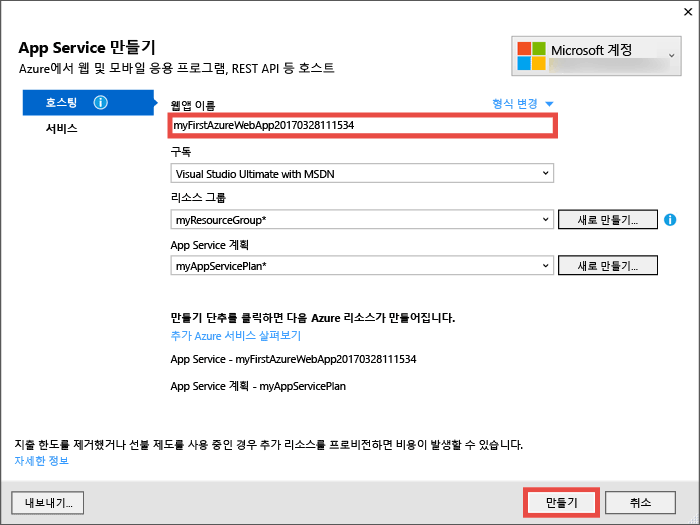

마법사가 Azure 리소스 만들기를 완료하면 처음으로 Azure에 ASP.NET 웹앱을 자동으로 게시하고 기본 브라우저에서 게시된 Azure 웹앱을 시작합니다.

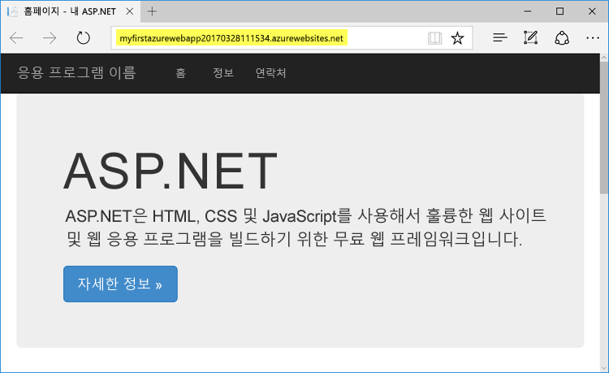

URL은 `http://<app_name>.azurewebsites.net` 형식으로 이전에 지정한 웹앱 이름을 사용합니다. 

축하합니다. 첫 번째 ASP.NET 웹앱이 Azure App Service에서 실시간으로 실행 중입니다.

## <a name="update-the-app-and-redeploy"></a>앱 업데이트 및 다시 배포

매우 간편하게 업데이트하고 Azure에 다시 배포할 수 있습니다. 홈페이지에 대한 업데이트를 만들어 보겠습니다.

**솔루션 탐색기**에서 **Views\Home\Index.cshtml**을 엽니다.

위쪽 가까이에 `<div class="jumbotron">` HTML 태그를 찾아서 전체 태그를 다음 코드로 바꿉니다.

```HTML
<div class="jumbotron">
    <h1>ASP.NET in Azure!</h1>
    <p class="lead">This is a simple app that we’ve built that demonstrates how to deploy a .NET app to Azure App Service.</p>
</div>
```

Azure에 다시 배포하려면 **솔루션 탐색기**에서 **myFirstAzureWebApp** 프로젝트를 마우스 오른쪽 단추로 클릭하고 **게시**를 선택합니다.

게시 페이지에서 **게시**를 클릭합니다.

Visual Studio가 완료되면 브라우저에서 업데이트된 Azure 웹앱을 시작합니다.


## <a name="manage-your-new-azure-web-app"></a>새로운 Azure 웹앱 관리

Azure Portal로 이동하여 방금 만든 웹앱을 살펴봅니다. 

이 작업을 수행하려면 [https://portal.azure.com](https://portal.azure.com)에 로그인합니다.

왼쪽 메뉴에서 **App Services**를 클릭한 다음 Azure 웹앱의 이름을 클릭합니다.

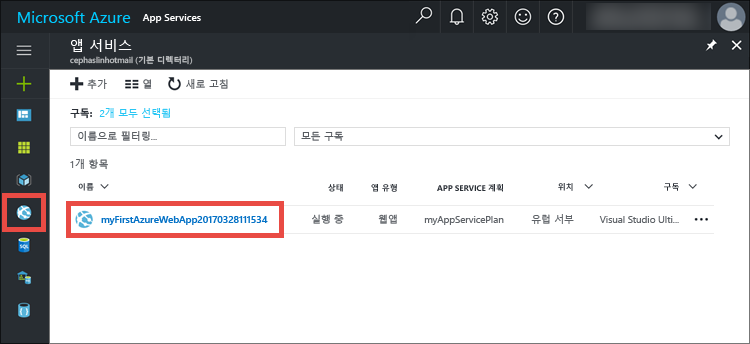

웹앱의 _블레이드_(가로로 열리는 포털 페이지)로 이동했습니다. 

기본적으로 웹앱의 블레이드는 **개요** 페이지를 표시합니다. 이 페이지에서는 앱이 어떻게 작동하고 있는지를 보여 줍니다. 여기에서 찾아보기, 중지, 시작, 다시 시작, 삭제와 같은 기본 관리 작업을 수행할 수 있습니다.  

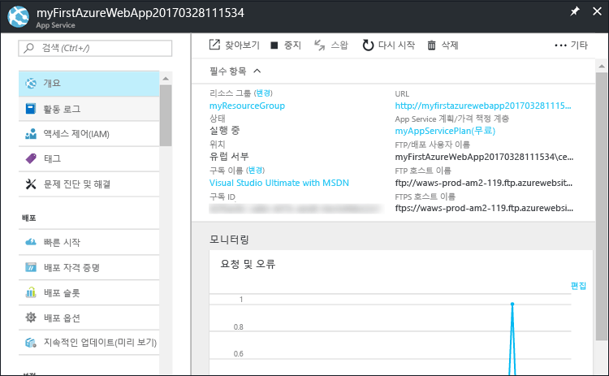

블레이드의 왼쪽에 있는 탭에서는 열 수 있는 다른 구성 페이지를 보여 줍니다. 다음은 몇 가지 가능성을 제공합니다.

- 사용자 지정 DNS 이름 매핑
- 사용자 지정 SSL 인증서 바인딩
- 지속적 배포 구성
- 수평 및 수직 확장
- 사용자 인증 추가

## <a name="clean-up-resources"></a>리소스 정리

첫 번째 Azure 웹앱을 삭제하려면 **개요** 페이지에서 **삭제**를 클릭하면 됩니다. 그러나 이 빠른 시작에서 만든 모든 항목을 삭제하는 더 나은 방법이 있습니다. 웹앱의 **개요** 페이지에서 리소스 그룹을 클릭하여 블레이드를 엽니다. 


리소스 그룹 블레이드에서 Visual Studio에서 만든 App Service 계획 및 App Service 앱을 모두 볼 수 있습니다. 

블레이드 맨 위에서 **삭제**를 클릭합니다. 

<!---->

확인 블레이드에서 리소스 그룹 이름인 **myResourceGroup**을 텍스트 상자에 입력하고 **삭제**를 클릭합니다.

## <a name="next-steps"></a>다음 단계

> [!div class="nextstepaction"]
> [Azure에서 SQL Database를 사용하여 ASP.NET 앱을 빌드하는 방법에 대한 자세한 정보](app-service-web-tutorial-dotnet-sqldatabase.md)

> [!div class="nextstepaction"]
> [샘플 Web Apps PowerShell 스크립트 탐색](app-service-powershell-samples.md)

