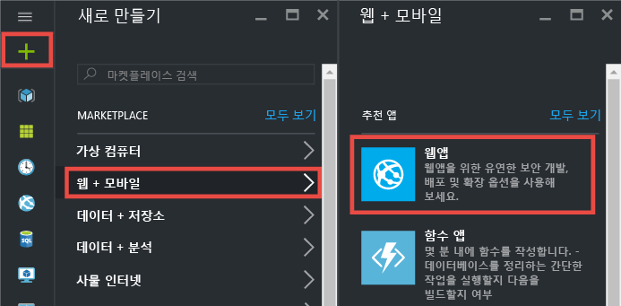
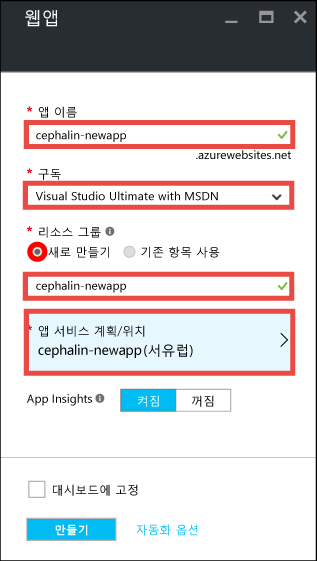
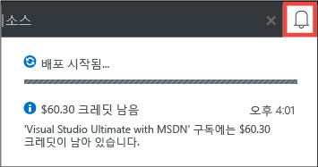
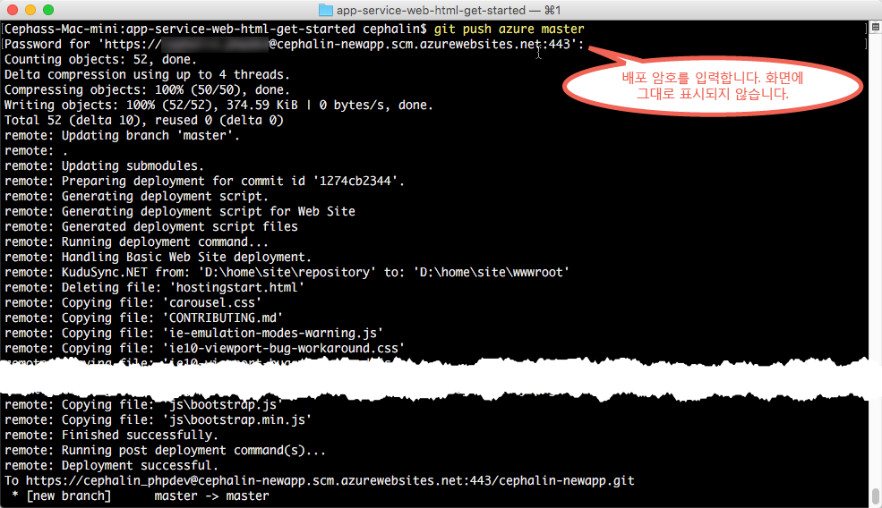

<properties 
	pageTitle="5분 내에 Azure에 첫 번째 웹앱 배포 | Microsoft Azure" 
	description="샘플 앱을 배포하여 App Service에서 웹앱을 실행하는 작업이 얼마나 쉬운지 알아봅니다. 실제 개발을 신속하게 수행하기 시작하고 즉시 결과를 봅니다." 
	services="app-service\web"
	documentationCenter=""
	authors="cephalin"
	manager="wpickett"
	editor=""
/>

<tags
	ms.service="app-service-web"
	ms.workload="web"
	ms.tgt_pltfrm="na"
	ms.devlang="na"
	ms.topic="hero-article"
	ms.date="09/16/2016" 
	ms.author="cephalin"
/>
	
# 5분 내에 Azure에 첫 번째 웹앱 배포

이 자습서를 통해 [Azure App Service](../app-service/app-service-value-prop-what-is.md)에 간단한 HTML+CSS 웹앱을 배포합니다. App Service를 사용하여 웹앱, [모바일 앱 백 엔드](/documentation/learning-paths/appservice-mobileapps/) 및 [API Apps](../app-service-api/app-service-api-apps-why-best-platform.md)를 만들 수 있습니다.

다음을 수행합니다.

- Azure App Service에서 웹앱을 만듭니다.
- HTML 및 CSS를 여기에 배포합니다.
- 프로덕션 환경에서 라이브로 페이지 실행을 참조하세요.
- [Git 커밋을 푸시](https://git-scm.com/docs/git-push)하는 것과 동일한 방식으로 콘텐츠를 업데이트합니다.

## 필수 조건

- [Git를 설치](http://www.git-scm.com/downloads)합니다. 새 Windows 명령 프롬프트, PowerShell 창, Linux 셸 또는 OS X 터미널에서 `git --version`를 실행하여 성공적으로 설치되었는지 확인합니다.
- Microsoft Azure 계정을 가져옵니다. 계정이 없는 경우 [무료 평가판을 등록](/pricing/free-trial/?WT.mc_id=A261C142F)하거나 [Visual Studio 구독자 혜택을 활성화](/pricing/member-offers/msdn-benefits-details/?WT.mc_id=A261C142F)할 수 있습니다.

>[AZURE.NOTE] Azure 계정 없이 [App Service](http://go.microsoft.com/fwlink/?LinkId=523751)를 시도할 수 있습니다. 시작 앱을 만들고 최대 한 시간 동안 해당 앱을 사용하여 재생합니다. -- 신용 카드는 필요하지 않으며 약정도 필요하지 않습니다.

## 웹앱 만들기

1. Azure 계정을 사용하여 [Azure Portal](https://portal.azure.com)에 로그인합니다.

2. 왼쪽 메뉴에서 **새로 만들기** > **웹 + 모바일** > **웹앱**을 클릭합니다.

    

3. 앱 만들기 블레이드에서 새 앱에 대해 다음 설정을 사용합니다.

    - **앱 이름**: 고유 이름을 입력합니다.
    - **리소스 그룹**: **새로 만들기**를 클릭하고 리소스 그룹에 이름을 지정합니다.
    - **앱 서비스 계획/위치**: 클릭하여 구성한 다음 **새로 만들기**를 클릭하여 앱 서비스 계획의 이름, 위치 및 가격 책정 계층을 설정합니다. **무료** 가격 책정 계층을 자유롭게 사용합니다.

    완료되면 앱 만들기 블레이드는 다음과 같이 표시됩니다.

    

3. 맨 아래에 있는 **만들기**를 클릭합니다. 맨 위에 있는 **알림** 아이콘을 클릭하면 진행률을 확인할 수 있습니다.

    

4. 배포가 완료되면 이 알림 메시지를 확인해야 합니다. 메시지를 클릭하여 배포의 블레이드를 엽니다.

    

5. **배포 성공** 블레이드에서 **리소스** 링크를 클릭하여 새 웹앱의 블레이드를 엽니다.

    

## 사용자의 웹앱에 콘텐츠 배포

이제 Git를 사용하여 일부 콘텐츠를 Azure에 배포해 보겠습니다.

5. 웹앱 블레이드에서 **배포 옵션**까지 아래로 스크롤하거나 해당 옵션을 검색한 다음 클릭합니다.

    

6. **원본 선택** > **로컬 Git 리포지토리** > **확인**을 클릭합니다.

7. 웹앱 블레이드로 돌아가 **배포 자격 증명**을 클릭합니다.

8. 배포 자격 증명을 설정하고 **저장**을 클릭합니다.

7. 웹앱 블레이드로 돌아가 **속성**까지 아래로 스크롤하거나 해당 옵션을 검색한 다음 클릭합니다. **Git URL** 옆의 **복사** 단추를 클릭합니다.

    

    이제 Git를 사용하여 콘텐츠를 배포할 준비가 되었습니다.

1. 명령줄 터미널에서 작업 디렉터리(`CD`)로 변경하고 샘플 앱을 다음과 같이 복제합니다.

        git clone https://github.com/Azure-Samples/app-service-web-html-get-started.git

    

2. 샘플 앱의 리포지토리로 변경합니다. 예를 들면 다음과 같습니다.

        cd app-service-web-html-get-started

3. Git를 몇 단계 전에 포털에서 복사한 Azure 앱의 Git URL에 대해 원격이 되도록 구성합니다.

        git remote add azure <giturlfromportal>

4. Git로 코드를 푸시하듯이 새 Azure 앱에 샘플 코드를 배포합니다.

        git push azure master

    

이것으로 끝입니다. 사용자의 코드는 이제 Azure에서 라이브로 실행 중입니다. 브라우저에서 http://*&lt;appname>*.azurewebsites.net으로 이동하여 동작 중인 코드를 확인합니다.

## 앱 업데이트

이제 언제든지 Git를 사용하여 프로젝트(리포지토리) 루트에서 푸시하여 라이브 사이트를 업데이트할 수 있습니다. 사용자의 콘텐츠를 처음으로 배포했을 때와 같은 방식으로 수행합니다. 예를 들어 로컬에서 테스트한 새로운 변경 내용을 푸시하고 싶을 때마다 프로젝트(리포지토리) 루트에서 다음 명령을 실행하기만 하면 됩니다.

    git add .
    git commit -m "<your_message>"
    git push azure master

## 다음 단계

언어 프레임워크에 대한 기본 개발 및 배포 단계를 찾습니다.

> [AZURE.SELECTOR]
- [.NET](web-sites-dotnet-get-started.md)
- [PHP](app-service-web-php-get-started.md)
- [Node.js](app-service-web-nodejs-get-started.md)
- [Python](web-sites-python-ptvs-django-mysql.md)
- [Java](web-sites-java-get-started.md)

또는 첫 번째 웹앱으로 더 많은 작업을 수행합니다. 예:

- [사용자의 코드를 Azure에 배포하는 다른 방법](../app-service-web/web-sites-deploy.md)을 시도해 보세요. 예를 들어 GitHub 리포지토리 중 하나에서 배포하려면 **배포 옵션**에서 **로컬 Git 리포지토리** 대신에 **GitHub**를 선택합니다.
- 다음 수준으로 Azure 앱을 이동합니다. 사용자를 인증합니다. 요구에 따라 규모를 조정합니다. 몇 가지 성능 경고를 설정합니다. 이 모든 작업이 클릭 몇 번으로 가능합니다. [첫 번째 웹앱에 기능 추가](app-service-web-get-started-2.md)를 참조하세요.

<!-----HONumber=AcomDC_0920_2016-->