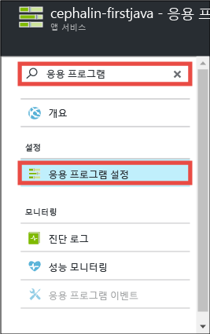
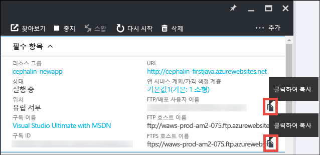
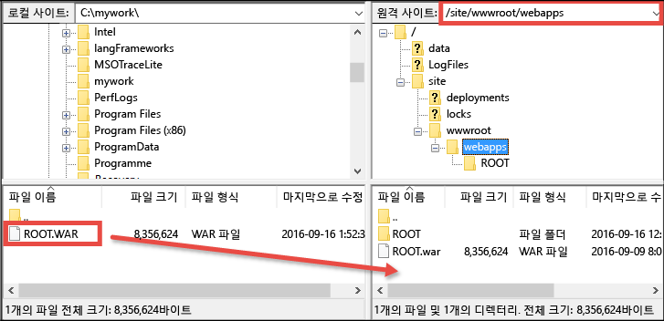

<properties 
	pageTitle="5분 내에 Azure에 첫 번째 Java 웹앱 배포 | Microsoft Azure" 
	description="샘플 앱을 배포하여 App Service에서 웹앱을 실행하는 작업이 얼마나 쉬운지 알아봅니다. 실제 개발을 신속하게 수행하기 시작하고 즉시 결과를 봅니다." 
	services="app-service\web"
	documentationCenter=""
	authors="cephalin"
	manager="wpickett"
	editor=""
/>

<tags
	ms.service="app-service-web"
	ms.workload="web"
	ms.tgt_pltfrm="na"
	ms.devlang="na"
	ms.topic="hero-article"
	ms.date="09/16/2016" 
	ms.author="cephalin"
/>
	
# 5분 내에 Azure에 첫 번째 Java 웹앱 배포

이 자습서를 통해 [Azure App Service](../app-service/app-service-value-prop-what-is.md)에 간단한 Java 웹앱을 배포합니다. App Service를 사용하여 웹앱, [모바일 앱 백 엔드](/documentation/learning-paths/appservice-mobileapps/) 및 [API Apps](../app-service-api/app-service-api-apps-why-best-platform.md)를 만들 수 있습니다.

다음을 수행합니다.

- Azure App Service에서 웹앱을 만듭니다.
- 샘플 Java 앱을 배포합니다.
- 프로덕션 환경에서 라이브로 코드 실행을 참조하세요.

## 필수 조건

- [FileZilla](https://filezilla-project.org/) 등의 FTP/FTPS 클라이언트를 가져옵니다.
- Microsoft Azure 계정을 가져옵니다. 계정이 없는 경우 [무료 평가판을 등록](/pricing/free-trial/?WT.mc_id=A261C142F)하거나 [Visual Studio 구독자 혜택을 활성화](/pricing/member-offers/msdn-benefits-details/?WT.mc_id=A261C142F)할 수 있습니다.

>[AZURE.NOTE] Azure 계정 없이 [App Service](http://go.microsoft.com/fwlink/?LinkId=523751)를 시도할 수 있습니다. 시작 앱을 만들고 최대 한 시간 동안 해당 앱을 사용하여 재생합니다. -- 신용 카드는 필요하지 않으며 약정도 필요하지 않습니다.

## 웹앱 만들기

1. Azure 계정을 사용하여 [Azure Portal](https://portal.azure.com)에 로그인합니다.

2. 왼쪽 메뉴에서 **새로 만들기** > **웹 + 모바일** > **웹앱**을 클릭합니다.

    

3. 앱 만들기 블레이드에서 새 앱에 대해 다음 설정을 사용합니다.

    - **앱 이름**: 고유 이름을 입력합니다.
    - **리소스 그룹**: **새로 만들기**를 클릭하고 리소스 그룹에 이름을 지정합니다.
    - **앱 서비스 계획/위치**: 클릭하여 구성한 다음 **새로 만들기**를 클릭하여 앱 서비스 계획의 이름, 위치 및 가격 책정 계층을 설정합니다. **무료** 가격 책정 계층을 자유롭게 사용합니다.

    완료되면 앱 만들기 블레이드는 다음과 같이 표시됩니다.

    

3. 맨 아래에 있는 **만들기**를 클릭합니다. 맨 위에 있는 **알림** 아이콘을 클릭하면 진행률을 확인할 수 있습니다.

    

4. 배포가 완료되면 이 알림 메시지를 확인해야 합니다. 메시지를 클릭하여 배포의 블레이드를 엽니다.

    

5. **배포 성공** 블레이드에서 **리소스** 링크를 클릭하여 새 웹앱의 블레이드를 엽니다.

    

## 웹앱에 Java 앱 배포

이제 FTPS를 사용하여 Azure에 Java 앱을 배포해보겠습니다.

5. 웹앱 블레이드에서 **응용 프로그램 설정**까지 아래로 스크롤하거나 해당 옵션을 검색한 다음 클릭합니다.

    

6. **Java 버전**에서 **Java 8**을 선택하고 **저장**을 클릭합니다.

    

    **웹앱 설정을 업데이트 했습니다** 알림을 가져올 때, http://*&lt;appname> *. azurewebsites.net로 이동하여 작업에서 기본 JSP 서블릿을 봅니다.

7. 웹앱 블레이드로 돌아가 **배포 자격 증명**까지 아래로 스크롤하거나 해당 옵션을 검색한 다음 클릭합니다.

8. 배포 자격 증명을 설정하고 **저장**을 클릭합니다.

7. 웹앱 블레이드로 돌아가 **개요**를 클릭합니다. **FTP/Deployment username** 및 **FTPS 호스트 이름** 옆에 있는 **복사** 단추를 클릭하여 이들 값을 복사합니다.

    

    이제 FTPS를 사용하여 Java 앱을 배포할 준비가 되었습니다.

8. FTP/FTPS 클라이언트에서 마지막 단계에서 복사한 값을 사용하여 Azure 웹앱의 FTP 서버에 로그인합니다. 앞에서 만든 배포 암호를 사용합니다.

    다음 스크린샷은 FileZilla를 사용한 로그인을 보여줍니다.

    

    Azure로부터 인식되지 않은 SSL 인증서에 대한 보안 경고를 볼 수 있습니다. 계속 진행합니다.

9. [이 링크](https://github.com/Azure-Samples/app-service-web-java-get-started/raw/master/webapps/ROOT.war)를 클릭하여 WAR 파일을 로컬 컴퓨터에 다운로드합니다.

9. FTP/FTPS 클라이언트에서, 원격 사이트에 있는 **/site/wwwroot/webapps**로 이동하여 로컬 컴퓨터에 다운로드한 WAR 파일을 해당 원격 디렉터리로 끕니다.

    

    **확인**을 클릭하여 Azure의 파일을 재정의합니다.

    >[AZURE.NOTE] Tomcat의 기본 동작에 따라 /site/wwwroot/webapps의 파일 이름 **ROOT.war**는 루트 웹앱(http://*&lt;appname>*.azurewebsites.net)을, 파일 이름 ***&lt;anyname>*.war**는 명명된 웹앱(http://*&lt;appname>*.azurewebsites.net/*&lt;anyname>*)을 제공합니다.

이것으로 끝입니다. 사용자의 Java 앱은 이제 Azure에서 라이브로 실행됩니다. 브라우저에서 http://*&lt;appname>*.azurewebsites.net으로 이동하여 동작 중인 코드를 확인합니다.

## 앱 업데이트

업데이트해야 할 때마다 FTP/FTPS 클라이언트와 같은 원격 디렉터리에 새 WAR 파일을 업로드합니다.

## 다음 단계

[Azure Marketplace에서 템플릿을 통해 Java 웹앱을 만듭니다](app-service-web-java-get-started.md#marketplace). 사용자 지정할 수 있는 Tomcat 컨테이너와 친숙한 Manager UI를 가져올 수 있습니다.

[IntelliJ](app-service-web-debug-java-web-app-in-intellij.md) 또는 [Eclipse](app-service-web-debug-java-web-app-in-eclipse.md)에서 Azure 웹앱을 직접 디버그합니다.

또는 첫 번째 웹앱으로 더 많은 작업을 수행합니다. 예:

- [사용자의 코드를 Azure에 배포하는 다른 방법](../app-service-web/web-sites-deploy.md)을 시도해 보세요. 예를 들어 GitHub 리포지토리 중 하나에서 배포하려면 **배포 옵션**에서 **로컬 Git 리포지토리** 대신에 **GitHub**를 선택합니다.
- 다음 수준으로 Azure 앱을 이동합니다. 사용자를 인증합니다. 요구에 따라 규모를 조정합니다. 몇 가지 성능 경고를 설정합니다. 이 모든 작업이 클릭 몇 번으로 가능합니다. [첫 번째 웹앱에 기능 추가](app-service-web-get-started-2.md)를 참조하세요.

<!-----HONumber=AcomDC_0920_2016-->