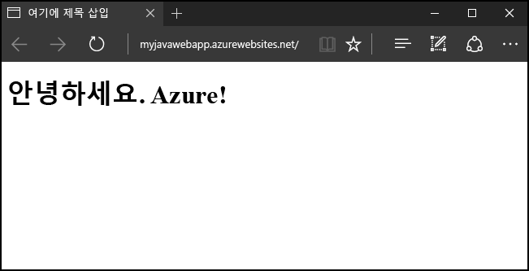
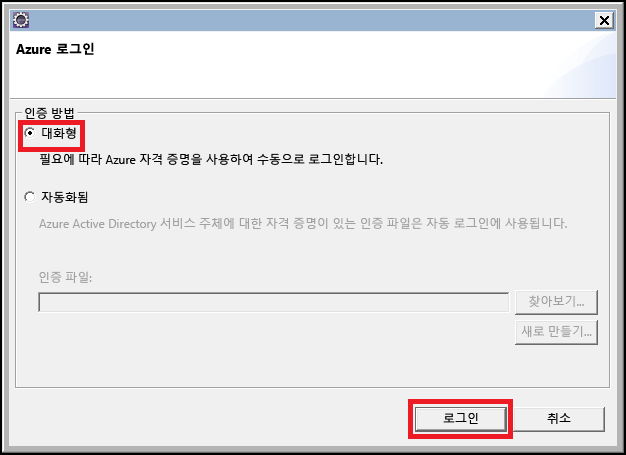
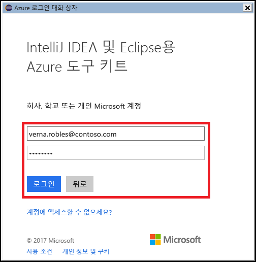
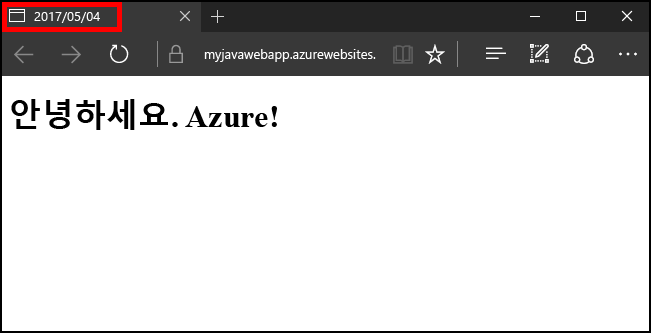

# <a name="create-your-first-java-web-app-in-azure-in-five-minutes"></a>5분 내에 Azure에서 첫 번째 Java 웹앱 만들기

[!INCLUDE [app-service-web-selector-get-started](../../includes/app-service-web-selector-get-started.md)] 

이 빠른 시작을 사용하면 몇 분 만에 [Azure App Service](../app-service/app-service-value-prop-what-is.md)에 첫 번째 Java 웹앱을 배포할 수 있습니다. 이 자습서를 완료하면 클라우드에서 간단한 Java 기반 웹앱을 실행할 수 있습니다.



## <a name="before-you-begin"></a>시작하기 전에

이 자습서에서는 Eclipse IDE for Java EE Developers를 사용하여 Java 웹앱을 빌드하고 Azure에 배포하는 방법을 보여 줍니다. 아직 Eclipse를 설치하지 않은 경우 http://www.eclipse.org/에서 무료로 다운로드할 수 있습니다.

Azure에 Java 웹앱을 게시하는 과정을 간소화하기 위해 이 자습서의 단계에서는 [Eclipse용 Azure 도구 키트](/azure/azure-toolkit-for-eclipse)를 사용하겠습니다. 이 도구 키트를 설치하는 방법에 대한 지침은 [Eclipse용 Azure 도구 키트 설치](/azure/azure-toolkit-for-eclipse-installation)를 참조하세요.

> [!NOTE]
>
> JetBrains에서 [IntelliJ IDEA](https://www.jetbrains.com/idea/)를 사용하여 이 자습서의 단계를 완료할 수도 있습니다. 해당 IDE를 게시하는 과정을 간소화할 수 있는 [IntelliJ용 Azure 도구 키트](/azure/azure-toolkit-for-intellij)가 있기는 하지만, 개발 환경의 일부 단계가 약간 다를 수도 있습니다.
>

또한 이 자습서를 단계를 완료하려면 Azure 구독이 필요합니다. Azure 구독이 아직 없는 경우 [MSDN 구독자 혜택](https://azure.microsoft.com/pricing/member-offers/msdn-benefits-details/)을 활성화하거나 [무료 Azure 계정](https://azure.microsoft.com/pricing/free-trial/)에 등록할 수 있습니다.

## <a name="create-a-dynamic-web-project-in-eclipse"></a>Eclipse에서 동적 웹 프로젝트 만들기

Eclipse IDE에서 **파일**, **새로 만들기**, **동적 웹 프로젝트**를 차례로 클릭합니다.


동적 웹 프로젝트 대화 상자가 나타나면 응용 프로그램 이름을 **MyFirstJavaOnAzureWebApp**으로 지정한 다음 **마침**을 클릭합니다.
   


> [!NOTE]
>
> [Apache Tomcat](https://tomcat.apache.org/) 같은 로컬 런타임 환경을 설치한 경우 **대상 런타임** 필드에서 지정할 수 있습니다.
>

동적 웹 프로젝트를 만든 후에는 프로젝트 탐색기에서 프로젝트를 확장하고, **WebContent** 폴더를 마우스 오른쪽 단추로 클릭하고, **새로 만들기**를 클릭한 다음 **JSP 파일**을 클릭하여 새 JSP 페이지를 추가합니다.


새 JSP 파일 대화 상자가 나타나면 파일 이름을 **index.jsp**로 지정하고, 부모 폴더를 **MyFirstJavaOnAzureWebApp/WebContent**로 유지한 후 **다음**을 클릭합니다.


새 JSP 파일 대화 상자의 두 번째 페이지가 나타나면 파일 이름을 **index.jsp**로 지정하고, 부모 폴더를 **MyFirstJavaOnAzureWebApp/WebContent**로 유지한 후 **마침**을 클릭합니다.


Eclipse에서 새 페이지가 열리면 기존의 `<body></body>` 섹션을 다음 코드로 바꿉니다.

```jsp
<body>
<h1><% out.println("Java on Azure!"); %></h1>
</body>
```

페이지 변경 내용을 저장합니다.


## <a name="publish-your-web-app-to-azure"></a>웹앱을 Azure에 게시

Eclipse용 Azure 도구 키트에서 제공하는 몇 가지 기능을 활용하여 웹앱을 Azure에 배포할 수 있습니다.

게시 프로세스를 시작하려면 다음 방법 중 하나를 사용합니다.

* Eclipse **프로젝트 탐색기**에서 프로젝트를 마우스 오른쪽 단추로 클릭하고, **Azure**를 클릭한 다음 **Azure 웹앱으로 게시**를 클릭합니다.

   

* Eclipse 도구 모음에서 **게시**를 클릭한 다음 **Azure 웹앱으로 게시**를 클릭합니다.

   

아직 Azure 계정에 로그인하지 않은 경우 로그인하라는 메시지가 표시됩니다. 이렇게 하려면 다음 단계를 수행합니다.

1. Azure 계정에 로그인하는 두 가지 방법이 있는데, 이 자습서에서는 **대화형**을 선택하겠습니다.

   

1. Azure 자격 증명을 입력한 다음 **로그인**을 클릭합니다.

   

1. Azure 구독을 선택한 다음 **선택**을 클릭합니다.

   

> [!NOTE]
>
> **대화형** 및 **자동** 로그인에 대한 구체적인 지침은 [Eclipse용 Azure 도구 키트에 대한 Azure 로그인 지침](https://go.microsoft.com/fwlink/?linkid=846174) 문서를 참조하세요.
>

Azure 계정에 로그인하면 **웹앱 배포** 대화 상자가 표시됩니다. Azure에 웹앱을 처음으로 게시하는 경우 App Services가 나열되지 않습니다. 이 경우 또는 새 App Service를 만들려는 경우 그 다음으로 할 일은 새 App Service를 만드는 것입니다. 이렇게 하려면 **만들기**를 클릭합니다.


**App Service 만들기** 대화 상자가 표시되면 다음과 같은 초기 데이터를 입력해야 합니다.

* 웹앱의 DNS 주소가 될 고유한 웹앱 이름. 예를 들어 **MyJavaWebApp**은 *myjavawebapp.azurewebsites.net*이 됩니다.

* 웹앱이 사용할 웹 컨테이너(예: **최신 Tomcat 8.5**).

* Azure 구독.

   

기존 App Service 계획이 없거나 새 서비스 계획을 만들려는 경우 다음 정보를 입력해야 합니다.

* 새 서비스 계획의 고유한 이름. 이 이름은 나중에 Azure 도구 키트를 사용하여 웹앱을 게시할 때 표시되며, 계정을 관리할 때 [Azure Portal](https://portal.azure.com)에 표시됩니다.

* 서비스 계획을 만들 지리적 위치.

* 서비스 계획의 가격 책정 계층.

   

다음으로 **리소스 그룹** 탭을 클릭합니다. 기존 리소스 그룹이 없는 경우 또는 새 리소스 그룹을 만들려는 경우에는 새 리소스 그룹의 고유 이름을 입력하고, 그렇지 않으면 드롭다운 메뉴에서 기존 리소스 그룹을 선택합니다.


마지막으로 **JDK** 탭을 클릭합니다. 개발자가 타사 또는 사용자 지정 JDK(Java Developer Kit)를 지정할 수 있는 여러 옵션이 표시되지만, 이 자습서에는 **기본**를 선택하고 **만들기**를 클릭합니다.


Azure 도구 키트가 새 앱 서비스를 만들기 시작하고 작업을 처리하는 동안 진행률 대화 상자를 표시합니다.


새 앱 서비스를 만든 후, 마지막으로 웹앱을 새 웹 사이트의 루트에 배포할지 여부를 선택해야 합니다. 예를 들어 앱 서비스가 *wingtiptoys.azurewebsites.net*에 있는데 이 루트에 배포하지 않으면 **MyFirstJavaOnAzureWebApp** 웹앱이 *wingtiptoys.azurewebsites.net/MyFirstJavaOnAzureWebApp*에 배포됩니다.


이전 단계를 모두 완료한 후 **배포**를 클릭하여 Azure에 웹앱을 게시합니다.


축하합니다. Azure에 웹앱을 배포했습니다! 이제 Azure 웹 사이트에서 웹앱을 미리 볼 수 있습니다.


## <a name="updating-your-web-app"></a>웹앱 업데이트

Azure에 웹앱을 게시했으니, 웹앱을 업데이트하는 과정이 훨씬 간편해졌으며 다음 단계에 따라 웹앱 변경 내용을 게시할 수 있습니다.

먼저 제목이 오늘 날짜로 바뀌도록 이전 섹션의 샘플 JSP 코드를 변경합니다.

```jsp
<%@ page
    language="java"
    contentType="text/html; charset=ISO-8859-1"
    pageEncoding="ISO-8859-1"
    import="java.text.SimpleDateFormat"
    import="java.util.Date" %>
<!DOCTYPE html PUBLIC "-//W3C//DTD HTML 4.01 Transitional//EN" "http://www.w3.org/TR/html4/loose.dtd">
<html>
<head>
<meta http-equiv="Content-Type" content="text/html; charset=ISO-8859-1">
<% SimpleDateFormat date = new SimpleDateFormat("yyyy/MM/dd"); %>
<title><% out.println(date.format(new Date())); %></title>
</head>
<body>
<h1><% out.println("Java on Azure!"); %></h1>
</body>
</html>
```


페이지 변경 내용을 저장한 후 Eclipse **프로젝트 탐색기**에서 프로젝트를 마우스 오른쪽 단추로 클릭하고, **Azure**를 클릭한 다음 **Azure 웹앱으로 게시**를 클릭합니다.


**웹앱 배포** 대화 상자가 표시되면 이전 섹션의 앱 서비스가 나열됩니다. 웹앱을 업데이트하려면 앱 서비스를 강조 표시하고 **배포**를 클릭하여 변경 내용을 게시하면 됩니다.


> [!NOTE]
>
> 앱 서비스의 루트에 웹앱을 배포하는 경우 변경 내용을 게시할 때마다 **루트에 배포**를 다시 선택해야 합니다.
>

변경 내용을 게시한 후에는 브라우저에서 페이지 제목이 오늘 날짜로 변경된 것을 확인할 수 있습니다.



## <a name="deleting-your-web-app"></a>웹앱 삭제

웹앱을 삭제하려면 Azure 도구 키트에 포함된 **Azure 탐색기**를 사용합니다. **Azure 탐색기** 보기가 Eclipse에 표시되지 않으면 다음 단계에 따라 표시할 수 있습니다.

1. **창**을 클릭하고, **보기 표시**를 클릭한 다음 **기타**를 클릭합니다.

   

2. **보기 표시** 대화 상자가 나타나면 **Azure 탐색기**를 선택하고 **확인**을 클릭합니다.

   

Azure 탐색기에서 웹앱을 삭제하려면 **Web Apps** 노드를 확장한 다음 웹앱을 마우스 오른쪽 단추로 클릭하고 **삭제**를 선택합니다.


웹앱을 삭제할 것인지 묻는 메시지가 나타나면 **확인**을 클릭합니다.

## <a name="next-steps"></a>다음 단계

Java IDE용 Azure 도구 키트에 대한 자세한 내용은 다음 링크를 참조하세요.

* [Eclipse용 Azure 도구 키트(이 문서)](../azure-toolkit-for-eclipse.md)
  * [Eclipse용 Azure 도구 키트의 새로운 기능](../azure-toolkit-for-eclipse-whats-new.md)
  * [Eclipse용 Azure 도구 키트 설치](../azure-toolkit-for-eclipse-installation.md)
  * [Eclipse용 Azure 도구 키트에 대한 로그인 지침](https://go.microsoft.com/fwlink/?linkid=846174)
* [IntelliJ용 Azure 도구 키트](../azure-toolkit-for-intellij.md)
  * [IntelliJ용 Azure 도구 키트의 새로운 기능](../azure-toolkit-for-intellij-whats-new.md)
  * [IntelliJ용 Azure 도구 키트 설치](../azure-toolkit-for-intellij-installation.md)
  * [IntelliJ용 Azure 도구 키트에 대한 로그인 지침](https://go.microsoft.com/fwlink/?linkid=846179)

Java와 함께 Azure를 사용하는 방법에 대한 자세한 내용은 [Azure Java 개발자 센터](https://azure.microsoft.com/develop/java/) 및 [Visual Studio Team Services용 Java 도구](https://java.visualstudio.com/)를 참조하세요.

