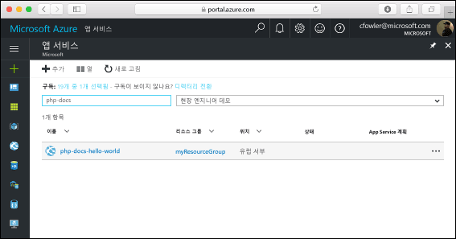

# <a name="create-a-php-application-on-web-app"></a>Web App에서 PHP 응용 프로그램 만들기

이 빠른 시작 자습서에서는 PHP 앱을 개발하고 Azure에 배포하는 방법을 설명합니다. [Azure App Service 계획](https://docs.microsoft.com/azure/app-service/azure-web-sites-web-hosting-plans-in-depth-overview)을 사용하여 앱을 실행하고, Azure CLI를 사용하여 새 웹앱을 만들고 구성합니다. 그런 다음 Git를 사용하여 PHP 앱을 Azure에 배포합니다.


Mac, Windows 또는 Linux 컴퓨터를 사용하여 아래 단계를 따르면 됩니다. 다음 단계를 모두 완료하려면 약 5분이 소요됩니다.

## <a name="prerequisites"></a>필수 조건

이 샘플을 만들기 전에 다음을 다운로드하여 설치합니다.

* [Git](https://git-scm.com/)
* [PHP](https://php.net)
* [Azure CLI 2.0](https://docs.microsoft.com/cli/azure/install-azure-cli)

[!INCLUDE [quickstarts-free-trial-note](../../includes/quickstarts-free-trial-note.md)]

## <a name="download-the-sample"></a>샘플 다운로드

로컬 컴퓨터에 Hello World 샘플 앱 리포지토리를 복제합니다.

```bash
git clone https://github.com/Azure-Samples/php-docs-hello-world
```

샘플 코드를 포함하는 디렉터리로 변경합니다.

```bash
cd php-docs-hello-world
```

## <a name="run-the-app-locally"></a>로컬에서 앱 실행

PHP 웹 서버에서 기본 제공을 시작하려면 이 샘플의 `php` 명령줄을 사용하는 터미널 창을 열어서 응용 프로그램을 로컬로 실행합니다.

```bash
php -S localhost:8080
```

웹 브라우저를 열고 샘플로 이동합니다.

```bash
http://localhost:8080
```

이 페이지에 표시된 샘플 앱에서 **Hello World** 메시지를 볼 수 있습니다.


터미널 창에서 **Ctrl+C**를 눌러 웹 서버를 종료합니다.

## <a name="log-in-to-azure"></a>Azure에 로그인

이제 터미널 창에서 Azure CLI 2.0을 사용하여 Azure에서 PHP 앱을 호스팅하는 데 필요한 리소스를 만들 예정입니다. [az login](/cli/azure/#login) 명령으로 Azure 구독에 로그인하고 화면의 지시를 따릅니다.

```azurecli
az login
```

<!-- ## Configure a Deployment User -->
[!INCLUDE [login-to-azure](../../includes/configure-deployment-user.md)]

## <a name="create-a-resource-group"></a>리소스 그룹 만들기

[az group create](/cli/azure/group#create)를 사용하여 리소스 그룹을 만듭니다. Azure 리소스 그룹은 웹앱, 데이터베이스, 저장소 계정이 관리되었는지 등 Azure 리소스가 배포 및 관리되는 논리적 컨테이너입니다.

```azurecli
az group create --name myResourceGroup --location westeurope
```

## <a name="create-an-azure-app-service-plan"></a>Azure App Service 계획 만들기

[az appservice plan create](/cli/azure/appservice/plan#create) 명령을 사용하여 "체험" [App Service 계획](../app-service/azure-web-sites-web-hosting-plans-in-depth-overview.md)을 만듭니다.

<!--
 An App Service plan represents the collection of physical resources used to ..
-->
[!INCLUDE [app-service-plan](../../includes/app-service-plan.md)]

다음 예에서는 **체험** 가격 책정 계층을 사용하여 `quickStartPlan`이라는 App Service 계획을 만듭니다.

```azurecli
az appservice plan create --name quickStartPlan --resource-group myResourceGroup --sku FREE
```

App Service 계획을 만든 경우 Azure CLI는 다음 예제와 비슷한 정보를 표시합니다.

```json
{
    "id": "/subscriptions/00000000-0000-0000-0000-000000000000/resourceGroups/myResourceGroup/providers/Microsoft.Web/serverfarms/quickStartPlan",
    "location": "West Europe",
    "sku": {
    "capacity": 1,
    "family": "S",
    "name": "S1",
    "tier": "Standard"
    },
    "status": "Ready",
    "type": "Microsoft.Web/serverfarms"
}
```

## <a name="create-a-web-app"></a>웹앱 만들기

이제 App Service 계획을 만들었으므로 `quickStartPlan` App Service 계획 내에서 [웹앱](https://docs.microsoft.com/azure/app-service-web/app-service-web-overview)을 만듭니다. 웹앱은 코드를 배포할 호스팅 공간을 제공할 뿐만 아니라 배포된 응용 프로그램을 확인하도록 URL도 제공합니다. [az appservice web create](/cli/azure/appservice/web#create) 명령을 사용하여 Web App을 만듭니다.

아래 명령에서 `<app_name>` 자리 표시자를 고유한 앱 이름으로 바꿉니다. `<app_name>`은 웹 앱의 기본 DNS 사이트에 사용됩니다. `<app_name>`이 고유하지 않으면 "지정된 이름이 <app_name>인 웹 사이트가 이미 있습니다."라는 오류 메시지가 표시됩니다.

<!-- removed per https://github.com/Microsoft/azure-docs-pr/issues/11878
You can later map any custom DNS entry to the web app before you expose it to your users.
-->

```azurecli
az appservice web create --name <app_name> --resource-group myResourceGroup --plan quickStartPlan
```

Web App을 만든 경우 Azure CLI는 다음 예제와 비슷한 정보를 표시합니다.

```json
{
    "clientAffinityEnabled": true,
    "defaultHostName": "<app_name>.azurewebsites.net",
    "id": "/subscriptions/00000000-0000-0000-0000-000000000000/resourceGroups/myResourceGroup/providers/Microsoft.Web/sites/<app_name>",
    "isDefaultContainer": null,
    "kind": "app",
    "location": "West Europe",
    "name": "<app_name>",
    "repositorySiteName": "<app_name>",
    "reserved": true,
    "resourceGroup": "myResourceGroup",
    "serverFarmId": "/subscriptions/00000000-0000-0000-0000-000000000000/resourceGroups/myResourceGroup/providers/Microsoft.Web/serverfarms/quickStartPlan",
    "state": "Running",
    "type": "Microsoft.Web/sites",
}
```

사이트로 이동하여 새로 만든 Web App을 봅니다.

```bash
http://<app_name>.azurewebsites.net
```


이제 Azure에서 비어 있는 새 Web App을 만들었습니다.

## <a name="configure-local-git-deployment"></a>로컬 Git 배포 구성

FTP, 로컬 Git뿐만 아니라 GitHub, Visual Studio Team Services 및 Bitbucket을 비롯한 다양한 방법으로 웹앱에 배포할 수 있습니다.

[az appservice web source-control config-local-git](/cli/azure/appservice/web/source-control#config-local-git) 명령을 사용하여 Web App에 대한 로컬 Git 액세스 권한을 구성합니다.

```azurecli
az appservice web source-control config-local-git --name <app_name> --resource-group myResourceGroup --query url --output tsv
```

다음 단계에서 사용할 수 있는 터미널의 출력을 복사합니다.

```bash
https://<username>@<app_name>.scm.azurewebsites.net:443/<app_name>.git
```

## <a name="push-to-azure-from-git"></a>Git에서 Azure에 푸시

로컬 Git 리포지토리에 Azure 원격을 추가합니다.

```bash
git remote add azure <paste-previous-command-output-here>
```

Azure 원격에 푸시하여 앱을 배포합니다. 앞서 배포 사용자를 만들 때 입력한 암호를 묻는 메시지가 나타납니다. Azure Portal에 로그인할 때 사용하는 암호가 아닌, [배포 사용자 구성](#configure-a-deployment-user)에서 만든 암호를 입력해야 합니다.

```bash
git push azure master
```

배포하는 동안 Azure App Service는 Git에서 진행률을 조율합니다.

```bash
Counting objects: 2, done.
Delta compression using up to 4 threads.
Compressing objects: 100% (2/2), done.
Writing objects: 100% (2/2), 352 bytes | 0 bytes/s, done.
Total 2 (delta 1), reused 0 (delta 0)
remote: Updating branch 'master'.
remote: Updating submodules.
remote: Preparing deployment for commit id '25f18051e9'.
remote: Generating deployment script.
remote: Running deployment command...
remote: Handling Basic Web Site deployment.
remote: Kudu sync from: '/home/site/repository' to: '/home/site/wwwroot'
remote: Copying file: '.gitignore'
remote: Copying file: 'LICENSE'
remote: Copying file: 'README.md'
remote: Copying file: 'index.php'
remote: Ignoring: .git
remote: Finished successfully.
remote: Running post deployment command(s)...
remote: Deployment successful.
To https://<app_name>.scm.azurewebsites.net/<app_name>.git
   cc39b1e..25f1805  master -> master
```

## <a name="browse-to-the-app"></a>앱으로 이동

웹 브라우저를 사용하여 배포된 응용 프로그램으로 이동합니다.

```bash
http://<app_name>.azurewebsites.net
```

이번에는 Azure App Service 웹앱으로 실행되는 PHP 코드를 사용하여 Hello World 메시지를 표시하는 페이지가 실행되고 있습니다.


## <a name="updating-and-deploying-the-code"></a>코드 업데이트 및 배포

로컬 텍스트 편집기를 사용하여 PHP 앱 내에서 `index.php` 파일을 열고 `echo` 옆에 있는 문자열 내의 텍스트를 약간 변경합니다.

```php
echo "Hello Azure!";
```

Git에서 변경 내용을 커밋한 다음 Azure에 코드 변경 내용을 푸시합니다.

```bash
git commit -am "updated output"
git push azure master
```

배포가 완료되면 **앱으로 이동** 단계에서 열린 브라우저 창으로 다시 전환하고 새로 고침을 누릅니다.


## <a name="manage-your-new-azure-web-app"></a>새로운 Azure 웹앱 관리

Azure Portal로 이동하여 방금 만든 웹앱을 살펴봅니다.

이 작업을 수행하려면 [https://portal.azure.com](https://portal.azure.com)에 로그인합니다.

왼쪽 메뉴에서 **App Services**를 클릭한 다음 Azure 웹앱의 이름을 클릭합니다.



웹앱의 _블레이드_(가로로 열리는 포털 페이지)로 이동했습니다.

기본적으로 웹앱의 블레이드는 **개요** 페이지를 표시합니다. 이 페이지에서는 앱이 어떻게 작동하고 있는지를 보여 줍니다. 여기에서 찾아보기, 중지, 시작, 다시 시작, 삭제와 같은 기본 관리 작업을 수행할 수 있습니다. 블레이드의 왼쪽에 있는 탭에서는 열 수 있는 다른 구성 페이지를 보여 줍니다.


블레이드의 이러한 탭은 웹앱에 추가할 수 있는 유용한 많은 기능을 보여 줍니다. 다음은 몇 가지 가능성을 제공합니다.

* 사용자 지정 DNS 이름 매핑
* 사용자 지정 SSL 인증서 바인딩
* 지속적 배포 구성
* 수평 및 수직 확장
* 사용자 인증 추가

**축하합니다.** App Service에 첫 번째 PHP 앱을 배포했습니다.

[!INCLUDE [cli-samples-clean-up](../../includes/cli-samples-clean-up.md)]

> [!div class="nextstepaction"]
> [샘플 Web Apps CLI 스크립트 탐색](app-service-cli-samples.md)


