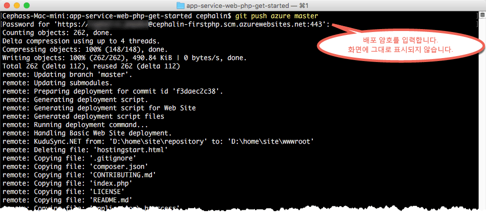

# 5분 내 Azure에 첫 번째 PHP 웹앱 배포(CLI 2.0 미리 보기)

> [!div class="op_single_selector"]
> * [첫 번째 HTML 사이트](app-service-web-get-started-html.md)
> * [첫 번째 .NET 앱](app-service-web-get-started-dotnet.md)
> * [첫 번째 PHP 앱](app-service-web-get-started-php.md)
> * [첫 번째 Node.js 앱](app-service-web-get-started-nodejs.md)
> * [첫 번째 Python 앱](app-service-web-get-started-python.md)
> * [첫 번째 Java 앱](app-service-web-get-started-java.md)
> 
> 

이 자습서를 통해 [Azure App Service](../app-service/app-service-value-prop-what-is.md)에 첫 번째 PHP 웹앱을 배포합니다.
App Service를 사용하여 웹앱, [모바일 앱 백 엔드](/documentation/learning-paths/appservice-mobileapps/) 및 [API 앱](../app-service-api/app-service-api-apps-why-best-platform.md)을 만들 수 있습니다.

다음을 수행합니다. 

* Azure App Service에서 웹앱을 만듭니다.
* 샘플 PHP 코드를 배포합니다.
* 프로덕션 환경에서 라이브로 코드 실행을 참조하세요.
* [Git 커밋을 푸시](https://git-scm.com/docs/git-push)하는 것과 똑같은 방식으로 웹앱을 업데이트합니다.

[!INCLUDE [app-service-linux](../../includes/app-service-linux.md)]

## 태스크를 완료하기 위한 CLI 버전

다음 CLI 버전 중 하나를 사용하여 태스크를 완료할 수 있습니다.

- [Azure CLI 1.0](app-service-web-get-started-php-cli-nodejs.md) - 클래식 및 리소스 관리 배포 모델용 CLI
- [Azure CLI 2.0(미리 보기)](app-service-web-get-started-php.md) - 리소스 관리 배포 모델용 차세대 CLI

## 필수 조건
* [Git](http://www.git-scm.com/downloads)
* [Azure CLI 2.0 미리 보기](/cli/azure/install-az-cli2)
* Microsoft Azure 계정. 계정이 없는 경우 [무료 평가판을 등록](https://azure.microsoft.com/pricing/free-trial/?WT.mc_id=A261C142F)하거나 [Visual Studio 구독자 혜택을 활성화](https://azure.microsoft.com/pricing/member-offers/msdn-benefits-details/?WT.mc_id=A261C142F)할 수 있습니다.

> [!NOTE]
> Azure 계정 없이 [App Service를 체험](https://azure.microsoft.com/try/app-service/)할 수 있습니다. 시작 앱을 만들고 최대 한 시간 동안 해당 앱을 사용하여 재생합니다. -- 신용 카드는 필요하지 않으며 약정도 필요하지 않습니다.
> 
> 

## PHP 웹앱 배포
1. 새 Windows 명령 프롬프트, PowerShell 창, Linux 셸 또는 OS X 터미널을 엽니다. `git --version` 및 `azure --version`를 실행하여 Git 및 Azure CLI가 컴퓨터에 설치되어 있는지 확인합니다.
   
    
   
    도구를 설치하지 않은 경우 다운로드 링크는 [필수 구성 요소](#Prerequisites) 를 참조하세요.
2. 다음과 같이 Azure에 로그인합니다.
   
        az login
   
    로그인 프로세스를 계속하려면 도움말 메시지를 따릅니다.
   
    

3. App Service의 배포 사용자를 설정합니다. 나중에 이러한 자격 증명을 사용하여 코드를 배포합니다.
   
        az appservice web deployment user set --user-name <username> --password <password>

3. 새 [리소스 그룹](../azure-resource-manager/resource-group-overview.md)을 만듭니다. 이 첫 번째 App Service 자습서의 경우 무엇인지 몰라도 됩니다.

        az group create --location "<location>" --name my-first-app-group

    `<location>`에 사용할 수 있는 가능한 값을 보려면 `az appservice list-locations` CLI 명령을 사용합니다.

3. 새로운 "무료" [App Service 계획](../app-service/azure-web-sites-web-hosting-plans-in-depth-overview.md)을 만듭니다. 이 첫 번째 App Service 자습서의 경우 이 계획에서 웹앱에 대한 요금이 부과되지 않습니다.

        az appservice plan create --name my-free-appservice-plan --resource-group my-first-app-group --sku FREE

4. `<app_name>`에 고유한 이름이 있는 새 웹앱을 만듭니다.

        az appservice web create --name <app_name> --resource-group my-first-app-group --plan my-free-appservice-plan

4. 다음으로 배포하려는 샘플 PHP 코드를 가져옵니다. 작업 디렉터리(`CD`)를 변경하고 샘플 앱을 다음과 같이 복제합니다.
   
        cd <working_directory>
        git clone https://github.com/Azure-Samples/app-service-web-php-get-started.git

5. 샘플 앱의 리포지토리로 변경합니다. 예:
   
        cd app-service-web-php-get-started
5. 다음 명령을 사용하여 App Service 웹앱에 대한 로컬 Git 배포를 구성합니다.

        az appservice web source-control config-local-git --name <app_name> --resource-group my-first-app-group

    다음과 같이 JSON 출력을 받게 됩니다. 즉, 원격 Git 리포지토리가 구성되게 됩니다.

        {
        "url": "https://<deployment_user>@<app_name>.scm.azurewebsites.net/<app_name>.git"
        }

6. JSON의 URL을 로컬 리포지토리의 Git 원격으로 추가합니다(간단히 `azure`라고 함).

        git remote add azure https://<deployment_user>@<app_name>.scm.azurewebsites.net/<app_name>.git
   
7. Git로 코드를 푸시하듯이 새 Azure 앱에 샘플 코드를 배포합니다. 메시지가 표시되면 이전에 구성한 암호를 사용합니다.
   
        git push azure master
   
    
   
    `git push`는 Azure에 코드를 배치할 뿐만 아니라 배포 엔진에서 배포 작업을 트리거합니다. 또한 PHP 앱의 composer.json 파일을 자동으로 처리하도록  [작성기 확장](web-sites-php-mysql-deploy-use-git.md#composer) 을 설정할 수 있습니다.

축하합니다. Azure 앱 서비스에 앱을 배포하셨습니다.

## 실시간으로 실행 중인 앱 확인
Azure에서 라이브로 실행 중인 앱을 보려면 리포지토리의 디렉터리에서 이 명령을 실행합니다.

    azure site browse

## 앱 업데이트
이제 언제든지 Git를 사용하여 프로젝트(리포지토리) 루트에서 푸시하여 라이브 사이트를 업데이트할 수 있습니다. 사용자의 코드를 처음으로 배포했을 때와 같은 방식으로 수행합니다. 예를 들어 로컬에서 테스트한 새로운 변경 내용을 푸시하고 싶을 때마다 프로젝트(리포지토리) 루트에서 다음 명령을 실행하기만 하면 됩니다.

    git add .
    git commit -m "<your_message>"
    git push azure master

## 다음 단계
[Azure에 Laravel 웹앱을 만들고 구성하여 배포합니다](app-service-web-php-get-started.md). 이 자습서를 따라 수행하면 다음과 같이 Azure에서 PHP 웹앱을 실행하는 데 필요한 기본 기술을 배우게 됩니다.

* PowerShell/Bash로부터 Azure의 앱을 만들어 구성합니다.
* PHP 버전을 설정합니다.
* 루트 응용 프로그램 디렉터리에 있지 않은 시작 파일을 사용합니다.
* Composer 자동화를 사용합니다.
* 특정 환경 변수에 액세스합니다.
* 일반적인 오류 문제를 해결합니다.

또는 첫 번째 웹앱으로 더 많은 작업을 수행합니다. 예:

* [사용자의 코드를 Azure에 배포하는 다른 방법](web-sites-deploy.md)을 시도해 보세요. 예를 들어 GitHub 리포지토리 중 하나에서 배포하려면 **배포 옵션**에서 **로컬 Git 리포지토리** 대신에 **GitHub**를 선택합니다.
* 다음 수준으로 Azure 앱을 이동합니다. 사용자를 인증합니다. 요구에 따라 규모를 조정합니다. 몇 가지 성능 경고를 설정합니다. 이 모든 작업이 클릭 몇 번으로 가능합니다. [첫 번째 웹앱에 기능 추가](app-service-web-get-started-2.md)를 참조하세요.

<!--HONumber=Jan17_HO3-->

