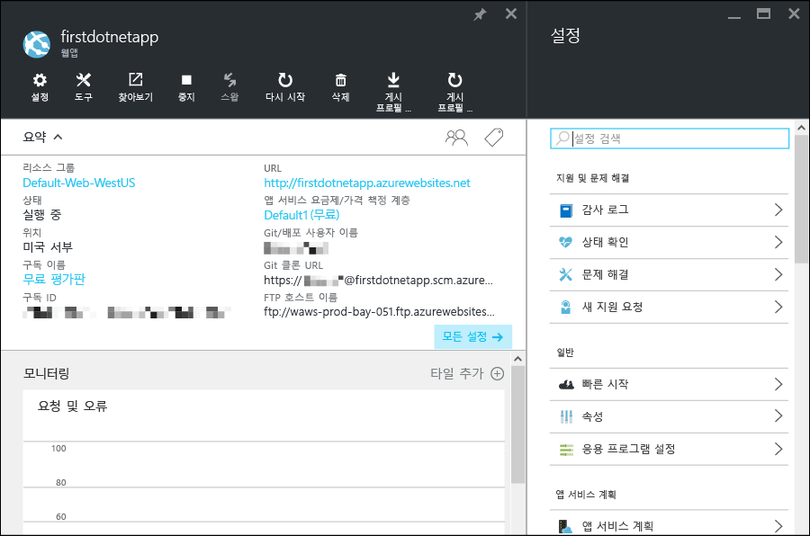

<properties 
	pageTitle="Azure 앱 서비스에서 웹 앱 시작" 
	description="앱 서비스에서 실시간으로 웹 앱을 실행하는 방법이 얼마나 쉬운지 알아보세요. 5분 내에 실제 개발을 시작하고 즉시 결과를 확인하세요." 
	services="app-service\web"
	documentationCenter=""
	authors="cephalin" 
	manager="wpickett" 
	editor="" 
/>

<tags 
	ms.service="app-service-web" 
	ms.workload="web" 
	ms.tgt_pltfrm="na" 
	ms.devlang="na" 
	ms.topic="hero-article"
	ms.date="03/14/2016" 
	ms.author="cephalin"
/>
	
# Azure 앱 서비스에서 웹 앱 시작

이 자습서는 [Azure 앱 서비스](../app-service/app-service-value-prop-what-is.md)에 신속하게 웹 앱을 배포하는 방법을 알려 줍니다. 사용자는 최소한의 작업으로 다음을 수행할 수 있습니다.

- 샘플 웹 앱을 배포합니다(ASP.NET, PHP, Node.js, Java 또는 Python 중 선택).
- 잠시 후 실시간으로 실행 중인 앱을 확인합니다.
- [Git](http://www.git-scm.com/) 커밋을 푸시하는 것과 똑같은 방식으로 웹 앱을 업데이트합니다.

또한 처음으로 [Azure 포털](https://portal.azure.com)을 살펴보고 제공되는 기능을 알아봅니다.

## 필수 조건

이 자습서를 완료하려면 다음이 필요합니다.

- Git. [여기서](http://www.git-scm.com/downloads) 설치 이진 파일을 다운로드할 수 있습니다. 사용자는 선택하는 명령줄 터미널에서 `git --version`을 실행할 수 있어야 합니다. 
- Git에 대한 기본 지식.
- Azure CLI. 설치 지침은 [여기에](../xplat-cli-install.md) 있습니다.
- Microsoft Azure 계정. 계정이 없는 경우 [무료 평가판을 등록](/pricing/free-trial/?WT.mc_id=A261C142F)하거나 [Visual Studio 구독자 혜택을 활성화](/pricing/member-offers/msdn-benefits-details/?WT.mc_id=A261C142F)할 수 있습니다.

>[AZURE.NOTE] Azure 계정을 등록하기 전에 동작 중인 Azure 앱 서비스를 확인하려면 [앱 서비스 체험](http://go.microsoft.com/fwlink/?LinkId=523751)으로 이동하세요. 여기서 신용 카드와 약정 없이 앱 서비스에서 수명이 짧은 스타터 앱을 즉시 만들 수 있습니다.

## 웹 앱 배포

Azure 앱 서비스에 웹 앱을 배포하겠습니다.

1. 새 Windows 명령 프롬프트, Linux 셸 또는 OS X 터미널을 열고 다음과 같이 작업 디렉터리에 `CD`를 입력하고 샘플 앱을 복제합니다.

        git clone <github_sample_url>

    *&lt;github\_sample\_url>*의 경우 원하는 프레임워크에 따라 다음 URL 중 하나를 사용합니다.

    - ASP.NET: [https://github.com/azure-appservice-samples/aspnet-get-started.git](https://github.com/azure-appservice-samples/aspnet-get-started.git)
    - PHP(CodeIgniter): [https://github.com/azure-appservice-samples/php-get-started.git](https://github.com/azure-appservice-samples/php-get-started.git)
    - Node.js(Express): [https://github.com/azure-appservice-samples/nodejs-get-started.git](https://github.com/azure-appservice-samples/nodejs-get-started.git) 
    - Python(Django): [https://github.com/azure-appservice-samples/python-get-started.git](https://github.com/azure-appservice-samples/python-get-started.git)
    - Java: [https://github.com/azure-appservice-samples/java-get-started.git](https://github.com/azure-appservice-samples/java-get-started.git)

2. 샘플 앱의 프로젝트 루트에 `CD`를 입력합니다. 예를 들면 다음과 같습니다.

        cd aspnet-get-started

3. 다음과 같이 Azure에 로그인합니다.

        azure login
    
    프롬프트를 따라 Azure 구독을 보유하고 있는 Microsoft 계정을 사용하여 브라우저에서 계속 로그인합니다.

4. 다음 명령을 사용하여 Azure에 고유한 앱 이름을 가진 앱 서비스 앱 리소스를 만듭니다. 웹 앱의 URL은 http://&lt;app_name>.azurewebsites.net이 됩니다.

        azure site create --git <app_name> 
      
    >[AZURE.NOTE] Azure 구독에 대한 배포 자격 증명을 전혀 설정하지 않은 경우 배포 자격 증명을 만들라는 메시지가 나타납니다. 이러한 자격 증명은(Azure 계정 자격 증명 아님) 앱 서비스에서 Git 배포 및 FTP 로그인에만 사용합니다.
    
    이제 Azure에 앱이 생성될 뿐 아니라 현재 디렉터리가 Git 초기화되어 새로운 앱 서비스 앱에 Git 원격으로 연결됩니다. 앱의 URL을 탐색하여 아름다운 기본 HTML 페이지를 볼 수 있지만, 지금은 거기에 사용자 고유의 코드를 배치해 보겠습니다.

4. 이제 Git로 코드를 푸시하듯이 새 앱 서비스 앱에 샘플 코드를 배포합니다.

        git push azure master 
    
    >[AZURE.NOTE] 배포 암호가 필요할 것입니다. 앱 서비스를 처음 접하는 경우, 방금 만든 배포 암호를 입력하고 과정을 진행하면 됩니다.
    
    `git push`는 Azure에 코드를 배치할 뿐만 아니라 배포 엔진에서 배포 작업을 트리거합니다. 프로젝트(리포지토리) 루트에 package.json(Node.js) 또는 requirements.txt(Python)가 있거나 ASP.NET 프로젝트에 packages.config가 있는 경우 배포 스크립트가 사용자에게 필요한 패키지를 복원할 것입니다. 또한 PHP 앱의 composer.json 파일을 자동으로 처리하도록 [작성기 확장](web-sites-php-mysql-deploy-use-git.md#composer)을 설정할 수 있습니다.

축하합니다. Azure 앱 서비스에 앱을 배포하셨습니다.

## 실시간으로 실행 중인 앱 확인

Azure에서 실시간으로 실행 중인 앱을 확인하려면 다음 명령을 실행합니다.

    azure site browse <app_name>

`Site <app_name> does not exist or has no hostnames` 오류 메시지가 나타나면 몇 초 후에 명령을 다시 실행합니다. Java 앱 같은 일부 앱은 배포를 마무리하는 데 시간이 약간 더 걸립니다.

## 앱 업데이트

처음으로 Azure에 앱을 배포한 방법과 마찬가지로, 이제 언제든지 Git를 사용하여 프로젝트(리포지토리) 루트에서 푸시하여 라이브 사이트를 업데이트할 수 있습니다. 예를 들어 로컬에서 테스트한 새로운 변경 내용을 푸시하고 싶을 때마다 프로젝트(리포지토리) 루트에서 다음 명령을 실행하기만 하면 됩니다.
    
    git add .
    git commit -m "<you_message>"
    git push azure master

## 또 다른 배포 방법

웹 앱을 배포하는 다양한 방법이 있으며, 로컬 리포지토리에서 Git 배포는 수많은 배포 방법 중 하나일 뿐입니다. 웹 개발자에게 익숙한 FTP 방법을 포함하여 Visual Studio의 직관적인 마법사 배포, GitHub에서 직접 연속 배포, DropBox에서 콘텐츠 동기화 등 여러 가지 방법이 있습니다. 배포 옵션에 대한 자세한 내용은 [Azure 앱 서비스에 앱 배포](../app-service-web/web-sites-deploy.md)를 참조하세요.

## Azure 포털에서 앱 확인

이제 Azure 포털로 이동하여 여러분이 만든 앱을 살펴보겠습니다.

1. Azure 구독을 보유한 Microsoft 계정을 사용하여 [Azure 포털](https://portal.azure.com)에 로그인합니다.

2. 왼쪽 표시줄에서 **앱 서비스**를 클릭합니다.

3. 방금 만든 앱 서비스 앱을 클릭하여 포털에서 해당 블레이드를 엽니다. 사용자 편의를 위해 기본적으로 **설정** 블레이드가 함께 열립니다.

    

앱 서비스 앱의 블레이드는 앱을 구성, 모니터링 및 보호하고 문제를 해결할 수 있는 다양한 설정과 도구를 제공합니다. 이 인터페이스에 익숙해지도록 잠시 시간을 내어 몇 가지 간단한 작업을 수행해 보세요.

- 앱 중지
- 앱 다시 시작
- **리소스 그룹** 링크를 클릭하여 리소스 그룹에 배포된 모든 리소스 확인
- **설정** > **속성**을 클릭하여 앱에 대한 다른 정보 확인
- **도구**를 클릭하여 앱을 모니터링하고 문제를 해결할 수 있는 유용한 도구에 액세스  

## 다음 단계

배포한 앱을 다음 단계로 전환합니다. 인증을 사용하여 앱을 보호합니다. 요구에 따라 규모를 조정합니다. 몇 가지 성능 경고를 설정합니다. 이 모든 작업이 클릭 몇 번으로 가능합니다. [Azure 앱 서비스 시작 - 2부](app-service-web-get-started-2.md)를 참조하세요.

또는 앱 서비스용 웹 앱을 만드는 방법을 처음부터 자세히 살펴보세요.

- [Azure 앱 서비스에서 ASP.NET 웹 응용 프로그램 만들기](web-sites-dotnet-get-started.md)
- [Azure 앱 서비스에서 PHP 웹 앱 만들기](web-sites-php-mysql-deploy-use-git.md)
- [Azure 앱 서비스에서 Node.js 웹 앱 만들기](web-sites-nodejs-develop-deploy-mac.md)
- [Azure 앱 서비스에서 Java 웹앱 만들기](web-sites-java-get-started.md)
- [Azure 앱 서비스에서 Python 웹 앱 만들기](web-sites-python-ptvs-django-mysql.md)

또한 웹 앱, 모바일 앱 백 엔드, API 앱을 포함하여 Azure 앱 서비스에 빌드할 수 있는 앱 범위를 보여 주는 수많은 콘텐츠가 있습니다.

- [웹 앱 만들기](/documentation/learning-paths/appservice-webapps/)
- [모바일 앱 만들기](/documentation/learning-paths/appservice-mobileapps/)
- [API 앱 만들기](../app-service-api/app-service-api-apps-why-best-platform.md)

<!---HONumber=AcomDC_0316_2016-->