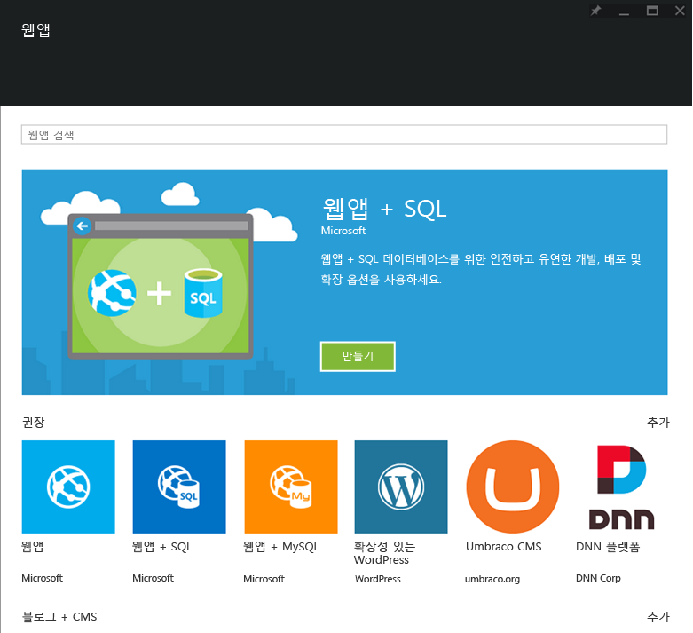

<properties
	pageTitle="웹앱 개요"
	description="앱 서비스 웹앱에 대해 자세히 알아봅니다."
	services="app-service\web"
	documentationCenter=""
	authors="jaime-espinosa"
	manager="wpickett"
	editor="jimbe"/>

<tags
	ms.service="app-service-web"
	ms.workload="web"
	ms.tgt_pltfrm="na"
	ms.devlang="na"
	ms.topic="article"
	ms.date="03/24/2015"
	ms.author="jaime.espinosa"/>

#웹앱 개요

[앱 서비스](http://go.microsoft.com/fwlink/?LinkId=529714)는 웹, 모바일 및 통합 시나리오에 풍부한 기능 집합을 제공하는 완전히 관리되는 전문 개발자용 플랫폼입니다. Azure 앱 서비스를 사용하여 비즈니스에 맞게 크기가 조정되는 중요 업무용 웹앱을 신속하게 만들고 배포하세요.

[앱 서비스 웹앱](http://go.microsoft.com/fwlink/?LinkId=529714)의 기능을 활용하여 알고 있고 종속된 언어 및 프레임워크를 사용하고, 응용 프로그램을 Azure 클라우드에 신속하게 배포하고, 인프라에 대한 염려 없이 계속해서 코드를 향상시키세요.

## 웹 사이트의 범위 초월##

최근 엔터프라이즈는 이전보다 훨씬 정교한 방법으로 고객과 상호 작용합니다. 모든 유형의 회사는 회사 웹 서비스를 비즈니스의 중요한 일부이자 비즈니스 계획의 주요 구성 요소로 간주합니다. 이 중요성을 수용하기 위해 엔터프라이즈는 민첩성, 보안 및 확장성을 제공할 플랫폼을 찾고 있습니다. 또한 기존 비즈니스 시스템에 연결하고, 새 코드를 신속하게 배포하고, 전 세계에서 인스턴스를 실행할 수 있어야 합니다. Azure 앱 서비스와 웹앱을 사용하면 조직에서 신속하고 비용 효과적으로 고객을 만족시킬 수 있습니다.

## 웹앱을 사용하는 이유 ##

Azure 앱 서비스 웹앱은 엔터프라이즈급 웹앱을 몇 초 내에 빌드, 배포 및 확장할 수 있게 해주는 완전히 관리되는 플랫폼입니다. 응용 프로그램 코드에만 집중하면 Azure에서 크기를 조정하고 안전하게 실행할 인프라를 자동으로 처리합니다. 웹앱의 이점은 다음과 같습니다.

- **친숙하고 빠름** - 기존 기술을 사용하여 좋아하는 언어, 프레임워크 및 IDE로 코딩합니다. 몇 번만 클릭하여 기존 웹앱에 버전 관리, 업데이트, Single Sign-On, ID 브로커, 격리된 저장소 및 성능 모니터링을 추가합니다. 구성 요소로 사용할 풍부한 갤러리에 액세스하여 개발을 가속화합니다. 연속 통합, 라이브 사이트 디버깅 및 업계 선도적인 Visual Studio IDE와 같은 첨단 기능으로 뛰어난 개발자 생산성을 경험합니다.
- **엔터프라이즈급** - 웹앱은 중요 업무용 보안 응용 프로그램을 빌드 및 호스트하도록 설계되었습니다. 안전하게 온-프레미스 리소스에 연결한 다음 ISO, SOC2 및 PCI 규격인 보안 클라우드 플랫폼에 호스트하는 Active Directory 통합 비즈니스 앱을 빌드합니다. 엔터프라이즈 수준 SLA로 모든 작업을 수행할 수 있습니다.
- **글로벌 환경** - 웹앱은 글로벌 데이터 센터 인프라에서 가용성과 자동 크기 조정을 제공하도록 최적화되었습니다. 필요에 따라 쉽게 응용 프로그램 규모를 확장하거나 축소합니다. 여러 지역에 걸쳐 고가용성이 제공됩니다. 쉽고 빠르게 여러 위치에 데이터를 복제하고 서비스를 호스트할 수 있어 마우스만 한 번 클릭하여 간단하게 새 지역으로 확장합니다.  

## 웹앱 개념 ##

- **웹앱 갤러리** - 점점 증가하는 기존 웹 응용 프로그램 템플릿 목록에서 선택합니다. 한 번 클릭으로 Wordpress, Joomla 및 Drupal과 같은 패키지를 설치하여 OSS 앱 커뮤니티를 최대한 활용합니다. .NET MVC, Django 및 CakePHP와 같은 프레임워크를 활용하여 응용 프로그램 개발 프로세스를 바로 시작합니다.
- **자동 크기 조정** - 웹앱을 사용하면 들어오는 고객 부하를 처리하기 위해 신속하게 규모를 확장하거나 축소할 수 있습니다. 수동으로 VM 수와 크기를 선택하거나 자동 확장을 설정하여 부하 또는 일정에 따라 서버를 확장할 수 있습니다.
- **연속 통합** - VSO, GitHub, TeamCity, Hudson 또는 BitBucket을 통해 연속 통합 및 배포 워크플로를 설정하여 코드 체크 인 또는 통합 테스트에 성공할 때마다 웹앱을 자동으로 빌드, 테스트 및 배포할 수 있습니다.
- **배포 슬롯** - [스테이징된 배포][Slots]를 구현하여 Azure 앱 서비스의 프로덕션 웹앱과 동일한 프로덕션 전 환경에서 코드를 검증합니다. 만족할 경우 교환 작업을 수행하여 가동 중지 시간 0으로 새 버전의 앱을 릴리스합니다. 
- **프로덕션에서 테스트** - 다음 수준으로 스테이징된 배포를 사용하고 A/B 테스트를 수행하여 구성 가능한 일부 라이브 트래픽으로 새 코드를 검증합니다. 
- **WebJobs** - 웹앱 VM에서 프로그램이나 스크립트를 실행합니다. 지속형 또는 예약형 작업을 실행하고 여러 VM에서 실행되도록 크기를 조정합니다. Azure [WebJobs SDK][Webjobs]를 사용하여 Azure 저장소 또는 서비스 버스와 통합합니다.
- **하이브리드 연결** - - [하이브리드 연결](../integration-hybrid-connection-overview.md) 및 [VNET](../app-service-web/web-sites-integrate-with-vnet.md)를 사용하는 온-프레미스 데이터에 액세스.

## 시작 ##
웹앱을 시작하려면 [ASP.NET 웹앱 만들기][create] 자습서를 따르세요.

Azure 앱 서비스 플랫폼에 대한 자세한 내용은 [Azure 앱 서비스][appservice]를 참조하세요.

>[AZURE.NOTE]Azure 계정을 등록하기 전에 Azure 앱 서비스를 시작하려면 [앱 서비스 평가](http://go.microsoft.com/fwlink/?LinkId=523751)로 이동합니다. 앱 서비스에서 단기 스타터 웹앱을 즉시 만들 수 있습니다. 신용 카드는 필요하지 않으며 약정도 필요하지 않습니다.

## 변경된 내용
* 웹 사이트에서 앱 서비스로의 변경에 대한 지침은 [Azure 앱 서비스와 이 서비스가 기존 Azure 서비스에 미치는 영향](http://go.microsoft.com/fwlink/?LinkId=529714)을 참조하세요.
* 이전 포털에서 새 포털로의 변경에 대한 지침은 [미리 보기 포털 탐색에 대한 참조](http://go.microsoft.com/fwlink/?LinkId=529715)를 참조하세요.

[appservice]: ../app-service/app-service-value-prop-what-is.md
[create]: web-sites-dotnet-get-started.md
[Webjobs]: websites-dotnet-webjobs-sdk-get-started.md
[Slots]: web-sites-staged-publishing.md

 

<!---HONumber=July15_HO3-->