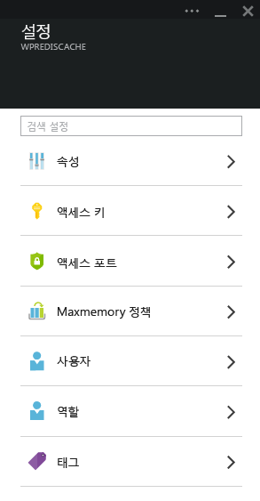
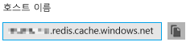
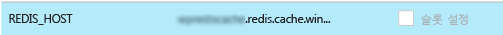
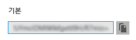
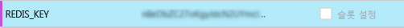
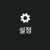
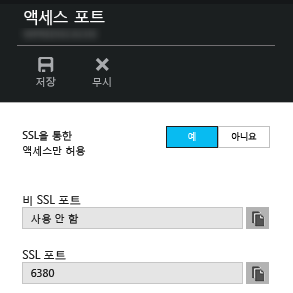
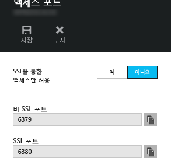

<properties
   pageTitle="Memcache 프로토콜을 통해 Redis Cache에 Azure 앱 서비스의 웹 앱 연결"
   description="Memcache 프로토콜을 사용하여 Redis Cache에 Azure 앱 서비스의 웹 앱 연결"
   services="app-service\web"
   documentationCenter="php"
   authors="SyntaxC4"
   manager="wpickett"
   editor="riande"/>

<tags
   ms.service="app-service-web"
   ms.devlang="php"
   ms.topic="get-started-article"
   ms.tgt_pltfrm="windows"
   ms.workload="web"
   ms.date="06/30/2015"
   ms.author="cfowler"/>

# Memcache 프로토콜을 통해 Redis Cache에 Azure 앱 서비스의 웹 앱 연결

이 문서에서는 [Azure 앱 서비스](http://go.microsoft.com/fwlink/?LinkId=529714)의 WordPress 웹앱을 [Memcache][13] 프로토콜을 사용하는 [Azure Redis Cache][12]에 연결하는 방법에 대해 알아봅니다. 메모리 내 캐싱을 위해 Memcached 서버를 사용하는 기존 웹 앱이 있는 경우 이를 Azure 앱 서비스로 마이그레이션할 수 있으며 응용 프로그램 코드를 거의 또는 전혀 변경하지 않고 Microsoft Azure에서 자사 캐싱 솔루션을 사용할 수 있습니다. 또한 .NET, PHP, Node.js, Java 및 Python과 같은 대중적인 응용 프로그램 프레임워크를 사용하는 동안 메모리 내 캐싱을 위해 Azure Redis Cache를 사용하여 Azure 앱 서비스에서 매우 확장성 있는 배포 앱을 만들기 위해 기존의 Memcache 전문가를 활용할 수 있습니다.

앱 서비스 웹 앱은 이 응용 프로그램 시나리오를 웹 앱 Memcache shim로 사용할 수 있으며, 이는 Azure Redis Cache로 호출되는 캐시를 위한 Memcache 프록시로 동작하는 로컬 Memcache 서버입니다. 이를 통해 앱이 Redis Cache로 데이터를 캐시하는 데 Memcache 프로토콜을 사용하여 통신할 수 있습니다. 이 Memcache shim은 프로토콜 단계에서 작업하므로 Memcache 프로토콜을 사용하여 통신하는 한 모든 응용 프로그램 또는 응용 프로그램 프레임워크에서 이를 사용할 수 있습니다.

## 필수 조건

웹 앱 Memcache shim은 Memcache 프로토콜을 사용하여 통신하는 제공된 응용 프로그램과 함께 사용할 수 있습니다. 이 특정 예제의 경우, 참조 응용 프로그램은 Azure 마켓플레이스에서 프로비전할 수 있는 확장 가능한 WordPress 사이트입니다.

이 포스트에서 설명한 단계를 따르세요.

* [Azure Redis Cache 서비스의 인스턴스 프로비전][1]
* [Azure에서 확장 가능한 WordPress 사이트 배포][0]

확장 가능한 WordPress 사이트가 배포되고 Redis Cache 인스턴스가 프로비전되면 Azure 앱 서비스 웹 앱에서 Memcache shim을 사용하여 진행할 준비가 됩니다.

## 웹 앱 Memcache shim 사용

Memcache shim을 구성하려면 3개의 앱 설정을 만들어야 합니다. [Azure 포털](http://go.microsoft.com/fwlink/?LinkId=529715), [기존 포털][3], [Azure PowerShell Cmdlet][5] 또는 [Azure 명령줄 인터페이스][5]를 포함한 다양한 방법으로 완료할 수 있습니다. 이 게시물의 목적은 [Azure 포털][4]을 사용하여 앱을 설정하는 것입니다. 다음 값은 Redis Cache의 **설정** 블레이드에서 검색할 수 있습니다.



### REDIS_HOST 앱 설정 추가

만들어야 하는 첫 번째 앱 설정은 **REDIS_HOST** 앱 설정입니다. 이 설정은 shim이 캐시 정보를 전달하는 대상을 설정합니다. REDIS_HOST 앱 설정에 필요한 값은 Redis Cache 인스턴스의 **속성** 블레이드에서 검색할 수 있습니다.



앱 설정의 키를 **REDIS_HOST**로, 앱 설정 값을 Redis Cache 인스턴스의 **호스트 이름**으로 설정합니다.



### REDIS_KEY 앱 설정 추가

만들어야 하는 두 번째 앱 설정은 **REDIS_KEY** 앱 설정입니다. 이 설정은 Redis Cache 인스턴스에 안전하게 액세스하는 데 필요한 인증 토큰을 제공합니다. REDIS_KEY 앱 설정에 필요한 값은 Redis Cache 인스턴스의 **액세스 키** 블레이드에서 검색할 수 있습니다.



앱 설정의 키를 **REDIS_KEY**로, 앱 설정 값을 Redis Cache 인스턴스의 **기본 키**로 설정합니다.



### MEMCACHESHIM_REDIS_ENABLE 앱 설정 추가

마지막 앱 설정은 웹 앱에서 Memcache Shim을 설정하는 데 사용됩니다. Memcache Shim은 Azure Redis Cache에 연결하기 위해 REDIS_HOST 및 REDIS_KEY를 사용하며 캐시 호출을 전달합니다. 앱 설정의 키는 **MEMCACHESHIM_REDIS_ENABLE**로, 값은 **true**로 설정합니다.


세 개의 앱 설정 추가를 완료하면 **저장**을 클릭합니다.

## PHP에 Memcache 확장 사용

Memcache 프로토콜을 읽어주는 응용 프로그램을 위해 Memcache 확장을 PHP로 설치해야 합니다(WordPress 사이트를 위한 언어 프레임워크).

### php_memcache 확장 다운로드

캐싱 범주 아래 [PECL][6]을 찾아 [memcache][7]를 클릭합니다. 다운로드 열 아래의 DLL 링크를 클릭합니다.


웹 앱에서 사용되는 PHP 버전은 NTS(Non-Thread Safe) x86 링크를 다운로드합니다. (기본은 PHP 5.4입니다.)


### php_memcache 확장 사용

파일을 다운로드한 후 압축을 풀어 **php_memcache.dll**을 **d:\home\site\wwwroot\bin\ext\** 디렉터리로 업로드합니다. php_memcache.dll이 웹 앱에 업로드된 후 확장을 PHP 런타임에 사용하도록 설정해야 합니다. Azure 포털에서 Memcache 확장을 사용하려면 웹앱에 대한 **응용 프로그램 설정** 블레이드를 열고 **PHP_EXTENSIONS** 키 및 **bin\ext\php_memcache.dll** 값으로 새 앱 설정을 추가합니다.


> 웹 앱에 여러 PHP 확장을 로드해야 하는 경우, PHP_EXTENSIONS 값은 DLL 파일에 대한 관련 경로 목록을 쉼표로 구분해야 합니다.


완료되면 **저장**을 클릭합니다.

## Memcache WordPress 플러그인 설치

> WordPress.org에서도 [Memcached 개체 캐시 플러그인](https://wordpress.org/plugins/memcached/)을 다운로드할 수 있습니다.

WordPress 플러그인 페이지에서 **새로 추가** 단추를 클릭합니다.


검색 상자에 **memcached**를 입력하고 **Enter** 키를 누릅니다.


목록에서 **Memcached Object Cache**를 찾아 **지금 설치** 단추를 클릭합니다.


### Memcache WordPress 플러그인 사용

>[AZURE.NOTE]Visual Studio Online을 설치하려면 [웹앱에서 사이트 확장을 사용하는 방법][8]에 있는 이 블로그의 지침을 따르세요.

`wp-config.php` 파일에서 파일 끝부분 편집 중지 주석 위에 다음 코드 조각을 추가합니다.

```php
$memcached_servers = array(
	'default' => array('localhost:' . getenv("MEMCACHESHIM_PORT"))
);
```

이 코드 조각을 붙여 넣으면 모나코가 문서를 자동으로 저장합니다.

다음 단계는 개체-캐시 플러그임을 사용하도록 설정하는 것입니다. **wp-content/memcached** 폴더에서 **wp-content** 폴더로 **object-cache.php**를 끌어서 놓아 Memcache Object Cache 기능 설정을 완료합니다.


이제 **object-cache.php** 파일이 **wp-content** 폴더에 있으며 Memcached Object Cache를 사용할 수 있습니다.


## 작용하고 있는 Memcache Object Cache 플러그인 확인

이제 웹 앱 Memcache shim 사용 설정의 모든 단계가 완료되었습니다. 데이터가 Redis Cache 인스턴스에 채워졌는지 확인하는 단계만 남아 있습니다.

### Azure Redis Cache에서 비SSL 포트 지원 사용 설정

>[AZURE.NOTE]이 문서가 작성된 현재 Redis CLI는 SSL 연결을 지원하지 않습니다. 따라서 다음 단계가 필요합니다.

Azure 포털에서 이 웹 앱에 대해 만들어진 Redis Cache 인스턴스를 찾아봅니다. 캐시의 블레이드가 열리면 **설정** 아이콘을 클릭합니다.



목록에서 **액세스 포트**를 선택합니다.


**SSL을 통해서만 액세스 허용**에 대해 **아니요**를 클릭합니다.



이제 비SSL 포트가 설정된 것이 보입니다. **Save**를 클릭합니다.



### redis-cli에서 Azure Redis Cache로 연결

>[AZURE.NOTE]이 단계에서는 redis가 개발 컴퓨터에 로컬로 설치된 것으로 간주합니다. [다음 지침을 사용하여 Redis를 로컬로 설치합니다][9].

선택한 명령줄 콘솔을 열고 다음 명령을 입력합니다.

```shell
redis-cli –h <hostname-for-redis-cache> –a <primary-key-for-redis-cache> –p 6379
```

**<hostname-for-redis-cache>**를 실제 xxxxx.redis.cache.windows.net 호스트 이름으로, **<primary-key-for-redis-cache>**를 캐시에 대한 액세스 키로 바꾸고 **Enter**를 누릅니다. CLI가 Redis Cache 인스턴스에 연결되면 redis 명령을 실행합니다. 아래 스크린샷에서는 키를 나열하도록 선택했습니다.


키 나열에 대한 호출은 값을 반환합니다. 값을 반환하지 않으면 웹 앱을 찾아 다시 시도해 봅니다.

## 결론

축하합니다. 이제 WordPress 앱에 증가하는 처리량을 지원하기 위해 중앙 메모리 내 캐시가 생겼습니다. 웹 앱 Memcache Shim은 프로그래밍 언어 또는 응용 프로그램 프레임워크와 상관 없이 Memcache 클라이언트에 사용할 수 있습니다. 피드백 게시 또는 웹앱 Memcache shim에 대한 문의는 [MSDN 포럼][10] 또는 [Stackoverflow][11]에 게시하세요.

>[AZURE.NOTE]Azure 계정을 등록하기 전에 Azure 앱 서비스를 시작하려면 [앱 서비스 평가](http://go.microsoft.com/fwlink/?LinkId=523751)로 이동합니다. 앱 서비스에서 단기 스타터 웹앱을 즉시 만들 수 있습니다. 신용 카드는 필요하지 않으며 약정도 필요하지 않습니다.

## 변경된 내용
* 웹 사이트에서 앱 서비스로의 변경에 대한 지침은 [Azure 앱 서비스와 이 서비스가 기존 Azure 서비스에 미치는 영향](http://go.microsoft.com/fwlink/?LinkId=529714)을 참조하세요.
* 이전 포털에서 새 포털로의 변경에 대한 지침은 [미리 보기 포털 탐색에 대한 참조](http://go.microsoft.com/fwlink/?LinkId=529715)를 참조하세요.


[0]: http://bit.ly/1F0m3tw
[1]: http://bit.ly/1t0KxBQ
[2]: http://manage.windowsazure.com
[3]: http://portal.azure.com
[4]: ../powershell-install-configure.md
[5]: /downloads
[6]: http://pecl.php.net
[7]: http://pecl.php.net/package/memcache
[8]: http://blog.syntaxc4.net/post/2015/02/05/how-to-enable-a-site-extension-in-azure-websites.aspx
[9]: http://redis.io/download#installation
[10]: https://social.msdn.microsoft.com/Forums/home?forum=windowsazurewebsitespreview
[11]: http://stackoverflow.com/questions/tagged/azure-web-sites
[12]: /services/cache/
[13]: http://memcached.org
 

<!---HONumber=July15_HO4-->