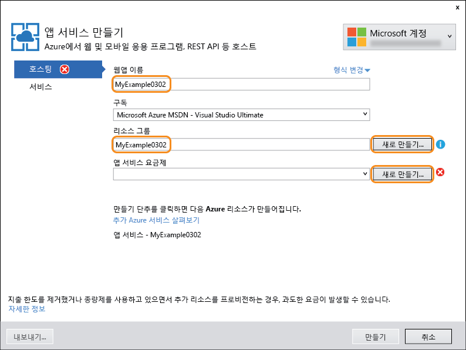
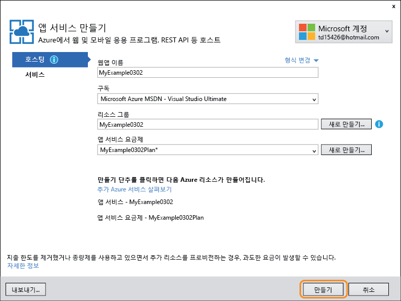
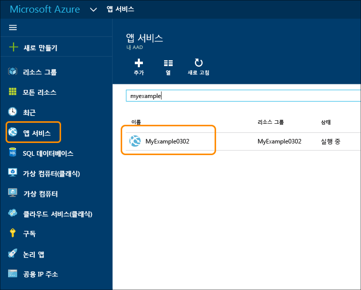
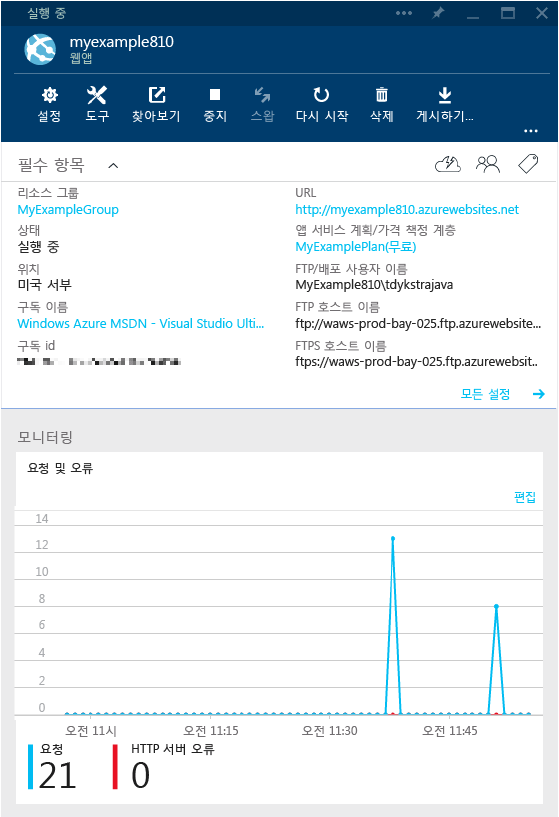
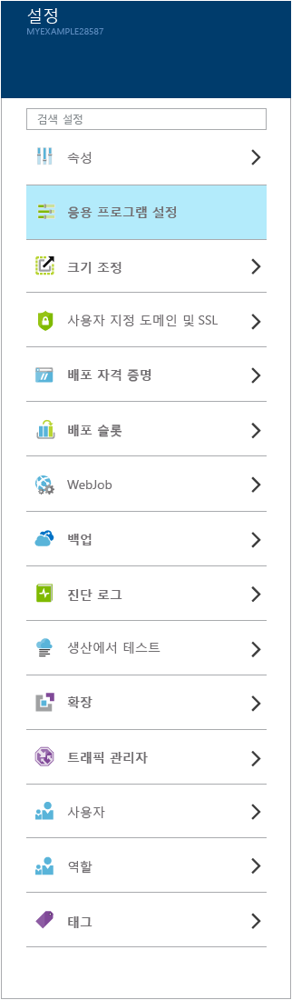
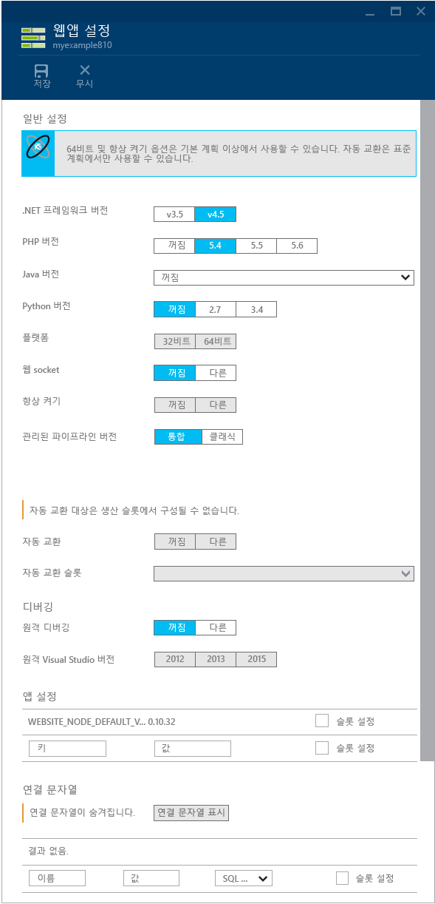
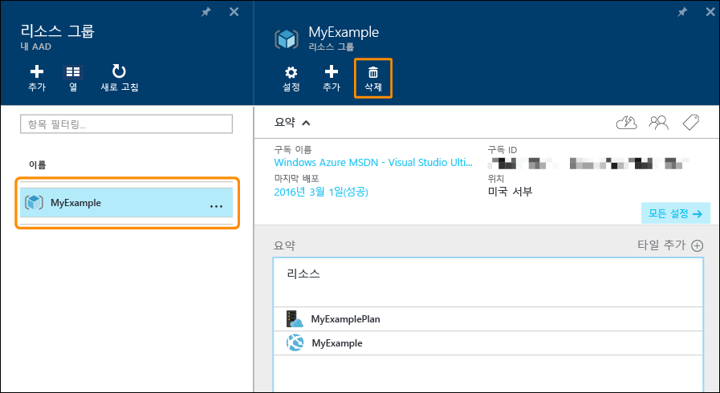

<properties
	pageTitle="Azure 앱 서비스 및 ASP.NET 시작 | Microsoft Azure"
	description="Visual Studio를 사용하여 Azure 앱 서비스에서 새 웹 앱에 ASP.NET을 배포하는 방법에 대해 알아봅니다."
	services="app-service\web"
	documentationCenter=".net"
	authors="tdykstra"
	manager="wpickett"
	editor=""/>

<tags
	ms.service="app-service-web"
	ms.workload="web"
	ms.tgt_pltfrm="na"
	ms.devlang="dotnet"
	ms.topic="get-started-article"
	ms.date="04/22/2016"
	ms.author="tdykstra"/>

# ASP.NET a및 Visual Studio를 사용하여 Azure 앱 서비스에서 웹 앱 시작

> [AZURE.SELECTOR]
- [.Net](web-sites-dotnet-get-started.md)
- [Node.JS](app-service-web-nodejs-get-started.md)
- [Java](web-sites-java-get-started.md)
- [PHP - Git](web-sites-php-mysql-deploy-use-git.md)
- [PHP - FTP](web-sites-php-mysql-deploy-use-ftp.md)
- [Python](web-sites-python-ptvs-django-mysql.md)

## 개요

이 자습서에서는 Visual Studio 2015를 사용하여 ASP.NET 웹 응용 프로그램을 [Azure 앱 서비스의 웹앱](app-service-web-overview.md)에 배포하는 방법을 보여줍니다. 이 자습서에서는 이전에 Azure을 사용한 경험이 없는 ASP.NET 개발자를 가정합니다. 이 자습서를 완료하면 클라우드에서 간단한 웹 응용 프로그램을 실행할 수 있습니다.

다음 그림에서는 완료된 응용 프로그램을 보여 줍니다.

다음 내용을 배웁니다.

* Visual Studio에서 새 웹 프로젝트를 만드는 동안 새 앱 서비스 웹 앱을 만드는 방법
* Visual Studio를 사용하여 앱 서비스 웹앱에 웹 프로젝트를 배포하는 방법
* [Azure 포털](/features/azure-portal/)을 사용하여 웹앱을 모니터링 및 관리하는 방법

자습서를 종료한 후 작동하지 않는 경우 [문제 해결](#troubleshooting) 섹션은 수행할 작업에 대한 아이디어를 제공하고 [다음 단계](#next-steps) 섹션은 Azure 앱 서비스를 사용하는 방법에 대해 더 심층적으로 살펴보는 다른 자습서에 대한 링크를 제공합니다.

## 필수 조건

[AZURE.INCLUDE [선행 조건](../../includes/app-service-web-dotnet-get-started-prereqs.md)]

## Azure 앱 서비스에서 웹 프로젝트 및 웹 앱 만들기

첫 번째 단계는 Visual Studio의 웹 프로젝트와 Azure App Service의 웹앱을 만드는 것입니다. 이 작업을 마치면 프로젝트를 인터넷에서 사용할 수 있게 웹 앱에 배포합니다.

만들기와 배포 단계에서 수행하는 작업이 다이어그램에 설명되어 있습니다.

1. Visual Studio 2015를 엽니다.

2. **파일 > 새로 만들기 > 프로젝트**를 클릭합니다.

3. **새 프로젝트** 대화 상자에서 **Visual C# > 웹 > ASP.NET 웹 응용 프로그램**을 클릭합니다. (원하는 경우 **Visual Basic**을 선택할 수 있습니다.)

3. **.NET Framework 4.5.2**가 대상 프레임워크로 선택되었는지 확인합니다.

4.  [Azure Application Insights](../application-insights/app-insights-overview.md)는 웹앱의 가용성, 성능 및 사용량을 모니터링합니다. **프로젝트에 Application Insights 추가** 확인란은 Visual Studio를 설치한 후 웹 프로젝트를 처음 만들 때 기본적으로 선택됩니다. 확인란이 선택되었지만 Application Insights를 평가하지 않으려면 확인란의 선택을 취소합니다.

4. 응용 프로그램 이름을 **MyExample**로 지정합니다.

5. **확인**을 클릭합니다.

	

5. **새 ASP.NET 프로젝트** 대화 상자에서 **MVC** 템플릿을 선택합니다.

7. **인증 변경**을 클릭합니다.

	

6. **인증 변경** 대화 상자에서 **인증 없음**, **확인**을 차례로 클릭합니다.

	

	이 자습서를 위해 만들고 있는 응용 프로그램은 사용자 로그인을 지원하지 않는 단순한 것입니다.

5. **새 ASP.NET 프로젝트** 대화 상자의 **Microsoft Azure** 섹션에서 **클라우드에서 호스트**가 선택되어 있는지 그리고 드롭다운 목록에서 **앱 서비스**가 선택되어 있는지 확인합니다.

	

	이러한 설정은 Visual Studio를 지정하여 웹 프로젝트용 Azure 웹앱을 만듭니다.

6. **확인**을 클릭합니다.

5. Azure에 아직 로그인하지 않은 경우 로그인하라는 메시지가 Visual Studio에 표시됩니다. Azure 구독을 관리하는 데 사용하는 계정의 ID 및 암호로 로그인합니다.

	로그인하면 만들려는 리소스에 대해 묻는 **Create App Service(앱 서비스 만들기)** 대화 상자가 표시됩니다.

	

3. **앱 서비스 만들기** 대화 상자에 *azurewebsites.net* 도메인에서 고유한 **웹앱 이름**을 입력합니다. 예를 들어, MyExample810처럼 MyExample 오른쪽에 숫자를 더하여 고유의 이름을 지정할 수 있습니다. 기본 웹 이름이 만들어진 경우 해당 이름은 고유하므로 사용할 수 있습니다.

	입력한 이름을 다른 사용자가 이미 사용한 경우 녹색 확인 표시 대신 오른쪽에 빨간색 느낌표가 표시되며, 다른 이름을 입력해야 합니다.

	응용 프로그램에 대한 URL은 이 이름과 *.azurewebsites.net*(**웹앱 이름** 텍스트 상자 옆에 표시)입니다. 예를 들어 이름이 `MyExample810`이면 URL은 `myexample810.azurewebsites.net`이 됩니다.

	[다음 단계](#next-steps) 섹션은 Azure 웹앱으로 고유의 사용자 지정 도메인을 사용하는 방법을 설명하는 자습서로 연결됩니다.

6. **리소스 그룹** 상자 옆에서 **새로 만들기**를 클릭한 다음, "MyExample" 또는 원하는 다른 이름을 입력합니다.

	이 콤보 상자에서 기존 리소스 그룹을 선택하거나 구독의 기존 리소스 그룹과 다른 이름을 입력하여 새 리소스 그룹을 만들 수 있습니다.

	리소스 그룹은 웹앱, 데이터베이스, VM과 같은 Azure 리소스의 컬렉션입니다. 자습서에서는 일반적으로 새 리소스 그룹을 만드는 것이 가장 좋습니다. 자습서에서 만든 모든 Azure 리소스를 한 번에 쉽게 삭제할 수 있기 때문입니다. 자세한 내용은 [Azure Resource Manager 개요](../resource-group-overview.md)를 참조하세요.

4. **앱 서비스 계획** 드롭다운 옆의 **새로 만들기** 단추를 클릭합니다.

	

	스크린샷은 **웹앱 이름**, **구독** 및 **리소스 그룹**에 대한 샘플 값을 보여줍니다. -- 값은 달라질 수 있습니다.

	다음 단계에서는 새 리소스 그룹에 대한 앱 서비스 계획을 만듭니다. 앱 서비스 계획은 웹앱이 실행되는 계산 리소스를 지정합니다. 예를 들어, 무료 계층을 선택한 경우 API 앱은 공유 VM에서 실행되지만, 일부 유료 계층에의 경우 전용 VM에서 실행됩니다. 자세한 내용은 [앱 서비스 계획 개요](../app-service/azure-web-sites-web-hosting-plans-in-depth-overview.md)를 참조하세요.

5. **앱 서비스 계획 구성** 대화 상자에서 "MyExamplePlan" 또는 원하는 경우 다른 이름을 입력합니다.

5. **위치** 드롭다운 목록에서 가장 가까운 위치를 선택합니다.

	이 설정은 앱이 실행되는 Azure 데이터 센터를 지정합니다. 이 자습서에서는 어떤 지역이든 선택할 수 있으며 지역에 따른 뚜렷한 차이는 없습니다. 그러나 프로덕션 앱의 경우 [대기 시간](http://www.bing.com/search?q=web%20latency%20introduction&qs=n&form=QBRE&pq=web%20latency%20introduction&sc=1-24&sp=-1&sk=&cvid=eefff99dfc864d25a75a83740f1e0090)을 최소화하기 위해 액세스하는 클라이언트와 최대한 가깝게 서버를 배치할 수 있습니다.

5. **크기** 드롭다운에서 **무료**를 클릭합니다.

	이 자습서의 경우 무료 가격 책정 계층으로도 충분한 성능이 제공됩니다.

6. **앱 서비스 계획 구성** 대화 상자에서 **확인**을 클릭합니다.

	

7. **앱 서비스 만들기** 대화 상자에서 **만들기**를 클릭합니다.

	

	짧은 시간 내에, 일반적으로 1분 미만 동안 Visual Studio는 웹 프로젝트 및 웹앱을 만듭니다.

	**솔루션 탐색기** 창에 새 프로젝트의 파일 및 폴더가 표시됩니다.

	

	**Azure 앱 서비스 작업** 창에 웹앱이 만들어졌다고 표시됩니다.

	

	Visual Studio **클라우드 탐색기** 창에서 웹앱을 볼 수 있습니다.

	
	
	이 창을 통해 다양한 Azure 리소스를 보고 관리할 수 있습니다. 스크린 샷은 웹앱만을 표시하지만 **클라우드 탐색기** 창에서 더 많은 리소스 형식을 확인할 수 있습니다. 웹앱과 같은 리소스를 마우스 오른쪽 단추로 클릭하여 관리하기 위한 옵션을 확인합니다.

## Azure 웹앱에 웹 프로젝트 배포

이 섹션에서는 다이어그램의 2단계에 나와 있는 대로 웹앱에 웹 프로젝트를 배포합니다.

1. **솔루션 탐색기**에서 프로젝트를 마우스 오른쪽 단추로 클릭하고 **게시**를 선택합니다.

	

	몇 초 후에 **웹 게시** 마법사가 나타납니다. 마법사에 웹 프로젝트를 새 웹앱으로 배포하기 위한 설정이 포함된 *프로필 게시*가 열립니다. 다른 웹앱에 배포하려면 **프로필** 탭을 클릭하여 다른 프로필을 만들 수 있습니다. 이 자습서에서는 이전에 만든 웹앱에 배포하는 설정을 수락합니다.

	게시 프로필은 배포하기 위한 사용자 이름 및 암호를 포함합니다. 이러한 자격 증명은 사용자를 위해 생성되며 입력하거나 변경할 필요가 없습니다. 암호는 `Properties\PublishProfiles` 폴더의 숨겨진 사용자 특정 파일에 암호화됩니다.

8. **웹 게시** 마법사의 **연결** 탭에서 **다음**을 클릭합니다.

	

	다음 탭은 **설정** 탭입니다. 여기에서 빌드 구성 탭을 변경하여 [원격 디버깅](../app-service-web/web-sites-dotnet-troubleshoot-visual-studio.md#remotedebug)을 위한 디버그 빌드를 배포할 수 있습니다. 이 탭은 몇 가지 **파일 게시 옵션**도 제공합니다.

	* 대상에 있는 추가적인 파일을 제거합니다.
	* 게시 중 미리 컴파일합니다.
	* App\_Data 폴더에서 파일을 실행합니다.

	이 자습서의 경우 이런 것들이 필요하지 않습니다. 옵션을 통해 수행하는 작업에 대한 자세한 설명은 [Visual Studio의 One-Click 게시를 사용하여 웹 프로젝트 배포 방법](https://msdn.microsoft.com/library/dd465337.aspx)을 참조하세요.

10. **설정** 탭에서 **다음**을 클릭합니다.

	

	다음은 **미리 보기** 탭입니다. 여기서는 어떤 파일이 프로젝트에서 API 앱으로 복사되는지 볼 수 있습니다. 이전에 배포한 API 앱에 프로젝트를 배포하는 경우, 변경된 파일만 복사됩니다. 복사될 파일 목록을 표시하려면 **미리 보기 시작** 단추를 클릭할 수 있습니다.

11. **미리 보기** 탭에서 **게시**를 클릭합니다.

	

	**게시**를 클릭하면 Visual Studio에서 Azure 서버로 파일을 복사하는 프로세스를 시작합니다. 1분 또는 2분이 걸릴 수 있습니다.

	**출력** 및 **Azure 앱 서비스 활동** 창에 수행된 배포 작업이 표시되고 성공적인 배포 완료가 보고됩니다.

	

	배포에 성공하면 기본 브라우저에서 배포된 웹 응용 프로그램의 URL이 자동으로 열리며, 만든 응용 프로그램이 이제 클라우드에서 실행되고 있습니다. 브라우저 주소 표시줄의 URL은 웹앱이 인터넷에서 로드됨을 보여 줍니다.

	

> [AZURE.TIP] 빠른 배포를 위해 **한 번 클릭으로 웹 게시** 도구 모음을 사용할 수 있습니다. **보기 > 도구 모음**을 클릭한 다음 **한 번 클릭으로 웹 게시**를 선택합니다. 이 도구 모음을 사용하여 프로필을 선택하거나, 단추를 클릭하여 게시하거나, 단추를 클릭하여 **웹 게시** 마법사를 열 수 있습니다. 

##  Azure 포털에서 웹앱 모니터링 및 관리

[Azure 포털](/services/management-portal/)은 Azure 서비스(예: 방금 만든 웹앱)를 관리하고 모니터링하는 데 사용할 수 있는 웹 인터페이스입니다. 자습서의 이 섹션에서는 포털에서 수행할 수 있는 작업 중 일부를 살펴봅니다.

1. 브라우저에서 [https://portal.azure.com](https://portal.azure.com)으로 이동하고 Azure 계정을 관리하는 데 사용하는 자격 증명을 사용하여 로그인합니다.

2. **웹 서비스**를 클릭한 다음 웹앱의 이름을 클릭합니다.

	

	**웹앱** 블레이드에 웹앱의 설정 개요와 사용량 통계가 표시됩니다. (포털에서 오른쪽으로 열리는 창을 *블레이드*라고 합니다.)

	

	웹앱에 트래픽이 많지 않아서 그래프에 아무 것도 표시되지 않을 수 있습니다. 응용 프로그램을 탐색하고, 페이지를 몇 번 새로 고친 다음 포털 페이지를 새로 고치면 몇 가지 통계가 표시됩니다.

3. **설정** 블레이드는 더 많은 웹앱 구성 옵션을 표시합니다.

	

	**게시** 섹션에서 **배포 자격 증명**이 연결됩니다. 여기에 배포를 위해 사용자 지정 사용자 이름 및 암호를 만들 수 있습니다. 블레이드의 위쪽에서 **저장** 단추를 클릭하여 변경 사항을 제출합니다. 새 사용자 이름 및 암호를 만들면 동일한 값을 웹 프로젝트의 **웹 게시** 마법사에 있는 **연결** 탭에 입력해야 합니다.
	
	스크린샷은 **설정** 블레이드의 부분 보기입니다. 이 블레이드에는 표시된 것보다 더 많은 섹션이 있습니다.

4. **설정** 블레이드의 **일반** 섹션에서 **응용 프로그램 설정**을 클릭하여 포털에서 구성할 수 설정 유형의 예를 볼 수 있습니다.

	예를 들어 웹앱에서 사용되는 .NET 버전을 제어하고, [WebSockets](/blog/2013/11/14/introduction-to-websockets-on-windows-azure-web-sites/)와 같은 기능을 활성화하고, [연결 문자열 값](/blog/2013/07/17/windows-azure-web-sites-how-application-strings-and-connection-strings-work/)을 설정하는 등의 기능을 사용할 수 있습니다.

	

이러한 기능은 포털의 일부에 지나지 않습니다. 또한 새 웹앱을 만들고, 기존 웹앱을 삭제하고, 웹앱을 중지 및 다시 시작하고, 다른 Azure 서비스(예: 데이터베이스 및 가상 컴퓨터)를 관리할 수도 있습니다.

## Azure 웹앱 삭제

이 자습서에 대해 만든 웹앱이 더 이상 필요하지 않은 경우 삭제할 수 있습니다.

Azure 포털에서 **웹앱** 블레이드의 위에 있는 **삭제** 단추를 클릭하면 웹앱을 쉽게 삭제할 수 있습니다. 더 나은 방법은 웹앱을 포함하도록 만든 리소스 그룹을 삭제하는 것입니다. 이 자습서의 경우 리소스 그룹에는 웹앱만이 포함되어 있지만 일반적인 리소스 그룹은 관련된 리소스의 컬렉션을 모두 포함합니다. 예를 들어, 웹앱을 삭제한 경우 웹앱은 더 이상 필요하지 않은 데이터베이스 또는 Azure 저장소 계정을 사용할 수 있습니다. 리소스 그룹을 삭제하면 포함된 모든 항목이 삭제됩니다. Azure 포털을 사용하여 리소스 그룹을 삭제하려면 다음 단계를 수행합니다.

1. [Azure 포털](https://portal.azure.com)의 홈 페이지로 이동합니다.

2. **리소스 그룹**을 클릭합니다.

3. 리소스 그룹 목록에서 삭제하려는 리소스 그룹을 클릭합니다.

	**리소스 그룹** 블레이드가 나타나면 포함된 리소스의 목록을 포함합니다.

4. **리소스 그룹** 블레이드에서 **삭제**를 클릭합니다.

	

## 문제 해결

이 자습서를 진행하면서 문제에 직면하는 경우 .NET용 Azure SDK의 최신 버전을 사용하도록 합니다. 작업을 수행하는 가장 쉬운 방법은 [Visual Studio 2015용 Azure SDK를 다운로드](http://go.microsoft.com/fwlink/?linkid=518003)하는 것입니다. 현재 버전이 설치되어 있다면 웹 플랫폼 설치 관리자에서 설치가 필요하지 않다고 알려줍니다.

회사 네트워크에서 방화벽을 통해 Azure 앱 서비스에 배포하려고 하는 경우 포트 443 및 8172가 웹 배포에 열려 있는지 확인합니다. 해당 포트를 열 수 없으면 다른 배포 옵션에서 다음 단계 섹션을 참조하세요.

Azure 앱 서비스에서 ASP.NET 웹앱이 실행 중인 경우 문제 해결을 단순화하는 Visual Studio 기능에 대한 자세한 내용을 확인할 수 있습니다. 로깅, 원격 디버깅 등에 대한 정보는 [Visual Studio에서 Azure 웹앱 문제 해결](web-sites-dotnet-troubleshoot-visual-studio.md)을 참조하세요.

## 다음 단계

이 자습서에서는 간단한 웹 응용 프로그램을 만들고 Azure 웹앱에 배포하는 방법을 확인했습니다. 다음은 Azure 앱 서비스에 관한 자세한 내용을 확인할 수 있는 몇 가지 관련 항목 및 리소스입니다.

* 새 웹앱에 기존 웹 프로젝트를 배포하는 방법

	기존 웹 프로젝트에 배포 프로세스를 시작하려면 **솔루션 탐색기**에서 프로젝트를 마우스 오른쪽 단추로 클릭한 다음 **게시**를 클릭합니다. **Microsoft Azure 앱 서비스**를 게시 대상으로 선택합니다. 그런 다음 기존 Azure 웹앱을 대상으로 선택하거나 **새로 만들기**를 클릭하여 새 계정을 만듭니다. **새로 만들기**를 클릭하여 새 계정을 만드는 경우 이 자습서에 표시되는 프로세스와 동일합니다.

* 웹앱을 만드는 다른 방법

	[Azure 포털](https://portal.azure.com/), [Windows PowerShell용 Azure cmdlet](../powershell-install-configure.md) 또는 [플랫폼 간 명령줄 인터페이스](../xplat-cli.md)를 사용하여 웹앱을 만들 수도 있습니다.

* API 앱을 만드는 방법

	주로 웹 사이트를 호스트하기 위한 Azure 앱 서비스의 인스턴스를 만드는 방법을 살펴봤습니다. 이러한 인스턴스는 웹앱이라고 합니다. 앱 서비스는 API 개발, 시험 및 호스트를 더 쉽게 만들도록 설계된 기능도 가지고 있습니다. 주로 API를 호스트하려는 앱 서비스의 인스턴스를 API 앱이라고 합니다. 자세한 내용은 [Azure 앱 서비스에서 API 앱 및 ASP.NET 시작](../app-service-api/app-service-api-dotnet-get-started.md)을 참조하세요.

* 웹 프로젝트를 배포하는 다른 방법

	Visual Studio를 사용하거나 [소스 제어 시스템](http://www.asp.net/aspnet/overview/developing-apps-with-windows-azure/building-real-world-cloud-apps-with-windows-azure/source-control)에서 [배포를 자동화](http://www.asp.net/aspnet/overview/developing-apps-with-windows-azure/building-real-world-cloud-apps-with-windows-azure/continuous-integration-and-continuous-delivery)하여 웹앱에 웹 프로젝트를 배포하는 다른 방법에 대한 개요는 [Azure 앱 서비스에서 웹앱 시작](app-service-web-get-started.md) 및 [Azure 웹앱을 배포하는 방법](web-sites-deploy.md)을 참조하세요.

* 사용자 지정 도메인 이름 및 SSL을 추가하는 방법

	SSL 및 사용자만의 도메인(예: contoso.azurewebsites.net가 아닌 www.contoso.com 사용)을 사용하는 방법에 대한 자세한 내용은 다음 리소스를 참조하세요.

	* [Azure 앱 서비스에서 사용자 지정 도메인 이름 구성](web-sites-custom-domain-name.md)
	* [Azure 웹 사이트에 HTTPS 사용](web-sites-configure-ssl-certificate.md)

* 채팅과 같은 실시간 기능을 추가하는 방법

	채팅 서비스, 게임 또는 주식 기호와 같은 실시간 기능의 경우 [WebSockets](/blog/2013/11/14/introduction-to-websockets-on-windows-azure-web-sites/) 전송 방식으로 [ASP.NET SignalR](http://www.asp.net/signalr)을 사용하여 최상의 성과를 얻을 수 있습니다. 자세한 내용은 [Azure 웹앱에서 SignalR 사용](http://www.asp.net/signalr/overview/signalr-20/getting-started-with-signalr-20/using-signalr-with-windows-azure-web-sites)을 참조하세요.

* 웹 응용 프로그램용 앱 서비스, Azure 클라우드 서비스 및 Azure 가상 컴퓨터를 선택하는 방법

	Azure에서는 앱 서비스 웹앱을 웹 사이트(이 자습서에 설명됨), 클라우드 서비스 또는 가상 컴퓨터에서 실행할 수 있습니다. 자세한 내용은 [Azure 웹앱, 클라우드 서비스 및 VM: 사용하는 경우](/manage/services/web-sites/choose-web-app-service/)를 참조하세요.

<!----HONumber=AcomDC_0427_2016-->