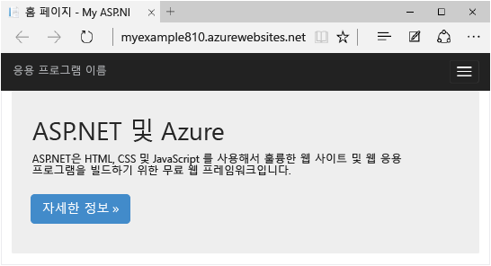
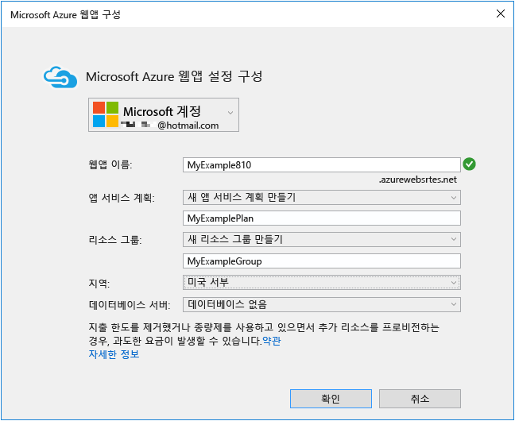
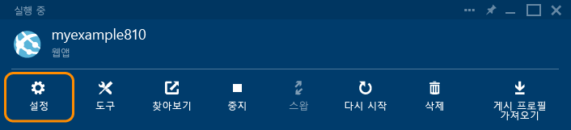

<properties
	pageTitle="Azure 앱 서비스에서 ASP.NET 웹앱 만들기 | Microsoft Azure"
	description="이 자습서에서는 Visual Studio 2013에서 ASP.NET 웹 프로젝트를 만들어 Azure 앱 서비스의 앱 응용 프로그램에 배포하는 방법에 대해 알아봅니다."
	services="app-service\web"
	documentationCenter=".net"
	authors="tdykstra"
	manager="wpickett"
	editor="jimbe"/>

<tags
	ms.service="app-service-web"
	ms.workload="web"
	ms.tgt_pltfrm="na"
	ms.devlang="dotnet"
	ms.topic="hero-article"
	ms.date="10/16/2015"
	ms.author="tdykstra"/>

# Azure 앱 서비스에서 ASP.NET 웹 응용 프로그램 만들기

> [AZURE.SELECTOR]
- [.Net](web-sites-dotnet-get-started.md)
- [Node.js](web-sites-nodejs-develop-deploy-mac.md)
- [Java](web-sites-java-get-started.md)
- [PHP - Git](web-sites-php-mysql-deploy-use-git.md)
- [PHP - FTP](web-sites-php-mysql-deploy-use-ftp.md)
- [Python](web-sites-python-ptvs-django-mysql.md)

## 개요

이 자습서에서는 Visual Studio 2015 또는 Visual Studio 2013을 사용하여 ASP.NET 웹 응용 프로그램을 [Azure 앱 서비스의 웹앱](app-service-web-overview.md)에 배포하는 방법을 보여줍니다. 이 자습서에서는 이전에 Azure을 사용한 경험이 없는 ASP.NET 개발자를 가정합니다. 이 자습서를 완료하면 클라우드에서 간단한 웹 응용 프로그램을 실행할 수 있습니다.

다음 그림에서는 완료된 응용 프로그램을 보여 줍니다.

다음 내용을 배웁니다.

* [Azure SDK for .NET](../dotnet-sdk/)을 설치하여 Azure 개발용 컴퓨터를 준비하는 방법
* Visual Studio를 설정하여 앱 서비스 웹앱으로 ASP.NET MVC 5 웹 프로젝트를 만들면서 새 앱 서비스 웹앱을 만드는 방법
* Visual Studio를 사용하여 앱 서비스 웹앱에 웹 프로젝트를 배포하는 방법
* Visual Studio **서버 탐색기**를 사용하여 원격 파일을 열고 원격 디버그 세션을 시작하는 방법입니다. 
* [Azure 포털](/overview/preview-portal/)을 사용하여 웹앱을 모니터링 및 관리하는 방법

> [AZURE.NOTE]이 자습서는 Azure 앱 서비스와 ASP.NET을 사용하는 방법을 설명합니다. ASP.NET 웹앱을 개발하는 방법을 가르치지 않습니다. ASP.NET MVC 5에 대한 소개는 [ASP.NET](http://asp.net/) 사이트에서 [ASP.NET MVC 5 시작](http://www.asp.net/mvc/overview/getting-started/introduction/getting-started)을 참조하세요. Azure 앱 서비스를 사용하는 방법에 대해 더 심층적으로 살펴보는 다른 문서에 대한 링크는 [다음 단계](#next-steps) 섹션을 참조하세요.
> 
> 이 자습서의 범위 및 접근 방식을 알도록 돕습니다. -- 여기 시작 자습서에서 살펴보고 싶은 다른 항목이 있는 경우 자습서의 끝에 있는 [Disqus 주석](#comments)에 피드백을 남겨주세요.

##Microsoft Azure 등록

이 자습서를 완료하려면 Azure 계정이 있어야 합니다. 다음을 수행할 수 있습니다.

* [Azure 계정을 무료로 개설할 수 있습니다](/pricing/free-trial/?WT.mc_id=A261C142F). 유료 Azure 서비스를 사용해볼 수 있는 크레딧을 받게 됩니다. 크레딧을 모두 사용한 후에도 계정을 유지하고 무료 Azure 서비스 및 기능(예: Azure 앱 서비스의 웹앱 기능)을 사용할 수 있습니다.
* [MSDN 구독자 혜택을 활성화할 수 있습니다](/pricing/member-offers/msdn-benefits-details/?WT.mc_id=A261C142F). MSDN 구독은 유료 Azure 서비스에 사용할 수 있는 크레딧을 매달 제공합니다.

Azure 계정을 등록하기 전에 Azure 앱 서비스를 시작하려는 경우 [앱 서비스 평가](http://go.microsoft.com/fwlink/?LinkId=523751)로 이동하세요. 여기서 신용 카드와 약정 없이 앱 서비스에서 수명이 짧은 스타터 웹앱을 즉시 만들 수 있습니다.

다음 비디오에서 Scott Hanselman은 Microsoft Azure의 무료 평가판 등록이 얼마나 쉬운지 보여 줍니다. (소요 시간: 1분 58초)

> [AZURE.VIDEO sign-up-for-microsoft-azure]

[AZURE.INCLUDE [install-sdk-2015-2013](../../includes/install-sdk-2015-2013.md)]

## 프로젝트 및 웹앱 만들기

첫 번째 단계는 Visual Studio의 웹 프로젝트와 Azure App Service의 웹앱을 만드는 것입니다. 이 작업을 마치면 프로젝트를 인터넷에서 사용할 수 있게 웹앱에 배포합니다.

만들기와 배포 단계에서 수행하는 작업이 다이어그램에 설명되어 있습니다.

1. Visual Studio 2015 또는 Visual Studio 2013을 엽니다.

	Visual Studio 2013을 사용할 경우 화면이 스크린샷과 약간 다르지만 기본적으로 절차는 동일합니다.

2. **파일** 메뉴에서 **새로 만들기 >프로젝트**를 클릭합니다.

3. **새 프로젝트** 대화 상자에서 **C# > Web > ASP.NET 웹 응용 프로그램**을 클릭합니다. 원하는 경우 **Visual Basic**을 선택할 수 있습니다.

3. **.NET Framework 4.5.2**가 대상 프레임워크로 선택되었는지 확인합니다.

4.  [Azure Application Insights](app-insights-overview.md)는 웹앱의 가용성, 성능 및 사용량을 모니터링합니다. 평가하지 않으려면 **프로젝트에 Application Insights 추가** 확인란의 선택을 취소합니다.

4. 응용 프로그램 이름을 **MyExample**로 지정합니다.

5. **확인**을 클릭합니다.

	

5. **새 ASP.NET 프로젝트** 대화 상자에서 **MVC** 템플릿을 선택합니다.

	[MVC](http://www.asp.net/mvc)는 웹앱 제작을 위한 ASP.NET 프레임워크입니다.

7. **인증 변경**을 클릭합니다.

	

6. **인증 변경** 대화 상자에서 **인증 없음**, **확인**을 차례로 클릭합니다.

	

	여기서 만드는 샘플 응용 프로그램에는 사용자가 로그인할 수 없습니다. [다음 단계](#next-steps) 섹션은 인증 및 권한 부여를 구현하는 자습서로 연결됩니다.

5. **새 ASP.NET 프로젝트** 대화 상자에서 **Microsoft Azure** 아래의 설정을 그대로 둔 다음 **확인**을 클릭합니다.

	

	기본 설정은 Visual Studio에서 웹 프로젝트용 Azure 웹 응용 프로그램을 만들도록 지정합니다. 자습서의 다음 섹션에서는 새로 만든 웹앱에 웹 프로젝트를 배포합니다.

5. Azure에 아직 로그인하지 않은 경우 로그인하라는 메시지가 Visual Studio에 표시됩니다. Azure 구독을 관리하는 데 사용하는 계정의 ID 및 암호로 로그인합니다.

	로그인하면 만들려는 리소스에 대해 묻는 **Microsoft Azure 웹앱 설정 구성** 대화 상자가 표시됩니다.

	

3. **Microsoft Azure 웹앱 설정 구성** 대화 상자에 *azurewebsites.net* 도메인에서 고유한 **웹앱 이름**을 입력합니다. 예를 들어, MyExample810처럼 MyExample 오른쪽에 숫자를 더하여 고유의 이름을 지정할 수 있습니다. 기본 웹 이름이 만들어진 경우 해당 이름은 고유하므로 사용할 수 있습니다.

	입력한 이름을 다른 사용자가 이미 사용한 경우 녹색 확인 표시 대신 오른쪽에 빨간색 느낌표가 표시되며, 다른 이름을 입력해야 합니다.

	Azure에서는 응용 프로그램의 URL에 대한 접두사로 이 이름을 사용합니다. 전체 URL은 이 이름과 *.azurewebsites.net*(**웹앱 이름** 텍스트 상자 옆에 표시)으로 구성됩니다. 예를 들어 이름이 `MyExample810`이면 URL은 `MyExample810.azurewebsites.net`이 됩니다. URL은 고유해야 합니다.

4. **앱 서비스 계획** 드롭다운에서 **새 앱 서비스 계획 만들기**를 선택합니다.

	[다음 단계](#next-steps) 섹션에 앱 서비스 계획에 대한 정보의 링크가 있습니다.

5. 계획 이름에 **MyExamplePlan** 또는 원하는 다른 이름을 입력합니다.

6. **리소스 그룹** 드롭다운에서 **새 리소스 그룹 만들기**를 선택합니다.

	[다음 단계](#next-steps) 섹션에 리소스 그룹에 대한 정보의 링크가 있습니다.

5. 리소스 그룹 이름에 **MyExampleGroup** 또는 원하는 다른 이름을 입력합니다.

5. **지역** 드롭다운 목록에서 가장 가까운 위치를 선택합니다.

	이 설정은 웹앱이 실행되는 Azure 데이터 센터를 지정합니다. 이 자습서에서는 어떤 지역이든 선택할 수 있으며 지역에 따른 뚜렷한 차이는 없습니다. 그러나 프로덕션 웹앱의 경우 [대기 시간](http://www.bing.com/search?q=web%20latency%20introduction&qs=n&form=QBRE&pq=web%20latency%20introduction&sc=1-24&sp=-1&sk=&cvid=eefff99dfc864d25a75a83740f1e0090)을 최소화하기 위해 사용자 사이트에 액세스하는 브라우저와 최대한 가깝게 웹 서버를 배치할 수 있습니다.

5. 데이터베이스 필드를 변경하지 않고 그대로 둡니다.

	이 자습서에서는 데이터베이스를 사용하지 않습니다. [다음 단계](#next-steps) 섹션은 데이터베이스 사용 방법을 보여주는 자습서로 연결됩니다.

6. **확인**을 클릭합니다.

	

	몇 초 후 Visual Studio에서 지정된 폴더에 웹 프로젝트를 만들고 지정된 Azure 지역에 웹앱을 만듭니다.

	**솔루션 탐색기** 창에 새 프로젝트의 파일 및 폴더가 표시됩니다.

	

	**Azure 앱 서비스 작업** 창에 웹앱이 만들어졌다고 표시됩니다.

	

	이제 **서버 탐색기**에서 웹앱을 볼 수 있습니다.

	

## 웹앱에 프로젝트 배포

이 섹션에서는 다이어그램의 2단계에 나와 있는 설명과 같이 웹앱에 웹 프로젝트를 배포합니다.

1. **솔루션 탐색기**에서 프로젝트를 마우스 오른쪽 단추로 클릭하고 **게시**를 선택합니다.

	

	몇 초 후에 **웹 게시** 마법사가 나타납니다. 마법사에 웹 프로젝트를 새 웹앱으로 배포하기 위한 설정이 포함된 *프로필 게시*가 열립니다. 다른 웹앱에 배포하려면 **프로필** 탭을 클릭하여 다른 프로필을 만들 수 있습니다. 이 자습서에서는 이전에 만든 웹앱에 배포하는 설정을 수락합니다.

8. **웹 게시** 마법사의 **연결** 탭에서 **다음**을 클릭합니다.

	

10. **설정** 탭에서 **다음**을 클릭합니다.

	**구성** 및 **파일 게시 옵션**의 기본값을 그대로 사용합니다.

	**구성** 드롭다운을 사용하여 원격 디버깅을 위한 디버그 빌드를 배포할 수 있습니다. [다음 단계](#next-steps) 섹션은 Visual Studio를 원격에서 디버그 모드로 실행하는 방법을 보여 주는 자습서로 연결됩니다.

	

11. **미리 보기** 탭에서 **게시**를 클릭합니다.

	Azure에 복사할 파일을 확인하려면 **게시**를 클릭하기 전에 **미리 보기 시작**을 클릭하면 됩니다.

	

	**게시**를 클릭하면 Visual Studio에서 Azure 서버로 파일을 복사하는 프로세스를 시작합니다.

	**출력** 및 **Azure 앱 서비스 활동** 창에 수행된 배포 작업이 표시되고 성공적인 배포 완료가 보고됩니다.

	

	배포에 성공하면 기본 브라우저에서 배포된 웹 응용 프로그램의 URL이 자동으로 열리며, 만든 응용 프로그램이 이제 클라우드에서 실행되고 있습니다. 브라우저 주소 표시줄의 URL은 웹앱이 인터넷에서 로드됨을 보여 줍니다.

	

13. 다음 섹션에서 사용하기 위해 이 브라우저 창을 열어둡니다.

**팁:** 빠른 배포를 위해 **한 번 클릭으로 웹 게시** 도구 모음을 사용할 수 있습니다. **보기 > 도구 모음**을 클릭한 다음 **한 번 클릭으로 웹 게시**를 선택합니다. 이 도구 모음을 사용하여 프로필을 선택하거나, 단추를 클릭하여 게시하거나, 단추를 클릭하여 **웹 게시** 마법사를 열 수 있습니다.

## 서버 탐색기에서 원격 파일 열기

웹앱을 테스트하고 디버깅할 때 원격 사이트에서 **서버 탐색기**의 파일을 열고 편집하여 빠른 임시 변경을 수행할 수 있습니다.

1.  **서버 탐색기**에서 **Azure > 앱 서비스 > MyExampleGroup**으로 이동한 다음 웹앱에 대한 노드를 확장합니다.

2. **파일 > 뷰 > 홈**을 확장한 다음 *Index.cshtml* 파일을 두 번 클릭합니다.

	

3. `<h1>ASP.NET</h1>`을 `<h1>Azure App Service</h1>`으로 변경합니다.

4. 파일을 저장합니다.

5. Azure에서 실행되는 사이트가 있는 브라우저 창을 새로 고칩니다.

	

이제 이 변경 내용은 로컬 프로젝트가 아닌 배포된 사이트에 포함됩니다. 프로젝트를 다시 배포하는 경우 사이트는 이러한 변경 사항을 적용하기 전의 방식으로 되돌아갑니다.

이 기능은 [자세한 오류 메시지를 가져오기 위해 Web.config 파일에서 customErrors를 일시적으로 해제](web-sites-dotnet-troubleshoot-visual-studio.md)하는 경우 유용합니다.

또한 **서버 탐색기**에서 웹앱 노드를 마우스 오른쪽 단추로 클릭하고 Visual Studio 창에서 웹앱 설정에 액세스하며 원격 디버깅 세션을 시작하고 응용 프로그램이 작성하는 순간 실시간으로 응용 프로그램 로그를 볼 수 있습니다.

자세한 내용은 [Visual Studio에서 Azure 웹앱 문제 해결](web-sites-dotnet-troubleshoot-visual-studio.md)을 참조하세요.

## Azure 포털에서 웹앱 모니터링 및 관리

[Azure 포털](/services/management-portal/)은 Azure 서비스(예: 방금 만든 웹앱)를 관리하고 모니터링하는 데 사용할 수 있는 웹 인터페이스입니다. 자습서의 이 섹션에서는 포털에서 수행할 수 있는 작업 중 일부를 살펴봅니다.

1. 브라우저에서 [https://portal.azure.com](https://portal.azure.com)으로 이동하여 Azure 자격 증명으로 로그인합니다.

2. **웹앱**을 클릭한 다음 웹앱의 이름을 클릭합니다.

	**웹앱** 블레이드에 웹앱의 설정 개요와 사용량 통계가 표시됩니다.

	

	지금은 웹앱의 트래픽이 그다지 많지 않아서 그래픽에 아무것도 표시되지 않을 수 있습니다. 응용 프로그램을 탐색하고, 페이지를 몇 번 새로 고친 다음 포털 페이지를 새로 고치면 몇 가지 통계가 표시됩니다.

3. 더 많은 웹앱 구성 옵션을 보려면 **설정**을 클릭합니다.

	

	설정 유형 목록이 표시됩니다.

	

4. **응용 프로그램 설정**을 클릭하여 포털에서 구성할 수 설정 유형의 예를 볼 수 있습니다.

	예를 들어 웹앱에서 사용되는 .NET 버전을 제어하고, [WebSockets](/blog/2013/11/14/introduction-to-websockets-on-windows-azure-web-sites/)와 같은 기능을 활성화하고, [연결 문자열 값](/blog/2013/07/17/windows-azure-web-sites-how-application-strings-and-connection-strings-work/)을 설정하는 등의 기능을 사용할 수 있습니다.

	

이러한 기능은 포털의 일부에 지나지 않습니다. 또한 새 웹앱을 만들고, 기존 웹앱을 삭제하고, 웹앱을 중지 및 다시 시작하고, 다른 Azure 서비스(예: 데이터베이스 및 가상 컴퓨터)를 관리할 수도 있습니다.

## 다음 단계

이 자습서에서는 간단한 웹 응용 프로그램을 만들고 Azure 웹앱에 배포하는 방법을 확인했습니다. 다음은 Azure 앱 서비스의 웹앱과 관련한 자세한 내용을 확인할 수 있는 몇 가지 관련 항목 및 리소스입니다.

* 데이터베이스 및 권한 부여 기능을 추가하는 방법

	데이터베이스에 액세스하는 방법과 일부 응용 프로그램 기능을 인증된 사용자만 사용할 수 있도록 제한하는 방법을 보여 주는 자습서는 [Azure 웹앱에 멤버 자격, OAuth 및 SQL 데이터베이스가 포함된 보안 ASP.NET MVC 앱 배포](/develop/net/tutorials/web-site-with-sql-database/)를 참조하세요. 이 자습서에서는 MVC 5에 대한 지식 일부를 가정합니다. MVC 5를 처음 접하는 경우 [ASP.NET MVC 5 시작](http://www.asp.net/mvc/overview/getting-started/introduction/getting-started)을 참조하세요.

* 웹 프로젝트를 배포하는 다른 방법

	Visual Studio를 사용하거나 [소스 제어 시스템](http://www.asp.net/aspnet/overview/developing-apps-with-windows-azure/building-real-world-cloud-apps-with-windows-azure/source-control)에서 [배포를 자동화](http://www.asp.net/aspnet/overview/developing-apps-with-windows-azure/building-real-world-cloud-apps-with-windows-azure/continuous-integration-and-continuous-delivery)하여 웹앱에 웹 프로젝트를 배포하는 다른 방법에 대한 개요는 [Azure 웹앱을 배포하는 방법](web-sites-deploy.md)을 참조하세요.

	Visual Studio에서 배포를 자동화하는 데 사용할 수 있는 Windows PowerShell 스크립트를 생성할 수도 있습니다. 자세한 내용은 [자동화(Azure에서 실제 클라우드 앱 빌드)](http://www.asp.net/aspnet/overview/developing-apps-with-windows-azure/building-real-world-cloud-apps-with-windows-azure/automate-everything)(영문)를 참조하십시오.

* 웹 응용 프로그램 문제를 해결하는 방법

	Visual Studio는 Azure 로그가 생성될 때 실시간으로 보기 쉽도록 만드는 기능을 제공합니다. 원격으로 Azure에서 디버그 모드로 실행할 수도 있습니다. 자세한 내용은 [Visual Studio에서 Azure 웹앱 문제 해결](web-sites-dotnet-troubleshoot-visual-studio.md)을 참조하세요.

* 사용자 지정 도메인 이름 및 SSL을 추가하는 방법

	SSL 및 사용자만의 도메인(예: contoso.azurewebsites.net가 아닌 www.contoso.com 사용)을 사용하는 방법에 대한 자세한 내용은 다음 리소스를 참조하세요.

	* [Azure 앱 서비스에서 사용자 지정 도메인 이름 구성](web-sites-custom-domain-name.md)
	* [Azure 웹 사이트에 HTTPS 사용](web-sites-configure-ssl-certificate.md)

* 채팅과 같은 실시간 기능을 추가하는 방법

	웹앱에 실시간 기능(예: 채팅 서비스, 게임 또는 주식 기호)을 포함하는 경우 [WebSocket](/blog/2013/11/14/introduction-to-websockets-on-windows-azure-web-sites/) 전송 방식으로 [ASP.NET SignalR](http://www.asp.net/signalr)을 사용하여 최상의 성과를 얻을 수 있습니다. 자세한 내용은 [Azure 웹앱에서 SignalR 사용](http://www.asp.net/signalr/overview/signalr-20/getting-started-with-signalr-20/using-signalr-with-windows-azure-web-sites)을 참조하세요.

* 웹 응용 프로그램용 앱 서비스, Azure 클라우드 서비스 및 Azure 가상 컴퓨터를 선택하는 방법

	Azure에서는 앱 서비스 웹앱을 웹 사이트(이 자습서에 설명됨), 클라우드 서비스 또는 가상 컴퓨터에서 실행할 수 있습니다. 자세한 내용은 [Azure 웹앱, 클라우드 서비스 및 VM을 사용하는 경우](/manage/services/web-sites/choose-web-app-service/) 를 참조하세요.

* [앱 서비스 계획을 선택하거나 만드는 방법](../app-service/azure-web-sites-web-hosting-plans-in-depth-overview.md)

* [리소스 그룹을 선택하거나 만드는 방법](../azure-preview-portal-using-resource-groups.md)

## 변경된 내용
* 웹 사이트에서 앱 서비스로의 변경에 대한 지침은 [Azure 앱 서비스 및 기존 Azure 서비스](http://go.microsoft.com/fwlink/?LinkId=529714)를 참조하세요.
* Azure 포털에서 Preview 포털로 변경하는 방법에 대한 지침은 [Azure 포털 탐색에 대한 참조](http://go.microsoft.com/fwlink/?LinkId=529715)를 참조하세요.

<!---HONumber=Nov15_HO1-->