# Visual Studio를 사용하여 Azure 앱 서비스에 ASP.NET 웹앱 배포
[!INCLUDE [tabs](../../includes/app-service-web-get-started-nav-tabs.md)]

## 개요
이 자습서에서는 Visual Studio 2015를 사용하여 ASP.NET 웹 응용 프로그램을 [Azure 앱 서비스의 웹앱](app-service-web-overview.md) 에 배포하는 방법을 보여줍니다.

이 자습서에서는 이전에 Azure을 사용한 경험이 없는 ASP.NET 개발자를 가정합니다. 완료하면 클라우드에서 간단한 웹 응용 프로그램을 실행할 수 있습니다.

다음 내용을 배웁니다.

* Visual Studio에서 새 웹 프로젝트를 만드는 동안 새 앱 서비스 웹 앱을 만드는 방법
* Visual Studio를 사용하여 앱 서비스 웹앱에 웹 프로젝트를 배포하는 방법

다이어그램은 자습서에서 수행할 작업을 나타냅니다.

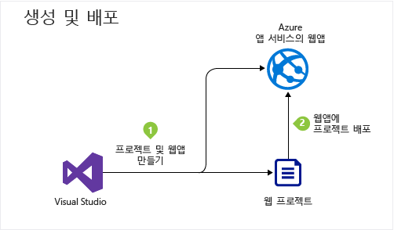

자습서를 종료한 후 작동하지 않는 경우 [문제 해결](#troubleshooting) 섹션은 수행할 작업에 대한 아이디어를 제공하고 [다음 단계](#next-steps) 섹션은 Azure App Service를 사용하는 방법에 대해 더 심층적으로 살펴보는 다른 자습서에 대한 링크를 제공합니다.

시작 자습서이기 때문에 배포하는 방법을 보여 주는 웹 프로젝트는 데이터베이스를 사용하지 않고 인증이나 권한 부여를 수행하지 않는 단순한 형태입니다. 더 많은 고급 배포 항목에 대한 링크는 [Azure 웹앱을 배포하는 방법](web-sites-deploy.md)을 참조하세요.

.NET용 Azure SDK를 설치하는 데 필요한 시간 외에도 이 자습서를 완료하려면 약 10-15분 정도가 걸립니다.

## 필수 조건
* 이 자습서에서는 사용자가 ASP.NET MVC 및 Visual Studio로 작업을 수행했다고 가정합니다. 소개가 필요한 경우 [ASP.NET MVC 5 시작](http://www.asp.net/mvc/overview/getting-started/introduction/getting-started)을 참조하세요.
* Azure 계정이 필요합니다. [무료 Azure 계정을 열거나](https://azure.microsoft.com/pricing/free-trial/?WT.mc_id=A261C142F) 또는 [Visual Studio 구독자 혜택을 활성화](https://azure.microsoft.com/pricing/member-offers/msdn-benefits-details/?WT.mc_id=A261C142F)할 수 있습니다. 
  
    Azure 계정을 등록하기 전에 Azure 앱 서비스를 시작하려는 경우 [앱 서비스 평가](https://azure.microsoft.com/try/app-service/)로 이동하세요. 여기서 신용 카드와 약정 없이 앱 서비스에서 수명이 짧은 스타터 앱을 만들 수 있습니다.

## 개발 환경 설정
이 자습서는 [Azure SDK for .NET](../dotnet-sdk.md) 2.9 이상이 설치된 Visual Studio 2015용으로 작성되었습니다. 

* [Visual Studio 2015용 최신 Azure SDK를 다운로드합니다](http://go.microsoft.com/fwlink/?linkid=518003). SDK에서는 Visual Studio 2015를 아직 설치하지 않은 경우 설치합니다.
  
  > [!NOTE]
  > 사용자 컴퓨터에 SDK 종속성이 얼마나 있었는지에 따라 SDK를 설치하는 시간이 몇 분에서 30분 또는 그 이상이 될 수 있습니다.
  > 
  > 

Visual Studio 2013을 사용하려는 경우 [Visual Studio 2013용 최신 Azure SDK를 다운로드](http://go.microsoft.com/fwlink/?LinkID=324322)할 수 있습니다. 일부 화면이 그림에서 다르게 보일 수 있습니다.

## 웹 응용 프로그램 만들기
다음 단계는 Visual Studio에서 웹 응용 프로그램 프로젝트를 만들고 Azure App Service에서 웹앱을 만드는 것입니다. 자습서의 이 섹션에서는 새 웹 프로젝트를 구성합니다. 

1. Visual Studio 2015를 엽니다.
2. **파일 > 새로 만들기 > 프로젝트**를 클릭합니다.
3. **새 프로젝트** 대화 상자에서 **Visual C# > 웹 > ASP.NET 웹 응용 프로그램**을 클릭합니다.
4. **.NET Framework 4.5.2** 가 대상 프레임워크로 선택되었는지 확인합니다.
5. [Azure Application Insights](../application-insights/app-insights-overview.md) 는 웹앱의 가용성, 성능 및 사용량을 모니터링합니다. **프로젝트에 Application Insights 추가** 확인란은 Visual Studio를 설치한 후 웹 프로젝트를 처음 만들 때 기본적으로 선택됩니다. 확인란이 선택되었지만 Application Insights를 평가하지 않으려면 확인란의 선택을 취소합니다.
6. 응용 프로그램 이름을 **MyExample**로 지정하고 **확인**을 클릭합니다.
   
    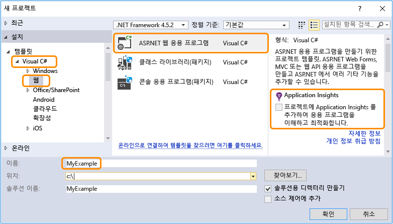
7. **새 ASP.NET 프로젝트** 대화 상자에서 **MVC** 템플릿을 선택하고 **인증 변경**을 클릭합니다.
   
    이 자습서에서는 ASP.NET MVC 웹 프로젝트를 배포합니다. ASP.NET Web API 프로젝트를 배포하는 방법을 알아보려는 경우 [다음 단계](#next-steps) 섹션을 참조하세요. 
   
    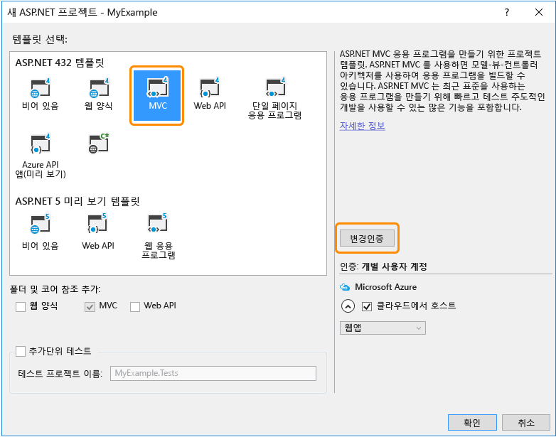
8. **인증 변경** 대화 상자에서 **인증 없음**, **확인**을 차례로 클릭합니다.
   
    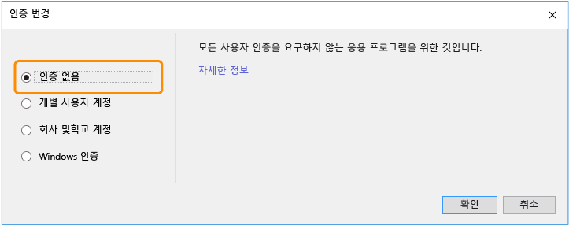
   
    이 시작 자습서에서는 사용자 로그인을 수행하지 않는 간단한 앱을 배포합니다.
9. **새 ASP.NET 프로젝트** 대화 상자의 **Microsoft Azure** 섹션에서 **클라우드에서 호스트**가 선택되어 있는지 그리고 드롭다운 목록에서 **App Service**가 선택되어 있는지 확인합니다.
   
    
   
    이러한 설정은 Visual Studio를 지정하여 웹 프로젝트용 Azure 웹앱을 만듭니다.
10. **확인**

## Azure 리소스 만들기
이제 Visual Studio에 만들려는 Azure 리소스에 대해 지시할 수 있습니다.

1. **App Service 만들기** 대화 상자에서 **계정 추가**를 클릭한 다음 Azure 구독을 관리하는 데 사용할 수 있는 계정의 ID와 암호를 사용하여 Azure에 로그인합니다.
   
    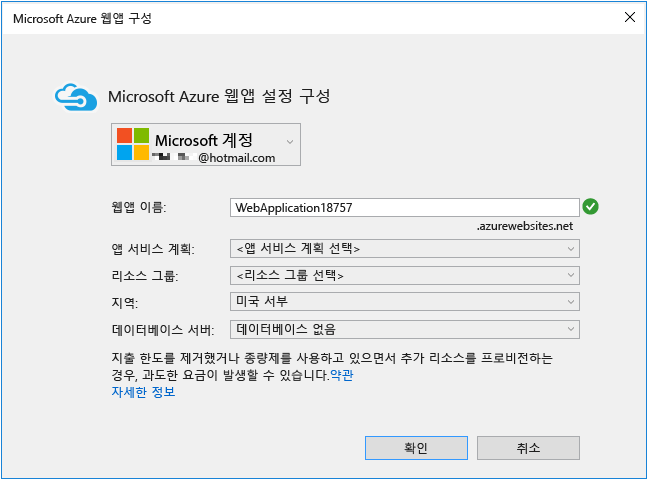
   
    동일한 컴퓨터에서 이전에 로그인한 경우 **계정 추가** 단추가 표시되지 않을 수 있습니다. 이 경우 이 단계를 건너뛰거나 자격 증명을 다시 입력해야 할 수 있습니다.
2. **azurewebsites.net** 도메인에서 고유한 *웹앱 이름* 을 입력합니다. 예를 들어, MyExample810처럼 MyExample 오른쪽에 숫자를 더하여 고유의 이름을 지정할 수 있습니다. 기본 웹 이름이 만들어진 경우 해당 이름은 고유하므로 사용할 수 있습니다.
   
    입력한 이름을 다른 사용자가 이미 사용한 경우 녹색 확인 표시 대신 오른쪽에 빨간색 느낌표가 표시되며, 다른 이름을 입력해야 합니다.
   
    응용 프로그램에 대한 URL은 이 이름 더하기 *.azurewebsites.net*입니다. 예를 들어 이름이 `MyExample810`이면 URL은 `myexample810.azurewebsites.net`이(가) 됩니다.
   
    또한 Azure 웹앱과 함께 사용자 지정 도메인을 사용할 수 있습니다. 자세한 내용은 [Azure 앱 서비스에서 사용자 지정 도메인 이름 구성](web-sites-custom-domain-name.md)을 참조하세요.
3. **리소스 그룹** 상자 옆에 있는 **새로 만들기** 단추를 클릭한 다음 "MyExample" 또는 원하는 다른 이름을 입력합니다. 
   
    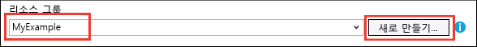
   
    리소스 그룹은 웹앱, 데이터베이스, VM과 같은 Azure 리소스의 컬렉션입니다. 자습서에서는 일반적으로 새 리소스 그룹을 만드는 것이 가장 좋습니다. 자습서에서 만든 모든 Azure 리소스를 한 번에 쉽게 삭제할 수 있기 때문입니다. 자세한 내용은 [Azure Resource Manager 개요](../azure-resource-manager/resource-group-overview.md)를 참조하세요.
4. **App Service 계획** 드롭다운 옆의 **새로 만들기** 단추를 클릭합니다.
   
    
   
    **앱 서비스 계획 구성** 대화 상자가 나타납니다.
   
    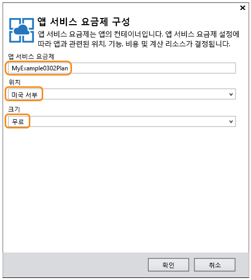
   
    다음 단계에서는 새 리소스 그룹에 대한 앱 서비스 계획을 구성합니다. 앱 서비스 계획은 웹앱이 실행되는 계산 리소스를 지정합니다. 예를 들어, 무료 계층을 선택한 경우 API 앱은 공유 VM에서 실행되지만, 일부 유료 계층에의 경우 전용 VM에서 실행됩니다. 자세한 내용은 [앱 서비스 계획 개요](../app-service/azure-web-sites-web-hosting-plans-in-depth-overview.md)를 참조하세요.
5. **앱 서비스 계획 구성** 대화 상자에서 "MyExamplePlan" 또는 원하는 경우 다른 이름을 입력합니다.
6. **위치** 드롭다운 목록에서 가장 가까운 위치를 선택합니다.
   
    이 설정은 앱이 실행되는 Azure 데이터 센터를 지정합니다. 이 자습서에서는 어떤 지역이든 선택할 수 있으며 지역에 따른 뚜렷한 차이는 없습니다. 그러나 프로덕션 앱의 경우 [대기 시간](http://www.bing.com/search?q=web%20latency%20introduction&qs=n&form=QBRE&pq=web%20latency%20introduction&sc=1-24&sp=-1&sk=&cvid=eefff99dfc864d25a75a83740f1e0090)을 최소화하기 위해 액세스하는 클라이언트와 최대한 가깝게 서버를 배치할 수 있습니다.
7. **크기** 드롭다운에서 **무료**를 클릭합니다.
   
    이 자습서의 경우 무료 가격 책정 계층으로도 충분한 성능이 제공됩니다.
8. **App Service 계획 구성** 대화 상자에서 **확인**을 클릭합니다.
9. **App Service 만들기** 대화 상자에서 **만들기**를 클릭합니다.

## Visual Studio에서 Azure 리소스 검사
짧은 시간 내에, 일반적으로 1분 미만 동안 Visual Studio는 웹 프로젝트 및 웹앱을 만듭니다.  

**솔루션 탐색기** 창에 새 프로젝트의 파일 및 폴더가 표시됩니다.

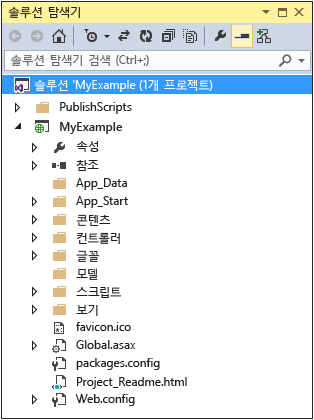

**Azure App Service 활동** 창에서는 Azure에서 App Service 리소스를 만들었음을 보여 줍니다. 여기에 있는 링크를 클릭하면 새 프로젝트를 즉시 게시할 수 있습니다. 그러나 나중에 이 자습서에서 언제든지 파일을 게시하는 방법을 보여 줍니다.

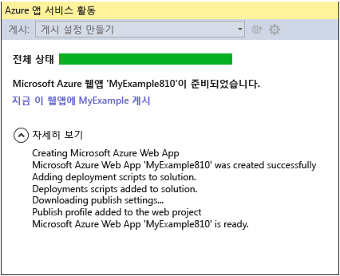

**Cloud Explorer** 창을 사용하면 방금 만든 새 웹앱을 포함하여 Azure 리소스를 보고 관리할 수 있습니다.

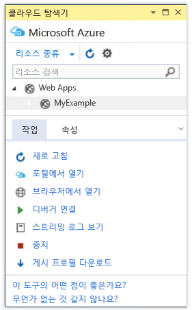

## Azure에 웹 프로젝트 배포
이 섹션에서는 Azure App Service에서 만든 웹앱 리소스에 웹 프로젝트를 배포합니다.

1. **솔루션 탐색기**에서 프로젝트를 마우스 오른쪽 단추로 클릭하고 **게시**를 선택합니다.
   
    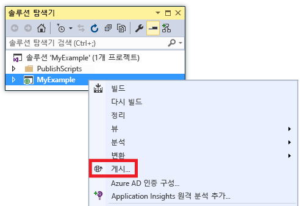
   
    몇 초 후에 **웹 게시** 마법사가 나타납니다. 마법사에 웹 프로젝트를 새 웹앱으로 배포하기 위한 설정이 포함된 *프로필 게시* 가 열립니다.
   
    > [!TIP] 
    > 게시 프로필은 배포하기 위한 사용자 이름 및 암호를 포함합니다.  이러한 자격 증명은 사용자를 위해 생성되며 입력할 필요가 없습니다. 암호는 `Properties\PublishProfiles` 폴더의 숨겨진 사용자별 파일에 암호화됩니다.
    >
    >
2. **웹 게시** 마법사의 **연결** 탭에서 **다음**을 클릭합니다.
   
    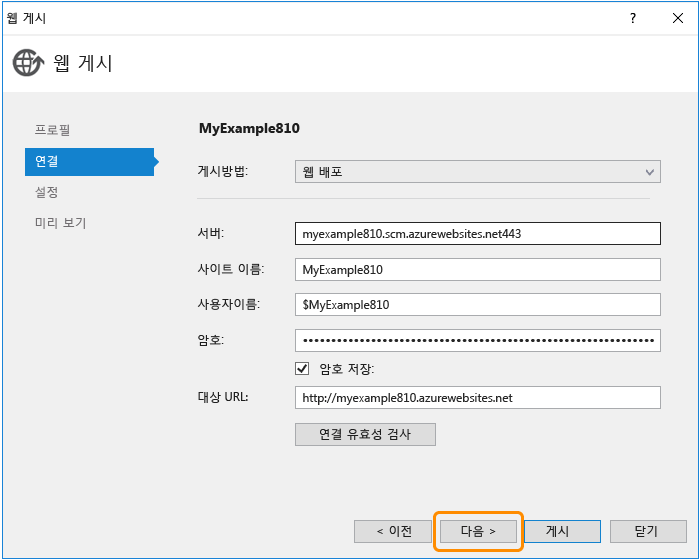
   
    다음은 **설정** 탭입니다. 여기에서 빌드 구성을 변경하여 [원격 디버깅](web-sites-dotnet-troubleshoot-visual-studio.md#remotedebug)을 위한 디버그 빌드를 배포할 수 있습니다. 이 탭은 몇 가지 [파일 게시 옵션](https://msdn.microsoft.com/library/dd465337.aspx#Anchor_2)도 제공합니다.
3. **설정** 탭에서 **다음**을 클릭합니다.
   
   
   
   다음은 **미리 보기** 탭입니다. 여기서는 어떤 파일이 프로젝트에서 API 앱으로 복사되는지 볼 수 있습니다. 이전에 배포한 API 앱에 프로젝트를 배포하는 경우, 변경된 파일만 복사됩니다. 복사될 파일 목록을 표시하려면 **미리 보기 시작** 단추를 클릭할 수 있습니다.
4. **미리 보기** 탭에서 **게시**를 클릭합니다.
   
   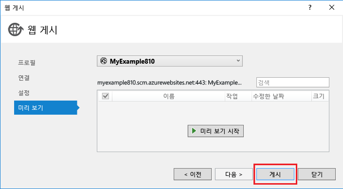
   
   **게시**를 클릭하면 Visual Studio에서 Azure 서버로 파일을 복사하는 프로세스를 시작합니다. 1분 또는 2분이 걸릴 수 있습니다.
   
   **출력** 및 **Azure App Service Activity** 창에 수행된 배포 작업이 표시되고 성공적인 배포 완료가 보고됩니다.
   
   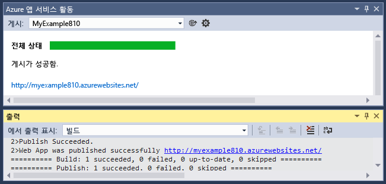
   
   배포에 성공하면 기본 브라우저에서 배포된 웹 응용 프로그램의 URL이 자동으로 열리며, 만든 응용 프로그램이 이제 클라우드에서 실행되고 있습니다. 브라우저 주소 표시줄의 URL은 웹앱이 인터넷에서 로드됨을 보여 줍니다.
   
   
   
   > [!TIP]
   > 빠른 배포를 위해 **한 번 클릭으로 웹 게시** 도구 모음을 사용할 수 있습니다. **보기 > 도구 모음**을 클릭한 다음 **한 번 클릭으로 웹 게시**를 선택합니다. 이 도구 모음을 사용하여 프로필을 선택하거나, 단추를 클릭하여 게시하거나, 단추를 클릭하여 **웹 게시** 마법사를 열 수 있습니다.
   > 
   > 
   > 

## 문제 해결
이 자습서를 진행하면서 문제에 직면하는 경우 .NET용 Azure SDK의 최신 버전을 사용하도록 합니다. 작업을 수행 하는 가장 쉬운 방법은 [Visual Studio 2015용 Azure SDK를 다운로드](http://go.microsoft.com/fwlink/?linkid=518003)하는 것입니다. 현재 버전이 설치되어 있다면 웹 플랫폼 설치 관리자에서 설치가 필요하지 않다고 알려줍니다.

Azure 앱 서비스에서 ASP.NET 웹앱이 실행 중인 경우 문제 해결을 단순화하는 Visual Studio 기능에 대한 자세한 내용을 확인할 수 있습니다. 로깅, 원격 디버깅 등에 대한 정보는 [Visual Studio에서 Azure 웹앱 문제 해결](web-sites-dotnet-troubleshoot-visual-studio.md)을 참조하세요.

## 다음 단계
이 자습서에서는 간단한 웹 응용 프로그램을 만들고 Azure 웹앱에 배포하는 방법을 확인했습니다. 다음은 Azure 앱 서비스에 관한 자세한 내용을 확인할 수 있는 몇 가지 관련 항목 및 리소스입니다.

* [Azure 포털](https://portal.azure.com/)에서 웹앱을 모니터링 및 관리합니다. 
  
    자세한 내용은 [Azure 포털의 개요](/services/management-portal/) 및 [Azure App Service에서 웹앱 구성](web-sites-configure.md)을 참조하세요.
* Visual Studio를 사용하여 새 웹앱에 기존 웹 프로젝트 배포
  
    **솔루션 탐색기**에서 프로젝트를 마우스 오른쪽 단추로 클릭하고 **게시**를 클릭합니다. **Microsoft Azure App Service**를 게시 대상으로 선택한 다음 **새로 만들기**를 클릭합니다. 대화 상자는 이 자습서에서 살펴본 것과 동일합니다.
* 원본 제어에서 웹 프로젝트 배포
  
    [소스 제어 시스템](http://www.asp.net/aspnet/overview/developing-apps-with-windows-azure/building-real-world-cloud-apps-with-windows-azure/source-control)에서 [배포를 자동화](http://www.asp.net/aspnet/overview/developing-apps-with-windows-azure/building-real-world-cloud-apps-with-windows-azure/continuous-integration-and-continuous-delivery)하는 방법에 대한 정보는 [Azure App Service에서 웹앱 시작](app-service-web-get-started.md) 및 [Azure 웹앱을 배포하는 방법](web-sites-deploy.md)을 참조하세요.
* Azure 앱 서비스에서 API 앱에 ASP.NET Web API 배포
  
    주로 웹 사이트를 호스트하기 위한 Azure 앱 서비스의 인스턴스를 만드는 방법을 살펴봤습니다. 또한 앱 서비스는 클라이언트 코드를 만들기 위한 CORS 지원 및 API 메타데이터 지원 등 Web API를 호스팅하는 기능을 제공합니다. 웹앱에서 API 기능을 사용할 수 있지만 주로 앱 서비스의 인스턴스에서 API를 호스팅하려는 경우 **API 앱** 이 더 적합합니다. 자세한 내용은 [Azure 앱 서비스에서 API 앱 및 ASP.NET 시작](../app-service-api/app-service-api-dotnet-get-started.md)을 참조하세요. 
* 사용자 지정 도메인 이름 및 SSL 추가
  
    SSL 및 사용자만의 도메인(예: contoso.azurewebsites.net가 아닌 www.contoso.com 사용)을 사용하는 방법에 대한 자세한 내용은 다음 리소스를 참조하세요.
  
  * [Azure 앱 서비스에서 사용자 지정 도메인 이름 구성](web-sites-custom-domain-name.md)
  * [Azure 웹 사이트에 HTTPS 사용](web-sites-configure-ssl-certificate.md)
* 완료되면 웹앱 및 관련된 모든 Azure 리소스를 포함하는 리소스 그룹을 삭제합니다.
  
    Azure 포털에서 리소스 그룹으로 작업하는 방법에 대한 자세한 내용은 [Resource Manager 템플릿 및 Azure 포털을 사용하여 리소스 배포](../azure-resource-manager/resource-group-template-deploy-portal.md)를 참조하세요.   
* 앱 서비스에서 ASP.NET 웹앱을 만드는 방법의 더 많은 예제는 [HealthClinic.biz](https://github.com/Microsoft/HealthClinic.biz) 2015 연결 [데모](https://blogs.msdn.microsoft.com/visualstudio/2015/12/08/connectdemos-2015-healthclinic-biz/)의 [Azure App Service에서 ASP.NET 웹앱 만들기 및 배포](https://github.com/Microsoft/HealthClinic.biz/wiki/Create-and-deploy-an-ASP.NET-web-app-in-Azure-App-Service) 및 [Azure App Service에서 모바일 앱 만들기 및 배포](https://github.com/Microsoft/HealthClinic.biz/wiki/Create-and-deploy-a-mobile-app-in-Azure-App-Service)를 참조하세요. HealthClinic.biz 데모에서 더 빠른 시작은 [Azure 개발자 도구 빠른 시작](https://github.com/Microsoft/HealthClinic.biz/wiki/Azure-Developer-Tools-Quickstarts)을 참조하세요.

