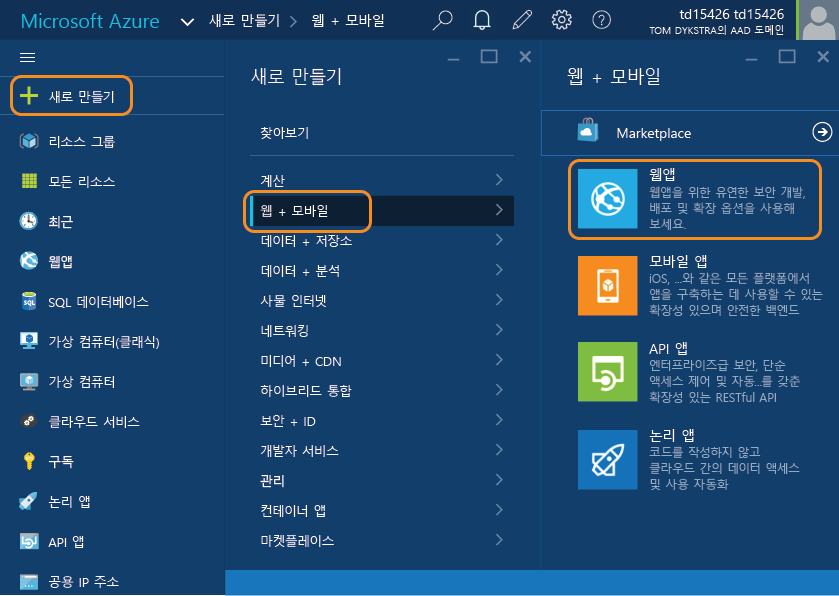
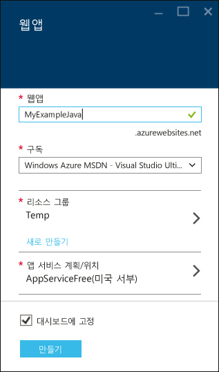
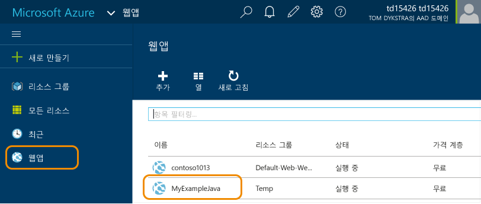
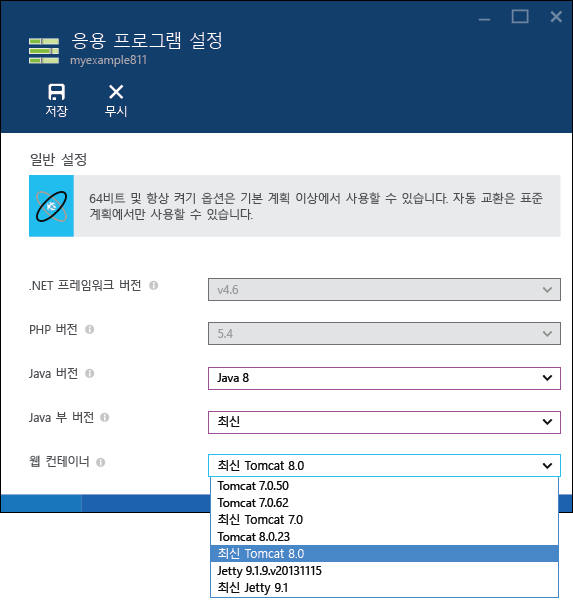
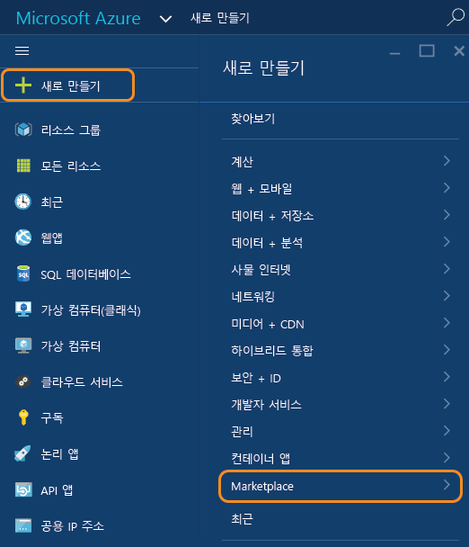
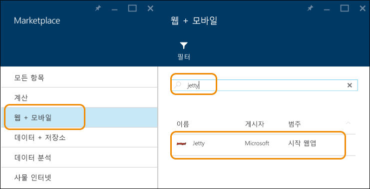
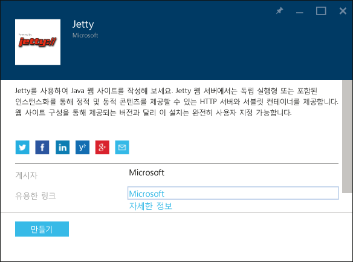
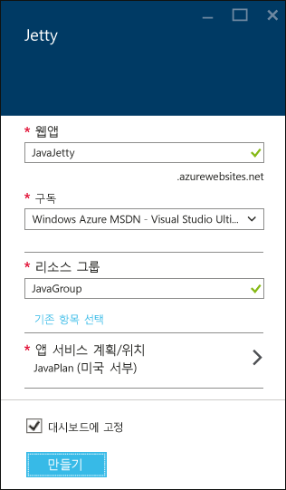
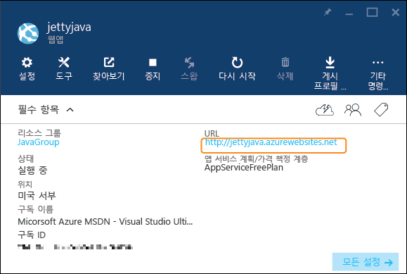

<properties
	pageTitle="Azure 앱 서비스에서 Java 웹앱 만들기 | Microsoft Azure"
	description="이 자습서에서는 Azure 앱 서비스에 Java 웹앱을 배포하는 방법을 보여 줍니다."
	services="app-service\web"
	documentationCenter="java"
	authors="rmcmurray"
	manager="wpickett"
	editor=""/>
<tags
	ms.service="app-service-web"
	ms.workload="web"
	ms.tgt_pltfrm="na"
	ms.devlang="Java"
	ms.topic="hero-article"
	ms.date="01/09/2016"
	ms.author="robmcm"/>

# Azure 앱 서비스에서 Java 웹앱 만들기

> [AZURE.SELECTOR]
- [.Net](web-sites-dotnet-get-started.md)
- [Node.JS](web-sites-nodejs-develop-deploy-mac.md)
- [Java](web-sites-java-get-started.md)
- [PHP - Git](web-sites-php-mysql-deploy-use-git.md)
- [PHP - FTP](web-sites-php-mysql-deploy-use-ftp.md)
- [Python](web-sites-python-ptvs-django-mysql.md)

이 자습서는 [Azure 포털](https://portal.azure.com/)을 사용하여 Java [Azure 앱 서비스에서 웹앱](http://go.microsoft.com/fwlink/?LinkId=529714)을 만드는 방법을 보여 줍니다. Azure 포털은 Azure 리소스를 관리하는 데 사용할 수 있는 웹 인터페이스입니다.

> [AZURE.NOTE] 이 자습서를 완료하려면 Microsoft Azure 계정이 필요합니다. 계정이 없는 경우 [Visual Studio 구독자 혜택을 활성화]하거나 [무료 평가판을 등록]할 수 있습니다.
>
> Azure 계정을 등록하기 전에 Azure 앱 서비스를 시작하려는 경우 [앱 서비스 평가]로 이동하세요. 여기서 신용 카드와 약정 없이 앱 서비스에서 수명이 짧은 스타터 웹앱을 즉시 만들 수 있습니다.

## Java 응용 프로그램 옵션

여러 가지 방법으로 앱 서비스 웹앱의 Java 응용 프로그램을 설정할 수 있습니다.

1. 앱을 만든 다음 **응용 프로그램 설정**을 구성합니다.

	앱 서비스는 기본 구성을 사용하여 여러 Tomcat 및 Jetty 버전을 제공합니다. 호스팅하는 응용 프로그램이 기본 제공 버전 중 하나와 작동하는 경우 웹 컨테이너를 설정하는 이 메서드는 가장 쉬우며 war 파일을 웹 컨테이너에 업로드하는 경우에 부합합니다. 이 메서드의 경우 Azure 포털에서 앱을 만든 다음 앱의 **응용 프로그램 설정** 블레이드로 이동하여 원하는 Java 웹 컨테이너와 함께 Java의 버전을 선택합니다. 이 메서드를 사용하는 경우 Java와 웹 컨테이너는 모두 프로그램 파일에서 실행됩니다. 다른 메서드는 웹 컨테이너와 잠재적으로 JVM을 디스크 공간에 배치합니다. 이 모델을 사용하는 경우 파일 시스템의 이 부분에서 파일을 편집하기 위한 액세스가 없으며 이는 *server.xml* 파일을 구성하거나 */lib* 폴더에 라이브러리 파일을 배치하는 등과 같은 작업을 할 수 없음을 의미합니다. 자세한 내용은 이 자습서 뒷부분의 [Java 웹앱 만들기 및 구성](#appsettings) 섹션을 참조하세요.
	
2. Azure 마켓플레이스에서 템플릿 사용

	Azure 마켓플레이스는 Tomcat 또는 Jetty 웹 컨테이너로 Java 웹앱을 자동으로 만들고 구성하는 템플릿을 포함합니다. 템플릿을 설정하는 웹 컨테이너를 구성할 수 있습니다. 자세한 내용은 이 자습서의 [Azure 마켓플레이스에서 Java 템플릿 사용](#marketplace) 섹션을 참조하세요.
 
  
3. 앱을 만든 다음 구성 파일을 수동으로 복사 및 편집

	앱 서비스에서 제공하는 웹 컨테이너 중 하나에 배포하지 않는 사용자 지정 Java 응용 프로그램을 호스팅할 수도 있습니다. 예를 들어 다음은 이 작업을 수행하는 것에 대한 몇 가지 이유입니다.
	
	* Java 응용 프로그램은 앱 서비스에서 직접 제공하지 않거나 갤러리에서 지원되지 않는 Tomcat 또는 Jetty의 버전이 필요합니다.
	* Java 응용 프로그램은 HTTP 요청을 취하며 기존 웹 컨테이너에 WAR로 배포하지 않습니다.
	* 사용자가 직접 처음부터 웹 컨테이너를 구성하려고 합니다. 
	* 앱 서비스에서 지원하지 않는 Java 버전을 사용하고 사용자가 직접 업로드하려고 합니다.

	이러한 경우 Azure 포털을 사용하여 앱을 만든 다음 적절한 런타임 파일을 수동으로 제공할 수 있습니다. 이 경우 파일은 앱 서비스 계획에 대한 저장소 공간 할당량에 대해 계산됩니다. 자세한 내용은 [Azure에 사용자 지정 Java 웹앱 업로드](web-sites-java-custom-upload.md)를 참조하세요.

##  Java 웹앱 만들기 및 구성

이 섹션에서는 포털의 **응용 프로그램 설정** 블레이드를 사용하여 Java에 대한 웹앱을 만들고 구성하는 방법을 보여 줍니다.

1. [Azure 포털](https://portal.azure.com/)에 로그인합니다.

2. **새로 만들기 > 웹 + 모바일 > 웹앱**을 클릭합니다.

	

4. **웹앱** 상자에서 웹앱에 대한 이름을 입력합니다.

	웹앱의 URL이 {name}.azurewebsites.net이기 때문에 이 이름은 azurewebsites.net 도메인에서 고유해야 합니다. 입력한 이름이 고유하지 않으면 빨간색 느낌표가 텍스트 상자에 나타납니다.

5. **리소스 그룹**을 선택하거나 새로 만듭니다.

	리소스 그룹에 대한 자세한 내용은 [Azure 포털을 사용하여 Azure 리소스 관리](../resource-group-portal.md)를 참조하세요.

6. **앱 서비스 계획/위치**을 선택하거나 새로 만듭니다.

	앱 서비스 계획에 대한 자세한 내용은 [Azure 앱 서비스 계획 개요](../azure-web-sites-web-hosting-plans-in-depth-overview.md)를 참조하세요.

7. **만들기**를 클릭합니다.

	
 
8. 웹앱을 만들었으면 **웹앱 > {사용자의 웹앱}**을 클릭합니다.
 
	

9. **웹앱** 블레이드에서 **설정**을 클릭합니다.

10. **응용 프로그램 설정**을 클릭합니다.

11. 원하는 **Java 버전**을 클릭합니다.

12. 원하는 **Java 부 버전**을 클릭합니다. **최신**을 선택하는 경우 앱은 해당 Java 주 버전에 대한 앱 서비스에서 사용할 수 있는 최신 부 버전을 사용합니다. **최신** 항목은 **응용 프로그램 설정**에서 만든 Java 앱에만 있습니다. 갤러리에서 Java 앱을 만드는 경우 컨테이너 및 JVM 변경 내용을 관리해야 합니다.

12. 원하는 **웹 컨테이너**를 선택합니다. **최신**으로 시작하는 컨테이너 이름을 선택하는 경우 앱은 앱 서비스에서 사용할 수 있는 해당 웹 컨테이너 주 버전의 최신 버전으로 유지됩니다.

	

13. **Save**를 클릭합니다.

	잠시 후 웹앱은 Java 기반이 되며 선택한 웹 컨테이너를 사용하도록 구성됩니다.

14. **웹앱 > {새로운 웹앱}**을 클릭합니다.

15. **URL**을 클릭하여 새 사이트를 찾습니다.

	웹 페이지에 Java 기반 웹앱을 만들었다는 확인 메시지가 표시됩니다.

##  Azure 마켓플레이스에서Java 템플릿 사용

이 섹션에서는 Azure 마켓플레이스를 사용하여 Java 웹앱을 만드는 방법을 보여줍니다. 동일한 일반 흐름은 Java 기반 모바일 또는 API 앱을 만드는 데도 사용될 수 있습니다.

1. [Azure 포털](https://portal.azure.com/)에 로그인합니다.

2. **새로 만들기 > 마켓플레이스**를 클릭합니다.

	

3. **웹 + 모바일**을 클릭합니다.

	**마켓플레이스** 블레이드를 표시하고 **웹 + 모바일**을 선택하려면 왼쪽으로 스크롤해야 할 수 있습니다.

4. 검색 텍스트 상자에 **Apache Tomcat**, **Jetty**와 같은 Java 응용 프로그램 서버의 이름을 입력한 다음 Enter를 누릅니다.

5. 검색 결과에서 Java 응용 프로그램 서버를 클릭합니다.

	

6. 첫 번째 **Apache Tomcat** 또는 **Jetty** 블레이드에서 **만들기**를 클릭합니다.

	

7. 다음 **Apache Tomcat** 또는 **Jetty** 블레이드에서 **웹앱** 상자에 웹앱의 이름을 입력합니다.

	웹앱의 URL이 {name}.azurewebsites.net이기 때문에 이 이름은 azurewebsites.net 도메인에서 고유해야 합니다. 입력한 이름이 고유하지 않으면 빨간색 느낌표가 텍스트 상자에 나타납니다.

8. **리소스 그룹**을 선택하거나 새로 만듭니다.

	리소스 그룹에 대한 자세한 내용은 [Azure 포털을 사용하여 Azure 리소스 관리](../resource-group-portal.md)를 참조하세요.

9. **앱 서비스 계획/위치**을 선택하거나 새로 만듭니다.

	앱 서비스 계획에 대한 자세한 내용은 [Azure 앱 서비스 계획 개요](../azure-web-sites-web-hosting-plans-in-depth-overview.md)를 참조하세요.

10. **만들기**를 클릭합니다.

	

	일반적으로 일 분 미만인 짧은 시간에 Azure는 새 웹앱 만들기를 마칩니다.

11. **웹앱 > {새로운 웹앱}**을 클릭합니다.

12. **URL**을 클릭하여 새 사이트를 찾습니다.

	

	Tomcat은 기본 페이지의 집합을 제공하므로 Tomcat을 선택하는 경우 다음 예제와 유사한 페이지가 표시됩니다.

	

	Jetty를 선택하는 경우 다음 예제와 유사한 페이지가 표시됩니다. Jetty는 기본 페이지 집합이 없으므로 빈 Java 사이트에 사용되는 동일한 JSP는 여기에 다시 사용됩니다.

	

앱 컨테이너로 웹앱을 만들었으므로 [다음 단계](#next-steps) 섹션에서 응용 프로그램을 웹앱에 업로드 하는 방법을 알아보세요.

## 다음 단계

이제 Azure 앱 서비스에서 Java 응용 프로그램 서버가 웹앱으로 실행됩니다. 웹앱에 직접 작성한 코드를 배포하려면 [Java 웹앱에 응용 프로그램 또는 웹 페이지 추가](web-sites-java-add-app.md)를 참조하세요.

Azure에서 Java 응용 프로그램을 개발하는 방법에 대한 자세한 내용은 [Java 개발자 센터](/develop/java/)를 참조하세요.

<!-- External Links -->
[Visual Studio 구독자 혜택을 활성화]: http://go.microsoft.com/fwlink/?LinkId=623901
[무료 평가판을 등록]: http://go.microsoft.com/fwlink/?LinkId=623901
[앱 서비스 평가]: http://go.microsoft.com/fwlink/?LinkId=523751

<!---HONumber=AcomDC_0302_2016-->