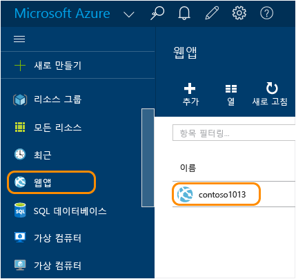
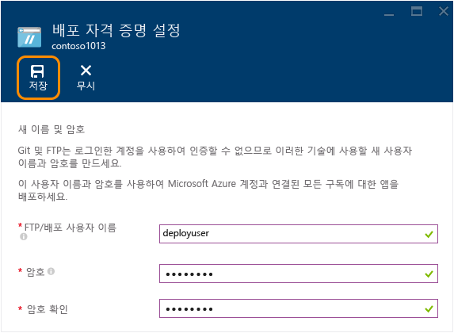
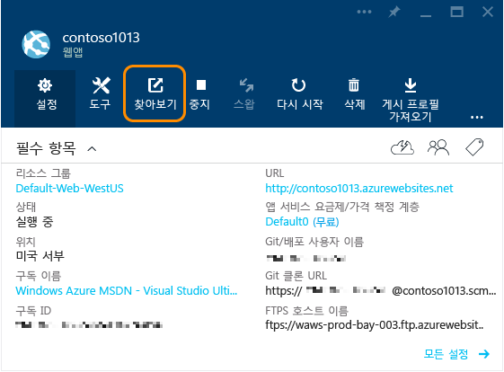

# Azure 앱 서비스에서 Node.js 웹 앱 만들기
> [!div class="op_single_selector"]
> * [.Net](web-sites-dotnet-get-started.md)
> * [Node.JS](web-sites-nodejs-develop-deploy-mac.md)
> * [Java](web-sites-java-get-started.md)
> * [PHP - Git](web-sites-php-mysql-deploy-use-git.md)
> * [PHP - FTP](web-sites-php-mysql-deploy-use-ftp.md)
> * [Python](web-sites-python-ptvs-django-mysql.md)
> 
> 

이 자습서에서는 간단한 [Node.js](http://nodejs.org) 응용 프로그램을 만들고 [Git](http://git-scm.com)를 사용하여 [Azure App Service](../app-service/app-service-value-prop-what-is.md)의 [웹앱](app-service-web-overview.md)에 배포하는 방법을 보여줍니다. 이 자습서의 지침은 Node.js를 실행할 수 있는 모든 운영 체제에 적용될 수 있습니다.

다음 내용을 배웁니다.

* Azure 포털을 사용하여 Azure 앱 서비스에서 웹앱을 만드는 방법
* 웹앱의 Git 리포지토리를 눌러 웹앱에 Node.js 응용 프로그램을 배포하는 방법입니다.

완성된 응용 프로그램은 브라우저에 짧은 "hello world" 문자열을 씁니다.

!['Hello World' 메시지를 표시하는 브라우저][helloworld-completed]

더 복잡한 Node.js 응용 프로그램을 가진 자습서 및 샘플 코드 또는 Azure에서 Node.js를 사용하는 방법에 대한 다른 항목은 [Node.js 개발자 센터](/develop/nodejs/)를 참조하세요.

> [!NOTE]
> 이 자습서를 완료하려면 Microsoft Azure 계정이 필요합니다. 계정이 없는 경우 [Visual Studio 구독자 혜택을 활성화](/en-us/pricing/member-offers/msdn-benefits-details/?WT.mc_id=A261C142F)하거나 [무료 평가판을 등록](/en-us/pricing/free-trial/?WT.mc_id=A261C142F)할 수 있습니다.
> 
> Azure 계정을 등록하기 전에 Azure 앱 서비스를 시작하려는 경우 [앱 서비스 평가](https://azure.microsoft.com/try/app-service/)로 이동하세요. 여기서 신용 카드와 약정 없이 앱 서비스에서 수명이 짧은 스타터 웹앱을 즉시 만들 수 있습니다.
> 
> 

## 웹 앱 만들기 및 Git 게시 설정
다음 단계를 수행하여 Azure 앱 서비스에서 웹 앱을 만들고 Git 게시를 설정합니다. 

[Git](http://git-scm.com/) 는 Azure 웹 사이트를 배포하는 데 사용할 수 있는 분산된 버전 제어 시스템입니다. 웹앱에 대해 작성한 코드를 로컬 Git 리포지토리에 저장하고, 원격 리포지토리로 푸시하여 Azure에 코드를 배포합니다. 이 배포 방법은 앱 서비스 웹앱의 기능입니다.  

1. [Azure 포털](https://portal.azure.com)에 로그인합니다.
2. Azure 포털의 왼쪽 맨 위에서 **+ 새로 만들기** 아이콘을 클릭합니다.
3. **웹 + 모바일**을 클릭한 다음 **웹앱**을 클릭합니다.
   
    ![][portal-quick-create]
4. **웹앱** 상자에서 웹앱에 대한 이름을 입력합니다.
   
    웹앱의 URL이 {name}.azurewebsites.net이기 때문에 이 이름은 azurewebsites.net 도메인에서 고유해야 합니다. 입력한 이름이 고유하지 않으면 빨간색 느낌표가 텍스트 상자에 나타납니다.
5. **구독**을 선택합니다.
6. **리소스 그룹** 을 선택하거나 새로 만듭니다.
   
    리소스 그룹에 대한 자세한 내용은 [Azure Resource Manager 개요](../azure-resource-manager/resource-group-overview.md)를 참조하세요.
7. **앱 서비스 계획/위치** 을 선택하거나 새로 만듭니다.
   
    앱 서비스 계획에 대한 자세한 내용은 [Azure 앱 서비스 계획 개요](../app-service/azure-web-sites-web-hosting-plans-in-depth-overview.md)
8. **만들기**를 클릭합니다.
   
    ![][portal-quick-create2]
   
    일반적으로 일 분 미만인 짧은 시간에 Azure는 새 웹앱 만들기를 마칩니다.
9. **웹앱 > {새로운 웹앱}**을 클릭합니다.
   
    
10. **웹앱** 블레이드에서 **배포** 부분을 클릭합니다.
    
    ![][deployment-part]
11. **지속적인 배포** 블레이드에서 **원본 선택**을 클릭합니다.
12. **로컬 Git 리포지토리**를 클릭한 다음 **확인**을 클릭합니다.
    
    ![][setup-git-publishing]
13. 아직 수행하지 않은 경우 배포 자격 증명을 설치합니다.
    
    a. 웹앱 블레이드에서 **설정 > 배포 자격 증명**을 클릭합니다.
    
    ![][deployment-credentials]
    
    b. 사용자 이름 및 암호를 만듭니다. 
    
    
14. 웹앱 블레이드에서 **설정**을 클릭한 후 **속성**을 클릭합니다.
    
    게시하려면 원격 Git 리포지토리에 푸시합니다. 리포지토리에 대한 URL은 **GIT URL**에 나열됩니다. 이 URL은 자습서의 뒷부분에서 필요합니다.
    
    ![][git-url]

## 로컬에서 응용 프로그램 빌드 및 테스트
이 섹션에서는 [nodejs.org]에서 'Hello World' 예제의 조금 변형된 버전이 포함된 **server.js** 파일을 만듭니다. 코드는 Azure 웹앱에서 실행되는 경우 수신할 포트로 process.env.PORT를 추가합니다.

1. *helloworld*라는 디렉터리를 만듭니다.
2. 텍스트 편집기를 사용하여 **helloworld** 디렉터리에 *server.js* 라는 새 파일을 만듭니다.
3. 다음 코드를 **server.js** 파일에 복사한 다음 파일을 저장합니다.
   
        var http = require('http')
        var port = process.env.PORT || 1337;
        http.createServer(function(req, res) {
          res.writeHead(200, { 'Content-Type': 'text/plain' });
          res.end('Hello World\n');
        }).listen(port);
4. 명령줄을 열고 다음 명령을 사용하여 웹앱을 로컬에서 시작합니다.
   
        node server.js
5. 웹 브라우저를 열고 http://localhost:1337 로 이동합니다. 
   
    다음 스크린샷처럼 "Hello World"라는 웹 페이지가 나타납니다.
   
    !['Hello World' 메시지를 표시하는 브라우저][helloworld-localhost]

## 응용 프로그램 게시
1. 아직 수행하지 않았다면 Git을 설치합니다.
   
    플랫폼별 설치 지침은 [Git 다운로드 페이지](http://git-scm.com/download)(영문)를 참조하세요.
2. 명령줄에서 **helloworld** 디렉터리로 이동한 후 다음 명령을 입력하여 로컬 Git 리포지토리를 초기화합니다.
   
        git init
3. 다음 명령을 사용하여 리포지토리에 파일을 추가합니다.
   
        git add .
        git commit -m "initial commit"
4. 다음 명령을 사용하여 이전에 만든 웹앱으로 업데이트를 푸시하는 Git 원격을 추가합니다.
   
        git remote add azure [URL for remote repository]
5. 다음 명령을 사용하여 변경 내용을 Azure에 푸시합니다.
   
        git push azure master
   
    이전에 만든 암호를 입력하라는 메시지가 나타납니다. 다음 예제와 유사하게 출력됩니다.
   
        Counting objects: 3, done.
        Delta compression using up to 8 threads.
        Compressing objects: 100% (2/2), done.
        Writing objects: 100% (3/3), 374 bytes, done.
        Total 3 (delta 0), reused 0 (delta 0)
        remote: New deployment received.
        remote: Updating branch 'master'.
        remote: Preparing deployment for commit id '5ebbe250c9'.
        remote: Preparing files for deployment.
        remote: Deploying Web.config to enable Node.js activation.
        remote: Deployment successful.
        To https://user@testsite.scm.azurewebsites.net/testsite.git
         * [new branch]      master -> master
6. 앱을 보려면 Azure 포털의 **웹앱** 부분에서 **찾아보기** 단추를 클릭합니다.
   
    
   
    

## 응용 프로그램에 변경 내용 게시
1. 텍스트 편집기에서 **server.js** 파일을 열고 'Hello World\n'를 'Hello Azure\n'로 변경합니다. 
2. 파일을 저장합니다.
3. 명령줄에서 **helloworld** 디렉터리로 이동한 후 다음 명령을 실행합니다.
   
        git add .
        git commit -m "changing to hello azure"
        git push azure master
   
    암호를 다시 입력하라는 메시지가 표시됩니다.
4. 웹앱의 URL을 탐색하는 브라우저 창을 새로 고칩니다.
   
    !['Hello Azure'를 표시하는 웹 페이지][helloworld-completed]

## 배포 롤백
**웹앱** 블레이드에서 **설정 > 지속적인 배포**를 클릭하여 **배포** 블레이드에서 배포 기록을 볼 수 있습니다. 이전 배포를 롤백해야 하는 경우 **배포 세부 정보** 블레이드에서 **재배포**를 선택하고 클릭합니다.

## 다음 단계
Azure 앱 서비스에서 웹앱에 Node.js 응용 프로그램을 배포했습니다. App Service 웹앱에서 Node.js 응용 프로그램을 실행하는 방법에 대해 자세히 알아보려면 [Azure App Service Web Apps: Node.js](http://blogs.msdn.com/b/silverlining/archive/2012/06/14/windows-azure-websites-node-js.aspx) 및 [Azure 응용 프로그램에서 Node.js 버전 지정](../nodejs-specify-node-version-azure-apps.md)을 참조하세요.

Node.js는 응용 프로그램에 사용될 수 있는 풍부한 모듈 에코시스템을 제공합니다. 웹앱에서 모듈을 사용하는 방법에 대한 자세한 내용은 [Azure 응용 프로그램에 Node.js 모듈 사용](../nodejs-use-node-modules-azure-apps.md)을 참조하세요.

응용 프로그램을 Azure에 배포한 후 문제가 발생하는 경우 [Azure 앱 서비스에서 Node.js 응용 프로그램을 디버그하는 방법](web-sites-nodejs-debug.md) 에서 문제를 진단하는 방법에 대한 정보를 참조하세요.

이 문서에서는 Azure 포털을 사용하여 웹앱을 만듭니다. 또한 [Azure 명령줄 인터페이스](../xplat-cli-install.md) 또는 [Azure PowerShell](/powershell/azureps-cmdlets-docs)을 사용하여 동일한 작업을 수행할 수 있습니다.

Azure에서 Node.js 응용 프로그램을 개발하는 방법에 대한 자세한 내용은 [Node.js 개발자 센터](/develop/nodejs/)를 참조하세요.

[helloworld-completed]: ./media/web-sites-nodejs-develop-deploy-mac/helloazure.png
[helloworld-localhost]: ./media/web-sites-nodejs-develop-deploy-mac/helloworldlocal.png
[portal-quick-create]: ./media/web-sites-nodejs-develop-deploy-mac/create-quick-website.png
[portal-quick-create2]: ./media/web-sites-nodejs-develop-deploy-mac/create-quick-website2.png
[setup-git-publishing]: ./media/web-sites-nodejs-develop-deploy-mac/setup_git_publishing.png
[go-to-dashboard]: ./media/web-sites-nodejs-develop-deploy-mac/go_to_dashboard.png
[deployment-part]: ./media/web-sites-nodejs-develop-deploy-mac/deployment-part.png
[deployment-credentials]: ./media/web-sites-nodejs-develop-deploy-mac/deployment-credentials.png
[git-url]: ./media/web-sites-nodejs-develop-deploy-mac/git-url.png

<!--HONumber=Feb17_HO3-->

