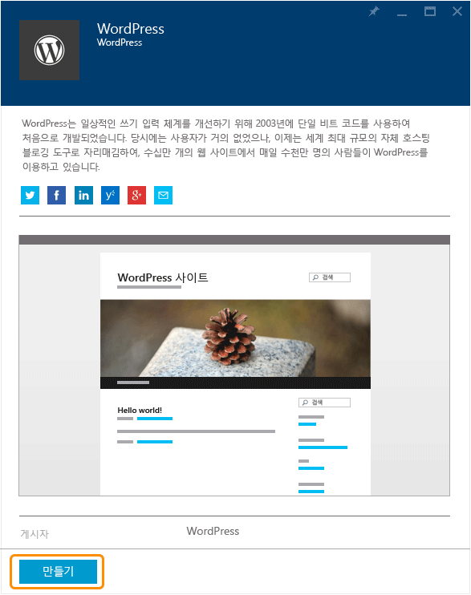
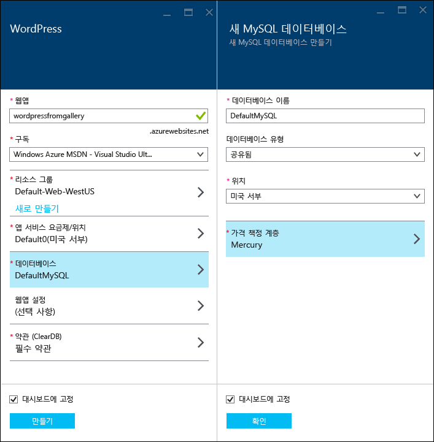
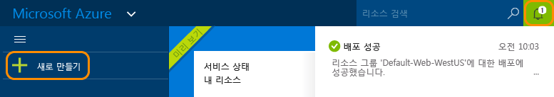
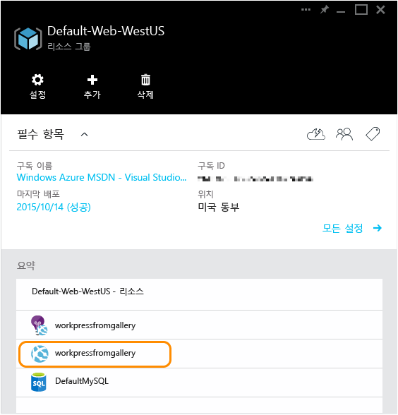

<properties
	pageTitle="Azure 앱 서비스에서 WordPress 웹앱 만들기 | Microsoft Azure"
	description="Azure Preview 포털을 사용하여 WordPress 블로그에 새 Azure 웹앱을 만드는 방법을 알아봅니다."
	services="app-service\web"
	documentationCenter="php"
	authors="tfitzmac"
	manager="wpickett"
	editor=""/>

<tags
	ms.service="app-service-web"
	ms.workload="na"
	ms.tgt_pltfrm="na"
	ms.devlang="PHP"
	ms.topic="hero-article"
	ms.date="10/13/2015"
	ms.author="tomfitz"/>

# Azure 앱 서비스에서 WordPress 웹앱 만들기

이 자습서에서는 Azure 마켓플레이스에서 응용 프로그램을 찾는 방법 및 앱 서비스 웹앱에 설치하는 방법을 보여줍니다. 이 자습서는 WordPress 블로그 사이트를 예로 사용하지만 과정은 여타 마켓플레이스 응용 프로그램과 유사합니다.

자습서가 완료되면 클라우드에서 고유의 WordPress 블로그 사이트를 실행합니다.

다음 내용을 배웁니다.

* Azure 마켓플레이스에서 응용 프로그램 템플릿을 찾는 방법.
* 템플릿을 기반으로 하는 Azure 앱 서비스에서 웹앱을 만드는 방법.
* 새 웹앱 및 MySQL 데이터베이스에 대한 Azure 앱 서비스 설정을 구성하는 방법.

Azure 마켓플레이스에서 Microsoft, 타사 및 오픈 소스 소프트웨어에서 개발된 다양한 인기 웹앱을 사용할 수 있습니다. 웹앱은 이 WordPress 예제에서 [PHP](/develop/nodejs/), [.NET](/develop/net/), [Node.js](/develop/nodejs/), [Java](/develop/java/), 및 [Python](/develop/python/) 등과 같은 광범위하고 인기있는 프레임워크에서 작성됩니다. Azure 마켓플레이스에서 웹앱을 만들려면 유일하게 필요한 소프트웨어는 [Azure Preview 포털](https://portal.azure.com/)에 대해 사용하는 브라우저입니다.

> [AZURE.NOTE]이 자습서를 완료하려면 Microsoft Azure 계정이 필요합니다. 계정이 없는 경우 [MSDN 구독자 혜택을 활성화](/ko-KR/pricing/member-offers/msdn-benefits-details/?WT.mc_id=A261C142F)하거나 [무료 평가판을 등록](/ko-KR/pricing/free-trial/?WT.mc_id=A261C142F)할 수 있습니다.
>
> Azure 계정을 등록하기 전에 Azure 앱 서비스를 시작하려는 경우 [앱 서비스 평가](http://go.microsoft.com/fwlink/?LinkId=523751)로 이동하세요. 여기서 신용 카드와 약정 없이 앱 서비스에서 수명이 짧은 스타터 웹앱을 즉시 만들 수 있습니다.

## WordPress 선택 및 Azure 앱 서비스에 대한 구성

1. [Azure Preview 포털](https://portal.azure.com/)에 로그인합니다.

2. **새로 만들기 > 마켓플레이스**를 클릭합니다.
	
    ![새로 만들기][5]
	
3. **WordPress**를 검색한 다음 **WordPress**를 클릭합니다.

	![목록에서 WordPress][7]
	
5. WordPress 앱에 대한 설명을 읽은 후 **만들기**를 클릭합니다.

	

4. **웹앱** 상자에서 웹앱에 대한 이름을 입력합니다.

	웹앱의 URL이 {name}.azurewebsites.net이기 때문에 이 이름은 azurewebsites.net 도메인에서 고유해야 합니다. 입력한 이름이 고유하지 않으면 빨간색 느낌표가 텍스트 상자에 나타납니다.

8. 구독이 둘 이상 있는 경우 사용하려는 구독을 하나 선택합니다.

5. **리소스 그룹**을 선택하거나 새로 만듭니다.

	리소스 그룹에 대한 자세한 내용은 [Azure Preview 포털을 사용하여 Azure 리소스 관리](../resource-group-portal.md)를 참조하세요.

5. **앱 서비스 계획/위치**을 선택하거나 새로 만듭니다.

	앱 서비스 계획에 대한 자세한 내용은 [Azure 앱 서비스 계획 개요](../azure-web-sites-web-hosting-plans-in-depth-overview.md)를 참조하세요.

7. **데이터베이스**를 클릭하고 **새 MySQL 데이터베이스** 블레이드에서 MySQL 데이터베이스를 구성하는 데 필요한 값을 제공합니다.

	a. 새 이름을 입력하거나 기본 이름을 사용합니다.

	b. **데이터베이스 형식**을 **공유**로 설정해 둡니다.

	c. 웹앱에 사용자가 선택한 동일한 위치를 선택합니다.

	d. 가격 책정 계층을 선택합니다. 이 자습서에 Mercury를 사용해도 됩니다.(최소 허용된 연결 및 디스크 공간 무료)

8. **새 MySQL 데이터베이스** 블레이드에서 **확인**을 클릭합니다.

8. **WordPress** 블레이드에서 법적 조건에 동의한 다음 **만들기**를 클릭합니다.

	

	Azure 앱 서비스는 일반적으로 일 분 내에 웹앱을 만듭니다. 포털 페이지의 위쪽에 종 아이콘을 클릭하여 진행률을 확인할 수 있습니다.

	

## WordPress 웹앱 시작 및 관리
	
7. 웹앱 만들기가 완료되면 포털에서 응용 프로그램을 만든 리소스 그룹으로 이동하고 웹앱 및 데이터베이스를 볼 수 있습니다.

	전구 아이콘이 있는 추가 리소스는 [Application Insights](/services/application-insights/)이며 웹앱에 대한 모니터링 서비스를 제공합니다.

1. **리소스 그룹** 블레이드에서 웹앱 줄을 클릭합니다.

	

2. 웹앱 블레이드에서 **찾아보기**를 클릭합니다.

    ![사이트 URL][browse]

3. WordPress **시작** 페이지에서 WordPress에 필요한 구성 정보를 입력한 다음 **WordPress 설치**를 클릭합니다.

	

4. **시작** 페이지에서 만든 자격 증명을 사용하여 로그인합니다.

5. 사이트 대시보드 페이지가 열립니다.

	

## 다음 단계

갤러리에서 PHP 웹앱을 만들어 배포하는 방법을 살펴봤습니다. Azure에서 PHP를 사용하는 방법에 대한 자세한 내용은 [PHP 개발자 센터](/develop/php/)를 참조하세요.

앱 서비스 웹앱으로 작업하는 방법에 대한 자세한 정보는 페이지의 왼쪽(넓은 브라우저 창의 경우) 또는 페이지의 위쪽(좁은 브라우저 창의 경우)에서 링크를 참조하세요.

## 변경된 내용
* 웹 사이트에서 앱 서비스로의 변경에 대한 지침은 [Azure 앱 서비스와 이 서비스가 기존 Azure 서비스에 미치는 영향](http://go.microsoft.com/fwlink/?LinkId=529714)을 참조하세요.
* 이전 포털에서 새 포털로의 변경에 대한 지침은 [미리 보기 포털 탐색에 대한 참조](http://go.microsoft.com/fwlink/?LinkId=529715)를 참조하세요.

[5]: ./media/web-sites-php-web-site-gallery/startmarketplace.png
[7]: ./media/web-sites-php-web-site-gallery/search-web-app.png
[browse]: ./media/web-sites-php-web-site-gallery/browse-web.png

<!---HONumber=Oct15_HO3-->