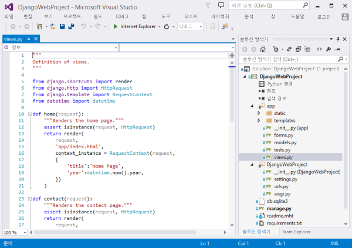
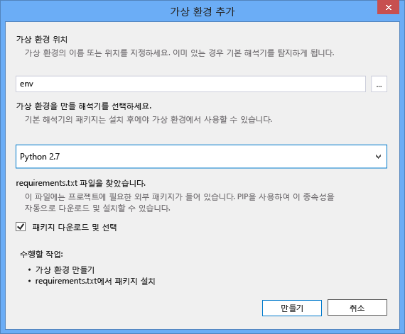
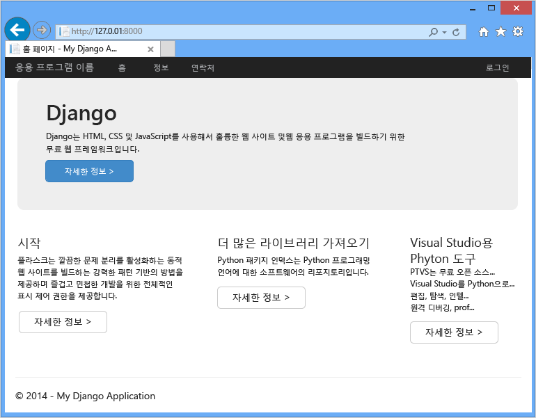
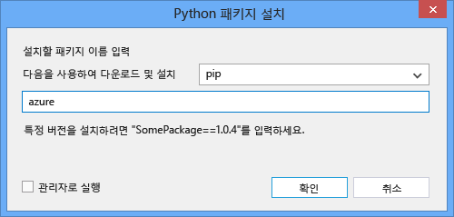
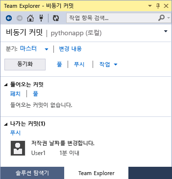

# Azure에서 Django를 사용하여 웹앱 만들기
이 자습서에서는 [Azure 앱 서비스 웹앱](http://go.microsoft.com/fwlink/?LinkId=529714)에서 Python을 실행하는 방법을 설명합니다. 웹앱은 제한된 무료 호스팅 및 신속한 배포 기능을 제공하며, Python을 사용할 수 있습니다! 앱이 증가하면 유료 호스팅으로 전환하여 다른 모든 Azure 서비스와 통합할 수도 있습니다.

먼저 Django 웹 프레임워크([Flask](web-sites-python-create-deploy-flask-app.md) 및 [Bottle](web-sites-python-create-deploy-bottle-app.md)은 이 자습서의 다른 버전 참조)를 사용하여 응용 프로그램을 만듭니다. Azure 마켓플레이스에서 웹앱을 만들고, Git 배포를 설치하고, 리포지토리를 로컬로 복제합니다. 그런 다음 응용 프로그램을 로컬로 실행하고, 변경한 다음, 이를 커밋하여 Azure에 푸시합니다. 이 자습서에서는 Windows 또는 Mac/Linux에서 이 작업을 수행하는 방법을 보여 줍니다.

[!INCLUDE [create-account-and-websites-note](../../includes/create-account-and-websites-note.md)]

> [!NOTE]
> Azure 계정을 등록하기 전에 Azure 앱 서비스를 시작하려면 [앱 서비스 평가](http://go.microsoft.com/fwlink/?LinkId=523751)로 이동합니다. 앱 서비스에서 단기 스타터 웹 앱을 즉시 만들 수 있습니다. 신용 카드는 필요하지 않으며 약정도 필요하지 않습니다.
> 
> 

## 필수 조건
* Windows, Mac 또는 Linux
* Python 2.7 또는 3.4
* setuptools, pip, virtualenv(Python 2.7 전용)
* Git
* [Python Tools for Visual Studio][Python Tools for Visual Studio](PTVS) - 참고: 선택 사항입니다.

**참고**: 현재 Python 프로젝트에서는 TFS 게시를 사용할 수 없습니다.

### Windows
Python 2.7 또는 3.4(32비트)를 아직 설치하지 않은 경우 웹 플랫폼 설치 관리자를 사용하여 [Azure SDK for Python 2.7] 또는 [Azure SDK for Python 3.4]를 설치하는 것이 좋습니다. 그러면 32비트 버전의 Python, setuptools, pip, virtualenv 등(32비트 Python은 Azure 호스트 컴퓨터에 설치되는 버전)이 설치됩니다. 또는 [python.org]에서 Python을 다운로드할 수 있습니다.

Git의 경우 [Windows용 Git] 또는 [Windows용 GitHub]를 설치하는 것이 좋습니다. Visual Studio를 사용하는 경우 통합 Git 지원을 사용할 수 있습니다.

또한 [Python Tools 2.2 for Visual Studio]를 설치하는 것이 좋습니다. 이는 선택 사항이지만 [Visual Studio](무료 Visual Studio Community 2013 또는 Visual Studio Express 2013 for Web 포함.md)가 있으면 Python IDE가 향상됩니다.

### Mac/Linux
Python 및 Git를 이미 설치했어야 하지만 Python 버전은 2.7 또는 3.4여야 합니다.

## 포털에서 웹 앱 만들기
앱을 만드는 첫 번째 단계는 [Azure 포털](https://portal.azure.com)을 통해 웹앱을 만드는 것입니다.

1. Azure 포털에 로그인하여 왼쪽 아래에 있는 **새로 만들기** 단추를 클릭합니다.
2. 검색 상자에 "python"을 입력합니다.
3. 검색 결과에서 **Django**(PTVS에서 게시)를 선택하고 **만들기**를 클릭합니다.
4. 새 Django 앱을 구성(예: 새 앱 서비스 계획 만들기)하고 해당 앱의 새 리소스 그룹을 구성합니다. 그런 다음에 **만들기**를 클릭합니다.
5. [Azure 앱 서비스에 로컬 Git 배포](app-service-deploy-local-git.md)의 지침에 따라 새로 만든 웹앱에 대한 Git 게시를 구성합니다.

## 응용 프로그램 개요
### Git 리포지토리 콘텐츠
다음은 초기 Git 리포지토리에 표시되는 파일의 개요입니다(다음 섹션에서 복제).

    \app\__init__.py
    \app\forms.py
    \app\models.py
    \app\tests.py
    \app\views.py
    \app\static\content\
    \app\static\fonts\
    \app\static\scripts\
    \app\templates\about.html
    \app\templates\contact.html
    \app\templates\index.html
    \app\templates\layout.html
    \app\templates\login.html
    \app\templates\loginpartial.html
    \DjangoWebProject\__init__.py
    \DjangoWebProject\settings.py
    \DjangoWebProject\urls.py
    \DjangoWebProject\wsgi.py

응용 프로그램의 기본 소스. 마스터 레이아웃과 함께 3페이지(index, about, contact)로 구성됩니다. 정적 콘텐츠와 스크립트에는 bootstrap, jquery, modernizr 및 respond가 포함되어 있습니다.

    \manage.py

로컬 관리 및 개발 서버 지원. 로컬로 응용 프로그램을 실행하고 데이터베이스를 동기화하는 등의 작업에 사용됩니다.

    \db.sqlite3

기본 데이터베이스. 응용 프로그램을 실행하는 데 필요한 테이블이 포함되어 있지만 사용자는 포함되어 있지 않습니다(데이터베이스를 동기화하여 사용자를 만듦).

    \DjangoWebProject.pyproj
    \DjangoWebProject.sln

[Python Tools for Visual Studio]에서 사용되는 프로젝트 파일

    \ptvs_virtualenv_proxy.py

가상 환경용 IIS 프록시 및 PTVS 원격 디버깅 지원

    \requirements.txt

이 응용 프로그램에 필요한 외부 패키지. 배포 스크립트는 이 파일에 나열된 패키지를 pip 설치합니다.

    \web.2.7.config
    \web.3.4.config

IIS 구성 파일. 배포 스크립트에서는 적절한 web.x.y.config를 사용하며 이를 web.config로 복사합니다.

### 선택적 파일 - 배포 사용자 지정
[!INCLUDE [web-sites-python-django-customizing-deployment](../../includes/web-sites-python-django-customizing-deployment.md)]

### 선택적 파일 - Python 런타임
[!INCLUDE [web-sites-python-customizing-runtime](../../includes/web-sites-python-customizing-runtime.md)]

### 서버의 추가 파일
일부 파일은 서버에 있지만 git 리포지토리에 추가되지 않습니다. 이러한 파일은 배포 스크립트를 통해 생성됩니다.

    \web.config

IIS 구성 파일. 모든 배포에서 web.x.y.config를 통해 생성됩니다.

    \env\

Python 가상 환경. 호환되는 가상 환경이 웹앱에 없는 경우 배포 중에 생성됩니다. requirements.txt에 나열된 패키지가 pip 설치되지만 패키지가 이미 설치된 경우에는 pip에서 설치를 건너뜁니다.

다음 세 개의 섹션에서는 세 가지 환경에서 웹앱 배포를 계속 진행하는 방법에 대해 설명합니다.

* Windows, Python Tools for Visual Studio 사용
* Windows, 명령줄 사용
* Mac/Linux, 명령줄 사용

## 웹앱 배포 - Windows - Python Tools for Visual Studio
### 리포지토리 복제
먼저 Azure 포털에서 제공된 URL을 사용하여 리포지토리를 복제합니다. 자세한 내용은 [Azure 앱 서비스에 로컬 Git 배포](app-service-deploy-local-git.md)를 참조하세요.

리포지토리의 루트에 포함된 솔루션 파일(.sln)을 엽니다.

### 가상 환경 만들기
이제 로컬 개발을 위한 가상 환경을 만듭니다. **Python Environments**를 마우스 오른쪽 단추로 클릭하고 **Add Virtual Environment...**를 선택합니다.

* 환경 이름이 `env`인지 확인합니다.
* 기본 해석기를 선택합니다. 웹앱에 대해 선택(runtime.txt 또는 Azure 포털에서 웹앱의 **응용 프로그램 설정** 블레이드를 통해)된 Python의 동일한 버전을 사용해야 합니다.
* 패키지를 다운로드하여 설치하는 옵션이 선택되어 있는지 확인합니다.

**만들기**를 클릭합니다. 가상 환경이 만들어지고 requirements.txt에 나열된 종속성이 설치됩니다.

### superuser 만들기
응용 프로그램에 포함된 데이터베이스에는 superuser가 정의되어 있지 않습니다. 응용 프로그램 또는 Django 관리 인터페이스(사용하도록 설정하려는 경우)에서 로그인 기능을 사용하려면 superuser를 만들어야 합니다.

명령줄을 통해 프로젝트 폴더에서 다음을 실행합니다.

    env\scripts\python manage.py createsuperuser

프롬프트에 따라 사용자 이름, 암호 등을 설정합니다.

### 개발 서버를 사용하여 실행
F5 키를 눌러 디버깅을 시작하면 웹 브라우저에서 로컬로 실행되는 페이지가 자동으로 열립니다.

원본에서 중단점을 설정하고, 조사식 창을 사용하는 등의 작업을 수행할 수 있습니다. 여러 기능에 대한 자세한 내용은 [Python Tools for Visual Studio 설명서]를 참조하세요.

### 변경 작업
이제 응용 프로그램 소스 및/또는 템플릿을 변경하여 실험할 수 있습니다.

변경 내용을 테스트한 후 Git 리포지토리에 커밋합니다.

### 추가 패키지 설치
응용 프로그램에 Python 및 Django 이외의 종속성이 있을 수 있습니다.

pip를 사용하여 추가 패키지를 설치할 수 있습니다. 패키지를 설치하려면 가상 환경을 마우스 오른쪽 단추로 클릭하고 **Install Python Package**를 선택합니다.

예를 들어 Azure 저장소, 서비스 버스 및 기타 Azure 서비스에 대한 액세스를 제공하는 Azure SDK for Python을 설치하려면 `azure`를 입력합니다.

가상 환경을 마우스 오른쪽 단추로 클릭하고 **Generate requirements.txt**를 선택하여 requirements.txt를 업데이트합니다.

그런 다음 requirements.txt의 변경 내용을 Git 리포지토리에 커밋합니다.

### Azure에 배포
배포를 트리거하려면 **Sync** 또는 **Push**를 클릭합니다. Sync는 밀어넣기와 끌어오기를 둘 다 수행합니다.

첫 배포에서는 가상 환경 만들기, 패키지 설치 등의 작업이 수행되므로 약간의 시간이 걸립니다.

Visual Studio에는 배포 진행률이 표시되지 않습니다. 출력을 검토하려면 [문제 해결 - 배포](#troubleshooting-deployment) 섹션을 참조하세요

Azure URL로 이동하여 변경 내용을 확인합니다.

## 웹앱 배포 - Windows - 명령줄
### 리포지토리 복제
먼저 Azure 포털에서 제공된 URL을 사용하여 리포지토리를 복제하고 Azure 리포지토리를 원격으로 추가합니다. 자세한 내용은 [Azure 앱 서비스에 로컬 Git 배포](app-service-deploy-local-git.md)를 참조하세요.

    git clone <repo-url>
    cd <repo-folder>
    git remote add azure <repo-url>

### 가상 환경 만들기
개발을 위해 새 가상 환경을 만듭니다(리포지토리에 추가 안 함). Python의 가상 환경은 재할당할 수 없으므로 응용 프로그램에서 작업하는 모든 개발자가 각자 로컬로 만듭니다.

웹앱에 대해 선택(runtime.txt 또는 Azure 포털에서 웹앱의 응용 프로그램 설정 블레이드를 통해)된 Python의 동일한 버전을 사용해야 합니다.

Python 2.7:

    c:\python27\python.exe -m virtualenv env

Python 3.4:

    c:\python34\python.exe -m venv env

응용 프로그램에 필요한 모든 외부 패키지를 설치합니다. 리포지토리의 루트에 있는 requirements.txt 파일을 사용하여 가상 환경에 패키지를 설치합니다.

    env\scripts\pip install -r requirements.txt

### superuser 만들기
응용 프로그램에 포함된 데이터베이스에는 superuser가 정의되어 있지 않습니다. 응용 프로그램 또는 Django 관리 인터페이스(사용하도록 설정하려는 경우)에서 로그인 기능을 사용하려면 superuser를 만들어야 합니다.

명령줄을 통해 프로젝트 폴더에서 다음을 실행합니다.

    env\scripts\python manage.py createsuperuser

프롬프트에 따라 사용자 이름, 암호 등을 설정합니다.

### 개발 서버를 사용하여 실행
다음 명령을 사용하여 개발 서버에서 응용 프로그램을 시작할 수 있습니다.

    env\scripts\python manage.py runserver

콘솔에 서버에서 수신 대기하는 URL 및 포트가 표시됩니다.

그러면 이 URL로 웹 브라우저를 엽니다.

### 변경 작업
이제 응용 프로그램 소스 및/또는 템플릿을 변경하여 실험할 수 있습니다.

변경 내용을 테스트한 후 Git 리포지토리에 커밋합니다.

    git add <modified-file>
    git commit -m "<commit-comment>"

### 추가 패키지 설치
응용 프로그램에 Python 및 Django 이외의 종속성이 있을 수 있습니다.

pip를 사용하여 추가 패키지를 설치할 수 있습니다. 예를 들어 Azure 저장소, 서비스 버스 및 기타 Azure 서비스에 대한 액세스를 제공하는 Azure SDK for Python을 설치하려면 다음을 입력합니다.

    env\scripts\pip install azure

requirements.txt를 업데이트합니다.

    env\scripts\pip freeze > requirements.txt

변경 내용을 커밋합니다.

    git add requirements.txt
    git commit -m "Added azure package"

### Azure에 배포
배포를 트리거하려면 변경 내용을 Azure에 푸시합니다.

    git push azure master

가상 환경 생성, 패키지 설치, web.config 생성 등 배포 스크립트의 출력이 표시됩니다.

Azure URL로 이동하여 변경 내용을 확인합니다.

## 웹앱 배포 - Mac/Linux - 명령줄
### 리포지토리 복제
먼저 Azure 포털에서 제공된 URL을 사용하여 리포지토리를 복제하고 Azure 리포지토리를 원격으로 추가합니다. 자세한 내용은 [Azure 앱 서비스에 로컬 Git 배포](app-service-deploy-local-git.md)를 참조하세요.

    git clone <repo-url>
    cd <repo-folder>
    git remote add azure <repo-url>

### 가상 환경 만들기
개발을 위해 새 가상 환경을 만듭니다(리포지토리에 추가 안 함). Python의 가상 환경은 재할당할 수 없으므로 응용 프로그램에서 작업하는 모든 개발자가 각자 로컬로 만듭니다.

웹앱에 대해 선택(runtime.txt 또는 Azure 포털에서 웹앱의 응용 프로그램 설정 블레이드를 통해)된 Python의 동일한 버전을 사용해야 합니다.

Python 2.7:

    python -m virtualenv env

Python 3.4:

    python -m venv env

또는

    pyvenv env

응용 프로그램에 필요한 모든 외부 패키지를 설치합니다. 리포지토리의 루트에 있는 requirements.txt 파일을 사용하여 가상 환경에 패키지를 설치합니다.

    env/bin/pip install -r requirements.txt

### superuser 만들기
응용 프로그램에 포함된 데이터베이스에는 superuser가 정의되어 있지 않습니다. 응용 프로그램 또는 Django 관리 인터페이스(사용하도록 설정하려는 경우)에서 로그인 기능을 사용하려면 superuser를 만들어야 합니다.

명령줄을 통해 프로젝트 폴더에서 다음을 실행합니다.

    env/bin/python manage.py createsuperuser

프롬프트에 따라 사용자 이름, 암호 등을 설정합니다.

### 개발 서버를 사용하여 실행
다음 명령을 사용하여 개발 서버에서 응용 프로그램을 시작할 수 있습니다.

    env/bin/python manage.py runserver

콘솔에 서버에서 수신 대기하는 URL 및 포트가 표시됩니다.

그러면 이 URL로 웹 브라우저를 엽니다.

### 변경 작업
이제 응용 프로그램 소스 및/또는 템플릿을 변경하여 실험할 수 있습니다.

변경 내용을 테스트한 후 Git 리포지토리에 커밋합니다.

    git add <modified-file>
    git commit -m "<commit-comment>"

### 추가 패키지 설치
응용 프로그램에 Python 및 Django 이외의 종속성이 있을 수 있습니다.

pip를 사용하여 추가 패키지를 설치할 수 있습니다. 예를 들어 Azure 저장소, 서비스 버스 및 기타 Azure 서비스에 대한 액세스를 제공하는 Azure SDK for Python을 설치하려면 다음을 입력합니다.

    env/bin/pip install azure

requirements.txt를 업데이트합니다.

    env/bin/pip freeze > requirements.txt

변경 내용을 커밋합니다.

    git add requirements.txt
    git commit -m "Added azure package"

### Azure에 배포
배포를 트리거하려면 변경 내용을 Azure에 푸시합니다.

    git push azure master

가상 환경 생성, 패키지 설치, web.config 생성 등 배포 스크립트의 출력이 표시됩니다.

Azure URL로 이동하여 변경 내용을 확인합니다.

## 문제 해결 - 패키지 설치
[!INCLUDE [web-sites-python-troubleshooting-package-installation](../../includes/web-sites-python-troubleshooting-package-installation.md)]

## 문제 해결 - 가상 환경
[!INCLUDE [web-sites-python-troubleshooting-virtual-environment](../../includes/web-sites-python-troubleshooting-virtual-environment.md)]

## 문제 해결 - 정적 파일
Django에는 정적 파일 수집 개념이 있습니다. 이는 모든 정적 파일을 원래 위치에서 가져와 단일 폴더에 복사합니다. 이 응용 프로그램의 경우 `/static`에 복사됩니다.

이 작업은 정적 파일이 다른 Django ‘앱’에서 가져온 파일일 수 있기 때문에 수행됩니다. 예를 들어 Django 관리 인터페이스의 정적 파일은 가상 환경에서 Django 라이브러리 하위 폴더에 있습니다. 이 응용 프로그램에서 정의된 정적 파일은 `/app/static`에 있습니다. 추가 Django ‘앱’을 사용할 경우 정적 파일을 여러 위치에 둘 수 있습니다.

디버그 모드에서 응용 프로그램을 실행할 때는 정적 파일이 원래 위치에서 제공됩니다.

릴리스 모드에서 응용 프로그램을 실행할 때는 정적 파일이 제공되지 **않습니다**. 이 경우 웹 서버에서 파일을 제공합니다. 이 응용 프로그램의 경우 IIS가 `/static`에서 정적 파일을 제공합니다.

정적 파일 수집은 배포 스크립트의 일부로 자동으로 수행되며, 이전에 수집된 파일은 지워집니다. 따라서 모든 배포에서 수집이 발생하기 때문에 배포가 약간 느려지지만 오래된 파일은 사용할 수 없게 되므로 잠재적 보안 문제가 방지됩니다.

Django 응용 프로그램에 대한 정적 파일 수집을 건너뛰려는 경우:

    \.skipDjango

그런 다음 로컬 컴퓨터에서 수동으로 수집을 수행해야 합니다.

    env\scripts\python manage.py collectstatic

그런 다음 `\static` 폴더를 `.gitignore`에서 제거하고 Git 리포지토리에 추가합니다.

## 문제 해결 - 설정
응용 프로그램의 여러 설정이 `DjangoWebProject/settings.py`에서 변경될 수 있습니다.

개발자의 편의를 위해 디버그 모드가 사용하도록 설정됩니다. 이 모드의 장점은 로컬로 실행할 때 정적 파일을 수집하지 않고도 이미지 및 다른 정적 콘텐츠를 볼 수 있다는 점입니다.

디버그 모드를 사용하지 않도록 설정하려면 다음을 실행합니다.

    DEBUG = False

디버그가 사용하지 않도록 설정되면 Azure 호스트 이름을 포함하도록 `ALLOWED_HOSTS` 값을 업데이트해야 합니다. 예:

    ALLOWED_HOSTS = (
        'pythonapp.azurewebsites.net',
    )

또는 모두 사용하도록 설정하려면 다음을 실행합니다.

    ALLOWED_HOSTS = (
        '*',
    )

실제로는 디버그 모드와 릴리스 모드 간의 전환 및 호스트 이름 가져오기를 처리하기 위해 보다 복잡한 작업을 수행할 수 있습니다.

Azure 포털 **구성** 페이지의 **앱 설정** 섹션에서 환경 변수를 설정할 수 있습니다. 이는 소스에 표시하지 않으려는 값(연결 문자열, 암호 등)을 설정하거나, Azure와 로컬 컴퓨터 간에 다르게 설정하려는 경우에 유용할 수 있습니다. `settings.py`에서 `os.getenv`를 사용하여 환경 변수를 쿼리할 수 있습니다.

## 데이터베이스 사용
응용 프로그램에 포함된 데이터베이스는 sqlite 데이터베이스입니다. 이는 필요한 설정이 거의 없으므로 개발용으로 편리하고 유용한 기본 데이터베이스입니다. 이 데이터베이스는 프로젝트 폴더의 db.sqlite3 파일에 저장됩니다.

Azure에서는 Django 응용 프로그램에서 쉽게 사용할 수 있는 데이터베이스 서비스를 제공합니다. Django 응용 프로그램에서 [SQL 데이터베이스] 및 [MySQL]을 사용하는 방법에 대한 자습서에는 데이터베이스 서비스를 만들고, `DjangoWebProject/settings.py`에서 데이터베이스 설정을 변경하고, 설치에 필요한 라이브러리를 가져오는 데 필요한 단계가 나와 있습니다.

물론 자체 데이터베이스 서버를 관리하려는 경우에는 Azure에서 실행되는 Windows 또는 Linux 가상 컴퓨터를 사용하여 관리할 수 있습니다.

## Django 관리 인터페이스
모델을 빌드하기 시작했으면 일부 데이터로 데이터베이스를 채워야 합니다. 콘텐츠를 대화형으로 추가하고 편집하는 간편한 방법은 Django 관리 인터페이스를 사용하는 것입니다.

관리 인터페이스의 코드는 응용 프로그램 소스에서 주석 처리되지만 쉽게 설정할 수 있도록 명확히 표시되어 있습니다('admin' 검색).

사용하도록 설정한 후에는 데이터베이스를 동기화하고 응용 프로그램을 실행한 후 `/admin`으로 이동하세요.

## 다음 단계
Django 및 Python Tools for Visual Studio에 대한 자세한 내용은 다음 링크를 참조하세요.

* [Django 설명서]
* [Python Tools for Visual Studio 설명서]

SQL 데이터베이스 및 MySQL 사용에 대한 자세한 정보:

* [Azure의 Django 및 MySQL과 Python Tools for Visual Studio]
* [Azure의 Django 및 SQL 데이터베이스와 Python Tools for Visual Studio]

자세한 내용은 [Python 개발자 센터](/develop/python/)를 참조하세요.

## 변경된 내용
* 웹 사이트에서 앱 서비스로의 변경에 대한 지침은 [Azure 앱 서비스와 이 서비스가 기존 Azure 서비스에 미치는 영향](http://go.microsoft.com/fwlink/?LinkId=529714)을 참조하세요.

<!--Link references-->
[Azure의 Django 및 MySQL과 Python Tools for Visual Studio]: web-sites-python-ptvs-django-mysql.md
[Azure의 Django 및 SQL 데이터베이스와 Python Tools for Visual Studio]: web-sites-python-ptvs-django-sql.md
[SQL 데이터베이스]: web-sites-python-ptvs-django-sql.md
[MySQL]: web-sites-python-ptvs-django-mysql.md

<!--External Link references-->
[Azure SDK for Python 2.7]: http://go.microsoft.com/fwlink/?linkid=254281
[Azure SDK for Python 3.4]: http://go.microsoft.com/fwlink/?linkid=516990
[python.org]: http://www.python.org/
[Windows용 Git]: http://msysgit.github.io/
[Windows용 GitHub]: https://windows.github.com/
[Python Tools for Visual Studio]: http://aka.ms/ptvs
[Python Tools 2.2 for Visual Studio]: http://go.microsoft.com/fwlink/?LinkID=624025
[Visual Studio]: http://www.visualstudio.com/
[Python Tools for Visual Studio 설명서]: http://aka.ms/ptvsdocs
[Django 설명서]: https://www.djangoproject.com/

<!---HONumber=AcomDC_0810_2016-->