<properties 
	pageTitle="Azure의 Django 및 MySQL과 Python Tools 2.2 for Visual Studio" 
	description="Python Tools for Visual Studio를 사용하여 MySQL 데이터베이스 인스턴스에 데이터를 저장하고 Azure 앱 서비스 웹앱에 배포할 수 있는 Django 웹앱을 만드는 방법에 대해 알아봅니다." 
	services="app-service\web" 
	documentationCenter="python" 
	authors="huguesv" 
	manager="wpickett" 
	editor=""/>

<tags 
	ms.service="app-service-web" 
	ms.workload="web" 
	ms.tgt_pltfrm="na" 
	ms.devlang="python"
	ms.topic="hero-article" 
	ms.date="02/25/2016"
	ms.author="huvalo"/>

# Azure의 Django 및 MySQL과 Python Tools 2.2 for Visual Studio 

> [AZURE.SELECTOR]
- [.Net](web-sites-dotnet-get-started.md)
- [Node.JS](web-sites-nodejs-develop-deploy-mac.md)
- [Java](web-sites-java-get-started.md)
- [PHP - Git](web-sites-php-mysql-deploy-use-git.md)
- [PHP - FTP](web-sites-php-mysql-deploy-use-ftp.md)
- [Python](web-sites-python-ptvs-django-mysql.md)

이 자습서에서는 PTVS 샘플 템플릿 중 하나를 사용하여 간단한 설문 조사 웹앱을 만들기 위해 [Python Tools for Visual Studio]를 사용해 보겠습니다. 이 자습서는 [비디오](https://www.youtube.com/watch?v=oKCApIrS0Lo)로도 제공됩니다.

Azure에서 호스트된 MySQL 서비스를 사용하는 방법, MySQL을 사용하도록 웹앱을 구성하는 방법 및 [Azure 앱 서비스 웹앱](http://go.microsoft.com/fwlink/?LinkId=529714)에 웹앱을 게시하는 방법을 알아봅니다.

Bottle, Flask 및 Django 웹 프레임워크, MongoDB, Azure 테이블 저장소, MySQL 및 SQL 데이터베이스 서비스를 사용하여 PTVS로 Azure 앱 서비스 웹앱을 개발하는 내용을 다루는 추가 문서에 대해서는 [Python 개발자 센터]를 참조하세요. 이 문서는 앱 서비스를 중점적으로 다루지만 포함된 단계는 [Azure 클라우드 서비스]를 개발할 때와 비슷합니다.

## 필수 조건

 - Visual Studio 2013 또는 2015
 - [Python Tools 2.2 for Visual Studio]
 - [Python Tools 2.2 for Visual Studio Samples VSIX]
 - [Azure SDK Tools for VS 2013] 또는 [Azure SDK Tools for VS 2015]
 - [Python 2.7 32비트]
 - Django 1.6 또는 이전

[AZURE.INCLUDE [create-account-and-websites-note](../../includes/create-account-and-websites-note.md)]

>[AZURE.NOTE] Azure 계정을 등록하기 전에 Azure 앱 서비스를 시작하려면 [앱 서비스 평가](http://go.microsoft.com/fwlink/?LinkId=523751)로 이동합니다. 앱 서비스에서 단기 스타터 웹 앱을 즉시 만들 수 있습니다. 신용 카드는 필요하지 않으며 약정도 필요하지 않습니다.

## 프로젝트 만들기

이 섹션에서는 샘플 템플릿을 사용하여 Visual Studio 프로젝트를 만듭니다. 가상 환경을 만들고 필요한 패키지를 설치합니다. sqlite를 사용하여 로컬 데이터베이스를 만듭니다. 그런 후 응용 프로그램을 로컬로 실행합니다.

1.  Visual Studio에서 **파일**, **새 프로젝트**를 선택합니다.

1.  PTVS 샘플 VSIX의 프로젝트 템플릿은 **Python**, **샘플**에서 사용할 수 있습니다. **Polls Django Web Project**를 선택하고 확인을 클릭하여 프로젝트를 만듭니다.

  	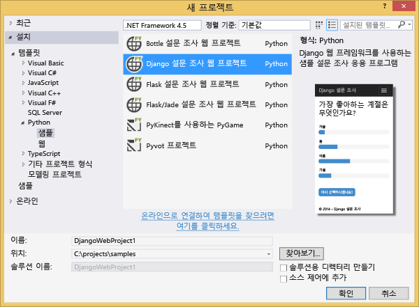

1.  외부 패키지를 설치할지 묻는 메시지가 표시됩니다. **가상 환경에 설치**를 선택합니다.

  	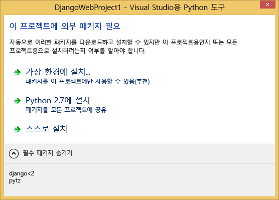

1.  기본 해석기로 **Python 2.7**을 선택합니다.

  	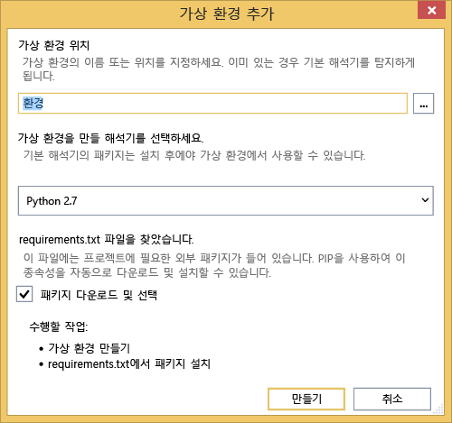

1.  프로젝트 노드를 마우스 오른쪽 단추로 클릭하고 **Python**, **Django Sync DB**를 선택합니다.

  	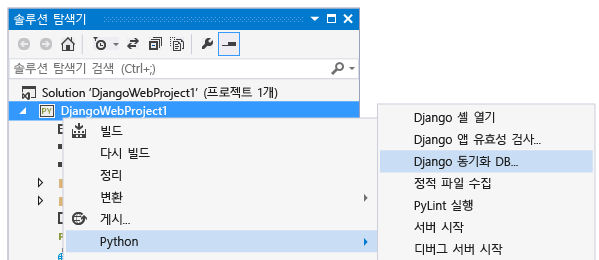

1.  이렇게 하면 Django Management Console이 열립니다. 프롬프트에 따라 사용자를 만듭니다.

    그러면 프로젝트 폴더에 sqlite 데이터베이스가 만들어집니다.

  	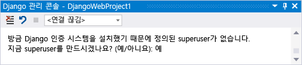

1.  <kbd>F5</kbd> 키를 눌러 응용프로그램이 작동하는지 확인합니다.

1.  위쪽의 탐색 모음에서 **로그인**을 클릭합니다.

  	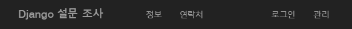

1.  데이터베이스를 동기화할 때 만든 사용자의 자격 증명을 입력합니다.

  	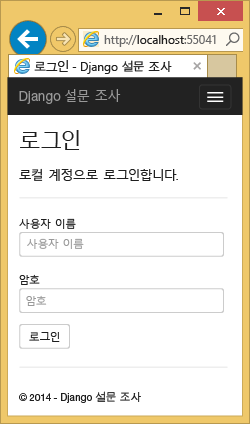

1.  **Create Sample Polls**를 클릭합니다.

  	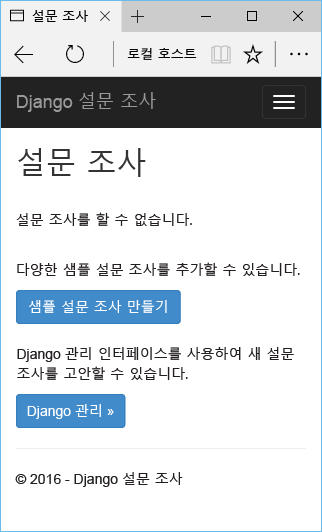

1.  poll and vote를 클릭합니다.

  	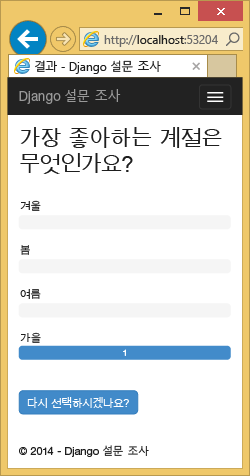

## MySQL 데이터베이스 만들기

데이터베이스에 대해 Azure에서 ClearDB MySQL 호스트 데이터베이스를 만들어 보겠습니다.

또는 Azure에서 실행되는 자체의 가상 컴퓨터를 만든 다음 MySQL을 직접 설치하고 관리할 수도 있습니다.

다음 단계에 따라 무료로 데이터베이스를 만들 수 있습니다.

1.  [Azure 포털](https://portal.azure.com/)에 로그인합니다.

1.  탐색 창 상단에서 **새로 만들기**를 클릭합니다. 그런 다음 **데이터 + 저장소** > **MySQL 데이터베이스**를 클릭합니다.

  

1.  검색 상자에 "**mysql**"을 입력하고 **MySQL 데이터베이스**를 클릭한 다음 **만들기**를 클릭합니다.
  	<!-- 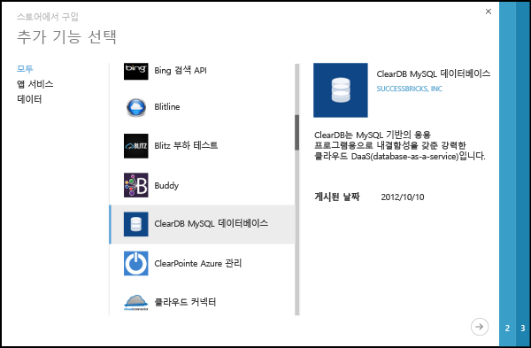 -->

1.  새 리소스 그룹을 만들어 새 MySQL 데이터베이스를 구성하고 적절한 위치를 선택합니다.

  	<!-- 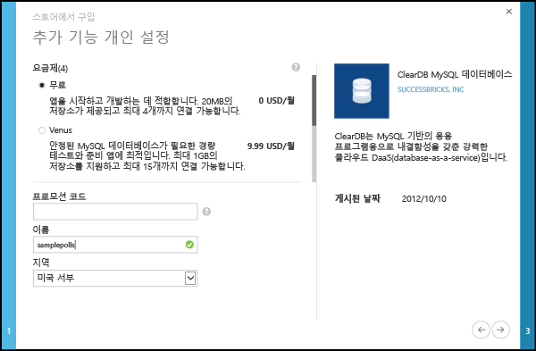 -->

1.  MySQL 데이터베이스를 만든 후 데이터베이스 블레이드에서 **속성**을 클릭합니다.
2.  복사 단추를 사용하여 **CONNECTION STRING** 값을 클립보드에 저장합니다.

## 프로젝트 구성

이 섹션에서는 방금 만든 MySQL 데이터베이스를 사용하도록 웹앱을 구성합니다. Django에서 MySQL 데이터베이스를 사용하는 데 필요한 추가 Python 패키지도 설치합니다. 그런 다음 웹앱을 로컬로 실행합니다.

1.  Visual Studio에서 *ProjectName* 폴더의 **settings.py** 를 엽니다. 일시적으로 연결 문자열을 편집기에 붙여 넣습니다. 연결 문자열은 다음 형식입니다.

        Database=<NAME>;Data Source=<HOST>;User Id=<USER>;Password=<PASSWORD>

    MySQL을 사용하도록 기본 데이터베이스 **ENGINE**을 변경하고 **CONNECTIONSTRING**에서 **NAME**, **USER**, **PASSWORD** 및 **HOST** 값을 설정합니다.

        DATABASES = {
            'default': {
                'ENGINE': 'django.db.backends.mysql',
                'NAME': '<Database>',
                'USER': '<User Id>',
                'PASSWORD': '<Password>',
                'HOST': '<Data Source>',
                'PORT': '',
            }
        }

1.  솔루션 탐색기의 **Python Environments**에서 가상 환경을 마우스 오른쪽 단추로 클릭하고 **Install Python Package**를 선택합니다.

1. **easy\_install**을 사용하여 패키지 `mysql-python`를 설치합니다.

  	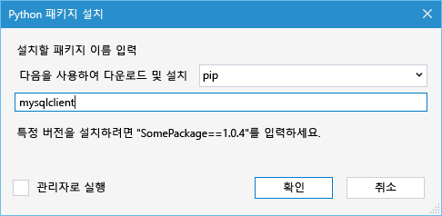

1.  프로젝트 노드를 마우스 오른쪽 단추로 클릭하고 **Python**, **Django Sync DB**를 선택합니다.

    이렇게 하면 이전 섹션에서 만든 MySQL 데이터베이스에 대한 테이블이 만들어집니다. 프롬프트에 따라 사용자를 만듭니다. 이 사용자가 첫 번째 섹션에서 만든 sqlite 데이터베이스의 사용자와 일치할 필요는 없습니다.

  	

1.  `F5` 키를 눌러 응용 프로그램을 실행합니다. **Create Sample Polls**를 사용하여 만든 설문 조사와 투표를 통해 제출된 데이터는 MySQL 데이터베이스에서 serialize됩니다.

## Azure 앱 서비스에 웹앱 게시

Azure .NET SDK를 통해 Azure 앱 서비스에 웹앱을 쉽게 배포할 수 있습니다.

1.  **솔루션 탐색기**에서 프로젝트 노드를 마우스 오른쪽 단추로 클릭하고 **게시**를 선택합니다.

  	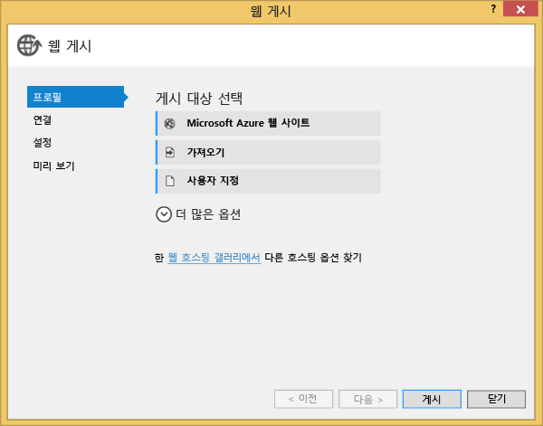

1.  **Microsoft Azure 웹앱**을 클릭합니다.

1.  **새로 만들기**를 클릭하여 새 웹앱을 만듭니다.

1.  다음 필드에 입력하고 **만들기**를 클릭합니다.
	-	**웹앱 이름**
	-	**앱 서비스 계획**
	-	**리소스 그룹**
	-	**지역**
	-	**데이터베이스 서버**를 **데이터베이스 없음**으로 그대로 설정합니다.

  	<!-- 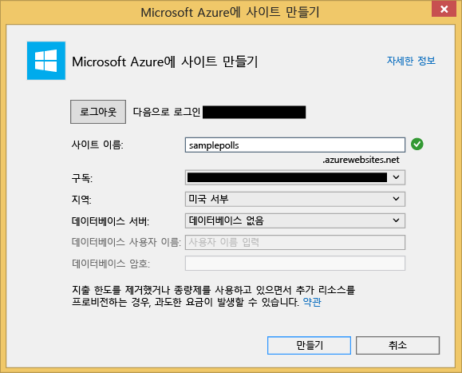 -->

1.  다른 모든 기본값을 그대로 적용하고 **게시**를 클릭합니다.

1.  웹 브라우저가 자동으로 게시된 웹앱으로 열립니다. Azure에 호스트된 **MySQL** 데이터베이스를 사용하여 예상한 대로 웹앱이 작동하는지 확인합니다.

    축하합니다.

  	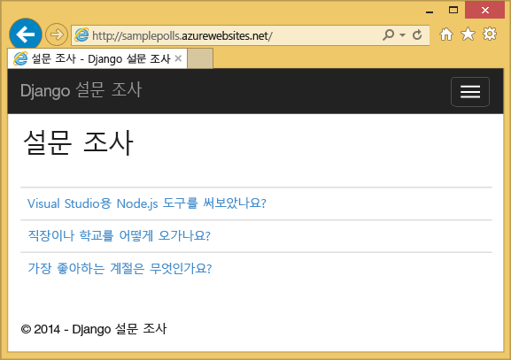

## 다음 단계

Python Tools for Visual Studio, Django 및 MySQL에 대해 자세히 알아보려면 다음 링크를 참조하세요.

- [Python Tools for Visual Studio 설명서]
  - [웹 프로젝트]
  - [클라우드 서비스 프로젝트]
  - [Microsoft Azure의 원격 디버깅]
- [Django 설명서]
- [MySQL]

자세한 내용은 [Python 개발자 센터](/develop/python/)를 참조하세요.

## 변경된 내용
* 웹 사이트에서 앱 서비스로의 변경에 대한 지침은 [Azure 앱 서비스와 이 서비스가 기존 Azure 서비스에 미치는 영향](http://go.microsoft.com/fwlink/?LinkId=529714)을 참조하세요.

<!--Link references-->
[Python 개발자 센터]: /develop/python/
[Azure 클라우드 서비스]: ../cloud-services-python-ptvs.md

<!--External Link references-->
[Azure Portal]: https://portal.azure.com
[Python Tools for Visual Studio]: http://aka.ms/ptvs
[Python Tools 2.2 for Visual Studio]: http://go.microsoft.com/fwlink/?LinkID=624025
[Python Tools 2.2 for Visual Studio Samples VSIX]: http://go.microsoft.com/fwlink/?LinkID=624025
[Azure SDK Tools for VS 2013]: http://go.microsoft.com/fwlink/?LinkId=323510
[Azure SDK Tools for VS 2015]: http://go.microsoft.com/fwlink/?LinkId=518003
[Python 2.7 32비트]: http://go.microsoft.com/fwlink/?LinkId=517190
[Python Tools for Visual Studio 설명서]: http://aka.ms/ptvsdocs
[Microsoft Azure의 원격 디버깅]: http://go.microsoft.com/fwlink/?LinkId=624026
[웹 프로젝트]: http://go.microsoft.com/fwlink/?LinkId=624027
[클라우드 서비스 프로젝트]: http://go.microsoft.com/fwlink/?LinkId=624028
[Django 설명서]: https://www.djangoproject.com/
[MySQL]: http://www.mysql.com/
 

<!---HONumber=AcomDC_0302_2016-->