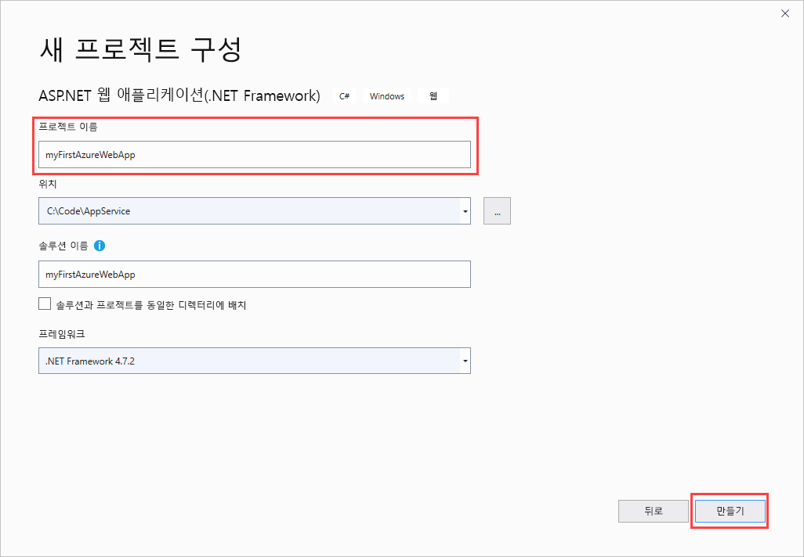
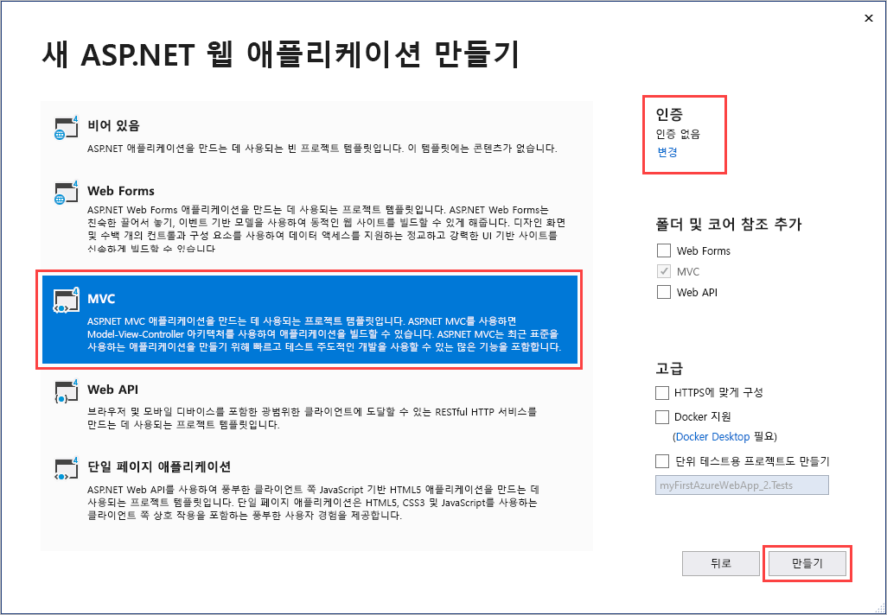
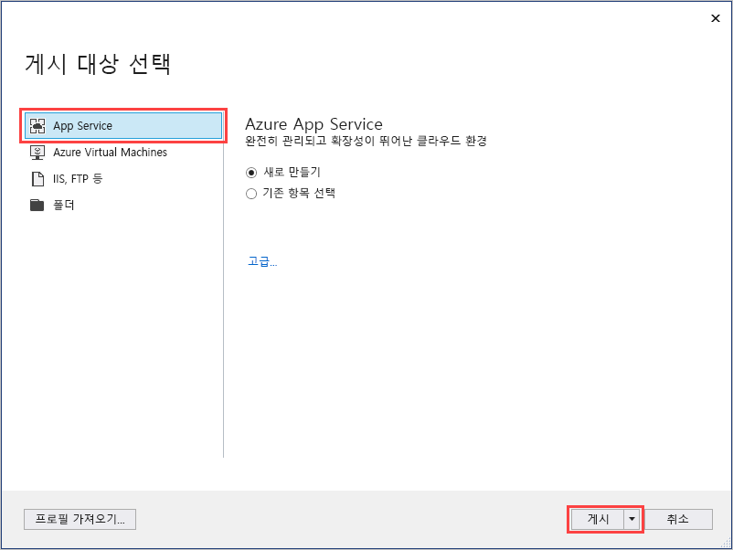
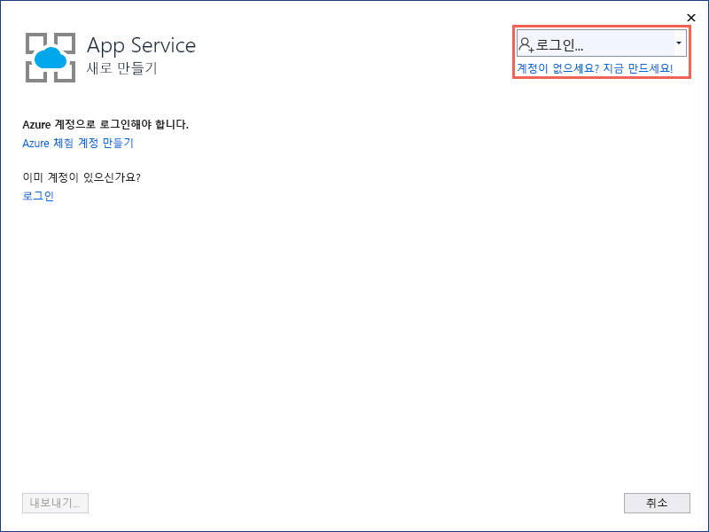
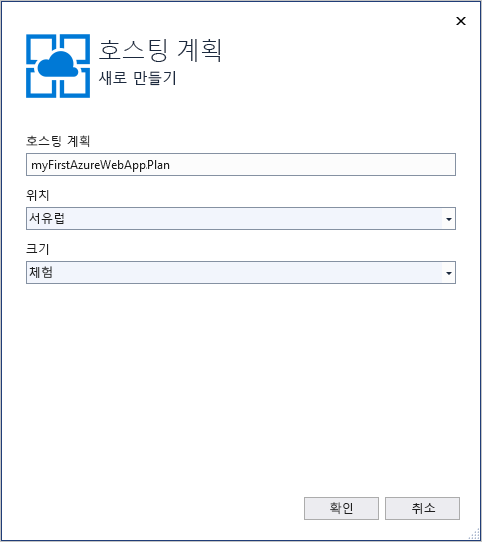
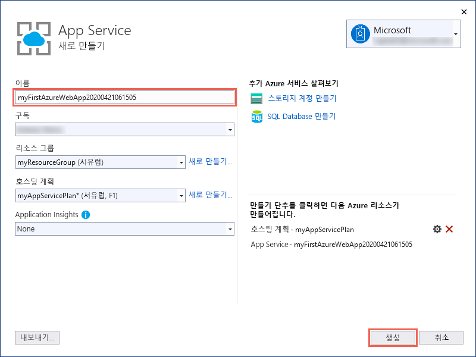
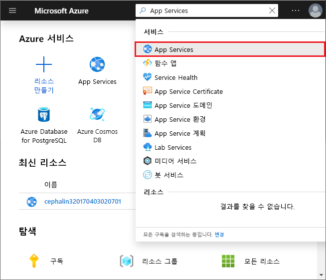
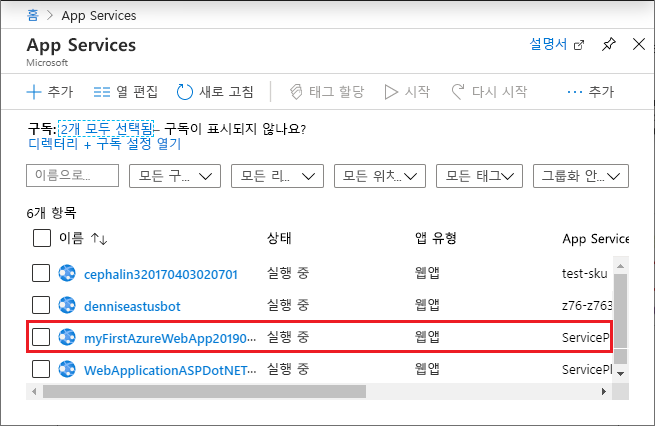
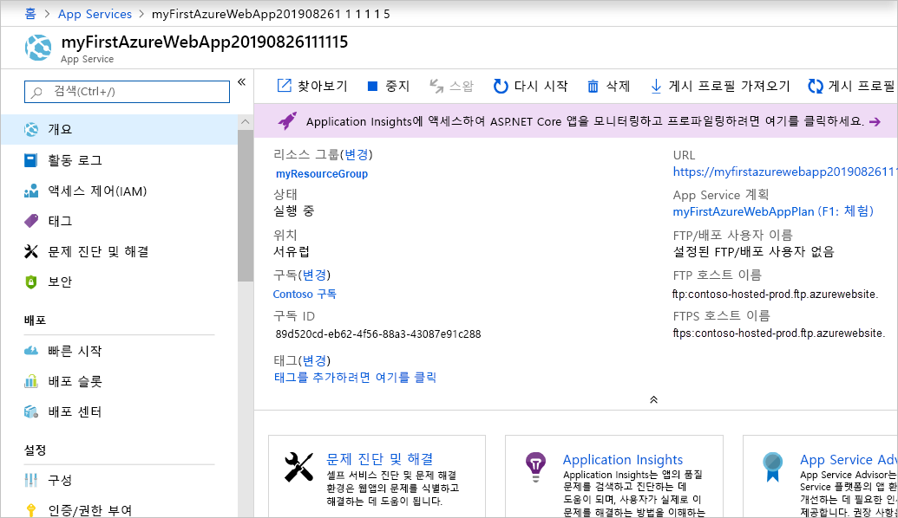

# <a name="create-an-aspnet-framework-web-app-in-azure"></a>Azure에서 ASP.NET Framework 웹앱 만들기

[Azure App Service](overview.md)는 확장성 높은 자체 패치 웹 호스팅 서비스를 제공합니다.

이 빠른 시작은 첫 번째 ASP.NET 웹앱을 Azure App Service에 배포하는 방법을 보여줍니다. 완료하면 App Service 계획을 얻을 수 있습니다. 배포된 웹 애플리케이션이 포함된 App Service 앱도 있습니다.

[!INCLUDE [quickstarts-free-trial-note](../../includes/quickstarts-free-trial-note.md)]

## <a name="prerequisites"></a>필수 조건

이 자습서를 완료하려면 **ASP.NET 및 웹 개발** 워크로드가 포함된 <a href="https://www.visualstudio.com/downloads/" target="_blank">Visual Studio 2019</a>를 설치합니다.

Visual Studio 2019를 이미 설치한 경우:

- **도움말** > **업데이트 확인**을 차례로 선택하여 Visual Studio에서 최신 업데이트를 설치합니다.
- **도구** > **도구 및 기능 가져오기**를 선택하여 워크로드를 추가합니다.

## ASP.NET 웹앱 만들기<a name="create-and-publish-the-web-app"></a>

다음 단계에 따라 ASP.NET 웹앱을 만듭니다.

1. Visual Studio를 연 다음, **새 프로젝트 만들기**를 선택합니다.

2. **새 프로젝트 만들기**에서 **ASP.NET 웹 애플리케이션(.NET Framework)** 을 찾아서 선택한 후, **다음**을 선택합니다.

3. **새 프로젝트 구성**에서 애플리케이션 이름을 _myFirstAzureWebApp_으로 지정한 다음, **만들기**를 선택합니다.

   

4. 모든 종류의 ASP.NET 웹앱을 Azure에 배포할 수 있습니다. 이 빠른 시작을 위해 **MVC** 템플릿을 선택합니다.

5. 인증이 **인증 없음**으로 설정되어 있는지 확인합니다. **만들기**를 선택합니다.

   

6. Visual Studio 메뉴에서 **디버그** > **디버깅하지 않고 시작**을 선택하여 웹앱을 로컬로 실행합니다.

   

## 웹앱 <a name="launch-the-publish-wizard"></a> 게시

1. **솔루션 탐색기**에서 마우스 오른쪽 단추로 **myFirstAzureWebApp** 프로젝트를 클릭하고, **게시**를 선택합니다.

1. **App Service**를 선택한 다음, **프로필 만들기**를 **게시**로 변경합니다.

   

1. **App Service 새로 만들기**의 옵션은 Azure에 이미 로그인했는지 여부와 Azure 계정에 연결된 Visual Studio 계정이 있는지 여부에 따라 달라집니다. **계정 추가** 또는 **로그인** 중 하나를 선택하여 Azure 구독에 로그인합니다. 이미 로그인한 경우 원하는 계정을 선택합니다.

   > [!NOTE]
   > 이미 로그인한 경우 아직 **만들기**를 선택하지 마십시오.
   >
   >

   

   [!INCLUDE [resource group intro text](../../includes/resource-group.md)]

1. **리소스 그룹**에 대해 **새로 만들기**를 선택합니다.

1. **새 리소스 그룹 이름**에서 *myResourceGroup*을 입력하고, **확인**을 선택합니다.

   [!INCLUDE [app-service-plan](../../includes/app-service-plan.md)]

1. **호스팅 계획**에 대해 **새로 만들기**를 선택합니다.

1. **호스팅 계획 구성** 대화 상자에서 다음 표의 값을 입력한 다음, **확인**을 선택합니다.

   | 설정 | 제안 값 | 설명 |
   |-|-|-|
   |App Service 계획| myAppServicePlan | App Service 계획의 이름입니다. |
   | 위치 | 서유럽 | 웹앱이 호스팅된 데이터 센터입니다. |
   | 크기 | 무료 | [가격 책정 계층](https://azure.microsoft.com/pricing/details/app-service/?ref=microsoft.com&utm_source=microsoft.com&utm_medium=docs&utm_campaign=visualstudio)은 호스팅 기능을 결정합니다. |

   

1. **이름**에서 유효한 문자(`a-z`, `A-Z`, `0-9` 및 `-`)만 포함된 고유한 앱 이름을 입력합니다. 자동으로 생성된 고유한 이름을 적용할 수 있습니다. 웹앱의 URL은 `http://<app_name>.azurewebsites.net`이며, 여기서 `<app_name>`은 앱 이름입니다.

2. **만들기**를 선택하여 Azure 리소스를 만듭니다.

   

마법사가 완료되면 Azure에 ASP.NET 웹앱을 게시한 다음 기본 브라우저에서 앱을 시작합니다.


**App Service 새로 만들기** 페이지에서 지정한 앱 이름은 `http://<app_name>.azurewebsites.net` 형식의 URL 접두사로 사용됩니다.

**축하합니다.** ASP.NET 웹앱이 Azure App Service에서 실시간으로 실행 중입니다.

## <a name="update-the-app-and-redeploy"></a>앱 업데이트 및 재배포

1. **솔루션 탐색기**의 프로젝트에서 **Views** > **Home** > **Index.cshtml**을 엽니다.

1. 위쪽 가까이에 `<div class="jumbotron">` HTML 태그를 찾아서 전체 요소를 다음 코드로 바꿉니다.

   ```HTML
   <div class="jumbotron">
       <h1>ASP.NET in Azure!</h1>
       <p class="lead">This is a simple app that we’ve built that demonstrates how to deploy a .NET app to Azure App Service.</p>
   </div>
   ```

1. Azure에 다시 배포하려면 **솔루션 탐색기**에서 **myFirstAzureWebApp** 프로젝트를 마우스 오른쪽 버튼으로 클릭하고 **게시**를 선택합니다. 그런 다음, **게시**를 선택합니다.

게시가 완료되면 Visual Studio가 웹앱의 URL로 브라우저를 시작합니다.


## <a name="manage-the-azure-app"></a>Azure 앱 관리

1. 웹앱을 관리하려면 [Azure Portal](https://portal.azure.com)로 이동하여 **App Services**를 검색하여 선택합니다.

   

2. **App Services** 페이지에서 웹앱의 이름을 선택합니다.

   

   웹앱의 개요 페이지가 표시됩니다. 여기에서 찾아보기, 중지, 시작, 다시 시작, 삭제와 같은 기본 관리를 수행할 수 있습니다.

   

   왼쪽 메뉴로 앱 구성을 위한 여러가지 페이지를 볼 수 있습니다.

## <a name="next-steps"></a>다음 단계

> [!div class="nextstepaction"]
> [SQL Database를 사용하는 ASP.NET](app-service-web-tutorial-dotnet-sqldatabase.md)
