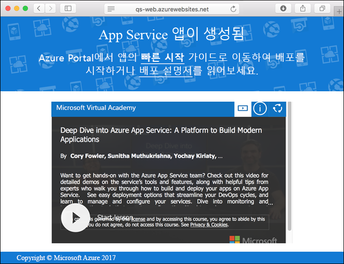

# <a name="create-a-static-html-web-app-in-azure"></a>Azure에서 정적 HTML 웹앱 만들기

[Azure Web Apps](app-service-web-overview.md)는 확장성 있는 자체 패치 웹 호스팅 서비스를 제공합니다.  이 빠른 시작에서는 기본적인 HTML+CSS 사이트를 Azure Web Apps에 배포하는 방법을 보여 줍니다. [Azure CLI](https://docs.microsoft.com/cli/azure/get-started-with-azure-cli)를 사용하여 웹앱을 만들고 Git을 사용하여 웹앱에 샘플 HTML 콘텐츠를 배포합니다.


Mac, Windows 또는 Linux 컴퓨터를 사용하여 아래 단계를 따르면 됩니다. 필수 구성 요소가 설치된 후 단계를 완료하는 데는 약 5분 정도 걸립니다.

[!INCLUDE [quickstarts-free-trial-note](../../includes/quickstarts-free-trial-note.md)]

## <a name="prerequisites"></a>필수 조건

이 빠른 시작을 완료하려면 다음이 필요합니다.

- <a href="https://git-scm.com/" target="_blank">Git 설치</a>

## <a name="download-the-sample"></a>샘플 다운로드

터미널 창에서 다음 명령을 실행하여 로컬 컴퓨터에 샘플 앱 리포지토리를 복제합니다.

```bash
git clone https://github.com/Azure-Samples/html-docs-hello-world.git
```

샘플 코드를 포함하는 디렉터리로 변경합니다.

```bash
cd html-docs-hello-world
```

## <a name="view-the-html"></a>HTML 보기

샘플 HTML을 포함하는 디렉터리로 이동합니다. 브라우저에서 *index.html* 파일을 엽니다.


[!INCLUDE [cloud-shell-try-it.md](../../includes/cloud-shell-try-it.md)]

[!INCLUDE [Configure deployment user](../../includes/configure-deployment-user.md)] 

[!INCLUDE [Create resource group](../../includes/app-service-web-create-resource-group.md)] 

[!INCLUDE [Create app service plan](../../includes/app-service-web-create-app-service-plan.md)] 

[!INCLUDE [Create web app](../../includes/app-service-web-create-web-app.md)] 



[!INCLUDE [Push to Azure](../../includes/app-service-web-git-push-to-azure.md)] 

```bash
Counting objects: 13, done.
Delta compression using up to 4 threads.
Compressing objects: 100% (11/11), done.
Writing objects: 100% (13/13), 2.07 KiB | 0 bytes/s, done.
Total 13 (delta 2), reused 0 (delta 0)
remote: Updating branch 'master'.
remote: Updating submodules.
remote: Preparing deployment for commit id 'cc39b1e4cb'.
remote: Generating deployment script.
remote: Generating deployment script for Web Site
remote: Generated deployment script files
remote: Running deployment command...
remote: Handling Basic Web Site deployment.
remote: KuduSync.NET from: 'D:\home\site\repository' to: 'D:\home\site\wwwroot'
remote: Deleting file: 'hostingstart.html'
remote: Copying file: '.gitignore'
remote: Copying file: 'LICENSE'
remote: Copying file: 'README.md'
remote: Finished successfully.
remote: Running post deployment command(s)...
remote: Deployment successful.
To https://<app_name>.scm.azurewebsites.net/<app_name>.git
 * [new branch]      master -> master
```

## <a name="browse-to-the-app"></a>앱으로 이동

브라우저에서 Azure 웹앱 URL로 이동합니다. `http://<app_name>.azurewebsites.net`

이 페이지는 Azure App Service 웹앱으로 실행됩니다.


**축하합니다.** App Service에 첫 번째 HTML 앱을 배포했습니다.

## <a name="update-and-redeploy-the-app"></a>앱 업데이트 및 다시 배포

텍스트 편집기에서 *index.html* 파일을 열고 태그를 변경합니다. 예를 들어 "Azure App Service - 샘플 정적 HTML 사이트"에서 H1 제목을 "Azure App Service'로 변경합니다.

로컬 터미널 창에서 Git의 변경 내용을 커밋한 다음 Azure에 코드 변경 내용을 푸시합니다.

```bash
git commit -am "updated HTML"
git push azure master
```

배포가 완료되면 브라우저를 새로 고쳐 변경 내용을 확인합니다.


## <a name="manage-your-new-azure-web-app"></a>새로운 Azure 웹앱 관리

만든 웹앱을 관리하려면 <a href="https://portal.azure.com" target="_blank">Azure Portal</a>로 이동합니다.

왼쪽 메뉴에서 **App Services**를 클릭한 다음 Azure 웹앱의 이름을 클릭합니다.


웹앱의 개요 페이지가 표시됩니다. 여기에서 찾아보기, 중지, 시작, 다시 시작, 삭제와 같은 기본 관리 작업을 수행할 수 있습니다. 


왼쪽 메뉴는 앱 구성을 위한 서로 다른 페이지를 제공합니다. 

[!INCLUDE [cli-samples-clean-up](../../includes/cli-samples-clean-up.md)]

## <a name="next-steps"></a>다음 단계

> [!div class="nextstepaction"]
> [사용자 지정 도메인 매핑](app-service-web-tutorial-custom-domain.md)
