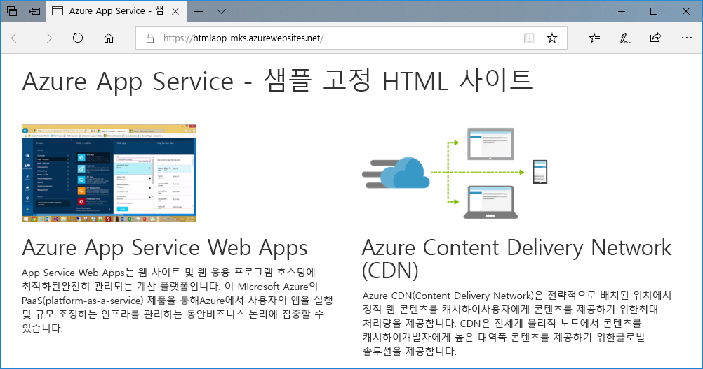
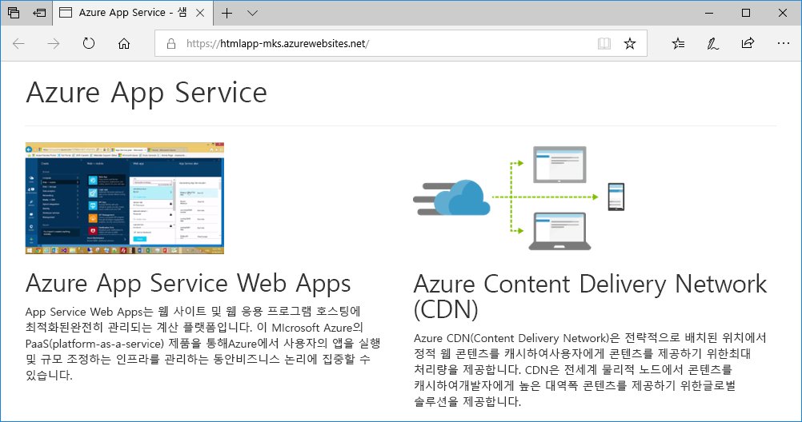
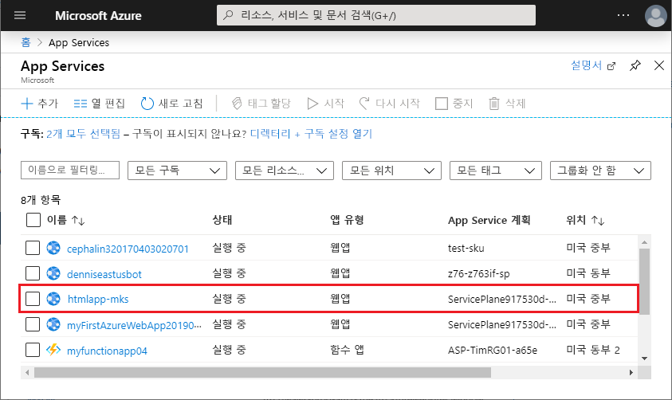
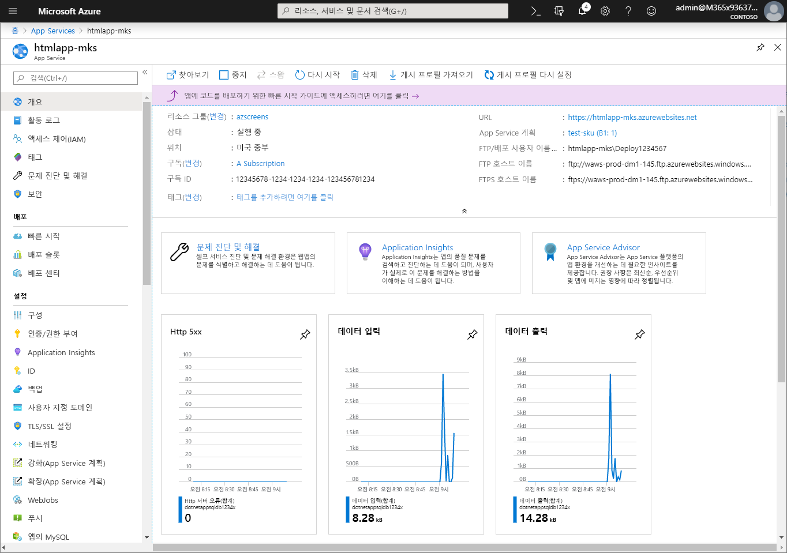

# <a name="create-a-static-html-web-app-in-azure"></a>Azure에서 정적 HTML 웹앱 만들기

[Azure App Service](overview.md)는 확장성 높은 자체 패치 웹 호스팅 서비스를 제공합니다. 이 빠른 시작에서는 기본적인 HTML+CSS 사이트를 Azure App Service에 배포하는 방법을 보여줍니다. 여기에서는 [Cloud Shell](https://docs.microsoft.com/azure/cloud-shell/overview)을 사용해서 빠른 시작을 실행하지만 [Azure CLI](/cli/azure/install-azure-cli)를 사용하여 여기에서 설명하는 명령들을 로컬에서도 실행할 수도 있습니다.



[!INCLUDE [quickstarts-free-trial-note](../../includes/quickstarts-free-trial-note.md)]

[!INCLUDE [cloud-shell-try-it.md](../../includes/cloud-shell-try-it.md)]

## <a name="download-the-sample"></a>샘플 다운로드

Cloud Shell에서 quickstart 디렉터리를 만든 다음, 해당 디렉토리로 이동합니다.

```bash
mkdir quickstart

cd $HOME/quickstart
```

이어서 다음 명령을 실행하여 quickstart 디렉터리에 샘플 앱 리포지토리를 복제합니다.

```bash
git clone https://github.com/Azure-Samples/html-docs-hello-world.git
```

## <a name="create-a-web-app"></a>웹앱 만들기

샘플 코드가 들어있는 디렉토리로 이동한 후 `az webapp up` 명령을 실행합니다.

다음 명령에서 <app_name>을 고유한 앱 이름으로 바꿉니다.

```bash
cd html-docs-hello-world

az webapp up --location westeurope --name <app_name>
```

`az webapp up` 명령에는 다음 작업이 포함됩니다.

- 기본 리소스 그룹 만들기

- 기본 앱 서비스 계획 만들기

- 지정된 이름의 앱 만들기

- 현재 작업 디렉터리에서 웹앱까지의 [Zip 배포](https://docs.microsoft.com/azure/app-service/deploy-zip) 파일

이 명령을 실행하는 데 몇 분 정도 걸릴 수 있습니다. 실행 시 다음 예와 유사한 정보를 출력합니다.

```json
{
  "app_url": "https://<app_name>.azurewebsites.net",
  "location": "westeurope",
  "name": "<app_name>",
  "os": "Windows",
  "resourcegroup": "appsvc_rg_Windows_westeurope",
  "serverfarm": "appsvc_asp_Windows_westeurope",
  "sku": "FREE",
  "src_path": "/home/<username>/quickstart/html-docs-hello-world ",
  < JSON data removed for brevity. >
}
```

`resourceGroup` 값을 기록해 둡니다. [리소스 정리](#clean-up-resources) 섹션에서 필요합니다.

## <a name="browse-to-the-app"></a>앱으로 이동

브라우저에서 앱 URL(`http://<app_name>.azurewebsites.net`)로 이동합니다.

이 페이지는 Azure App Service 웹앱으로 실행됩니다.


**축하합니다.** App Service에 첫 번째 HTML 앱을 배포했습니다.

## <a name="update-and-redeploy-the-app"></a>앱 업데이트 및 다시 배포

Cloud Shell에서 `nano index.html`을 입력하여 Nano 텍스트 편집기를 엽니다. 아래와 같이 `<h1>` 제목 태그에서 "Azure App Service - 샘플 정적 HTML 사이트"를 "Azure App Service"로 변경합니다.


변경 내용을 저장하고 Nano를 종료합니다. `^O` 명령을 사용하여 저장하고 `^X` 명령을 사용하여 종료합니다.

이제 동일한 `az webapp up` 명령을 사용하여 앱을 다시 배포합니다.

```bash
az webapp up --location westeurope --name <app_name>
```

배포가 완료되면 **앱으로 이동** 단계에서 열린 브라우저 창으로 다시 전환하고 페이지를 새로 고칩니다.



## <a name="manage-your-new-azure-app"></a>새 Azure 앱 관리

만든 웹앱을 관리하려면 <a href="https://portal.azure.com" target="_blank">Azure Portal</a>로 이동합니다.

왼쪽 메뉴에서 **App Services**를 클릭한 다음, Azure 앱의 이름을 클릭합니다.



웹앱의 개요 페이지가 표시됩니다. 여기에서 찾아보기, 중지, 시작, 다시 시작, 삭제와 같은 기본 관리 작업을 수행할 수 있습니다.



왼쪽 메뉴는 앱 구성을 위한 다양한 페이지를 제공합니다.

## <a name="clean-up-resources"></a>리소스 정리

이전 단계에서 Azure 리소스를 리소스 그룹에 만들었습니다. 나중에 이러한 리소스가 필요하지 않을 것으로 생가 생각되는 경우 Cloud Shell에서 다음 명령을 실행하여 리소스 그룹을 삭제합니다. 리소스 그룹 이름은 [웹앱 만들기](#create-a-web-app) 단계에서 자동으로 생성된 것입니다.

```bash
az group delete --name appsvc_rg_Windows_westeurope
```

이 명령을 실행하는 데 1분 정도 걸릴 수 있습니다.

## <a name="next-steps"></a>다음 단계

> [!div class="nextstepaction"]
> [사용자 지정 도메인 매핑](app-service-web-tutorial-custom-domain.md)
