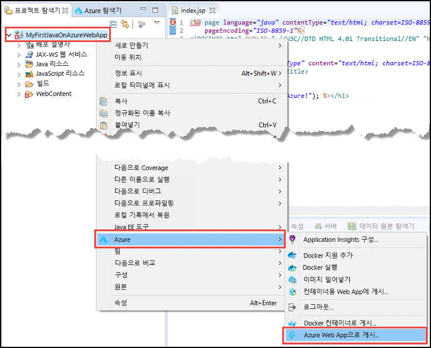
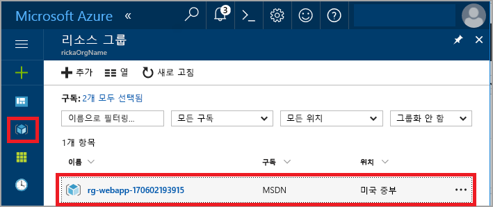
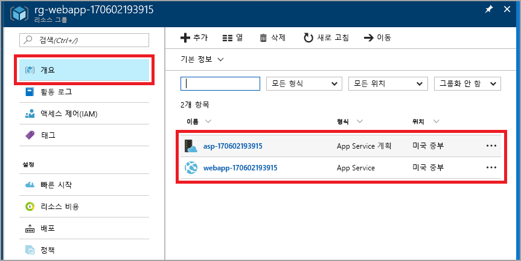

# <a name="create-your-first-java-web-app-in-azure"></a>Azure에서 첫 번째 Java 웹앱 만들기

[Azure Web Apps](app-service-web-overview.md)는 확장성 있는 자체 패치 웹 호스팅 서비스를 제공합니다. 이 빠른 시작에서는 [Eclipse IDE for Java EE Developers](http://www.eclipse.org/)를 사용하여 App Service에 Java 웹앱을 배포하는 방법을 보여 줍니다.

> [!NOTE]
>
> 이 빠른 시작의 단계에서는 Eclipse IDE를 사용하여 App Service에 Java 웹앱을 배포하는 방법을 보여주지만, IntelliJ IDEA Ultimate Edition 또는 Community Edition을 사용할 수 있습니다. 자세한 내용은 [IntelliJ를 사용하여 Azure용 Hello World 웹앱 만들기](/java/azure/intellij/azure-toolkit-for-intellij-create-hello-world-web-app)를 참조하세요.
>

이 빠른 시작을 완료하면 웹 브라우저에서 응용 프로그램을 봤을 때 다음 그림과 같이 표시됩니다.


[!INCLUDE [quickstarts-free-trial-note](../../includes/quickstarts-free-trial-note.md)]

## <a name="prerequisites"></a>필수 조건

이 빠른 시작을 완료하려면 다음을 설치합니다.

* 무료 <a href="http://www.eclipse.org/downloads/" target="_blank">Eclipse IDE for Java EE Developers</a>. 이 빠른 시작은 Eclipse Neon을 사용합니다.
* <a href="/java/azure/eclipse/azure-toolkit-for-eclipse-installation" target="_blank">Eclipse용 Azure 도구 키트</a>.

> [!NOTE]
>
> 이 빠른 시작의 단계를 완료하려면 Eclipse용 Azure 도구 키트를 사용하여 Azure 계정에 로그인해야 합니다. 이렇게 하려면 [Eclipse용 Azure 도구 키트에 대한 Azure 로그인 지침](/java/azure/eclipse/azure-toolkit-for-eclipse-sign-in-instructions)을 참조하세요.
>

## <a name="create-a-dynamic-web-project-in-eclipse"></a>Eclipse에서 동적 웹 프로젝트 만들기

Eclipse에서 **파일** > **새로 만들기** > **동적 웹 프로젝트**를 선택합니다.

**새 동적 웹 프로젝트** 대화 상자에서 프로젝트의 이름을 **MyFirstJavaOnAzureWebApp**으로 지정하고 **마침**을 선택합니다.
   


### <a name="add-a-jsp-page"></a>JSP 페이지 추가

프로젝트 탐색기가 표시되지 않으면 복원합니다.


프로젝트 탐색기에서 **MyFirstJavaOnAzureWebApp** 프로젝트를 확장합니다.
**WebContent**를 마우스 오른쪽 단추로 클릭한 다음 **새로 만들기** > **JSP 파일**을 선택합니다.


**새 JSP 파일** 대화 상자에서:

* 파일 이름을 **index.jsp**로 지정합니다.
* **마침**을 선택합니다.

  

index.jsp 파일에서 `<body></body>` 요소를 다음 태그로 바꿉니다.

```jsp
<body>
<h1><% out.println("Hello Azure!"); %></h1>
</body>
```

변경 내용을 저장합니다.

> [!NOTE]
>
> 누락된 Java Servlet 클래스를 참조하는 첫 번째 줄에서 오류가 발생하는 경우 무시해도 됩니다.
> 
> 
>

## <a name="publish-the-web-app-to-azure"></a>Azure에 웹앱 게시

프로젝트 탐색기에서 프로젝트를 마우스 오른쪽 단추로 클릭한 다음, **Azure** > **Azure 웹앱으로 게시**를 선택합니다.



**Azure 로그인** 대화 상자가 나타나면 자격 증명을 입력하기 위해 [Eclipse용 Azure 도구 키트에 대한 Azure 로그인 지침](/java/azure/eclipse/azure-toolkit-for-eclipse-sign-in-instructions) 아티클의 단계를 따라야 합니다.

### <a name="deploy-web-app-dialog-box"></a>웹앱 배포 대화 상자

Azure 계정에 로그인하면 **웹앱 배포** 대화 상자가 나타납니다.

**만들기**를 선택합니다.


### <a name="create-app-service-dialog-box"></a>App Service 만들기 대화 상자

기본 값으로 **App Service 만들기** 대화 상자가 나타납니다. 다음 이미지에 나타난 숫자 **170602185241**과는 다른 숫자가 대화 상자에 나타날 수 있습니다.


**App Service 만들기** 대화 상자에서:

* 웹앱의 고유한 이름을 입력하거나 생성된 이름을 그대로 사용합니다. 이 이름은 Azure에서 고유해야 합니다. 이름은 웹앱에 대한 URL 주소의 일부입니다. 예: 웹앱 이름이 **MyJavaWebApp**이면 URL은 *myjavawebapp.azurewebsites.net*입니다.
* 이 빠른 시작에서는 기본 웹 컨테이너를 유지합니다.
* Azure 구독을 선택합니다.
* **App Service 계획** 탭에서:

  * **새로 만들기**: App Service 계획의 이름인 기본값을 유지합니다.
  * **위치**: **서유럽** 또는 인접 위치를 선택합니다.
  * **가격 책정 계층**: 무료 옵션을 선택합니다. 기능의 경우 [App Service 가격 책정](https://azure.microsoft.com/pricing/details/app-service/?ref=microsoft.com&utm_source=microsoft.com&utm_medium=docs&utm_campaign=visualstudio)을 참조하세요.

   

[!INCLUDE [app-service-plan](../../includes/app-service-plan.md)]

### <a name="resource-group-tab"></a>리소스 그룹 탭

**리소스 그룹** 탭을 선택합니다. 리소스 그룹에 대해 기본 생성된 값을 유지합니다.


[!INCLUDE [resource-group](../../includes/resource-group.md)]

**만들기**를 선택합니다.

<!--
### The JDK tab

Select the **JDK** tab. Keep the default, and then select **Create**.


-->

Azure 도구 키트는 웹앱을 만들고 진행률 대화 상자를 표시합니다.


### <a name="deploy-web-app-dialog-box"></a>웹앱 배포 대화 상자

**웹앱 배포** 대화 상자에서 **루트에 배포**를 선택합니다. 앱 서비스가 *wingtiptoys.azurewebsites.net*에 있는데 이 루트에 배포하지 않으면 **MyFirstJavaOnAzureWebApp** 웹앱이 *wingtiptoys.azurewebsites.net/MyFirstJavaOnAzureWebApp*에 배포됩니다.


대화 상자는 Azure, JDK 및 웹 컨테이너 선택 영역을 표시합니다.

**배포**를 선택하여 Azure에 웹앱을 게시합니다.

게시 작업을 마치면 **Azure 활동 로그** 대화 상자에서 **게시됨** 링크를 선택합니다.


축하합니다! Azure에 웹앱을 배포했습니다. 


## <a name="update-the-web-app"></a>웹앱 업데이트

샘플 JSP 코드를 다른 메시지로 변경합니다.

```jsp
<body>
<h1><% out.println("Hello again Azure!"); %></h1>
</body>
```

변경 내용을 저장합니다.

프로젝트 탐색기에서 프로젝트를 마우스 오른쪽 단추로 클릭한 다음 **Azure** > **Azure 웹앱으로 게시**를 선택합니다.

**웹앱 배포** 대화 상자가 표시되고 이전에 만든 앱 서비스를 보여 줍니다. 

> [!NOTE] 
> 게시할 때마다 **루트에 배포**를 선택합니다. 
> 

웹앱을 선택하고 변경 사항을 게시하는 **배포**를 선택합니다.

**게시** 링크가 표시되는 경우 웹앱으로 이동하도록 선택하고 변경 사항을 확인합니다.

## <a name="manage-the-web-app"></a>웹앱 관리

만든 웹앱을 보려면 <a href="https://portal.azure.com" target="_blank">Azure Portal</a>로 이동합니다.

왼쪽 메뉴에서 **리소스 그룹**을 선택합니다.



리소스 그룹을 선택합니다. 페이지에서 이 빠른 시작에서 만든 리소스를 보여 줍니다.



웹앱을 선택합니다(이전 이미지에서 **webapp-170602193915**).

**개요** 페이지가 나타납니다. 이 페이지에서는 앱이 어떻게 작동하고 있는지를 보여 줍니다. 여기에서 찾아보기, 중지, 시작, 다시 시작, 삭제와 같은 기본 관리 작업을 수행할 수 있습니다. 페이지의 왼쪽에 있는 탭에서는 열 수 있는 다른 구성을 보여 줍니다. 


[!INCLUDE [clean-up-section-portal-web-app](../../includes/clean-up-section-portal-web-app.md)]

## <a name="next-steps"></a>다음 단계

> [!div class="nextstepaction"]
> [사용자 지정 도메인 매핑](app-service-web-tutorial-custom-domain.md)
