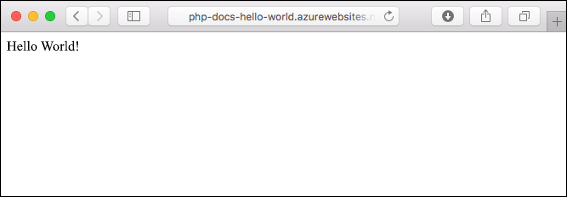
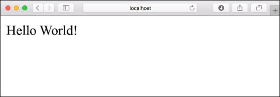
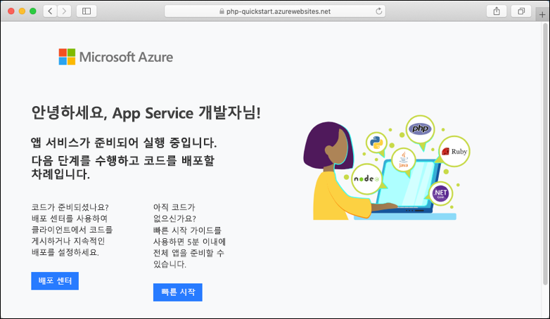
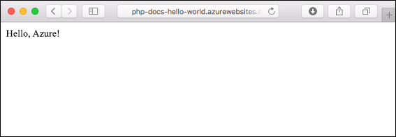
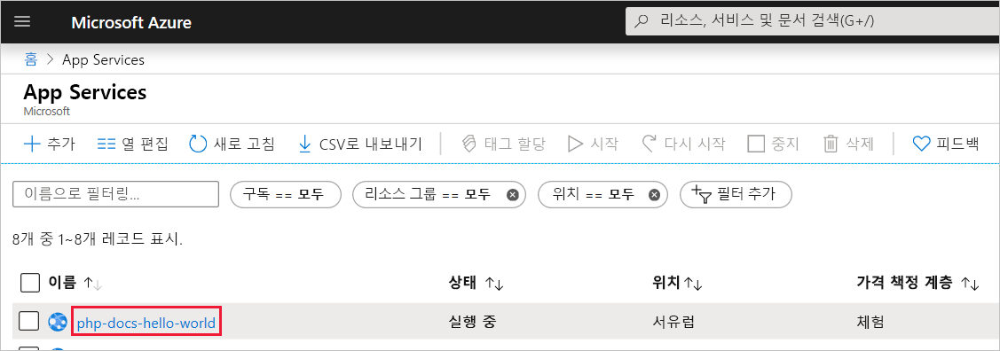
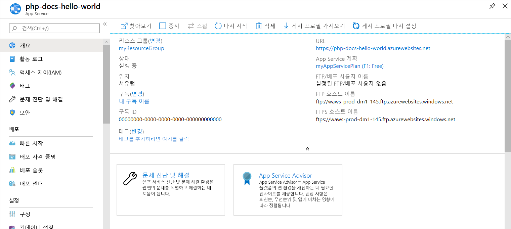

# <a name="create-a-php-web-app-in-azure"></a>Azure에서 PHP 웹앱 만들기

> [!NOTE]
> 이 문서에서는 Windows의 App Service에 앱을 배포합니다. _Linux_의 App Service에 배포하려면 [Linux의 App Service에서 PHP 웹앱 만들기](./containers/quickstart-php.md)를 참조하세요.
>

[Azure App Service](overview.md)는 확장성 높은 자체 패치 웹 호스팅 서비스를 제공합니다.  이 빠른 시작 자습서에서는 PHP 앱을 Azure App Service에 배포하는 방법을 보여줍니다. Cloud Shell에서 [Azure CLI](https://docs.microsoft.com/cli/azure/get-started-with-azure-cli)를 사용하여 웹앱을 만들고 Git을 사용하여 웹앱에 샘플 PHP 코드를 배포합니다.



Mac, Windows 또는 Linux 컴퓨터를 사용하여 여기서 설명하는 단계를 수행하면 됩니다. 필수 구성 요소가 설치된 후 단계를 완료하는 데는 약 5분 정도 걸립니다.

[!INCLUDE [quickstarts-free-trial-note](../../includes/quickstarts-free-trial-note.md)]

## <a name="prerequisites"></a>필수 조건

이 빠른 시작을 완료하려면 다음이 필요합니다.

* <a href="https://git-scm.com/" target="_blank">Git 설치</a>
* <a href="https://php.net/manual/install.php" target="_blank">PHP 설치</a>

## <a name="download-the-sample-locally"></a>로컬로 샘플 다운로드

터미널 창에서 다음 명령을 실행합니다. 그러면 애플리케이션 예제가 로컬 컴퓨터에 복제되고 샘플 코드가 들어 있는 디렉터리로 이동합니다. 

```bash
git clone https://github.com/Azure-Samples/php-docs-hello-world
cd php-docs-hello-world
```

## <a name="run-the-app-locally"></a>로컬에서 앱 실행하기

애플리케이션을 로컬로 실행하여 Azure에 애플리케이션을 배포할 때 표시되는 모양을 확인합니다. 터미널 창을 열고 `php` 명령을 사용하여 기본 제공 PHP 웹 서버를 시작합니다.

```bash
php -S localhost:8080
```

웹 브라우저를 열고 `http://localhost:8080`의 샘플 앱으로 이동합니다.

이 페이지에 표시된 샘플 앱의 **Hello World!** 메시지가 표시됩니다.



터미널 창에서 **Ctrl+C**를 눌러 웹 서버를 종료합니다.

[!INCLUDE [cloud-shell-try-it.md](../../includes/cloud-shell-try-it.md)]

[!INCLUDE [Configure deployment user](../../includes/configure-deployment-user.md)]

[!INCLUDE [Create resource group](../../includes/app-service-web-create-resource-group.md)]

[!INCLUDE [Create app service plan](../../includes/app-service-web-create-app-service-plan.md)]

## <a name="create-a-web-app"></a>웹앱 만들기

Cloud Shell에서 [`az webapp create`](/cli/azure/webapp?view=azure-cli-latest#az-webapp-create) 명령을 사용하여 `myAppServicePlan` App Service 계획에 웹앱을 만듭니다. 

다음 예에서 `<app_name>`을 전역적으로 고유한 앱 이름으로 바꿉니다(유효한 문자는 `a-z`, `0-9` 및 `-`). 런타임은 `PHP|7.0`으로 설정됩니다. 지원되는 모든 런타임을 보려면 [`az webapp list-runtimes`](/cli/azure/webapp?view=azure-cli-latest#az-webapp-list-runtimes)를 실행합니다. 

```azurecli-interactive
# Bash
az webapp create --resource-group myResourceGroup --plan myAppServicePlan --name <app_name> --runtime "PHP|7.0" --deployment-local-git
# PowerShell
az --% webapp create --resource-group myResourceGroup --plan myAppServicePlan --name <app_name> --runtime "PHP|7.0" --deployment-local-git
```

웹앱이 만들어지면 Azure CLI에서 다음 예제와 비슷한 출력을 표시합니다.

```json
Local git is configured with url of 'https://<username>@<app_name>.scm.azurewebsites.net/<app_name>.git'
{
  "availabilityState": "Normal",
  "clientAffinityEnabled": true,
  "clientCertEnabled": false,
  "cloningInfo": null,
  "containerSize": 0,
  "dailyMemoryTimeQuota": 0,
  "defaultHostName": "<app_name>.azurewebsites.net",
  "enabled": true,
  < JSON data removed for brevity. >
}
```
git 배포를 활성화하여 새 빈 웹앱을 만들었습니다.

> [!NOTE]
> Git 원격의 URL은 `https://<username>@<app_name>.scm.azurewebsites.net/<app_name>.git` 형식으로 `deploymentLocalGitUrl` 속성에 표시됩니다. 나중에 필요하므로 이 URL을 저장합니다.
>

새로 만든 웹앱으로 이동합니다. _&lt;앱 이름>_ 을 이전 단계에서 만든 고유한 앱 이름으로 바꿉니다.

```bash
http://<app name>.azurewebsites.net
```

새로운 웹앱은 다음과 같아야 합니다.



[!INCLUDE [Push to Azure](../../includes/app-service-web-git-push-to-azure.md)] 

```bash
Counting objects: 2, done.
Delta compression using up to 4 threads.
Compressing objects: 100% (2/2), done.
Writing objects: 100% (2/2), 352 bytes | 0 bytes/s, done.
Total 2 (delta 1), reused 0 (delta 0)
remote: Updating branch 'master'.
remote: Updating submodules.
remote: Preparing deployment for commit id '25f18051e9'.
remote: Generating deployment script.
remote: Running deployment command...
remote: Handling Basic Web Site deployment.
remote: Kudu sync from: '/home/site/repository' to: '/home/site/wwwroot'
remote: Copying file: '.gitignore'
remote: Copying file: 'LICENSE'
remote: Copying file: 'README.md'
remote: Copying file: 'index.php'
remote: Ignoring: .git
remote: Finished successfully.
remote: Running post deployment command(s)...
remote: Deployment successful.
To https://<app_name>.scm.azurewebsites.net/<app_name>.git
   cc39b1e..25f1805  master -> master
```

## <a name="browse-to-the-app"></a>앱으로 이동

웹 브라우저를 사용하여 배포된 애플리케이션으로 이동합니다.

```
http://<app_name>.azurewebsites.net
```

PHP 샘플 코드는 Azure App Service 웹앱에서 실행 중입니다.


**축하합니다.** App Service에 첫 번째 PHP 앱을 배포했습니다.

## <a name="update-locally-and-redeploy-the-code"></a>로컬로 코드 업데이트 및 다시 배포

로컬 텍스트 편집기를 사용하여 PHP 앱 내에서 `index.php` 파일을 열고 `echo` 옆에 있는 문자열 내의 텍스트를 약간 변경합니다.

```php
echo "Hello Azure!";
```

로컬 터미널 창에서 Git의 변경 내용을 커밋한 다음 Azure에 코드 변경 내용을 푸시합니다.

```bash
git commit -am "updated output"
git push azure master
```

배포가 완료되면 **앱으로 이동** 단계 중 열린 브라우저 창으로 돌아가서 페이지를 새로 고칩니다.



## <a name="manage-your-new-azure-app"></a>새 Azure 앱 관리

만든 웹앱을 관리하려면 <a href="https://portal.azure.com" target="_blank">Azure Portal</a>로 이동합니다.

왼쪽 메뉴에서 **App Services**를 클릭한 다음, Azure 앱의 이름을 클릭합니다.



웹앱의 개요 페이지가 표시됩니다. 여기에서 찾아보기, 중지, 시작, 다시 시작, 삭제와 같은 기본 관리 작업을 수행할 수 있습니다.



왼쪽 메뉴는 앱 구성을 위한 서로 다른 옵션을 제공합니다. 

[!INCLUDE [cli-samples-clean-up](../../includes/cli-samples-clean-up.md)]

## <a name="next-steps"></a>다음 단계

> [!div class="nextstepaction"]
> [MySQL을 사용하는 PHP](app-service-web-tutorial-php-mysql.md)
